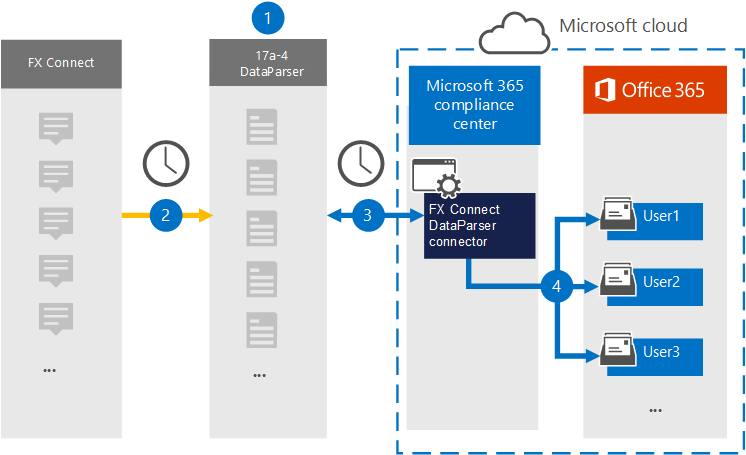

# Настройка соединитетеля для архива данных fx Подключение (предварительный просмотр)

Используйте [fx Подключение DataParser](https://www.17a-4.com/dataparser-roadmap/) от 17a-4 LLC для импорта и архива данных из FX Подключение в почтовые ящики пользователей в Microsoft 365 организации. DataParser включает соединителер FX Подключение, настроенный для захвата элементов из стороннего источника данных и импорта этих элементов в Microsoft 365. Соединиттель FX Подключение DataParser преобразует данные FX Подключение в формат сообщений электронной почты, а затем импортирует эти элементы в почтовые ящики пользователей в Microsoft 365.

После хранения Подключение fx в почтовых ящиках пользователей можно применять такие Microsoft 365, как хранение судебного разбирательства, открытие электронных данных, политики хранения и метки хранения, а также соответствие требованиям к связи. Использование соединиттеля fx Подключение для импорта и архива данных в Microsoft 365 может помочь вашей организации соблюдать государственные и нормативные политики.

## Обзор архива данных fx Подключение

В следующем обзоре объясняется процесс использования соединиттеля данных для архивации данных FX Подключение в Microsoft 365.

1. Ваша организация работает с 17a-4 для настройки и настройки Подключение DataParser.

2. Регулярно элементы FX Подключение собираются в DataParser. DataParser также преобразует содержимое сообщения в формат сообщения электронной почты.

3. Соедините Подключение DataParser, который вы создаете в Центр соответствия требованиям Microsoft 365, подключается к DataParser и передает сообщения в безопасное служба хранилища Azure в облаке Майкрософт.

4. В почтовых ящиках пользователей создается подмостки в папке "Входящие" с именем **FX Подключение DataParser,** и элементы fx Подключение импортируется в эту папку. Соединитатель определяет, в какой почтовый ящик импортировать элементы, используя значение свойства *Email.* Каждый элемент Подключение FX содержит это свойство, заполненное адресом электронной почты каждого участника.

## Перед настройками соединитетеля

- Создайте учетную запись DataParser для соединители Microsoft. Для этого обратитесь в [ООО "17a-4".](https://www.17a-4.com/contact/) При создании соединитетеля в шаге 1 необходимо войти в эту учетную запись.

- Пользователю, который создает соединиттель FX Подключение DataParser в шаге 1 (и завершает его в шаге 3), необходимо приступить к роли экспорта импорта почтовых ящиков в Exchange Online. Эта роль требуется для добавления соединители на странице **соединители** данных в Центр соответствия требованиям Microsoft 365. По умолчанию эта роль не назначена группе ролей в Exchange Online. Вы можете добавить роль экспорта импорта почтовых ящиков в группу ролей управления организацией в Exchange Online. Или вы можете создать группу ролей, назначить роль экспортировать импорт почтовых ящиков, а затем добавить соответствующих пользователей в качестве участников. Дополнительные сведения см. в разделах [Создание](/Exchange/permissions-exo/role-groups#create-role-groups) групп ролей или [изменение](/Exchange/permissions-exo/role-groups#modify-role-groups) групп ролей в статье "Управление группами ролей в Exchange Online".

## Шаг 1. Настройка соединиттеля fx Подключение DataParser

Первым шагом является доступ к странице соединители данных в Центр соответствия требованиям Microsoft 365 и создание соединителя 17a-4 для данных fx Подключение.

1. Перейдите <https://compliance.microsoft.com> к и нажмите **кнопку Соединители**  >  **данных FX Подключение DataParser**.

2. На странице **описания продукта Подключение DataParser** нажмите **кнопку Добавить соединителю**.

3. На странице **Условия службы нажмите** кнопку **Принять**.

4. Введите уникальное имя, которое идентифицирует соединителен, а затем нажмите **кнопку Далее**.

5. Вопишите в свою учетную запись 17a-4 и выполните действия в мастере подключения FX Подключение DataParser.

## Шаг 2. Настройка соединители FX Подключение DataParser

Работа с поддержкой 17a-4 для настройки соединителя fx Подключение DataParser.

## Шаг 3. Пользователи карт

Соединителю Подключение DataParser будет автоматически соединять пользователей с Microsoft 365 адресами электронной почты перед импортом данных в Microsoft 365.

## Шаг 4. Мониторинг соединиттеля Подключение DataParser

После создания соединиттеля Подключение DataParser можно просмотреть состояние соединитетеля в Центр соответствия требованиям Microsoft 365.

1. Перейдите <https://compliance.microsoft.com> и щелкните **соединители данных** в левом nav.

2. Щелкните  вкладку Соединители, а затем выберите соединиттель FX Подключение DataParser, созданный для отображения страницы вылетов, которая содержит свойства и сведения о соединителе.

3. В **состоянии Соединитель с исходным кодом** щелкните ссылку **Журнал** загрузки, чтобы открыть (или сохранить) журнал состояния соединитетеля. В этом журнале содержатся данные, импортируемые в облако Майкрософт.

## Известные проблемы

В настоящее время мы не поддерживаем импорт вложений или элементов размером более 10 МБ. Поддержка более крупных элементов будет доступна позднее.
