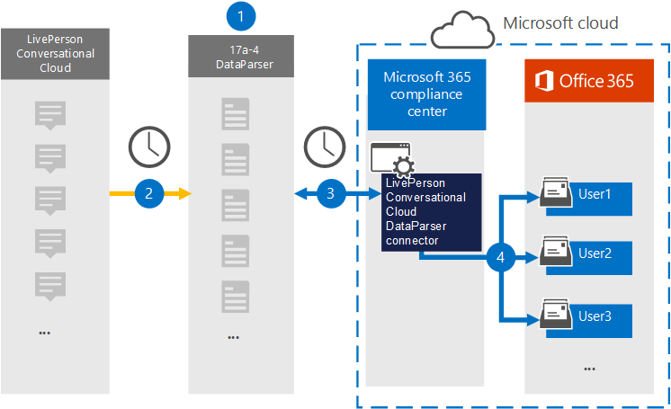

# Настройка соединителя для архива данных livePerson Conversational CloudSet up a connector to archive LivePerson Conversational Cloud data

Для импорта и архива данных [из livePerson Conversational Cloud DataParser](https://www.17a-4.com/liveperson-dataparser/) от 17a-4 LLC в почтовые ящики пользователей в вашей Microsoft 365 организации.Use the [LivePerson Conversational Cloud DataParser](https://www.17a-4.com/liveperson-dataparser/) from 17a-4 LLC to import and archive data from LivePerson Conversational Cloud to user mailboxes in your Microsoft 365 organization. В состав DataParser входит соединитель диалогового облака LivePerson, настроенный для захвата элементов из стороннего источника данных и импорта этих элементов в Microsoft 365.The DataParser includes a LivePerson Conversational Cloud connector that's configured to capture items from a third-party data source and import those items to Microsoft 365. Соединитель разговорного облака LivePerson DataParser преобразует данные в формат сообщений электронной почты, а затем импортирует эти элементы в почтовые ящики пользователей в Microsoft 365.The LivePerson Conversational Cloud DataParser connector converts data to an email message format and then imports those items to user mailboxes in Microsoft 365.

После хранения данных в почтовых ящиках пользователей можно применить Microsoft 365, такие как хранение судебного разбирательства, открытие электронных данных, политики хранения и метки хранения, а также соответствие требованиям связи.After data is stored in user mailboxes, you can apply Microsoft 365 compliance features such as Litigation Hold, eDiscovery, retention policies and retention labels, and communication compliance. Использование соединителя разговорного облака LivePerson для импорта и архива данных в Microsoft 365 может помочь вашей организации соблюдать государственные и нормативные политики.Using a LivePerson Conversational Cloud connector to import and archive data in Microsoft 365 can help your organization stay compliant with government and regulatory policies.

## Обзор архива данных livePerson Conversational CloudOverview of archiving LivePerson Conversational Cloud data

В следующем обзоре рассказывается о процессе использования соединителя данных для архивации данных livePerson Conversational Cloud в Microsoft 365.The following overview explains the process of using a data connector to archive LivePerson Conversational Cloud data in Microsoft 365.

1. Ваша организация работает с 17a-4 для настройки и настройки облачного dataParser LivePerson.Your organization works with 17a-4 to set up and configure the the LivePerson Conversational Cloud DataParser.

2. Регулярно элементы разговорного облака LivePerson собираются в DataParser.On a regular basis, LivePerson Conversational Cloud items are collected by the DataParser. DataParser также преобразует содержимое сообщения в формат сообщения электронной почты.The DataParser also converts the content of a message to an email message format.

3. Соединитель беседного облака LivePerson DataParser, который вы создаете в Центр соответствия требованиям Microsoft 365, подключается к DataParser и передает сообщения в безопасное служба хранилища Azure в облаке Майкрософт.The LivePerson Conversational Cloud DataParser connector that you create in the Microsoft 365 compliance center connects to DataParser and transfers the messages to a secure Azure Storage location in the Microsoft cloud.

4. В почтовых ящиках пользователей создается подмостка в папке "Входящие" с именем **LivePerson Conversational Cloud DataParser,** и элементы импортируется в эту папку.A subfolder in the Inbox folder named **LivePerson Conversational Cloud DataParser** is created in the user mailboxes, and the items are imported to that folder. Соединитатель определяет, в какой почтовый ящик импортировать элементы, используя значение свойства *Email.*The connector determines which mailbox to import items to by using the value of the *Email* property. Каждый элемент содержит это свойство, которое заполняется адресом электронной почты каждого участника.Every item contains this property, which is populated with the email address of every participant.

## Перед настройками соединитетеляBefore you set up a connector

- Создайте учетную запись DataParser для соединители Microsoft.Create a DataParser account for Microsoft connectors. Для этого обратитесь в [ООО "17a-4".](https://www.17a-4.com/contact/)To do this, contact [17a-4 LLC](https://www.17a-4.com/contact/). При создании соединитетеля в шаге 1 необходимо войти в эту учетную запись.You need to sign into this account when you create the connector in Step 1.

- Пользователь, создававший соединитель диалогового облачного облака LivePerson DataParser в шаге 1 (и завершавший его в шаге 3), должен быть назначен роли экспорта импорта почтовых ящиков в Exchange Online.The user who creates the LivePerson Conversational Cloud DataParser connector in Step 1 (and completes it in Step 3) must be assigned to the Mailbox Import Export role in Exchange Online. Эта роль требуется для добавления соединители на странице **соединители** данных в Центр соответствия требованиям Microsoft 365.This role is required to add connectors on the **Data connectors** page in the Microsoft 365 compliance center. По умолчанию эта роль не назначена группе ролей в Exchange Online.By default, this role is not assigned to a role group in Exchange Online. Вы можете добавить роль экспорта импорта почтовых ящиков в группу ролей управления организацией в Exchange Online.You can add the Mailbox Import Export role to the Organization Management role group in Exchange Online. Или вы можете создать группу ролей, назначить роль экспортировать импорт почтовых ящиков, а затем добавить соответствующих пользователей в качестве участников.Or you can create a role group, assign the Mailbox Import Export role, and then add the appropriate users as members. Дополнительные сведения см. в разделах [Создание](/Exchange/permissions-exo/role-groups#create-role-groups) групп ролей или [изменение](/Exchange/permissions-exo/role-groups#modify-role-groups) групп ролей в статье "Управление группами ролей в Exchange Online".For more information, see the [Create role groups](/Exchange/permissions-exo/role-groups#create-role-groups) or [Modify role groups](/Exchange/permissions-exo/role-groups#modify-role-groups) sections in the article "Manage role groups in Exchange Online".

## Шаг 1. Настройка соединителя беседного облака LivePerson DataParserStep 1: Set up a LivePerson Conversational Cloud DataParser connector

Первым шагом является доступ к странице соединители данных в Центр соответствия требованиям Microsoft 365 и создание соединителя 17a-4 для данных livePerson Conversational Cloud.The first step is to access to the Data connectors page in the Microsoft 365 compliance center and create a 17a-4 connector for LivePerson Conversational Cloud data.

1. Перейдите к соединителям данных и нажмите <https://compliance.microsoft.com>   >  **кнопку LivePerson Conversational Cloud DataParser**.Go to <https://compliance.microsoft.com> and then click **Data connectors** > **LivePerson Conversational Cloud DataParser**.

2. На странице **описания продукта LivePerson Conversational Cloud DataParser** нажмите **кнопку Добавить соединитель**.On the **LivePerson Conversational Cloud DataParser** product description page, click **Add connector**.

3. На странице **Условия службы нажмите** кнопку **Принять**.On the **Terms of service** page, click **Accept**.

4. Введите уникальное имя, которое идентифицирует соединителен, а затем нажмите **кнопку Далее**.Enter a unique name that identifies the connector and then click **Next**.

5. Вопишите в свою учетную запись 17a-4 и выполните действия в мастере подключения livePerson Conversational Cloud DataParser.Sign in to your 17a-4 account and complete the steps in the LivePerson Conversational Cloud DataParser connection wizard.

## Шаг 2. Настройка соединителя livePerson Conversational Cloud DataParserStep 2: Configure the LivePerson Conversational Cloud DataParser connector

Работа с поддержкой 17a-4 для настройки соединителя облачного облачного подключения LivePerson DataParser.Work with 17a-4 Support to configure the LivePerson Conversational Cloud DataParser connector.

## Шаг 3. Пользователи картStep 3: Map users

Соединитель беседного облачного облака LivePerson dataParser автоматически соединит пользователей с Microsoft 365 адресами электронной почты перед импортом данных в Microsoft 365.The LivePerson Conversational Cloud DataParser connector will automatically map users to their Microsoft 365 email addresses before importing data to Microsoft 365.

## Шаг 4. Мониторинг соединителя разговорного облачного облака LivePerson DataParserStep 4: Monitor the LivePerson Conversational Cloud DataParser connector

После создания соединиттеля livePerson Conversational Cloud DataParser можно просмотреть состояние соединителя в Центр соответствия требованиям Microsoft 365.After you create a LivePerson Conversational Cloud DataParser connector, you can view the connector status in the Microsoft 365 compliance center.

1. Перейдите <https://compliance.microsoft.com> и щелкните **соединители данных** в левом nav.Go to <https://compliance.microsoft.com> and click **Data connectors** in the left nav.

2. Щелкните  вкладку Соединители, а затем выберите соединитель livePerson Conversational Cloud DataParser, созданный для отображения страницы вылетов, которая содержит свойства и сведения о соединителе.Click the **Connectors** tab and then select the LivePerson Conversational Cloud DataParser connector that you created to display the flyout page, which contains the properties and information about the connector.

3. В **состоянии Соединитель с исходным кодом** щелкните ссылку **Журнал** загрузки, чтобы открыть (или сохранить) журнал состояния соединитетеля.Under **Connector status with source**, click the **Download log** link to open (or save) the status log for the connector. В этом журнале содержатся данные, импортируемые в облако Майкрософт.This log contains data that has been imported to the Microsoft cloud.

## Известные проблемыKnown issues

В настоящее время мы не поддерживаем импорт вложений или элементов размером более 10 МБ.At this time, we don't support importing attachments or items that are larger than 10 MB. Поддержка более крупных элементов будет доступна позднее.Support for larger items will be available at a later date.
