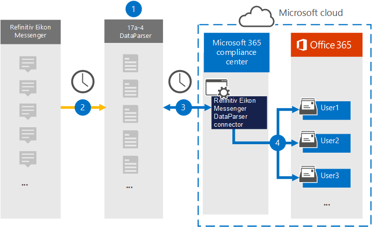

# Настройка соединителей для архивирования данных мессенджера Refinitiv Eikon (предварительный просмотр)

Для импорта и архивирования данных из [Refinitiv Eikon Messenger DataParser](https://www.17a-4.com/refinitiv-messenger-dataparser/) от 17a-4 LLC используйте для импорта и архивирования данных из messenger Refinitiv Eikon в почтовые ящики пользователей в Microsoft 365 организации. DataParser включает соединителю Eikon Messenger Refinitiv, который настроен для захвата элементов из стороннего источника данных и импорта этих элементов в Microsoft 365. Соединиттель DataParser messenger Refinitiv Eikon преобразует данные Refinitiv Eikon Messenger в формат сообщений электронной почты, а затем импортирует эти элементы в почтовые ящики пользователей в Microsoft 365.

После хранения данных в почтовых ящиках пользователей в мессенджере Refinitiv Eikon можно применять такие функции соответствия требованиям Microsoft 365, как хранение судебного разбирательства, открытие электронных данных, политики хранения и метки хранения, а также соответствие требованиям к связи. Использование соединителя мессенджера Refinitiv Eikon для импорта и архивирования данных в Microsoft 365 может помочь вашей организации соблюдать государственные и нормативные политики.

## Обзор архивирования данных мессенджера Refinitiv Eikon

В следующем обзоре рассказывается о процессе использования соединителя данных для архивации данных Мессенджера Refinitiv Eikon в Microsoft 365.

1. Ваша организация работает с 17a-4 для настройки и настройки dataParser мессенджера Refinitiv Eikon.

2. Регулярно элементы Refinitiv Eikon Messenger собираются в DataParser. DataParser также преобразует содержимое сообщения в формат сообщения электронной почты.

3. Соединителю dataParser мессенджера Refinitiv Eikon, который вы создаете в Центр соответствия требованиям Microsoft 365, подключается к DataParser и передает сообщения в безопасное служба хранилища Azure в облаке Майкрософт.

4. В почтовых ящиках пользователей создается поддвое в папке "Входящие" с именем **Refinitiv Eikon Messenger DataParser,** а элементы Refinitiv Eikon Messenger импортируется в эту папку. Соединитатель определяет, в какой почтовый ящик импортировать элементы, используя значение свойства *Email.* Каждый элемент Мессенджера Refinitiv Eikon содержит это свойство, заполненное адресом электронной почты каждого участника.

## Перед настройками соединитетеля

- Создайте учетную запись DataParser для соединители Microsoft. Для этого обратитесь в [ООО "17a-4".](https://www.17a-4.com/contact/) При создании соединитетеля в шаге 1 необходимо войти в эту учетную запись.

- Пользователь, создавший соединителю DataParser для мессенджера Refinitiv Eikon в шаге 1 (и завершавший его в шаге 3), должен быть назначен роли экспорта импорта почтовых ящиков в Exchange Online. Эта роль требуется для добавления соединители на странице **соединители** данных в Центр соответствия требованиям Microsoft 365. По умолчанию эта роль не назначена группе ролей в Exchange Online. Вы можете добавить роль экспорта импорта почтовых ящиков в группу ролей управления организацией в Exchange Online. Или вы можете создать группу ролей, назначить роль экспортировать импорт почтовых ящиков, а затем добавить соответствующих пользователей в качестве участников. Дополнительные сведения см. в разделах [Создание](/Exchange/permissions-exo/role-groups#create-role-groups) групп ролей или [изменение](/Exchange/permissions-exo/role-groups#modify-role-groups) групп ролей в статье "Управление группами ролей в Exchange Online".

## Шаг 1. Настройка соединиттеля DataParser мессенджера Refinitiv Eikon

Первым шагом является доступ к странице соединителей данных в Центр соответствия требованиям Microsoft 365 и создание соединителей 17a-4 для данных мессенджера Refinitiv Eikon.

1. Перейдите <https://compliance.microsoft.com> и нажмите **соединителей данных**  >  **Refinitiv Eikon Messenger DataParser**.

2. На странице **описания продукта Refinitiv Eikon Messenger DataParser** нажмите **кнопку Добавить соединителю**.

3. На странице **Условия службы нажмите** кнопку **Принять**.

4. Введите уникальное имя, которое идентифицирует соединителен, а затем нажмите **кнопку Далее**.

5. Вопишите в свою учетную запись 17a-4 и выполните действия в мастере подключения к мессенджеру Refinitiv Eikon DataParser.

## Шаг 2. Настройка соединиттеля DataParser мессенджера Refinitiv Eikon

Работа с поддержкой 17a-4 для настройки соединиттеля DataParser messenger Refinitiv Eikon.

## Шаг 3. Пользователи карт

Соединиттель DataParser мессенджера Refinitiv Eikon автоматически соединит пользователей с их Microsoft 365 адресами электронной почты перед импортом данных в Microsoft 365.

## Шаг 4. Мониторинг соединиттеля DataParser мессенджера Refinitiv Eikon

После создания соединиттеля DataParser messenger Refinitiv Eikon можно просмотреть состояние соединителей в Центр соответствия требованиям Microsoft 365.

1. Перейдите <https://compliance.microsoft.com> и щелкните **соединители данных** в левом nav.

2. Щелкните  вкладку Соединителей, а затем выберите соединителю DataParser для мессенджера Refinitiv Eikon, созданный для отображения страницы вылетов, которая содержит свойства и сведения о соединителе.

3. В **состоянии Соединитель с исходным кодом** щелкните ссылку **Журнал** загрузки, чтобы открыть (или сохранить) журнал состояния соединитетеля. В этом журнале содержатся данные, импортируемые в облако Майкрософт.

## Известные проблемы

В настоящее время мы не поддерживаем импорт вложений или элементов размером более 10 МБ. Поддержка более крупных элементов будет доступна позднее.
