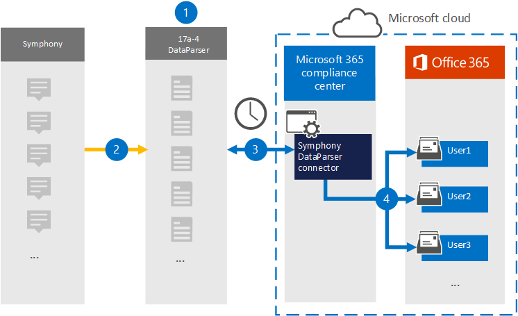

# Настройка соединитетеля для архива данных Symphony (предварительный просмотр)Set up a connector to archive Symphony data (preview)

Используйте [Symphony DataParser](https://www.17a-4.com/Symphony-dataparser/) от 17a-4 LLC для импорта и архива данных связи Symphony для почтовых ящиков пользователей в Microsoft 365 организации.Use the [Symphony DataParser](https://www.17a-4.com/Symphony-dataparser/) from 17a-4 LLC to import and archive Symphony communications data to user mailboxes in your Microsoft 365 organization. В dataParser включен соединиттель Symphony, настроенный для захвата элементов из стороннего источника данных и импорта этих элементов в Microsoft 365.The DataParser includes a Symphony connector that's configured to capture items from a third-party data source and import those items to Microsoft 365. Соединиттель Symphony DataParser преобразует данные Symphony в формат сообщений электронной почты, а затем импортирует эти элементы в почтовые ящики пользователей в Microsoft 365.The Symphony DataParser connector converts Symphony data to an email message format and then imports those items to user mailboxes in Microsoft 365.

После хранения данных Symphony в почтовых ящиках пользователей вы можете применять Microsoft 365, такие как хранение судебного разбирательства, открытие электронных данных, политики хранения и метки хранения, а также соответствие требованиям связи.After Symphony data is stored in user mailboxes, you can apply Microsoft 365 compliance features such as Litigation Hold, eDiscovery, retention policies and retention labels, and communication compliance. Использование соединиттеля Symphony для импорта и архива данных в Microsoft 365 может помочь вашей организации соблюдать государственные и нормативные политики.Using a Symphony connector to import and archive data in Microsoft 365 can help your organization stay compliant with government and regulatory policies.

## Обзор архива данных SymphonyOverview of archiving Symphony data

В следующем обзоре объясняется процесс использования соединиттеля данных для архивации данных Symphony в Microsoft 365.The following overview explains the process of using a data connector to archive Symphony data in Microsoft 365.

1. Ваша организация работает с 17a-4 для настройки и настройки симфонического dataParser.Your organization works with 17a-4 to set up and configure the Symphony DataParser.

2. Элементы Symphony регулярно собираются в DataParser.On a regular basis, Symphony items are collected by the DataParser. DataParser также преобразует содержимое сообщения в формат сообщения электронной почты.The DataParser also converts the content of a message to an email message format.

3. Соединиттель Symphony DataParser, который вы создаете в Центр соответствия требованиям Microsoft 365 подключается к DataParser и передает сообщения в безопасное служба хранилища Azure в облаке Майкрософт.The Symphony DataParser connector that you create in the Microsoft 365 compliance center connects to DataParser and transfers the messages to a secure Azure Storage location in the Microsoft cloud.

4. В почтовых ящиках пользователя создается подмостки в папке "Входящие" с именем **Symphony DataParser,** и элементы Symphony импортируется в эту папку.A subfolder in the Inbox folder named **Symphony DataParser** is created in the user mailboxes, and the Symphony items are imported to that folder. Соединитатель определяет, в какой почтовый ящик импортировать элементы, используя значение свойства *Email.*The connector determines which mailbox to import items to by using the value of the *Email* property. Каждый элемент Symphony содержит это свойство, которое заполняется адресом электронной почты каждого участника.Every Symphony item contains this property, which is populated with the email address of every participant.

## Перед настройками соединитетеляBefore you set up a connector

- Создайте учетную запись DataParser для соединители Microsoft.Create a DataParser account for Microsoft connectors. Для этого обратитесь в [ООО "17a-4".](https://www.17a-4.com/contact/)To do this, contact [17a-4 LLC](https://www.17a-4.com/contact/). При создании соединитетеля в шаге 1 необходимо войти в эту учетную запись.You need to sign into this account when you create the connector in Step 1.

- Пользователь, создававший соединиттель Symphony DataParser в шаге 1 (и завершавший его в шаге 3), должен быть назначен роли экспорта импорта почтовых ящиков в Exchange Online.The user who creates the Symphony DataParser connector in Step 1 (and completes it in Step 3) must be assigned to the Mailbox Import Export role in Exchange Online. Эта роль требуется для добавления соединители на странице **соединители** данных в Центр соответствия требованиям Microsoft 365.This role is required to add connectors on the **Data connectors** page in the Microsoft 365 compliance center. По умолчанию эта роль не назначена группе ролей в Exchange Online.By default, this role is not assigned to a role group in Exchange Online. Вы можете добавить роль экспорта импорта почтовых ящиков в группу ролей управления организацией в Exchange Online.You can add the Mailbox Import Export role to the Organization Management role group in Exchange Online. Или вы можете создать группу ролей, назначить роль экспортировать импорт почтовых ящиков, а затем добавить соответствующих пользователей в качестве участников.Or you can create a role group, assign the Mailbox Import Export role, and then add the appropriate users as members. Дополнительные сведения см. в разделах [Создание](/Exchange/permissions-exo/role-groups#create-role-groups) групп ролей или [изменение](/Exchange/permissions-exo/role-groups#modify-role-groups) групп ролей в статье "Управление группами ролей в Exchange Online".For more information, see the [Create role groups](/Exchange/permissions-exo/role-groups#create-role-groups) or [Modify role groups](/Exchange/permissions-exo/role-groups#modify-role-groups) sections in the article "Manage role groups in Exchange Online".

## Шаг 1. Настройка соединиттеля Symphony DataParserStep 1: Set up a Symphony DataParser connector

Первым шагом является доступ к странице соединители данных в Центр соответствия требованиям Microsoft 365 и создание соединителя 17a-4 для данных Symphony.The first step is to access to the Data connectors page in the Microsoft 365 compliance center and create a 17a-4 connector for Symphony data.

1. Перейдите <https://compliance.microsoft.com> к и нажмите **кнопку Соединители данных**  >  **Симфония DataParser**.Go to <https://compliance.microsoft.com> and then click **Data connectors** > **Symphony DataParser**.

2. На странице **описания продукта Symphony DataParser** нажмите **кнопку Добавить соединителю**.On the **Symphony DataParser** product description page, click **Add connector**.

3. На странице **Условия службы нажмите** кнопку **Принять**.On the **Terms of service** page, click **Accept**.

4. Введите уникальное имя, которое идентифицирует соединителен, а затем нажмите **кнопку Далее**.Enter a unique name that identifies the connector and then click **Next**.

5. Вопишите в свою учетную запись 17a-4 и выполните действия в мастере подключения к Symphony DataParser.Sign in to your 17a-4 account and complete the steps in the Symphony DataParser connection wizard.

## Шаг 2. Настройка соединиттеля Symphony DataParserStep 2: Configure the Symphony DataParser connector

Работа с поддержкой 17a-4 для настройки соединиттеля Symphony DataParser.Work with 17a-4 Support to configure the Symphony DataParser connector.

## Шаг 3. Пользователи картStep 3: Map users

Соединиттель Symphony DataParser автоматически соберет пользователей с Microsoft 365 адресами электронной почты перед импортом данных в Microsoft 365.The Symphony DataParser connector will automatically map users to their Microsoft 365 email addresses before importing data to Microsoft 365.

## Шаг 4. Мониторинг соединиттеля Symphony DataParserStep 4: Monitor the Symphony DataParser connector

После создания соединиттеля Symphony DataParser можно просмотреть состояние соединитетеля в Центр соответствия требованиям Microsoft 365.After you create a Symphony DataParser connector, you can view the connector status in the Microsoft 365 compliance center.

1. Перейдите <https://compliance.microsoft.com> и щелкните **соединители данных** в левом nav.Go to <https://compliance.microsoft.com> and click **Data connectors** in the left nav.

2. Щелкните  вкладку Соединители, а затем выберите соединитетель Symphony DataParser, созданный для отображения страницы вылетов, которая содержит свойства и сведения о соединителе.Click the **Connectors** tab and then select the Symphony DataParser connector that you created to display the flyout page, which contains the properties and information about the connector.

3. В **состоянии Соединитель с исходным кодом** щелкните ссылку **Журнал** загрузки, чтобы открыть (или сохранить) журнал состояния соединитетеля.Under **Connector status with source**, click the **Download log** link to open (or save) the status log for the connector. В этом журнале содержатся данные, импортируемые в облако Майкрософт.This log contains data that has been imported to the Microsoft cloud.

## Известные проблемыKnown issues

В настоящее время мы не поддерживаем импорт вложений или элементов размером более 10 МБ.At this time, we don't support importing attachments or items that are larger than 10 MB. Поддержка более крупных элементов будет доступна позднее.Support for larger items will be available at a later date.
