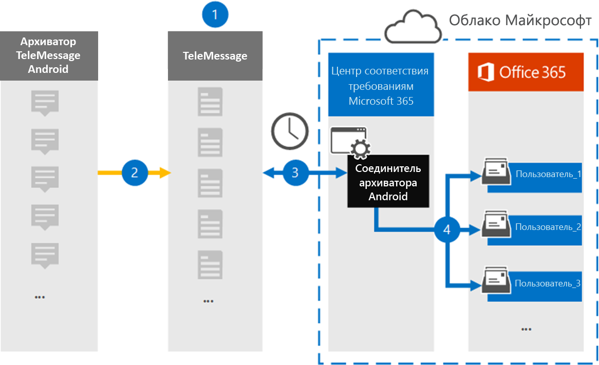

# Настройка соединителя для архивации мобильных данных Android (Предварительная версия)Set up a connector to archive Android mobile data (preview)

Используйте соединитель обмена сообщениями в центре соответствия требованиям Microsoft 365, чтобы импортировать и архивировать SMS, MMS, голосовые вызовы и журналы звонков с мобильных телефонов Android.Use a TeleMessage connector in the Microsoft 365 compliance center to import and archive SMS, MMS, voice calls, and call logs from Android mobile phones. После настройки и настройки соединителя он подключается к учетной записи электронной почты организации один раз в день и импортирует мобильный обмен данными сотрудников, использующих WinRAR с Android, на почтовые ящики в Microsoft 365.After you set up and configure a connector, it connects to your organization's TeleMessage account once every day, and imports the mobile communication of employees using the TeleMessage Android Archiver to mailboxes in Microsoft 365.

После хранения данных с мобильных телефонов Android в почтовых ящиках пользователей можно применять функции обеспечения соответствия требованиям Microsoft 365, такие как хранение для судебного разбирательства, поиск контента и политики хранения Microsoft 365, в данные WinRAR Android.After data from Android mobile phones is stored in user mailboxes, you can apply Microsoft 365 compliance features such as Litigation Hold, Content Search, and Microsoft 365 retention policies to Android Archiver data. Например, вы можете искать мобильную связь Android WinRAR с помощью поиска контента или сопоставить почтовый ящик, содержащий данные соединителя Android WinRAR, с хранитель в расширенном футляре eDiscovery.For example, you can search Android Archiver mobile communication using Content Search or associate the mailbox that contains the Android Archiver connector data with a custodian in an Advanced eDiscovery case. Использование соединителя WinRAR с Android для импорта и архивирования данных в Microsoft 365 может помочь организации соответствовать государственным и нормативным политикам.Using an Android Archiver connector to import and archive data in Microsoft 365 can help your organization stay compliant with government and regulatory policies.

## Общие сведения об архивации данных мобильных устройств AndroidOverview of archiving Android mobile data

В следующем обзоре описывается процесс использования соединителя для архивации мобильных данных Android в Microsoft 365.The following overview explains the process of using a connector to archive Android mobile data in Microsoft 365.

1. Ваша организация работает с сообщением о настройке соединителя WinRAR для Android.Your organization works with TeleMessage to set up an Android Archiver connector. Дополнительные сведения можно найти в разделе [Android WinRAR](https://www.telemessage.com/office365-activation-for-android-archiver/).For more information, see [Android Archiver](https://www.telemessage.com/office365-activation-for-android-archiver/).

2. Каждые 24 часа, SMS, MMS, голосовые звонки и журналы звонков с мобильных телефонов с Android в вашей организации копируются на сайт с мобильными сообщениями.Once every 24 hours, SMS, MMS, voice calls, and call logs from your organization's Android mobile phones are copied to the TeleMessage site.

3. Соединитель WinRAR для Android, который вы создаете в центре соответствия требованиям Microsoft 365, подключается к сайту сообщений каждый день и передает данные Android из предыдущих 24 часов в безопасное место хранения Azure в облаке Майкрософт.The Android Archiver connector that you create in the Microsoft 365 compliance center connects to the TeleMessage site every day and transfers the Android data from the previous 24 hours to a secure Azure Storage location in the Microsoft Cloud. Соединитель также преобразует данные Android в формат сообщения электронной почты.The connector also converts the Android data to an email message format.

4. Соединитель импортирует элементы мобильного взаимодействия в почтовый ящик определенного пользователя.The connector imports the mobile communication items to the mailbox of a specific user. Новая папка с именем Android WinRAR будет создана в почтовом ящике конкретного пользователя, а элементы будут импортированы в нее.A new folder named Android Archiver will be created in the specific user's mailbox and the items will be imported to it. Соединитель выполняет сопоставление, используя значение свойства *электронного адреса пользователя* .The connector does mapping by using the value of the *User’s Email address* property. Каждое сообщение электронной почты содержит это свойство, которое заполняется адресом электронной почты каждого участника сообщения электронной почты.Every email message contains this property, which is populated with the email address of every participant of the email message. В дополнение к автоматическому сопоставлению пользователей с использованием значения свойства *электронного адреса пользователя* , можно также определить настраиваемое сопоставление путем отправки CSV-файла сопоставления.In addition to automatic user mapping using the value of the *User’s Email address* property, you can also define a custom mapping by uploading a CSV mapping file. Этот файл сопоставления должен содержать номер мобильного телефона пользователя и соответствующий адрес почтовых ящиков Microsoft 365 для каждого пользователя.This mapping file should contain User’s mobile Number and the corresponding Microsoft 365 mailbox address for each user. Если включить автоматическое сопоставление пользователей и предоставить настраиваемое сопоставление, для каждого элемента электронной почты соединитель будет сначала просматривать пользовательский файл сопоставления.If you enable automatic user mapping and provide a custom mapping, for every email item the connector will first look at custom mapping file. Если не удается найти действительного пользователя Microsoft 365, который соответствует номеру мобильного телефона пользователя, соединитель будет использовать свойство электронного адреса пользователя почтового элемента.If it doesn't find a valid Microsoft 365 user that corresponds to a user's mobile number, the connector will use the User ‘s email address property of the email item. Если соединитель не находит действительных пользователей Microsoft 365 в файле настраиваемого сопоставления или в свойстве *электронного адреса пользователя* почтового элемента, элемент не импортируется.If the connector doesn't find a valid Microsoft 365 user in either the custom mapping file or the *user’s email address* property of the email item, the item won't be imported.

## Перед началом работыBefore you begin

Многие этапы реализации, необходимые для архивации данных связи Android, являются внешними по отношению к Microsoft 365 и должны быть завершены до того, как вы сможете создать соединитель в центре соответствия требованиям.Many of the implementation steps required to archive Android communication data are external to Microsoft 365 and must be completed before you can create the connector in the compliance center.

- Закажите [службу WinRAR для Android из сообщения](https://www.telemessage.com/mobile-archiver/order-mobile-archiver-for-o365) и получите допустимую учетную запись администрирования для Организации.Order the [Android Archiver service from TeleMessage](https://www.telemessage.com/mobile-archiver/order-mobile-archiver-for-o365) and get a valid administration account for your organization. При создании соединителя вам потребуется войти в эту учетную запись.You'll need to sign into this account when you create the connector.

- Зарегистрируйте всех пользователей, которым требуется служба WinRAR для Android, в учетной записи для обмена сообщениями.Register all users that require the Android Archiver service in the TeleMessage account. При регистрации пользователей необходимо использовать тот же адрес электронной почты, который используется для своей учетной записи Microsoft 365.When registering users, be sure to use the same email address that's used for their Microsoft 365 account.

- Установка и активация приложения WinRAR для Android на мобильных телефонах сотрудников.Install and activate the TeleMessage Android Archiver app on the mobile phones of your employees.

- Ваша организация должна разрешить службе импорта Office 365 доступ к данным почтовых ящиков в Организации.Your organization must consent to allow the Office 365 Import service to access mailbox data in your organization. Вам потребуется предоставить это согласие при создании соединителя.You will need to provide this consent when you create the connector. Чтобы согласиться с этим запросом, перейдите на [эту страницу](https://login.microsoftonline.com/common/oauth2/authorize?client_id=570d0bec-d001-4c4e-985e-3ab17fdc3073&response_type=code&redirect_uri=https://portal.azure.com/&nonce=1234&prompt=admin_consent), войдите с помощью учетных данных глобального администратора Office 365 и примите запрос.To consent to this request, go to [this page](https://login.microsoftonline.com/common/oauth2/authorize?client_id=570d0bec-d001-4c4e-985e-3ab17fdc3073&response_type=code&redirect_uri=https://portal.azure.com/&nonce=1234&prompt=admin_consent), sign in with the credentials of an Office 365 global admin, and then accept the request. Необходимо выполнить это действие, прежде чем можно будет успешно создать соединитель&сети "T".You have to complete this step before you can successfully create an AT&T Network connector.

- Пользователю, создающему соединитель WinRAR Android, должна быть назначена роль импорта почтовых ящиков в Exchange Online.The user who creates a Android Archiver connector must be assigned the Mailbox Import Export role in Exchange Online. Это необходимо для добавления соединителей на странице " **соединители данных** " в центре соответствия требованиям Microsoft 365.This is required to add connectors in the **Data connectors** page in the Microsoft 365 compliance center. По умолчанию эта роль не назначена ни одной группе ролей в Exchange Online.By default, this role isn't assigned to any role group in Exchange Online. Вы можете добавить роль экспорта для импорта почтовых ящиков в группу ролей Управление организацией в Exchange Online.You can add the Mailbox Import Export role to the Organization Management role group in Exchange Online. Вы также можете создать группу ролей, назначить роль импорта для импорта почтовых ящиков, а затем добавить соответствующих пользователей в качестве участников.Or you can create a role group, assign the Mailbox Import Export role, and then add the appropriate users as members. Для получения дополнительных сведений обратитесь к разделу [Создание](https://docs.microsoft.com/Exchange/permissions-exo/role-groups#create-role-groups) групп ролей или [изменение групп ролей](https://docs.microsoft.com/Exchange/permissions-exo/role-groups#modify-role-groups) статьи "Управление группами ролей в Exchange Online".For more information, see the [Create role groups](https://docs.microsoft.com/Exchange/permissions-exo/role-groups#create-role-groups) or [Modify role groups](https://docs.microsoft.com/Exchange/permissions-exo/role-groups#modify-role-groups) sections in the article "Manage role groups in Exchange Online".

## Создание соединителя WinRAR для AndroidCreate an Android Archiver connector

Последний шаг — создание соединителя WinRAR для Android в центре соответствия требованиям Microsoft 365.The last step is to create an Android Archiver connector in the Microsoft 365 compliance center. Соединитель использует сведения, которые вы предоставляете для подключения к сайту для обмена сообщениями и передачи данных из Android в соответствующие поля почтового ящика пользователя в Microsoft 365.The connector uses the information you provide to connect to the TeleMessage site and transfer Android communication to the corresponding user mailbox boxes in Microsoft 365.

1. Перейдите к [https://compliance.microsoft.com](https://compliance.microsoft.com) элементу **Data Connectors**  >  **WinRAR Android**.Go to [https://compliance.microsoft.com](https://compliance.microsoft.com) and click **Data connectors** > **Android Archiver**.

2. На странице "Описание продукта **WinRAR Android** " нажмите **Добавить соединитель**.On the **Android Archiver** product description page, click **Add connector**.

3. На странице **условия обслуживания** нажмите кнопку **принять**.On the **Terms of service** page, click **Accept**.

4. На странице " **Вход в систему** " в разделе Шаг 3 Введите необходимые сведения в следующие поля, а затем нажмите кнопку **Далее**.On the **Login to TeleMessage** page, under Step 3, enter the required information in the following boxes and then click **Next**.

   - **Имя пользователя:** Имя пользователя в вашем почтовом сообщении.**Username:** Your TeleMessage username.

   - **Пароль:** Пароль к своему почтовому сообщению.**Password:** Your TeleMessage password.

5. После создания соединителя закройте всплывающее окно и нажмите кнопку **Далее**.After the connector is created, close the pop-up window and click **Next**.

6. На странице **Сопоставление пользователей** включите автоматическое сопоставление пользователей и нажмите кнопку **Далее**.On the **User mapping** page, enable automatic user mapping and click **Next**. Если вам потребуется настраиваемое сопоставление, отправьте CSV-файл, а затем нажмите кнопку **Далее**.In case you need custom mapping upload a CSV file, and click **Next**.

7. Предоставьте согласие администратора и нажмите кнопку **Далее**.Provide admin consent and then click **Next**.

   Чтобы предоставить согласие администратора, необходимо войти в систему, используя учетные данные глобального администратора Office 365, а затем принять запрос согласия.To provide admin consent, you must be signed in with the credentials of an Office 365 global admin, and then accept the consent request. Если вы не вошли в систему как глобальный администратор, вы можете перейти на [эту страницу](https://login.microsoftonline.com/common/oauth2/authorize?client_id=570d0bec-d001-4c4e-985e-3ab17fdc3073&response_type=code&redirect_uri=https://portal.azure.com/&nonce=1234&prompt=admin_consent) и войти, используя учетные данные глобального администратора, чтобы принять запрос.If you aren't signed in as a global admin, you can go to [this page](https://login.microsoftonline.com/common/oauth2/authorize?client_id=570d0bec-d001-4c4e-985e-3ab17fdc3073&response_type=code&redirect_uri=https://portal.azure.com/&nonce=1234&prompt=admin_consent) and sign-in using global admin credentials to accept the request.

8. Проверьте параметры и нажмите кнопку **Готово** , чтобы создать соединитель.Review your settings, and then click **Finish** to create the connector.

9. Перейдите на вкладку Connectors (соединители) на странице **Data Connectors** (соединители), чтобы увидеть ход процесса импорта для нового соединителя.Go to the Connectors tab in **Data connectors** page to see the progress of the import process for the new connector.

## Известные проблемыKnown issues

- Соединитель не импортирует элементы размером более 10 МБ.The connector doesn’t import any item larger than 10 MB.
