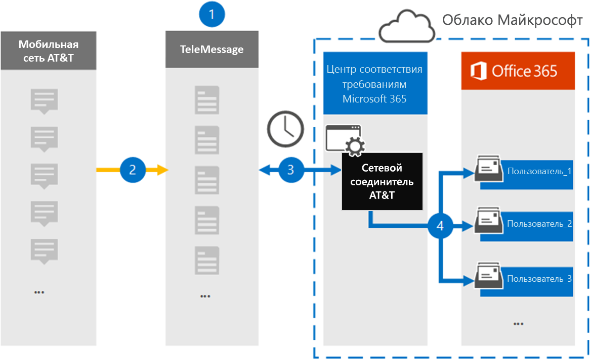

# Настройка соединителя для архивации на&T SMS и MMS (Предварительная версия)

С помощью соединителя для обмена сообщениями в центре соответствия требованиям Microsoft 365 можно импортировать и архивировать SMS и MMS, используя&сеть для мобильных устройств. После настройки и настройки соединителя он подключается к сети Организации в&, а затем импортирует данные SMS и MMS в почтовые ящики в Microsoft 365.

После того как SMS и MMS сообщения хранятся в почтовых ящиках пользователей, вы можете применять функции обеспечения соответствия требованиям Microsoft 365, такие как хранение для судебного разбирательства, поиск контента и политики хранения Microsoft 365, на&сетевых данных. Например, можно выполнить поиск по&данных сети с помощью поиска контента или сопоставить почтовый ящик, который содержит данные по&T Network Connector с хранитель в расширенном случае обнаружения электронных данных. Использование AT&T Network Connector для импорта и архивирования данных в Microsoft 365 может помочь организации соответствовать государственным и нормативным политикам.

## Общие сведения о архивации данных в сети&T

В следующем обзоре описывается процесс использования соединителя для архивации данных&T в сети Microsoft 365.

1. Ваша организация работает с сообщением для настройки сетевого соединителя&T. Дополнительные сведения можно узнать [в статье&WinRAR в сети](https://www.telemessage.com/office365-activation-for-atnt-network-archiver/).

2. Каждые 24 часа SMS-сообщения и MMS-сообщения из сети организации&T копируются на сайт для обмена сообщениями.

3. Сетевой соединитель&T, который вы создаете в центре соответствия требованиям Microsoft 365, подключается к сайту для отправки сообщений каждый день и передает SMS-и MMS-сообщения из предыдущих 24 часов в безопасное место хранения Azure в облаке Майкрософт. Соединитель также Преобразовывает содержимое SMS и MMS сообщения в формат сообщения электронной почты.

4. Соединитель импортирует мобильные элементы в почтовый ящик определенных пользователей. В почтовом ящике пользователя создается новая папка с именем **AT&T SMS/MMS Network WinRAR** , в которую будут импортированы элементы. Соединитель выполняет это сопоставление, используя значение свойства *электронного адреса пользователя* . Каждое сообщение SMS и MMS содержит это свойство, которое заполняется адресом электронной почты каждого участника сообщения.
 
   В дополнение к автоматическому сопоставлению пользователей с использованием значения свойства *электронного адреса пользователя* , можно также определить настраиваемое сопоставление путем отправки CSV-файла сопоставления. Этот файл сопоставления содержит номер мобильного телефона и соответствующий адрес электронной почты Microsoft 365 для пользователей в вашей организации. Если вы включаете автоматическое сопоставление пользователей и настраиваемое сопоставление, для каждого элемента электронной почты соединитель будет сначала искать пользовательский файл сопоставления. Если не удается найти действительного пользователя Microsoft 365, который соответствует номеру мобильного телефона, соединитель использует значения в свойстве адрес электронной почты элемента, который он пытается импортировать. Если соединитель не находит действительного пользователя Microsoft 365 в файле настраиваемого сопоставления или в свойстве электронного адреса элемента электронной почты, элемент не импортируется.

## Перед началом работы

Многие этапы реализации, необходимые для архивации данных сети&T, являются внешними по отношению к Microsoft 365 и должны быть завершены, прежде чем можно будет создать соединитель в центре соответствия требованиям.

- Закажите [службу мобильного WinRAR из сообщения](https://www.telemessage.com/mobile-archiver/order-mobile-archiver-for-o365/) и получите допустимую учетную запись администрирования для Организации. Вам потребуется войти в эту учетную запись, когда вы создадите соединитель в центре соответствия требованиям.

- Получите учетную запись&T и сведения о контакте для выставления счетов, чтобы можно было заполнить формы входящей миграции и упорядочить службу архивации сообщений в&T.

- Зарегистрируйте всех пользователей, которым требуется&Архивация SMS/MMS в учетной записи для сообщений. При регистрации пользователей необходимо использовать тот же адрес электронной почты, который используется для своей учетной записи Microsoft 365.

- Ваши сотрудники должны иметь корпоративные и корпоративные мобильные телефоны на&сети на мобильных устройствах. Архивация сообщений в Microsoft 365 недоступна для устройств, принадлежащих сотрудникам, или "перенесите свои устройства BYOD".

- Ваша организация должна разрешить службе импорта Office 365 доступ к данным почтовых ящиков в Организации. Вам потребуется предоставить это согласие при создании соединителя. Чтобы согласиться с этим запросом, перейдите на [эту страницу](https://login.microsoftonline.com/common/oauth2/authorize?client_id=570d0bec-d001-4c4e-985e-3ab17fdc3073&response_type=code&redirect_uri=https://portal.azure.com/&nonce=1234&prompt=admin_consent), войдите с помощью учетных данных глобального администратора Office 365 и примите запрос. Необходимо выполнить это действие, прежде чем можно будет успешно создать соединитель&сети "T".

- Пользователю, создающему подключение по протоколу&T, должна быть назначена роль импорта почтовых ящиков в Exchange Online. Это необходимо для добавления соединителей на странице " **соединители данных** " в центре соответствия требованиям Microsoft 365. По умолчанию эта роль не назначена ни одной группе ролей в Exchange Online. Вы можете добавить роль экспорта для импорта почтовых ящиков в группу ролей Управление организацией в Exchange Online. Вы также можете создать группу ролей, назначить роль импорта для импорта почтовых ящиков, а затем добавить соответствующих пользователей в качестве участников. Для получения дополнительных сведений обратитесь к разделу [Создание](https://docs.microsoft.com/Exchange/permissions-exo/role-groups#create-role-groups) групп ролей или [изменение групп ролей](https://docs.microsoft.com/Exchange/permissions-exo/role-groups#modify-role-groups) статьи "Управление группами ролей в Exchange Online".

## Создание сетевого соединителя&T

После выполнения предварительных требований, описанных в предыдущем разделе, можно создать соединитель&T Network Connector в центре соответствия требованиям Microsoft 365. Соединитель использует предоставленные сведения для подключения к сайту "Служба сообщений" и передачи SMS-и MMS-сообщений в соответствующие поля почтового ящика пользователя в Microsoft 365.

1. Перейдите к [https://compliance.microsoft.com](https://compliance.microsoft.com/) **соединителям данных**  \  **в&сети**, а затем нажмите кнопку соединители данных.

2. На странице " **Сетевое описание продукта по&T** " нажмите кнопку **Добавить соединитель** .

3. На странице **условия обслуживания** нажмите кнопку **принять**.

4. На странице " **Вход в систему** " в разделе Шаг 3 Введите необходимые сведения в следующие поля, а затем нажмите кнопку **Далее**.

   - **Имя пользователя:** Имя пользователя в вашем почтовом сообщении.

   - **Пароль:** Пароль к своему почтовому сообщению.

5. После создания соединителя можно закрыть всплывающее окно и перейти к следующей странице.

6. На странице **Сопоставление пользователей** включите автоматическое сопоставление пользователей. Чтобы включить настраиваемое сопоставление, отправьте CSV-файл, содержащий сведения о сопоставлении пользователей, и нажмите кнопку **Далее**.

7. Предоставьте согласие администратора и нажмите кнопку **Далее**.

   Чтобы предоставить согласие администратора, необходимо войти в систему, используя учетные данные глобального администратора Office 365, а затем принять запрос согласия. Если вы не вошли в систему как глобальный администратор, вы можете перейти на [эту страницу](https://login.microsoftonline.com/common/oauth2/authorize?client_id=570d0bec-d001-4c4e-985e-3ab17fdc3073&response_type=code&redirect_uri=https://portal.azure.com/&nonce=1234&prompt=admin_consent) и войти, используя учетные данные глобального администратора, чтобы принять запрос. 

8. Проверьте параметры и нажмите кнопку **Готово** , чтобы создать соединитель.

9. Перейдите на вкладку **соединители** на странице " **соединители данных** " центра соответствия требованиям, чтобы просмотреть ход процесса импорта для нового соединителя.

## Известные проблемы

- Соединитель не импортирует элементы размером более 10 МБ.
