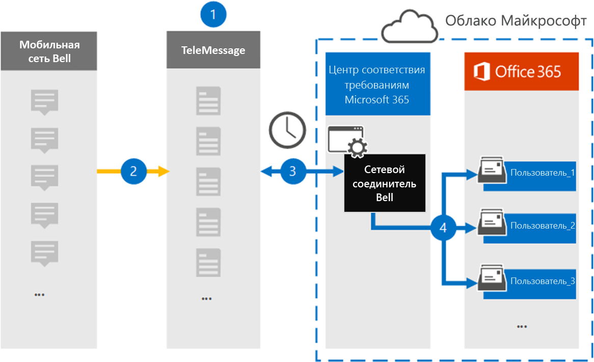

# Настройка соединитетеля для архива данных Bell Network

Используйте соединители TeleMessage в центре соответствия требованиям Microsoft 365 для импорта и архива сообщений службы коротких сообщений (SMS) и службы мультимедийных сообщений (MMS) из сети колокола. После настройки соединители он подключается к сети колоколов организации один раз в день и импортирует SMS и MMS-сообщения в почтовые ящики в Microsoft 365.

После хранения сообщений SMS и MMS в почтовых ящиках пользователей можно применить к данным Bell Network такие функции соответствия требованиям Microsoft 365, как хранение судебного разбирательства, поиск контента и политики хранения Microsoft 365. Например, вы можете искать SMS/MMS в Bell Network с помощью поиска контента или связывать почтовый ящик, содержащий данные соединителя сети колокола, с хранителями в деле advanced eDiscovery. Использование соединиттеля Bell Network для импорта и архива данных в Microsoft 365 может помочь вашей организации соблюдать государственные и нормативные политики.

## Обзор архива данных Bell Network

В следующем обзоре объясняется процесс использования соединитетеля для архивации данных Bell Network в Microsoft 365.

1. Ваша организация работает с TeleMessage и Bell для того, чтобы настроить соединители сети колоколов. Дополнительные сведения см. в [фотоархиве Bell Network Archiver.](https://www.telemessage.com/office365-activation-for-bell-network-archiver)

2. Каждые 24 часа SMS и MMS-сообщения из сети колоколов вашей организации копируется на сайт TeleMessage.

3. Соединители Bell Network, которые вы создаете в центре соответствия требованиям Microsoft 365, каждый день подключаются к сайту TeleMessage и переносят SMS-сообщения и MMS из предыдущих 24 часов в безопасное хранилище Azure в Microsoft Cloud. Соединителет также преобразует содержимое SMS и MMS-сообщений в формат сообщений электронной почты.

4. Соединитатель импортирует элементы мобильной связи в почтовый ящик определенных пользователей. В почтовом ящике конкретного пользователя создается новая папка с именем **Bell SMS/MMS Network Archiver,** и элементы импортируется в нее. Соединитатель делает это сопоставление, используя значение свойства адреса *электронной почты* пользователя. Каждое сообщение SMS и MMS содержит это свойство, заполненное адресом электронной почты каждого участника сообщения.

   Помимо автоматического сопоставления пользователей с  использованием значения свойства адресов электронной почты пользователя, вы также можете определить настраиваемую сопоставление, загрузив файл сопоставления CSV. Этот файл сопоставления содержит номер мобильного телефона и соответствующий адрес электронной почты Microsoft 365 для пользователей в организации. Если вы включаете автоматическое сопоставление пользователей и настраиваемое сопоставление, для каждого элемента Bell Network соединитатель сначала рассматривает настраиваемый файл сопоставления. Если он не найдет допустимого пользователя Microsoft 365, соответствующего номеру мобильного телефона пользователя, соединитетель будет использовать значения в свойстве адреса электронной почты элемента, который он пытается импортировать. Если соединиттель не находит допустимого пользователя Microsoft 365 в настраиваемом файле сопоставления или в свойстве адреса электронной почты элемента Bell Network, элемент не будет импортироваться.

## Подготовка

Некоторые этапы реализации, необходимые для архивации данных Bell Network, являются внешними для Microsoft 365 и должны быть завершены, прежде чем вы сможете создать соединители в центре соответствия требованиям.

- Заказать [службу архива беллет-сети в TeleMessage](https://www.telemessage.com/mobile-archiver/order-mobile-archiver-for-o365/) и получить допустимую учетную запись администрирования для вашей организации. Вам потребуется войти в эту учетную запись при создании соединитетеля в центре соответствия требованиям.

- Получите свою учетную запись и контактные данные для биллинга, чтобы можно было заполнить бортовые формы TeleMessage и заказать службу архива сообщений в Bell.

- Регистрация всех пользователей, которые требуют архива в учетной записи TeleMessage. При регистрации пользователей обязательно используйте тот же адрес электронной почты, который используется для их учетной записи Microsoft 365.

- Ваши сотрудники должны иметь корпоративные и корпоративные мобильные телефоны в мобильной сети Bell. Архивативная информация в Microsoft 365 недоступна для устройств, которые принадлежат сотруднику или "Принесите собственные устройства (BYOD).

- Пользователю, создава которому создается соединитель Сети колокольных звонок, должна быть назначена роль экспорта импорта почтовых ящиков в Exchange Online. Для этого необходимо добавить соединители на странице **соединители данных** в центре соответствия требованиям Microsoft 365. По умолчанию эта роль не назначена ни одной группе ролей в Exchange Online. Вы можете добавить роль экспорта импорта почтовых ящиков в группу ролей управления организацией в Exchange Online. Или вы можете создать группу ролей, назначить роль экспортировать импорт почтовых ящиков, а затем добавить соответствующих пользователей в качестве участников. Дополнительные сведения см. в разделах Создание групп [ролей](/Exchange/permissions-exo/role-groups#create-role-groups) или [изменение](/Exchange/permissions-exo/role-groups#modify-role-groups) групп ролей в статье "Управление группами ролей в Exchange Online".

## Создание соединитетеля сети колокола

Последний шаг — создание соединитетеля Bell Network в центре соответствия требованиям Microsoft 365. Соединитатель использует сведения, которые вы предоставляете, для подключения к сайту TeleMessage и передачи SMS/MMS-сообщений в соответствующие почтовые ящики пользователей в Microsoft 365.

1. Перейдите [https://compliance.microsoft.com](https://compliance.microsoft.com) к и нажмите **кнопку Соединители данных** Bell  >  **SMS/MMS Network Archiver**.

2. На странице **описание продукта Bell Network** нажмите кнопку Добавить **соединителю**

3. На странице **Условия службы нажмите** кнопку **Принять**.

4. На странице **Входа в TeleMessage** в шаге 3 введите необходимые сведения в следующих полях и нажмите **кнопку Далее**.

   - **Имя пользователя:** Имя пользователя TeleMessage.

   - **Пароль:** Пароль TeleMessage.

5. После создания соединитетеля можно закрыть всплывающее окно и перейти на следующую страницу.

6. На странице **Сопоставление пользователей** включаем автоматическое сопоставление пользователей. Чтобы включить настраиваемую сопоставление, загрузите CSV-файл, содержащий сведения о сопоставлении пользователей, а затем нажмите **кнопку Далее**.

7. Просмотрите параметры и нажмите **кнопку Готово** для создания соединитетеля.

8. Перейдите на вкладку **Соединители** на странице **Соединители** данных в центре соответствия требованиям, чтобы увидеть ход процесса импорта для нового соединитетеля.

## Известные проблемы

- В настоящее время мы не поддерживаем импорт вложений или элементов размером более 10 МБ. Поддержка более крупных элементов будет доступна позднее.