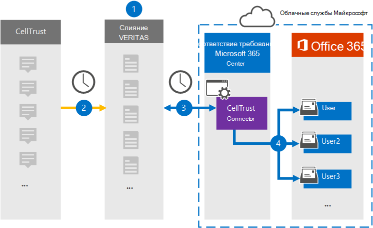

# Настройка соединителю для архивации данных CellTrustSet up a connector to archive CellTrust data

Используйте соединитель Veritas в центре Microsoft 365 для импорта и архивации данных с платформы CellTrust в почтовые ящики пользователей в Microsoft 365 организации.Use a Veritas connector in the Microsoft 365 compliance center to import and archive data from the CellTrust platform to user mailboxes in your Microsoft 365 organization. Veritas предоставляет соединитель [CellTrust,](https://globanet.com/celltrust/) который захватывает элементы из стороннего источника данных и импортирует эти элементы в Microsoft 365.Veritas provides a [CellTrust](https://globanet.com/celltrust/) connector that captures items from the third-party data source and imports those items to Microsoft 365. Соединитель преобразует содержимое SMS из учетных записей CellTrust в формат сообщений электронной почты, а затем импортирует эти элементы в почтовый ящик пользователя в Microsoft 365.The connector converts the content of SMS messages from CellTrust accounts to an email message format and then imports those items to the user's mailbox in Microsoft 365.

После хранения данных CellTrust в почтовых ящиках пользователей можно применить Microsoft 365, такие как хранение судебных разбирательств, электронные сведения, политики хранения и метки хранения, а также соответствие требованиям к связи.After CellTrust data is stored in user mailboxes, you can apply Microsoft 365 compliance features such as Litigation Hold, eDiscovery, retention policies and retention labels, and communication compliance. Использование соединиттеля CellTrust для импорта и архивации данных в Microsoft 365 может помочь вашей организации соблюдать государственные и нормативные политики.Using a CellTrust connector to import and archive data in Microsoft 365 can help your organization stay compliant with government and regulatory policies.

## Обзор архивации данных CellTrustOverview of archiving CellTrust data

В следующем обзоре объясняется процесс использования соединителю для архивации данных CellTrust в Microsoft 365.The following overview explains the process of using a connector to archive CellTrust data in Microsoft 365.

1. Ваша организация работает с CellTrust для настройки и настройки сайта CellTrust.Your organization works with CellTrust to set up and configure a CellTrust site.

2. Каждые 24 часа элементы CellTrust копируется на сайте Veritas Merge1.Once every 24 hours, CellTrust items are copied to the Veritas Merge1 site. Соединителет также преобразует содержимое сообщения в формат сообщения электронной почты.The connector also converts the content of a message to an email message format.

3. Соединитель CellTrust, который вы создаете в центре Microsoft 365 соответствия требованиям, подключается к сайту Veritas Merge1 каждый день и передает сообщения в безопасное расположение служба хранилища Azure в облаке Майкрософт.The CellTrust connector that you create in the Microsoft 365 compliance center connects to the Veritas Merge1 site every day and transfers the messages to a secure Azure Storage location in the Microsoft cloud.

4. Автоматическое сопоставление пользователей в качестве соединиттеля импортирует элементы в почтовые ящики определенных пользователей, используя значение свойства *Email,* описанного в [шаге 3.](#step-3-map-users-and-complete-the-connector-setup)The automatic user mapping as connector imports items to the mailboxes of specific users by using the value of the *Email* property of the described in [Step 3](#step-3-map-users-and-complete-the-connector-setup). В почтовых ящиках пользователей создается подмостки в папке "Входящие" с именем **CellTrust,** и элементы сообщений импортируются в эту папку.A subfolder in the Inbox folder named **CellTrust** is created in the user mailboxes, and the message items are imported to that folder. Соединитатель определяет, в какой почтовый ящик импортировать элементы, используя значение свойства *Email.*The connector determines which mailbox to import items to by using the value of the *Email* property. Каждый элемент CellTrust содержит это свойство, которое заполняется адресом электронной почты каждого участника.Every CellTrust item contains this property, which is populated with the email address of every participant.

## Прежде чем начатьBefore you begin

- Создание учетной записи Merge1 для соединители Microsoft.Create a Merge1 account for Microsoft connectors. Чтобы создать учетную запись, обратитесь [в службу поддержки клиентов Veritas.](https://www.veritas.com/content/support/)To create an account, contact [Veritas Customer Support](https://www.veritas.com/content/support/). При создании соединитетеля в шаге 1 необходимо войти в эту учетную запись.You need to sign into this account when you create the connector in Step 1.

- Пользователь, создавший соединитель CellTrust в шаге 1 (и завершивший его в шаге 3), должен быть назначен роли экспорта импорта почтовых ящиков в Exchange Online.The user who creates the CellTrust connector in Step 1 (and completes it in Step 3) must be assigned to the Mailbox Import Export role in Exchange Online. Эта роль необходима для добавления соединители на **странице** соединители данных в центре Microsoft 365 соответствия требованиям.This role is required to add connectors on the **Data connectors** page in the Microsoft 365 compliance center. По умолчанию эта роль не назначена ни одной группе ролей в Exchange Online.By default, this role isn't assigned to any role group in Exchange Online. Вы можете добавить роль экспорта импорта почтовых ящиков в группу ролей управления организацией в Exchange Online.You can add the Mailbox Import Export role to the Organization Management role group in Exchange Online. Или вы можете создать группу ролей, назначить роль экспортировать импорт почтовых ящиков, а затем добавить соответствующих пользователей в качестве участников.Or you can create a role group, assign the Mailbox Import Export role, and then add the appropriate users as members. Дополнительные сведения см. в разделах [Создание](/Exchange/permissions-exo/role-groups#create-role-groups) групп ролей или [изменение](/Exchange/permissions-exo/role-groups#modify-role-groups) групп ролей в статье "Управление группами ролей в Exchange Online".For more information, see the [Create role groups](/Exchange/permissions-exo/role-groups#create-role-groups) or [Modify role groups](/Exchange/permissions-exo/role-groups#modify-role-groups) sections in the article "Manage role groups in Exchange Online".

## Шаг 1. Настройка соединиттеля CellTrustStep 1: Set up the CellTrust connector

На первом этапе необходимо  получить доступ к соединителю данных в центре Microsoft 365 и создать соединитель для данных CellTrust.The first step is to access to the **Data Connectors** in the Microsoft 365 compliance center and create a connector for CellTrust data.

1. Перейдите [https://compliance.microsoft.com](https://compliance.microsoft.com/) к и нажмите **кнопку Соединители данных** \> **CellTrust**.Go to [https://compliance.microsoft.com](https://compliance.microsoft.com/) and then click **Data connectors** \> **CellTrust**.

2. На странице **описания продукта CellTrust** нажмите кнопку **Добавить соединитель**.On the **CellTrust** product description page, click **Add connector**.

3. На странице **Условия службы нажмите** кнопку **Принять**.On the **Terms of service** page, click **Accept**.

4. Введите уникальное имя, которое идентифицирует соединителен, а затем нажмите **кнопку Далее**.Enter a unique name that identifies the connector and then click **Next**.

5. Впишитесь в свою учетную запись Merge1, чтобы настроить соединители.Sign in to your Merge1 account to configure the connector.

## Шаг 2. Настройка соединителя CellTrust на сайте Veritas Merge1Step 2: Configure the CellTrust connector on the Veritas Merge1 site

Второй шаг — настройка соединителя CellTrust на сайте Veritas Merge1.The second step is to configure the CellTrust connector on the Veritas Merge1 site. Сведения о настройке соединиттеля CellTrust см. в руководстве по пользователю [Merge1 Third-Party Connectors.](https://docs.ms.merge1.globanetportal.com/Merge1%20Third-Party%20Connectors%20CellTrust%20User%20Guide%20.pdf)For information about how to configure the CellTrust connector, see [Merge1 Third-Party Connectors User Guide](https://docs.ms.merge1.globanetportal.com/Merge1%20Third-Party%20Connectors%20CellTrust%20User%20Guide%20.pdf).

После нажатия **кнопки Сохранить &**  finish отображается страница сопоставления пользователей в мастере соединители в центре Microsoft 365 соответствия требованиям.After you click **Save & Finish**, the **User mapping** page in the connector wizard in the Microsoft 365 compliance center is displayed.

## Шаг 3. Карта пользователей и завершение установки соединитетеляStep 3: Map users and complete the connector setup

Чтобы соединять пользователей и выполнить подключение, настроенное в центре Microsoft 365 соответствия требованиям, выполните следующие действия:To map users and complete the connector set up in the Microsoft 365 compliance center, follow these steps:

1. На странице **Map CellTrust пользователи, Microsoft 365 пользователи,** включат автоматическое сопоставление пользователей.On the **Map CellTrust users to Microsoft 365 users** page, enable automatic user mapping. Элементы CellTrust включают свойство *Email,* которое содержит адреса электронной почты для пользователей в организации.The CellTrust items include a property called *Email*, which contains email addresses for users in your organization. Если соединитатель может связать этот адрес с Microsoft 365 пользователем, элементы импортируется в почтовый ящик этого пользователя.If the connector can associate this address with a Microsoft 365 user, the items are imported to that user’s mailbox.

2. Нажмите **кнопку Далее,** просмотрите  параметры и перейдите на страницу соединители данных, чтобы просмотреть ход процесса импорта нового соединитетеля.Click **Next**, review your settings, and go to the **Data connectors** page to see the progress of the import process for the new connector.

## Шаг 4. Мониторинг соединителю CellTrustStep 4: Monitor the CellTrust connector

После создания соединиттеля CellTrust можно просмотреть состояние соединителю в центре Microsoft 365 соответствия требованиям.After you create the CellTrust connector, you can view the connector status in the Microsoft 365 compliance center.

1. Перейдите [https://compliance.microsoft.com](https://compliance.microsoft.com/) и щелкните **соединители данных** в левом nav.Go to [https://compliance.microsoft.com](https://compliance.microsoft.com/) and click **Data connectors** in the left nav.

2. Щелкните **вкладку** Соединители, а затем выберите соединитель **CellTrust,** чтобы отобразить страницу вылетов, которая содержит свойства и сведения о соединителе.Click the **Connectors** tab and then select the **CellTrust** connector to display the flyout page, which contains the properties and information about the connector.

3. В **состоянии Соединитель с исходным кодом** щелкните ссылку **Журнал** загрузки, чтобы открыть (или сохранить) журнал состояния соединитетеля.Under **Connector status with source**, click the **Download log** link to open (or save) the status log for the connector. В этом журнале содержатся данные, импортируемые в облако Майкрософт.This log contains data that has been imported to the Microsoft cloud.

## Известные проблемыKnown issues

- В настоящее время мы не поддерживаем импорт вложений или элементов размером более 10 МБ.At this time, we don't support importing attachments or items that are larger than 10 MB. Поддержка более крупных элементов будет доступна позднее.Support for larger items will be available at a later date.