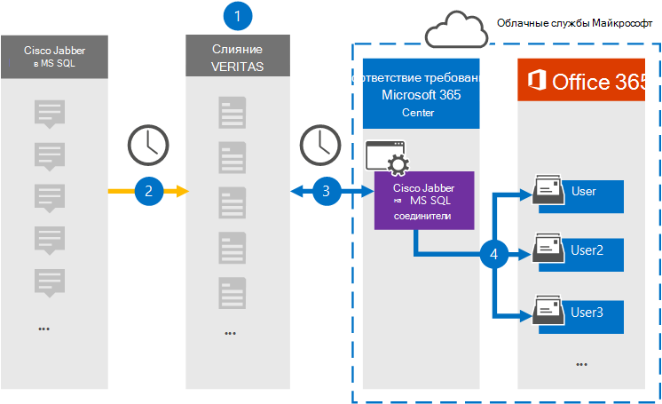

# Настройка соединителя для архивации данных Cisco Jabber

Используйте соединитель Глобанет в центре соответствия требованиям Microsoft 365 для импорта и архивирования данных из платформы Cisco Jabber в почтовые ящики пользователей в организации Microsoft 365. Глобанет предоставляет соединитель [Cisco Jabber](https://globanet.com/jabber/) , настроенный для захвата элементов из базы данных MS SQL Jabber, таких как сообщения чатов 1:1 чата и беседы групп, а затем импортировать эти элементы в Microsoft 365. Соединитель извлекает данные из базы данных MS SQL Cisco Jabber, обрабатывает их и преобразует содержимое из учетной записи Cisco Jabber в формат сообщения электронной почты, а затем импортирует эти элементы в почтовый ящик пользователя в Microsoft 365.

После хранения данных Cisco Jabber в почтовых ящиках пользователей можно применять функции обеспечения соответствия требованиям Microsoft 365, такие как хранение для судебного разбирательства, обнаружение электронных данных, политики хранения и метки хранения, а также соответствие требованиям. Использование соединителя Cisco Jabber для импорта и архивирования данных в Microsoft 365 поможет обеспечить соответствие организации требованиям государственных и законодательных политик.

## Общие сведения о архивации данных Cisco Jabber

В следующем обзоре описывается процесс использования соединителя для архивации данных Cisco Jabber в Microsoft 365.

1. Ваша организация работает с компанией Cisco для установки и настройки базы данных Cisco Jabber on MS SQL.

2. Каждые 24 часа элементы Cisco Jabber копируются из базы данных MS SQL на сайт Глобанет Merge1. Соединитель также Преобразовывает содержимое сообщений чата в формат сообщений электронной почты.

3. Соединитель Cisco Jabber, созданный в центре соответствия требованиям Microsoft 365, подключается к сайту Глобанет Merge1 каждый день и передает элементы в безопасное место хранения Azure в облаке Майкрософт.

4. Автоматическое сопоставление пользователей как соединитель импортирует элементы в почтовые ящики определенных пользователей, используя значение свойства *Email* , описанное в [шаге 3](#step-3-map-users-and-complete-the-connector-setup). Вложенная папка в папке "Входящие" с именем **Cisco Jabber on MS SQL** создается в почтовых ящиках пользователей, а элементы сообщения импортируются в эту папку. Соединитель выполняет это, используя значение свойства *Email* . Каждый элемент Cisco Jabber содержит это свойство, которое заполняется электронным адресом каждого участника сообщения.

## Прежде чем начать

- Создайте учетную запись Глобанет Merge1 для соединителей Майкрософт. Для этого обратитесь в [службу поддержки клиентов глобанет](https://globanet.com/ms-connectors-contact/). Вы должны войти в эту учетную запись, когда вы создадите соединитель на шаге 1.

- Необходимо настроить базу данных MS SQL для извлечения элементов Jabber, прежде чем создавать соединитель в действии 1. Вы укажете параметры подключения для базы данных MS SQL при настройке соединителя Cisco Jabber в действии 2. Дополнительные сведения можно найти в [руководстве пользователя Merge1 сторонних соединителей](https://docs.ms.merge1.globanetportal.com/Merge1%20Third-Party%20Connectors%20Cisco%20Jabber%20on%20MS%20SQL%20User%20Guide%20.pdf).

- Пользователь, который создает соединитель Cisco Jabber в действии 1 (и выполняет его на шаге 3), должен быть назначен роли импорта и экспорта почтовых ящиков в Exchange Online. Эта роль необходима для добавления соединителей на странице " **соединители данных** " в центре соответствия требованиям Microsoft 365. По умолчанию эта роль не назначена ни одной группе ролей в Exchange Online. Вы можете добавить роль экспорта для импорта почтовых ящиков в группу ролей Управление организацией в Exchange Online. Вы также можете создать группу ролей, назначить роль импорта для импорта почтовых ящиков, а затем добавить соответствующих пользователей в качестве участников. Для получения дополнительных сведений обратитесь к разделу [Создание](https://docs.microsoft.com/Exchange/permissions-exo/role-groups#create-role-groups) групп ролей или [изменение групп ролей](https://docs.microsoft.com/Exchange/permissions-exo/role-groups#modify-role-groups) статьи "Управление группами ролей в Exchange Online".

## Шаг 1: Настройка соединителя Cisco Jabber

Первый шаг — доступ к **соединителям данных** в центре соответствия требованиям Microsoft 365 и создание соединителя для данных Cisco Jabber в данных MS SQL.

1. Перейдите в раздел [https://compliance.microsoft.com](https://compliance.microsoft.com/) **соединители данных**  >  **Cisco Jabber для MS SQL** и нажмите кнопку соединители данных.

2. На странице "Описание продукта" **Cisco Jabber on MS SQL** нажмите **Добавить соединитель** .

3. На странице **условия обслуживания** нажмите кнопку **принять** .

4. Введите уникальное имя, идентифицирующее соединитель, а затем нажмите кнопку **Далее** .

5. Войдите в свою учетную запись Merge1, чтобы настроить соединитель.

## Шаг 2: Настройте соединитель Cisco Jabber на сайте Глобанет Merge1

Второй шаг — настройка соединителя Cisco Jabber on MS SQL на сайте Глобанет Merge1. Сведения о настройке соединителя Cisco Jabber on MS SQL можно найти в [руководстве пользователя Merge1 Connectors Guide (сторонние Connectors](https://docs.ms.merge1.globanetportal.com/Merge1%20Third-Party%20Connectors%20Cisco%20Jabber%20on%20MS%20SQL%20User%20Guide%20.pdf)).

После нажатия кнопки **сохранить & готово** вы передаетесь обратно в центр соответствия требованиям Microsoft 365 на страницу **сопоставления пользователей** в мастере соединителей.

## Шаг 3: сопоставление пользователей и завершение установки соединителя

Чтобы сопоставить пользователей и завершить настройку соединителя в центре соответствия требованиям Microsoft 365, выполните указанные ниже действия.

1. На странице **сопоставить Cisco Jabber on MS SQL users to Microsoft 365 Users** включите автоматическое сопоставление пользователей. Элементы Cisco Jabber on MS SQL включают в себя свойство *Email* , которое содержит адреса электронной почты для пользователей в Организации. Если соединитель может сопоставить этот адрес с пользователем Microsoft 365, элементы будут импортированы в почтовый ящик этого пользователя.

2. На странице **"согласие администратора** " щелкните **предоставить согласие** . Вы будете перенаправлены на сайт Майкрософт. Нажмите кнопку **принять** , чтобы предоставить согласие.

   Ваша организация должна разрешить службе импорта Office 365 доступ к данным почтовых ящиков в Организации. Чтобы предоставить согласие администратора, необходимо войти в систему, используя учетные данные глобального администратора Microsoft 365, а затем принять запрос согласия. Если вы не вошли в систему как глобальный администратор, вы можете перейти на [эту страницу](https://login.microsoftonline.com/common/oauth2/authorize?client_id=570d0bec-d001-4c4e-985e-3ab17fdc3073&response_type=code&redirect_uri=https://portal.azure.com/&nonce=1234&prompt=admin_consent) и войти в систему, используя учетные данные глобального администратора, чтобы принять запрос.

3. Нажмите кнопку **Далее** , проверьте параметры и перейдите на страницу " **соединители данных** ", чтобы просмотреть ход процесса импорта для нового соединителя.

## Шаг 4: мониторинг соединителя Cisco Jabber

После создания соединителя Cisco Jabber on MS SQL можно просмотреть состояние соединителя в центре соответствия требованиям Microsoft 365.

1. Перейдите к разделу [https://compliance.microsoft.com](https://compliance.microsoft.com) **соединители данных** в левой панели навигации и нажмите кнопку соединители данных.

2. Перейдите на вкладку **соединители** и выберите параметр **Cisco Jabber on MS SQL** Connector, чтобы отобразить всплывающую страницу, содержащую свойства и информацию о соединителе.

3. В разделе **состояние соединителя с источником** выберите ссылку **журнал загрузки** , чтобы открыть (или сохранить) журнал состояний для соединителя. Этот журнал содержит данные, которые были импортированы в Microsoft Cloud.

## Известные проблемы

- В настоящее время импорт вложений или элементов, размер которых превышает 10 МБ, не поддерживается. Поддержка элементов с большим сроком действия будет доступна позже.
