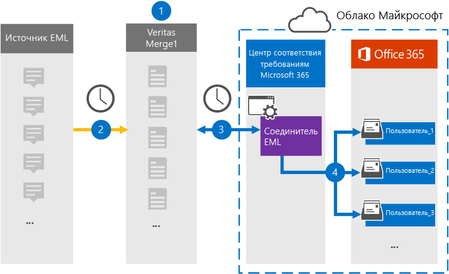

# Настройка соединителя для архивации данных EML (Предварительная версия)

Используйте соединитель Глобанет в центре соответствия требованиям Microsoft 365 для импорта и архивирования EML данных в почтовые ящики пользователей в организации Microsoft 365. EML — это расширение файла для сообщения электронной почты, сохраненного в файле. Соединитель преобразует содержимое элемента из исходного формата в формат сообщения электронной почты, а затем импортирует его в почтовый ящик пользователя.

После того как EML сообщения хранятся в почтовых ящиках пользователей, можно применять функции обеспечения соответствия требованиям Microsoft 365, такие как хранение для судебного разбирательства, обнаружение электронных данных, политики хранения и метки хранения, а также соответствие требованиям. Использование EML Connector для импорта и архивирования данных в Microsoft 365 поможет обеспечить соответствие организации политикам государственных учреждений и нормативным требованиям.

## Обзор архивации данных EML

В следующем обзоре описывается процесс использования соединителя для архивации EML данных в Microsoft 365.

1. Для установки и настройки сайта EML в организации используется источник EML.

2. Каждые 24 часа элементы контента из источника EML копируются на сайт Глобанет Merge1. Во время этого процесса содержимое EML-файла преобразуется в формат сообщения электронной почты.

3. Соединитель EML, созданный в центре соответствия требованиям Microsoft 365, подключается к сайту Глобанет Merge1 каждый день и передает сообщения в безопасное место хранения данных Azure в облаке Майкрософт.

4. Соединитель импортирует преобразованные элементы сообщений в почтовые ящики определенных пользователей, используя значение свойства *Email* процесса автоматического сопоставления пользователей, описанного в [шаге 3](#step-3-map-users-and-complete-the-connector-setup). Во время этого процесса вложенная папка в папке "Входящие" с именем **EML**создается в почтовых ящиках пользователей, а элементы EML импортируются в эту папку. Соединитель выполняет это, используя значение свойства *Email* . Каждое сообщение содержит это свойство, которое заполняется адресом электронной почты каждого участника элемента содержимого.

## Прежде чем начать

- Создайте учетную запись Глобанет Merge1 для соединителей Майкрософт. Для этого обратитесь в [службу поддержки клиентов глобанет](https://globanet.com/ms-connectors-contact). Вы должны войти в эту учетную запись, когда вы создадите соединитель на шаге 1.

- Пользователь, который создает соединитель EML на этапе 1 (и выполняет его на шаге 3), должен быть назначен роли импорта почтовых ящиков в Exchange Online. Эта роль необходима для добавления соединителей на странице " **соединители данных** " в центре соответствия требованиям Microsoft 365. По умолчанию эта роль не назначена ни одной группе ролей в Exchange Online. Вы можете добавить роль экспорта для импорта почтовых ящиков в группу ролей Управление организацией в Exchange Online. Вы также можете создать группу ролей, назначить роль импорта для импорта почтовых ящиков, а затем добавить соответствующих пользователей в качестве участников. Для получения дополнительных сведений обратитесь к разделу [Создание](https://docs.microsoft.com/Exchange/permissions-exo/role-groups#create-role-groups) групп ролей или [изменение групп ролей](https://docs.microsoft.com/Exchange/permissions-exo/role-groups#modify-role-groups) статьи "Управление группами ролей в Exchange Online".

## Шаг 1: Настройка соединителя EML

Первый шаг — доступ к странице " **соединители данных** " в центре соответствия требованиям Microsoft 365 и создание соединителя для данных EML.

1. Перейдите в раздел [https://compliance.microsoft.com](https://compliance.microsoft.com/) **соединители данных**  >  **EML**и нажмите кнопку.

2. На странице Описание продукции **EML** нажмите кнопку **Добавить соединитель**.

3. На странице **условия обслуживания** нажмите кнопку **принять**.

4. Введите уникальное имя, идентифицирующее соединитель, а затем нажмите кнопку **Далее**.

5. Войдите в свою учетную запись Merge1, чтобы настроить соединитель.

## Шаг 2: Настройка соединителя EML на сайте Глобанет Merge1

Второй шаг — настройка соединителя EML на сайте Глобанет Merge1. Сведения о настройке соединителя EML приведены в [руководстве пользователя Merge1 Connectors](https://docs.ms.merge1.globanetportal.com/Merge1%20Third-Party%20Connectors%20EML%20User%20Guide%20.pdf).

После нажатия кнопки **сохранить & готово**вы вернетесь в центр соответствия требованиям Microsoft 365 на страницу **сопоставления пользователей** в мастере соединителей.

## Шаг 3: сопоставление пользователей и завершение установки соединителя

Чтобы сопоставить пользователей и завершить настройку соединителя в центре соответствия требованиям Microsoft 365, выполните указанные ниже действия.

1. На странице " **сопоставление внешних пользователей с Microsoft 365 пользователей** " Включите автоматическое сопоставление пользователей. Элементы источника EML содержат свойство *Email*, которое содержит адреса электронной почты для пользователей в Организации. Если соединитель может сопоставить этот адрес с пользователем Microsoft 365, элементы EML импортируются в почтовый ящик этого пользователя.

2. На странице **согласия администратора** нажмите кнопку **предоставить согласие** . Вы будете перенаправлены на сайт Майкрософт. Нажмите кнопку **принять** , чтобы предоставить согласие.

   Ваша организация должна разрешить службе импорта Office 365 доступ к данным почтовых ящиков в Организации. Чтобы предоставить согласие администратора, необходимо войти в систему, используя учетные данные глобального администратора Microsoft 365, а затем принять запрос согласия. Если вы не вошли в систему как глобальный администратор, вы можете перейти на [эту страницу](https://login.microsoftonline.com/common/oauth2/authorize?client_id=570d0bec-d001-4c4e-985e-3ab17fdc3073&response_type=code&redirect_uri=https://portal.azure.com/&nonce=1234&prompt=admin_consent) и войти в систему, используя учетные данные глобального администратора, чтобы принять запрос.

3. Нажмите кнопку **Далее**, проверьте параметры, а затем перейдите на страницу " **соединители данных** ", чтобы просмотреть ход процесса импорта для нового соединителя.

## Шаг 4: мониторинг соединителя EML

После создания соединителя EML вы можете просмотреть состояние соединителя в центре соответствия требованиям Microsoft 365.

1. Перейдите к разделу [https://compliance.microsoft.com](https://compliance.microsoft.com) **соединители данных** в левой панели навигации и нажмите кнопку соединители данных.

2. Перейдите на вкладку **соединители** и выберите нужный соединитель **EML** , чтобы отобразить всплывающую страницу, содержащую свойства и сведения о соединителе.

3. В разделе **состояние соединителя с источником**выберите ссылку **журнал загрузки** , чтобы открыть (или сохранить) журнал состояний для соединителя. Этот журнал содержит сведения о данных, импортированных в Microsoft Cloud.

## Известные проблемы

- В настоящее время мы не поддерживаем импорт вложений размером более 10 МБ, но поддержка более крупных элементов будет доступна позже.
