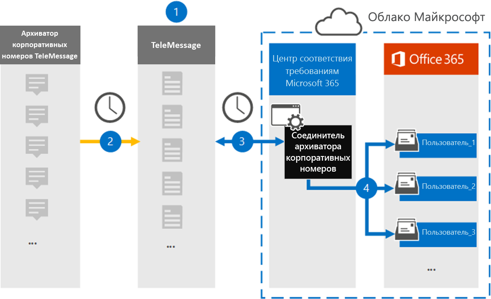

# Настройка соединителя для архивации корпоративных числовых данныхSet up a connector to archive Enterprise Number data

С помощью соединителя обмена сообщениями в центре соответствия требованиям Microsoft 365 можно импортировать и архивировать сообщения службы обмена мгновенными сообщениями (SMS) и службы обмена мгновенными сообщениями (MMS), сообщения чата, записи голосовых вызовов и журналы голосовых вызовов с корпоративного номера WinRAR.Use a TeleMessage connector in the Microsoft 365 compliance center to import and archive Short Messaging Service (SMS) and Multimedia Messaging Service (MMS) messages, chat messages, voice call recordings, and voice call logs from the Enterprise Number Archiver. После настройки и настройки соединителя он подключается к учетной записи электронной почты вашей организации один раз в день и импортирует мобильные данные сотрудников, использующих данные из WinRAR для передачи в почтовые ящики в Microsoft 365.After you set up and configure a connector, it connects to your organization's TeleMessage account once every day and imports the mobile communication data of employees using the TeleMessage Enterprise Number Archiver to mailboxes in Microsoft 365.

После того как данные соединителя Enterprise Number WinRAR Connector помещаются в почтовые ящики пользователей, можно применять функции соответствия требованиям Microsoft 365, такие как хранение для судебного разбирательства, поиск контента, Архивация на месте, аудит, обеспечение соответствия связи и политики хранения Microsoft 365 для корпоративных номеров WinRAR данных.After the TeleMessage Enterprise Number Archiver connector data is stored in user mailboxes, you can apply Microsoft 365 compliance features such as Litigation Hold, Content Search, In-Place Archiving, Auditing, Communication compliance, and Microsoft 365 retention policies to Enterprise Number Archiver data. Например, можно выполнить поиск в корпоративном номере WinRAR SMS, MMS и голосовой вызов с помощью поиска контента или сопоставить почтовый ящик, содержащий данные о корпоративном номере WinRAR Connector, с хранитель в расширенном футляре eDiscovery.For example, you can search the TeleMessage Enterprise Number Archiver SMS, MMS, and Voice Call using Content Search or associate the mailbox that contains the Enterprise Number Archiver connector data with a custodian in an Advanced eDiscovery case. Использование соединителя Enterprise Number WinRAR для импорта и архивирования данных в Microsoft 365 может помочь организации соответствовать государственным и нормативным политикам.Using an Enterprise Number Archiver connector to import and archive data in Microsoft 365 can help your organization stay compliant with government and regulatory policies.

## Обзор архивации корпоративных корпоративных данныхOverview of archiving Enterprise Number data

В следующем обзоре описывается процесс использования соединителя для архивации сетевых данных предприятия в Microsoft 365.The following overview explains the process of using a connector to archive Enterprise Network data in Microsoft 365.

1. Ваша организация работает с сообщением для настройки соединителя WinRAR Enterprise Number.Your organization works with TeleMessage to set up an Enterprise Number Archiver connector. Дополнительные сведения [см.](https://www.telemessage.com/office365-activation-for-enterprise-number-archiver/)For more details refer to [here](https://www.telemessage.com/office365-activation-for-enterprise-number-archiver/).

2. Соединитель WinRAR Enterprise Number, который вы создадите в центре соответствия требованиям Microsoft 365, подключается к сайту каждый день и передает сообщения электронной почты из предыдущих 24 часов в защищенную область хранилища Azure в облаке Майкрософт.The Enterprise Number Archiver connector that you create in the Microsoft 365 compliance center connects to the TeleMessage site every day and transfers the email messages from the previous 24 hours to a secure Azure Storage area in the Microsoft Cloud.

3. Соединитель импортирует элементы мобильного взаимодействия в почтовый ящик определенного пользователя.The connector imports the mobile communication items to the mailbox of a specific user. В почтовом ящике конкретного пользователя будет создан новый каталог с именем Enterprise Number WinRAR, в который будут импортированы элементы.A new folder named Enterprise Number Archiver will be created in the specific user's mailbox and the items will be imported to it. Соединитель выполняет сопоставление, используя значение свойства *электронного адреса пользователя* .The connector does mapping by using the value of the *User’s Email address* property. Каждое сообщение электронной почты содержит это свойство, которое заполняется адресом электронной почты каждого участника сообщения электронной почты.Every email message contains this property, which is populated with the email address of every participant of the email message. В дополнение к автоматическому сопоставлению пользователей с использованием значения свойства *электронного адреса пользователя* , можно также определить настраиваемое сопоставление путем отправки CSV-файла сопоставления.In addition to automatic user mapping using the value of the *User’s Email address* property, you can also define a custom mapping by uploading a CSV mapping file. Этот файл сопоставления должен содержать номер мобильного телефона пользователя и соответствующий адрес почтовых ящиков Microsoft 365 для каждого пользователя.This mapping file should contain User’s mobile Number and the corresponding Microsoft 365 mailbox address for each user. Если включить автоматическое сопоставление пользователей и предоставить настраиваемое сопоставление, для каждого элемента электронной почты соединитель будет сначала просматривать пользовательский файл сопоставления.If you enable automatic user mapping and provide a custom mapping, for every email item the connector will first look at custom mapping file. Если не удается найти действительного пользователя Microsoft 365, который соответствует номеру мобильного телефона пользователя, соединитель будет использовать свойство электронного адреса пользователя почтового элемента.If it doesn't find a valid Microsoft 365 user that corresponds to a user's mobile number, the connector will use the User ‘s email address property of the email item. Если соединитель не находит действительных пользователей Microsoft 365 в файле настраиваемого сопоставления или в свойстве *электронного адреса пользователя* почтового элемента, элемент не импортируется.If the connector doesn't find a valid Microsoft 365 user in either the custom mapping file or the *user’s email address* property of the email item, the item won't be imported.

## Прежде чем начатьBefore you begin

Некоторые действия по реализации, необходимые для архивации корпоративных номеров WinRAR, являются внешними по отношению к Microsoft 365 и должны быть завершены, прежде чем вы сможете создать соединитель в центре соответствия требованиям.Some of the implementation steps required to archive Enterprise Number Archiver data are external to Microsoft 365 and must be completed before you can create the connector in the compliance center.

- Закажите [корпоративный номер службы WinRAR из сообщения](https://www.telemessage.com/mobile-archiver/order-mobile-archiver-for-o365) и получите допустимую учетную запись администрирования для Организации.Order the [Enterprise Number Archiver service from TeleMessage](https://www.telemessage.com/mobile-archiver/order-mobile-archiver-for-o365) and get a valid administration account for your organization. Вам потребуется войти в эту учетную запись, когда вы создадите соединитель в центре соответствия требованиям.You'll need to sign into this account when you create the connector in the compliance center.

- Зарегистрируйте всех пользователей, которым требуется Корпоративное число архивных сетей SMS/MMS, в учетной записи для сообщений.Register all users that require Enterprise Number SMS/MMS Network archiving in the TeleMessage account. При регистрации пользователей необходимо использовать тот же адрес электронной почты, который используется для своей учетной записи Microsoft 365.When registering users, be sure to use the same email address that's used for their Microsoft 365 account.

- Установите и активируйте приложение WinRAR Enterprise Number Enterprise Number на мобильных телефонах сотрудников.Install and activate the TeleMessage Enterprise Number Archiver app on the mobile phones of your employees.

- Ваша организация должна разрешить службе импорта Office 365 доступ к данным почтовых ящиков в Организации.Your organization must consent to allow the Office 365 Import service to access mailbox data in your organization. Вам потребуется предоставить это согласие при создании соединителя.You will need to provide this consent when you create the connector. Чтобы согласиться с этим запросом, перейдите на [эту страницу](https://login.microsoftonline.com/common/oauth2/authorize?client_id=570d0bec-d001-4c4e-985e-3ab17fdc3073&response_type=code&redirect_uri=https://portal.azure.com/&nonce=1234&prompt=admin_consent), войдите с помощью учетных данных глобального администратора Microsoft 365 и примите запрос.To consent to this request, go to [this page](https://login.microsoftonline.com/common/oauth2/authorize?client_id=570d0bec-d001-4c4e-985e-3ab17fdc3073&response_type=code&redirect_uri=https://portal.azure.com/&nonce=1234&prompt=admin_consent), sign in with the credentials of Microsoft 365 global admin, and then accept the request. Необходимо выполнить это действие, прежде чем вы сможете успешно создать соединитель сети Bell.You have to complete this step before you can successfully create a Bell Network connector.

- Пользователю, создающему соединитель WinRAR Enterprise Number, должна быть назначена роль импорта почтовых ящиков в Exchange Online.The user who creates a Enterprise Number Archiver connector must be assigned the Mailbox Import Export role in Exchange Online. Это необходимо для добавления соединителей на странице " **соединители данных** " в центре соответствия требованиям Microsoft 365.This is required to add connectors in the **Data connectors** page in the Microsoft 365 compliance center. По умолчанию эта роль не назначена ни одной группе ролей в Exchange Online.By default, this role isn't assigned to any role group in Exchange Online. Вы можете добавить роль экспорта для импорта почтовых ящиков в группу ролей Управление организацией в Exchange Online.You can add the Mailbox Import Export role to the Organization Management role group in Exchange Online. Вы также можете создать группу ролей, назначить роль импорта для импорта почтовых ящиков, а затем добавить соответствующих пользователей в качестве участников.Or you can create a role group, assign the Mailbox Import Export role, and then add the appropriate users as members. Для получения дополнительных сведений обратитесь к разделу [Создание](https://docs.microsoft.com/Exchange/permissions-exo/role-groups#create-role-groups) групп ролей или [изменение групп ролей](https://docs.microsoft.com/Exchange/permissions-exo/role-groups#modify-role-groups) статьи "Управление группами ролей в Exchange Online".For more information, see the [Create role groups](https://docs.microsoft.com/Exchange/permissions-exo/role-groups#create-role-groups) or [Modify role groups](https://docs.microsoft.com/Exchange/permissions-exo/role-groups#modify-role-groups) sections in the article "Manage role groups in Exchange Online".

## Создание соединителя WinRAR для корпоративного номераCreate an Enterprise Number Archiver connector

После выполнения предварительных требований, описанных в предыдущем разделе, можно создать соединитель корпоративный номер WinRAR в центре соответствия требованиям Microsoft 365.After you've completed the prerequisites described in the previous section, you can create an Enterprise Number Archiver connector in the Microsoft 365 compliance center. Соединитель использует сведения, которые вы предоставляете для подключения к сайту, а также для передачи сообщений SMS, MMS и голосовых вызовов в соответствующие поля почтового ящика пользователя в Microsoft 365.The connector uses the information you provide to connect to the TeleMessage site and transfer SMS, MMS, and voice call messages to the corresponding user mailbox boxes in Microsoft 365.

1. Перейдите к [https://compliance.microsoft.com](https://compliance.microsoft.com/) пункту **соединители данных** \> **корпоративный номер WinRAR**.Go to [https://compliance.microsoft.com](https://compliance.microsoft.com/) and then click **Data connectors** \> **Enterprise Number Archiver**.

2. На странице Описание продукта **WinRAR корпоративного номера** нажмите кнопку **Добавить соединитель** .On the **Enterprise Number Archiver** product description page, click **Add connector**

3. На странице **условия обслуживания** нажмите кнопку **принять**.On the **Terms of service** page, click **Accept**.

4. На странице " **Вход в систему** " в разделе Шаг 3 Введите необходимые сведения в следующие поля, а затем нажмите кнопку **Далее**.On the **Login to TeleMessage** page, under Step 3, enter the required information in the following boxes and then click **Next**.

   - **Имя пользователя:** Имя пользователя в вашем почтовом сообщении.**Username:** Your TeleMessage username.

   - **Пароль:** Пароль к своему почтовому сообщению.**Password:** Your TeleMessage password.

5. После создания соединителя можно закрыть всплывающее окно и перейти к следующей странице.After the connector is created, you can close the pop-up window and go to the next page.

6. На странице **Сопоставление пользователей** включите автоматическое сопоставление пользователей.On the **User mapping** page, enable automatic user mapping. Чтобы включить настраиваемое сопоставление, отправьте CSV-файл, содержащий сведения о сопоставлении пользователей, и нажмите кнопку **Далее**.To enable custom mapping, upload a CSV file that contains the user mapping information, and then click **Next**.

7. Предоставьте согласие администратора и нажмите кнопку **Далее**.Provide admin consent and then click **Next**.

   Чтобы предоставить согласие администратора, необходимо войти в систему, используя учетные данные глобального администратора Office 365, а затем принять запрос согласия.To provide admin consent, you must be signed in with the credentials of an Office 365 global admin, and then accept the consent request. Если вы не вошли в систему как глобальный администратор, вы можете перейти на [эту страницу](https://login.microsoftonline.com/common/oauth2/authorize?client_id=570d0bec-d001-4c4e-985e-3ab17fdc3073&response_type=code&redirect_uri=https://portal.azure.com/&nonce=1234&prompt=admin_consent) и войти в систему, используя учетные данные глобального администратора, чтобы принять запрос.If you aren't signed in as a global admin, you can go to [this page](https://login.microsoftonline.com/common/oauth2/authorize?client_id=570d0bec-d001-4c4e-985e-3ab17fdc3073&response_type=code&redirect_uri=https://portal.azure.com/&nonce=1234&prompt=admin_consent) and sign in using global admin credentials to accept the request.

8. Проверьте параметры и нажмите кнопку **Готово** , чтобы создать соединитель.Review your settings, and then click **Finish** to create the connector.

9. Перейдите на вкладку Connectors (соединители) на странице **Data Connectors** (соединители), чтобы увидеть ход процесса импорта для нового соединителя.Go to the Connectors tab in **Data connectors** page to see the progress of the import process for the new connector.

## Известные проблемыKnown issues

- В настоящее время импорт вложений или элементов, размер которых превышает 10 МБ, не поддерживается.At this time, we don't support importing attachments or items that are larger than 10 MB. Поддержка элементов с большим сроком действия будет доступна позже.Support for larger items will be available at a later date.
