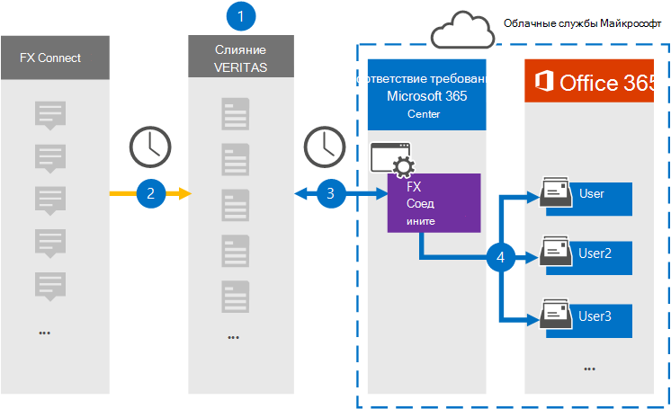

# Настройка соединитетеля для архива данных fx ПодключениеSet up a connector to archive FX Connect data

Используйте соединитель Veritas в центре Microsoft 365 для импорта и архивации данных с платформы совместной Подключение FX для почтовых ящиков пользователей в Microsoft 365 организации.Use a Veritas connector in the Microsoft 365 compliance center to import and archive data from the FX Connect collaboration platform to user mailboxes in your Microsoft 365 organization. Veritas предоставляет [соединитель fx Подключение,](https://globanet.com/fx-connect/) настроенный для захвата элементов FX Подключение и импорта этих элементов в Microsoft 365.Veritas provides an [FX Connect](https://globanet.com/fx-connect/) connector that is configured to capture FX Connect items and import those items to Microsoft 365. Соединитатель преобразует содержимое из FX Подключение, например сделок, сообщений и других сведений из учетной записи FX Подключение организации, в формат сообщения электронной почты, а затем импортирует эти элементы в почтовый ящик пользователя в Microsoft 365.The connector converts the content from FX Connect, such as  trades, messages, and other details from your organization's FX Connect account, to an email message format and then imports those items to the user's mailbox in Microsoft 365.

После хранения Подключение fx в почтовых ящиках пользователей можно применять такие Microsoft 365, как хранение судебного разбирательства, открытие электронных данных, политики хранения и метки хранения, а также соответствие требованиям к связи.After FX Connect data is stored in user mailboxes, you can apply Microsoft 365 compliance features such as Litigation Hold, eDiscovery, retention policies and retention labels, and communication compliance. Использование соединиттеля Подключение для импорта и архива данных в Microsoft 365 может помочь вашей организации соблюдать государственные и нормативные политики.Using an FX Connect connector to import and archive data in Microsoft 365 can help your organization stay compliant with government and regulatory policies.

## Обзор архива данных fx ПодключениеOverview of archiving FX Connect data

В следующем обзоре объясняется процесс использования соединитетеля для архивации данных Подключение в Microsoft 365.The following overview explains the process of using a connector to archive the FX Connect information in Microsoft 365.

1. Ваша организация работает с fx Подключение для настройки и настройки сайта fx Подключение.Your organization works with FX Connect to set up and configure an FX Connect site.

2. Каждые 24 часа элементы из учетных записей FX Подключение копируется на сайте Veritas Merge1.Once every 24 hours, items from FX Connect accounts are copied to the Veritas Merge1 site. Соединителет также преобразует элементы fx Подключение в формат сообщений электронной почты.The connector also converts the FX Connect items to an email message format.

3. Соединитель fx Подключение, который вы создаете в центре Microsoft 365 соответствия требованиям, подключается к сайту Veritas Merge1 каждый день и передает элементы FX Подключение в безопасное расположение служба хранилища Azure в облаке Microsoft.The FX Connect connector that you create in the Microsoft 365 compliance center, connects to the Veritas Merge1 site every day and transfers the FX Connect items to a secure Azure Storage location in the Microsoft cloud.

4. Соединитатель импортирует элементы в почтовые ящики определенных пользователей, используя значение свойства *Email* автоматического сопоставления пользователей, как описано в [шаге 3](#step-3-map-users-and-complete-the-connector-setup).The connector imports items to the mailboxes of specific users by using the value of the *Email* property of the automatic user mapping as described in [Step 3](#step-3-map-users-and-complete-the-connector-setup). Подмостки в папке **"Входящие"** с именем FX Подключение создаются в почтовых ящиках пользователей, и элементы импортируется в эту папку.A subfolder in the Inbox folder named **FX Connect** is created in the user mailboxes, and the items are imported to that folder. Соединитатель делает это, используя значение свойства *Email.*The connector does this by using the value of the *Email* property. Каждый элемент Подключение FX содержит это свойство, которое заполняется адресом электронной почты каждого участника элемента.Every FX Connect item contains this property, which is populated with the email address of every participant of the item.

## Прежде чем начатьBefore you begin

- Создайте учетную запись Veritas Merge1 для соединители Microsoft.Create a Veritas Merge1 account for Microsoft connectors.  Чтобы создать учетную запись, обратитесь [в службу поддержки клиентов Veritas.](https://globanet.com/ms-connectors-contact)To create an account, contact [Veritas Customer Support](https://globanet.com/ms-connectors-contact). При создании соединитетеля в шаге 1 вы вопишитесь в эту учетную запись.You will sign into this account when you create the connector in Step 1.

- Пользователю, создававшего Подключение FX в шаге 1 (и завершающую его в шаге 3), необходимо приступить к роли экспорта импорта почтовых ящиков в Exchange Online.The user who creates the FX Connect connector in Step 1 (and completes it in Step 3) must be assigned to the Mailbox Import Export role in Exchange Online. Эта роль необходима для добавления соединители на **странице** соединители данных в центре Microsoft 365 соответствия требованиям.This role is required to add connectors on the **Data connectors** page in the Microsoft 365 compliance center. По умолчанию эта роль не назначена группе ролей в Exchange Online.By default, this role is not assigned to a role group in Exchange Online. Вы можете добавить роль экспорта импорта почтовых ящиков в группу ролей управления организацией в Exchange Online.You can add the Mailbox Import Export role to the Organization Management role group in Exchange Online. Или вы можете создать группу ролей, назначить роль экспортировать импорт почтовых ящиков, а затем добавить соответствующих пользователей в качестве участников.Or you can create a role group, assign the Mailbox Import Export role, and then add the appropriate users as members. Дополнительные сведения см. в разделах [Создание](/Exchange/permissions-exo/role-groups#create-role-groups) групп ролей или [изменение](/Exchange/permissions-exo/role-groups#modify-role-groups) групп ролей в статье "Управление группами ролей в Exchange Online".For more information, see the [Create role groups](/Exchange/permissions-exo/role-groups#create-role-groups) or [Modify role groups](/Exchange/permissions-exo/role-groups#modify-role-groups) sections in the article "Manage role groups in Exchange Online".

## Шаг 1. Настройка соединиттеля Подключение FXStep 1: Set up the FX Connect connector

Первым шагом является доступ  к странице соединители данных в центре Microsoft 365 соответствия требованиям и создание соединитетеля для данных Подключение fx.The first step is to access to the **Data Connectors** page in the Microsoft 365 compliance center and create a connector for FX Connect data.

1. Перейдите [https://compliance.microsoft.com](https://compliance.microsoft.com/) к и нажмите **кнопку Соединители**  >  **данных FX Подключение**.Go to [https://compliance.microsoft.com](https://compliance.microsoft.com/) and then click **Data connectors** > **FX Connect**.

2. На странице **описания Подключение** fx нажмите **кнопку Добавить соединителю**.On the **FX Connect** product description page, click **Add connector**.

3. На странице **Условия службы нажмите** кнопку **Принять**.On the **Terms of service** page, click **Accept**.

4. Введите уникальное имя, идентифицируемое соединитетелем, а затем нажмите **кнопку Далее**.Enter a unique name that identifies the connector, and then click **Next**.

5. Впишитесь в свою учетную запись Merge1, чтобы настроить соединители.Sign in to your Merge1 account to configure the connector.

## Шаг 2. Настройка соединителя fx Подключение на сайте Veritas Merge1Step 2: Configure the FX Connect connector on the Veritas Merge1 site

Второй шаг — настройка соединители FX Подключение на сайте Merge1.The second step is to configure the FX Connect connector on the Merge1 site. Сведения о настройке соединиттеля FX Подключение см. в руководстве по пользователю [Merge1 Third-Party Connectors.](https://docs.ms.merge1.globanetportal.com/Merge1%20Third-Party%20Connectors%20FX%20Connect%20User%20Guide%20.pdf)For information about how to configure the FX Connect connector, see [Merge1 Third-Party Connectors User Guide](https://docs.ms.merge1.globanetportal.com/Merge1%20Third-Party%20Connectors%20FX%20Connect%20User%20Guide%20.pdf).

После нажатия **кнопки Сохранить &**  finish отображается страница сопоставления пользователей в мастере соединители в центре Microsoft 365 соответствия требованиям.After you click **Save & Finish**, the **User mapping** page in the connector wizard in the Microsoft 365 compliance center is displayed.

## Шаг 3. Карта пользователей и завершение установки соединитетеляStep 3: Map users and complete the connector setup

Чтобы составить карту пользователей и завершить установку соединитетеля в центре Microsoft 365 соответствия требованиям, выполните следующие действия:To map users and complete the connector setup in the Microsoft 365 compliance center, follow these steps:

1. На странице **Map FX Подключение пользователям Microsoft 365** пользователям включить автоматическое сопоставление пользователей.On the **Map FX Connect users to Microsoft 365 users** page, enable automatic user mapping. Элементы fx Подключение включают свойство *Email,* содержаное адреса электронной почты для пользователей в организации.The FX Connect items include a property called *Email*, which contains email addresses for users in your organization. Если соединитатель может связать этот адрес с Microsoft 365 пользователем, элементы импортируется в почтовый ящик этого пользователя.If the connector can associate this address with a Microsoft 365 user, the items are imported to that user’s mailbox.

2. Нажмите **кнопку Далее,** просмотрите параметры и перейдите на страницу соединители данных, чтобы просмотреть ход процесса импорта для нового соединитетеля. Click **Next**, review your settings, and then go to the **Data connectors** page to see the progress of the import process for the new connector.

## Шаг 4. Мониторинг соединиттеля Подключение FXStep 4: Monitor the FX Connect connector

После создания соединиттеля fx Подключение можно просмотреть состояние соединитетеля в центре Microsoft 365 соответствия требованиям.After you create the FX Connect connector, you can view the connector status in the Microsoft 365 compliance center.

1. Перейдите <https://compliance.microsoft.com/> и щелкните **соединители данных** в левом nav.Go to <https://compliance.microsoft.com/> and click **Data connectors** in the left nav.

2. Щелкните **вкладку** Соединители, а затем выберите Подключение **fx,** чтобы отобразить страницу вылетов.Click the **Connectors** tab and then select the **FX Connect** connector to display the flyout page. На этой странице содержатся свойства и сведения о соединители.This page contains the properties and information about the connector.

3. В **состоянии Соединитель с исходным кодом** щелкните ссылку **Журнал** загрузки, чтобы открыть (или сохранить) журнал состояния соединитетеля.Under **Connector status with source**, click the **Download log** link to open (or save) the status log for the connector. В этом журнале содержатся данные, импортируемые в облако Майкрософт.This log contains data that has been imported to the Microsoft cloud.

## Известные проблемыKnown issues

- В настоящее время мы не поддерживаем импорт вложений или элементов размером более 10 МБ.At this time, we don't support importing attachments or items that are larger than 10 MB. Поддержка более крупных элементов будет доступна позднее.Support for larger items will be available at a later date.