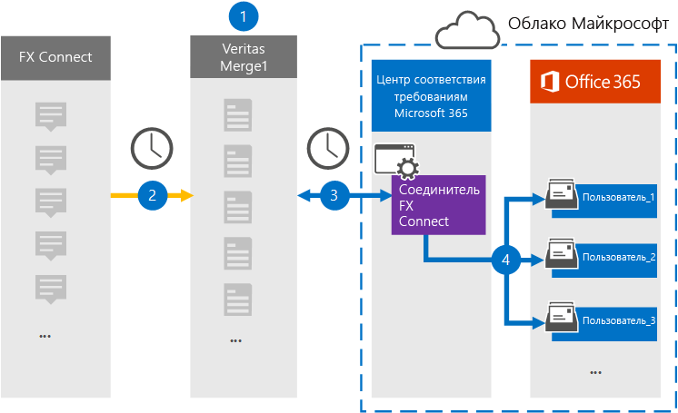

# Настройка соединителя для архивации данных FX ConnectSet up a connector to archive FX Connect data

Используйте соединитель Глобанет в центре соответствия требованиям Microsoft 365 для импорта и архивирования данных из платформы FX Connect Collaboration для почтовых ящиков пользователей в организации Microsoft 365.Use a Globanet connector in the Microsoft 365 compliance center to import and archive data from the FX Connect collaboration platform to user mailboxes in your Microsoft 365 organization. Глобанет предоставляет соединитель [FX Connect](https://globanet.com/fx-connect/) , настроенный для захвата элементов FX Connect и импорта этих элементов в Microsoft 365.Globanet provides an [FX Connect](https://globanet.com/fx-connect/) connector that is configured to capture FX Connect items and import those items to Microsoft 365. Соединитель преобразует содержимое из FX Connect, например, руки, сообщения и другие сведения из учетной записи FX Connect вашей организации, в формат электронного сообщения, а затем импортирует эти элементы в почтовый ящик пользователя в Microsoft 365.The connector converts the content from FX Connect, such as  trades, messages, and other details from your organization's FX Connect account, to an email message format and then imports those items to the user's mailbox in Microsoft 365.

После хранения данных FX Connect в почтовых ящиках пользователей можно применять функции обеспечения соответствия требованиям Microsoft 365, такие как хранение для судебного разбирательства, обнаружение электронных данных, политики хранения и метки хранения, а также соответствие требованиям.After FX Connect data is stored in user mailboxes, you can apply Microsoft 365 compliance features such as Litigation Hold, eDiscovery, retention policies and retention labels, and communication compliance. С помощью соединителя FX Connect для импорта и архивирования данных в Microsoft 365 можно обеспечить соответствие организации политикам государственных учреждений и нормативным требованиям.Using a FX Connect connector to import and archive data in Microsoft 365 can help your organization stay compliant with government and regulatory policies.

## Общие сведения о архивных данных FX ConnectOverview of archiving FX Connect data

В следующем обзоре описывается процесс использования соединителя для архивации данных FX Connect в Microsoft 365.The following overview explains the process of using a connector to archive the FX Connect information in Microsoft 365.

1. Ваша организация работает с FX Connect, чтобы установить и настроить сайт FX Connect.Your organization works with FX Connect to set up and configure an FX Connect site.

2. Каждые 24 часа элементы из учетных записей подключения FX копируются на сайт Глобанет Merge1.Once every 24 hours, items from FX Connect accounts are copied to the Globanet Merge1 site. Соединитель также преобразует элементы FX Connect в формат сообщения электронной почты.The connector also converts the FX Connect items to an email message format.

3. Соединитель FX Connect, созданный в центре соответствия требованиям Microsoft 365, подключается к сайту Глобанет Merge1 каждый день и передает элементы FX Connect в безопасное место хранения Azure в облаке Майкрософт.The FX Connect connector that you create in the Microsoft 365 compliance center, connects to the Globanet Merge1 site every day and transfers the FX Connect items to a secure Azure Storage location in the Microsoft cloud.

4. Соединитель импортирует элементы в почтовые ящики определенных пользователей, используя значение свойства *Email* для автоматического сопоставления пользователей, как описано в [шаге 3](#step-3-map-users-and-complete-the-connector-setup).The connector imports items to the mailboxes of specific users by using the value of the *Email* property of the automatic user mapping as described in [Step 3](#step-3-map-users-and-complete-the-connector-setup). Вложенная папка в папке "Входящие" с именем **FX Connect** создается в почтовых ящиках пользователей, а элементы импортируются в эту папку.A subfolder in the Inbox folder named **FX Connect** is created in the user mailboxes, and the items are imported to that folder. Соединитель выполняет это, используя значение свойства *Email* .The connector does this by using the value of the *Email* property. Каждый элемент FX Connect содержит это свойство, которое заполняется адресом электронной почты каждого участника элемента.Every FX Connect item contains this property, which is populated with the email address of every participant of the item.

## Прежде чем начатьBefore you begin

- Создайте учетную запись Глобанет Merge1 для соединителей Майкрософт.Create a Globanet Merge1 account for Microsoft connectors.  Для этого обратитесь в [службу поддержки клиентов глобанет](https://globanet.com/ms-connectors-contact).To do this, contact [Globanet Customer Support](https://globanet.com/ms-connectors-contact). Вы должны войти в эту учетную запись, когда вы создадите соединитель на шаге 1.You need to sign into this account when you create the connector in Step 1.

- Пользователь, который создает соединитель FX Connect на этапе 1 (и выполняет его на шаге 3), должен быть назначен роли импорта для импорта почтовых ящиков в Exchange Online.The user who creates the FX Connect connector in Step 1 (and completes it in Step 3) must be assigned to the Mailbox Import Export role in Exchange Online. Эта роль необходима для добавления соединителей на странице " **соединители данных** " в центре соответствия требованиям Microsoft 365.This role is required to add connectors on the **Data connectors** page in the Microsoft 365 compliance center. По умолчанию эта роль не назначена ни одной группе ролей в Exchange Online.By default, this role is not assigned to any role group in Exchange Online. Вы можете добавить роль экспорта для импорта почтовых ящиков в группу ролей Управление организацией в Exchange Online.You can add the Mailbox Import Export role to the Organization Management role group in Exchange Online. Вы также можете создать группу ролей, назначить роль импорта для импорта почтовых ящиков, а затем добавить соответствующих пользователей в качестве участников.Or you can create a role group, assign the Mailbox Import Export role, and then add the appropriate users as members. Для получения дополнительных сведений обратитесь к разделу [Создание](https://docs.microsoft.com/Exchange/permissions-exo/role-groups#create-role-groups) групп ролей или [изменение групп ролей](https://docs.microsoft.com/Exchange/permissions-exo/role-groups#modify-role-groups) статьи "Управление группами ролей в Exchange Online".For more information, see the [Create role groups](https://docs.microsoft.com/Exchange/permissions-exo/role-groups#create-role-groups) or [Modify role groups](https://docs.microsoft.com/Exchange/permissions-exo/role-groups#modify-role-groups) sections in the article "Manage role groups in Exchange Online".

## Шаг 1: Настройка соединителя подключения FXStep 1: Set up the FX Connect connector

Первый шаг — доступ к странице " **соединители данных** " в центре соответствия требованиям Microsoft 365 и создание соединителя для данных FX Connect.The first step is to access to the **Data Connectors** page in the Microsoft 365 compliance center and create a connector for FX Connect data.

1. Перейдите к [https://compliance.microsoft.com](https://compliance.microsoft.com/) пункту **Data Connectors**  >  **FX Connect**.Go to [https://compliance.microsoft.com](https://compliance.microsoft.com/) and then click **Data connectors** > **FX Connect**.

2. На странице "Описание продукта **FX Connect** " нажмите **Добавить соединитель**.On the **FX Connect** product description page, click **Add connector**.

3. На странице **условия обслуживания** нажмите кнопку **принять**.On the **Terms of service** page, click **Accept**.

4. Введите уникальное имя, идентифицирующее соединитель, а затем нажмите кнопку **Далее**.Enter a unique name that identifies the connector, and then click **Next**.

5. Войдите в свою учетную запись Merge1, чтобы настроить соединитель.Sign in to your Merge1 account to configure the connector.

## Шаг 2: Настройте соединитель FX Connect на сайте Глобанет Merge1Step 2: Configure the FX Connect connector on the Globanet Merge1 site

Второй шаг — настройка соединителя FX Connect на сайте Merge1.The second step is to configure the FX Connect connector on the Merge1 site. Сведения о том, как настроить соединитель FX Connect, можно найти в [руководстве пользователя Merge1 Connectors](https://docs.ms.merge1.globanetportal.com/Merge1%20Third-Party%20Connectors%20FX%20Connect%20User%20Guide%20.pdf).For information about how to configure the FX Connect connector, see [Merge1 Third-Party Connectors User Guide](https://docs.ms.merge1.globanetportal.com/Merge1%20Third-Party%20Connectors%20FX%20Connect%20User%20Guide%20.pdf).

После нажатия кнопки **сохранить & готово**вы передаетесь обратно в центр соответствия требованиям Microsoft 365 на страницу **сопоставления пользователей** в мастере соединителей.After you click **Save & Finish**, you are directed back to the Microsoft 365 compliance center, to the **User mapping** page in the connector wizard.

## Шаг 3: сопоставление пользователей и завершение установки соединителяStep 3: Map users and complete the connector setup

Чтобы сопоставить пользователей и завершить настройку соединителя в центре соответствия требованиям Microsoft 365, выполните указанные ниже действия.To map users and complete the connector setup in the Microsoft 365 compliance center, follow these steps:

1. На странице **Map FX Connect users to Microsoft 365 Users** включите автоматическое сопоставление пользователей.On the **Map FX Connect users to Microsoft 365 users** page, enable automatic user mapping. Элементы FX Connect включают в себя свойство *Email*, которое содержит адреса электронной почты для пользователей в Организации.The FX Connect items include a property called *Email*, which contains email addresses for users in your organization. Если соединитель может сопоставить этот адрес с пользователем Microsoft 365, элементы будут импортированы в почтовый ящик этого пользователя.If the connector can associate this address with a Microsoft 365 user, the items are imported to that user’s mailbox.

2. На странице **"согласие администратора** " щелкните **предоставить согласие**.On the **Admin Consent** page, click **Provide Consent**. Вы будете перенаправлены на сайт Майкрософт.You will be redirected to the Microsoft site. Нажмите кнопку **принять** , чтобы предоставить согласие.Click **Accept** to provide the consent.

   Ваша организация должна разрешить службе импорта Office 365 доступ к данным почтовых ящиков в Организации.Your organization must consent to allow the Office 365 Import service to access mailbox data in your organization. Чтобы предоставить согласие администратора, необходимо войти в систему, используя учетные данные глобального администратора Microsoft 365, а затем принять запрос согласия.To provide admin consent, you must be signed in with the credentials of a Microsoft 365 global admin, and then accept the consent request. Если вы не вошли в систему как глобальный администратор, вы можете перейти на [эту страницу](https://login.microsoftonline.com/common/oauth2/authorize?client_id=570d0bec-d001-4c4e-985e-3ab17fdc3073&response_type=code&redirect_uri=https://portal.azure.com/&nonce=1234&prompt=admin_consent) и войти в систему, используя учетные данные глобального администратора, чтобы принять запрос.If you aren't signed in as a global admin, you can go to [this page](https://login.microsoftonline.com/common/oauth2/authorize?client_id=570d0bec-d001-4c4e-985e-3ab17fdc3073&response_type=code&redirect_uri=https://portal.azure.com/&nonce=1234&prompt=admin_consent) and sign in using global admin credentials to accept the request.

3. Нажмите кнопку **Далее**, проверьте параметры, а затем перейдите на страницу " **соединители данных** ", чтобы просмотреть ход процесса импорта для нового соединителя.Click **Next**, review your settings, and then go to the **Data connectors** page to see the progress of the import process for the new connector.

## Шаг 4: мониторинг соединителя диспетчера FXStep 4: Monitor the FX Connect connector

После создания соединителя FX Connect вы можете просмотреть состояние соединителя в центре соответствия требованиям Microsoft 365.After you create the FX Connect connector, you can view the connector status in the Microsoft 365 compliance center.

1. Перейдите к разделу <https://compliance.microsoft.com/> **соединители данных** в левой панели навигации и нажмите кнопку соединители данных.Go to <https://compliance.microsoft.com/> and click **Data connectors** in the left nav.

2. Перейдите на вкладку **соединители** и выберите соединитель **FX Connect** , чтобы отобразить всплывающую страницу, содержащую свойства и сведения о соединителе.Click the **Connectors** tab and then select the **FX Connect** connector to display the flyout page, which contains the properties and information about the connector.

3. В разделе **состояние соединителя с источником**выберите ссылку **журнал загрузки** , чтобы открыть (или сохранить) журнал состояний для соединителя.Under **Connector status with source**, click the **Download log** link to open (or save) the status log for the connector. Этот журнал содержит данные, которые были импортированы в Microsoft Cloud.This log contains data that has been imported to the Microsoft cloud.

## Известные проблемыKnown issues

- В настоящее время импорт вложений или элементов, размер которых превышает 10 МБ, не поддерживается.At this time, we don't support importing attachments or items that are larger than 10 MB. Поддержка элементов с большим сроком действия будет доступна позже.Support for larger items will be available at a later date.
