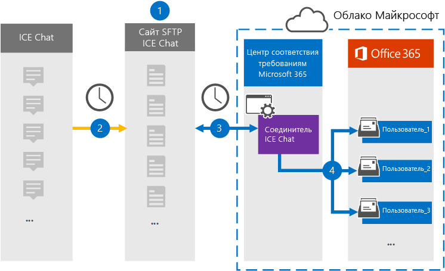

# Настройка соединитетеля для архива данных чата ICE

Используйте родной соединитель в центре соответствия требованиям Microsoft 365 для импорта и архивации данных чата финансовых служб из средства совместной работы ICE Chat. После настройки соединители он подключается к сайту БЕЗОПАСНОГО FTP(SFTP) вашей организации один раз в день, преобразует содержимое сообщений чата в формат сообщений электронной почты, а затем импортирует эти элементы в почтовые ящики в Microsoft 365.

После хранения данных чата ICE в почтовых ящиках пользователей к данным ICE Chat можно применить такие функции соответствия требованиям Microsoft 365, как удержание судебного разбирательства, eDiscovery, архива, аудит, соответствие требованиям к связи и политики хранения Microsoft 365. Например, вы можете искать сообщения ICE Chat с помощью поиска контента или связывать почтовый ящик, содержащий данные чата ICE, с хранителями в деле advanced eDiscovery. Использование соединиттеля чата ICE для импорта и архива данных в Microsoft 365 может помочь вашей организации соблюдать государственные и нормативные политики.

## Обзор архива данных ICE Chat

В следующем обзоре рассказывается о процессе использования соединитетеля для архивации данных чата ICE в Microsoft 365.

1. Ваша организация работает с ICE Chat, чтобы настроить сайт SFTP-чата ICE. Вы также будете работать с ICE Chat, чтобы настроить ICE Chat для копирования сообщений чата на сайтЕ ICE Chat SFTP.

2. Раз в 24 часа сообщения чата из ICE Chat копируется на ваш сайт ICE Chat SFTP.

3. Соединителичные чаты ICE, которые вы создаете в центре соответствия требованиям Microsoft 365, каждый день подключаются к сайту SFTP ice Chat и перенося сообщения чата из предыдущих 24 часов в безопасное хранилище Azure в Microsoft Cloud. Соединителет также преобразует содержимое сеанса чата в формат сообщения электронной почты.

4. Соединитатель импортирует элементы сообщений чата в почтовые ящики определенных пользователей. В почтовых ящиках пользователей создается новая папка с именем **ICE Chat,** и элементы сообщений чата импортируется в эту папку. Соединителю используется значение свойств *SenderEmail* и *RecipientEmail.* Каждое сообщение чата содержит эти свойства, которые заполнены адресом электронной почты отправитель и каждый получатель или участник сообщения чата.

   Помимо автоматического сопоставления пользователей, использующих значения свойства *SenderEmail* и *RecipientEmail* (это означает, что соединителю импортируется сообщение чата в почтовый ящик отправителя и почтовые ящики каждого получателя), можно также определить настраиваемое сопоставление пользователей, загрузив файл сопоставления CSV. Этот файл сопоставления содержит *imId* чата ICE и соответствующий почтовый ящик Microsoft 365 для каждого пользователя в вашей организации. Если вы включаете автоматическое сопоставление пользователей и предоставляете настраиваемый файл сопоставления, для каждого элемента чата соединитатель сначала будет смотреть на настраиваемый файл сопоставления. Если он не найдет допустимую учетную запись пользователя Microsoft 365, соответствующую имиду ICE Chat ImId пользователя, соединители будут использовать свойства *SenderEmail* и *RecipientEmail* элемента чата для импорта элемента в почтовые ящики участников чата. Если соединителю не найти допустимого пользователя Microsoft 365 в настраиваемом файле сопоставления или *свойствах SenderEmail* и *RecipientEmail,* элемент не будет импортироваться.

## Подготовка

Некоторые действия по реализации, необходимые для архивации данных ICE Chat, являются внешними для Microsoft 365 и должны быть завершены, прежде чем вы сможете создать соединитектор в центре соответствия требованиям.

- ICE Chat взимает с клиентов плату за внешнее соответствие требованиям. Ваша организация должна обратиться в группу продаж ICE Chat, чтобы обсудить и подписать соглашение об услугах служб данных ICE Chat, которое можно получить в [https://www.theice.com/publicdocs/agreements/ICE\_Data\_Services\_Agreement.pdf](https://www.theice.com/publicdocs/agreements/ICE\_Data\_Services\_Agreement.pdf) . Это соглашение заключено между ICE Chat и вашей организацией и не включает Корпорацию Майкрософт. После того, как вы настроите сайт SFTP-чата ICE в шаге 2, ICE Chat предоставляет учетные данные FTP непосредственно вашей организации. Затем вы предоставите эти учетные данные Корпорации Майкрософт при настройке соединитетеля в шаге 3.

- Перед созданием соединитетеля в шаге 3 необходимо настроить сайт SFTP-чата ICE. После работы с ICE Chat для настройка сайта SFTP данные из ICE Chat загружаются на сайт SFTP каждый день. Соединитатель, который вы создаете в шаге 3, подключается к этому сайту SFTP и передает данные чата в почтовые ящики Microsoft 365. SFTP также шифрует данные ICE Chat, которые отправляются в почтовые ящики во время процесса передачи.

- Соединители чата ICE могут импортировать в общей сложности 200 000 элементов за один день. Если на сайте SFTP находится более 200 000 элементов, ни один из этих элементов не будет импортироваться в Microsoft 365.

- Администратору, создававшего соединитель ICE Chat в шаге 3 (а также скачивающую общедоступные ключи и IP-адрес в шаге 1), необходимо приступить к роли экспорта импорта почтовых ящиков в Exchange Online. Эта роль необходима для добавления соединители на странице **соединители** данных в центре соответствия требованиям Microsoft 365. По умолчанию эта роль не назначена ни одной группе ролей в Exchange Online. Вы можете добавить роль экспорта импорта почтовых ящиков в группу ролей управления организацией в Exchange Online. Или вы можете создать группу ролей, назначить роль экспортировать импорт почтовых ящиков, а затем добавить соответствующих пользователей в качестве участников. Дополнительные сведения см. в разделах Создание групп [ролей](/Exchange/permissions-exo/role-groups#create-role-groups) или [изменение](/Exchange/permissions-exo/role-groups#modify-role-groups) групп ролей в статье "Управление группами ролей в Exchange Online".

## Шаг 1. Получение общедоступных ключей SSH и PGP

Первым шагом является получение копии общедоступных ключей для secure Shell (SSH) и Pretty Good Privacy (PGP). Эти клавиши используются в шаге 2 для настройки SFTP-сайта ICE Chat SFTP, чтобы разрешить соединитеку (создаваемый в шаге 3) подключаться к сайту SFTP и передавать данные ICE Chat в почтовые ящики Microsoft 365. На этом шаге вы также получите IP-адрес, который используется при настройке сайта SFTP ice Chat.

1. Перейдите [https://compliance.microsoft.com](https://compliance.microsoft.com) и щелкните **соединители данных** в левом nav.

2. На странице **Соединители данных в** **ICE Chat** нажмите **кнопку Просмотр**.

3. На странице **ICE Chat** нажмите **кнопку Добавить соединителю**.

4. На странице **Условия службы нажмите** кнопку **Принять**.

5. На странице Добавление учетных данных для сайта **ICE Chat SFTP** в шаге 1  щелкните клавишу Download **SSH,** скачайте **клавишу PGP** и скачайте ссылки IP-адресов, чтобы сохранить копию каждого файла на локальном компьютере. Эти файлы содержат следующие элементы, используемые для настройки сайта SFTP-чата ICE в шаге 2:

   - Открытый ключ SSH. Этот ключ используется для настройки secure SSH для обеспечения безопасного удаленного входа при подключении соединитетеля к сайту SFTP ICE Chat.

   - Открытый ключ PGP. Этот ключ используется для настройки шифрования данных, переданных с сайта ICE Chat SFTP в Microsoft 365.

   - IP-адрес. Сайт SFTP-чата ICE настроен для того, чтобы принимать запрос на подключение только с этого IP-адреса, который используется соединителом чата ICE, который создается в шаге 3.

6. Щелкните **Отмена,** чтобы закрыть мастера. Вы возвращались к этому мастеру в шаге 3 для создания соединитетеля.

## Шаг 2. Настройка сайта SFTP-чата ICE

Следующим шагом является использование общедоступных ключей SSH и PGP и IP-адреса, полученных в шаге 1, для настройки проверки подлинности SSH и шифрования PGP для сайта SFTP ICE Chat. Это позволяет соединитеку ICE Chat, создаваемую в шаге 3, подключиться к сайту SFTP ice Chat и передать данные ICE Chat в Microsoft 365. Чтобы настроить сайт SFTP-чата ICE, необходимо работать с поддержкой клиентов ICE Chat.

## Шаг 3. Создание соединитетеля чата ICE

Последний шаг — создание соединитетеля ice Chat в центре соответствия требованиям Microsoft 365. Соединитатель использует сведения, которые вы предоставляете, чтобы подключиться к сайту SFTP ice Chat и передать сообщения чата соответствующим ящикам почтовых ящиков пользователей в Microsoft 365.

1. Перейдите [https://compliance.microsoft.com](https://compliance.microsoft.com) и щелкните **соединители данных** в левом nav.

2. На странице **Соединители данных в** **ICE Chat** нажмите **кнопку Просмотр**.

3. На странице **ICE Chat** нажмите **кнопку Добавить соединителю**.

4. На странице **Условия службы нажмите** кнопку **Принять**.

5. На странице Добавление учетных данных для **сайта ICE Chat SFTP** в шаге 3 введите необходимые сведения в следующих полях и нажмите кнопку **Проверка подключения.**

   - **Код фирмы:** ID для вашей организации, который используется в качестве имени пользователя для сайта ICE Chat SFTP.

   - **Пароль:** Пароль для сайта ICE Chat SFTP.

   - **URL-адрес SFTP:** URL-адрес сайта SFTP ice Chat (например, sftp.theice.com).

   - **Порт SFTP:** Номер порта для сайта ICE Chat SFTP. Соединительщик использует этот порт для подключения к сайту SFTP.

6. После проверки подключения нажмите кнопку **Далее**.

7. На странице **"Карта внешних пользователей в Microsoft 365"** включаем автоматическое сопоставление пользователей и при необходимости предостанавлив пользовательское сопоставление. На этой странице можно скачать копию CSV-файла пользовательского сопоставления. Вы можете добавить сопоставления пользователей в файл, а затем загрузить его.

   > [!NOTE]
   > Как уже объяснялось ранее, пользовательский файл сопоставления CSV-файла содержит имид ICE Chat и соответствующий адрес почтового ящика Microsoft 365 для каждого пользователя. Если включить автоматическое сопоставление пользователей и предоставить настраиваемое сопоставление, для каждого элемента чата соединитатель сначала будет смотреть настраиваемый файл сопоставления. Если он не найдет допустимого пользователя Microsoft 365, соответствующего имиду ICE Chat пользователя, соединителю будет импортировать элемент в почтовые ящики для пользователей, указанных в свойствах *SenderEmail* и *RecipientEmail* элемента чата. Если соединиттель не найдет допустимого пользователя Microsoft 365 с помощью автоматического или настраиваемого сопоставления пользователей, элемент не будет импортирован.

8. Нажмите **кнопку Далее,** просмотрите параметры и нажмите **кнопку Готово** для создания соединитетеля.

9. Перейдите на **страницу Соединители** данных, чтобы увидеть ход процесса импорта для нового соединитетеля.