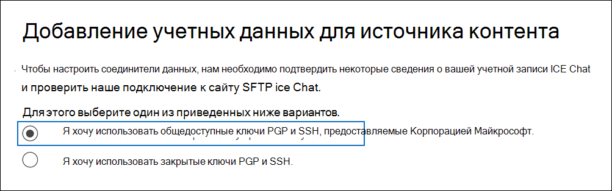
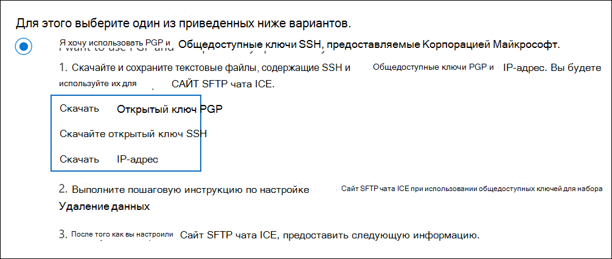
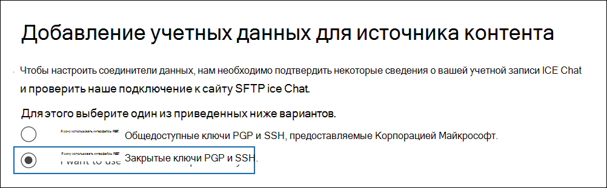
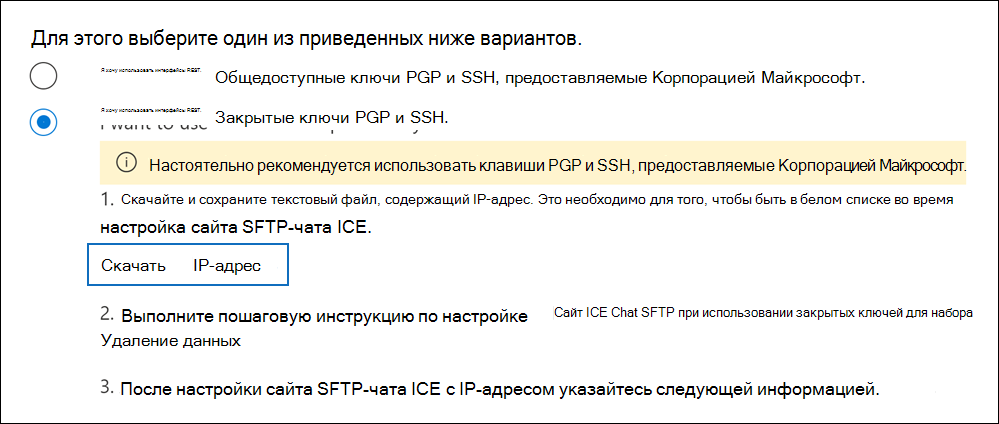

# Настройка соединитетеля для архива данных чата ICE

Используйте родной соединитель в центре Microsoft 365 для импорта и архивации данных чата финансовых служб из средства совместной работы ICE Chat. После настройки соединители он подключается к сайту БЕЗОПАСНОГО FTP (SFTP) организации один раз в день, преобразует содержимое сообщений чата в формат сообщений электронной почты, а затем импортирует эти элементы в почтовые ящики в Microsoft 365.

После хранения данных чата ICE в почтовых ящиках пользователей можно применить Microsoft 365, такие как хранение судебных разбирательств, хранение электронных данных, архива, аудит, соответствие требованиям к Microsoft 365 связи и хранение данных ICE Chat. Например, вы можете искать сообщения ICE Chat с помощью поиска контента или связывать почтовый ящик, содержащий данные ICE Chat, с хранителями в Advanced eDiscovery случае. Использование соединиттеля чата ICE для импорта и архива данных в Microsoft 365 может помочь вашей организации соблюдать правительственные и нормативные политики.

## Обзор архива данных ICE Chat

В следующем обзоре объясняется процесс использования соединитетеля для архивации данных чата ICE в Microsoft 365.

1. Ваша организация работает с ICE Chat, чтобы настроить сайт SFTP-чата ICE. Вы также будете работать с ICE Chat, чтобы настроить ICE Chat для копирования сообщений чата на сайтЕ ICE Chat SFTP.

2. Раз в 24 часа сообщения чата из ICE Chat копируется на ваш сайт ICE Chat SFTP.

3. Соединители ice Chat, которые вы создаете в центре Microsoft 365 соответствия требованиям, ежедневно подключаются к сайту SFTP-чата ICE и перенося сообщения чата из предыдущих 24 часов в безопасное служба хранилища Azure в облаке Майкрософт. Соединителет также преобразует содержимое сеанса чата в формат сообщения электронной почты.

4. Соединитатель импортирует элементы сообщений чата в почтовые ящики определенных пользователей. В почтовых ящиках пользователей создается новая папка с именем **ICE Chat,** и элементы сообщений чата импортируется в эту папку. Соединителю используется значение свойств *SenderEmail* и *RecipientEmail.* Каждое сообщение чата содержит эти свойства, которые заполнены адресом электронной почты отправитель и каждый получатель или участник сообщения чата.

   Помимо автоматического сопоставления пользователей, использующих значения свойства *SenderEmail* и *RecipientEmail* (это означает, что соединителю импортируется сообщение чата в почтовый ящик отправителя и почтовые ящики каждого получателя), можно также определить настраиваемое сопоставление пользователей, загрузив файл сопоставления CSV. Этот файл сопоставления содержит *imId* ice Chat и соответствующий Microsoft 365 адрес почтового ящика для каждого пользователя в организации. Если вы включаете автоматическое сопоставление пользователей и предоставляете настраиваемый файл сопоставления, для каждого элемента чата соединитатель сначала будет смотреть на настраиваемый файл сопоставления. Если он не находит допустимую учетную запись Microsoft 365, соответствующую имиду ICE Chat ImId пользователя, соединителю будут использовать свойства *SenderEmail* и *RecipientEmail* элемента чата для импорта элемента в почтовые ящики участников чата. Если соединителю не Microsoft 365 допустимого пользователя в настраиваемом файле сопоставления или *свойствах SenderEmail* и *RecipientEmail,* элемент не будет импортирован.

## Перед настройками соединитетеля

Некоторые этапы реализации, необходимые для архивации данных ICE Chat, являются внешними для Microsoft 365 и должны быть завершены, прежде чем вы сможете создать соединитектор в центре соответствия требованиям.

- ICE Chat взимает с клиентов плату за внешнее соответствие требованиям. Ваша организация должна обратиться в группу продаж ICE Chat, чтобы обсудить и подписать соглашение об услугах служб данных ICE Chat, которое можно получить в [https://www.theice.com/publicdocs/agreements/ICE\_Data\_Services\_Agreement.pdf](https://www.theice.com/publicdocs/agreements/ICE\_Data\_Services\_Agreement.pdf) . Это соглашение заключено между ICE Chat и вашей организацией и не включает Корпорацию Майкрософт. После того, как вы настроите сайт SFTP-чата ICE в шаге 2, ICE Chat предоставляет учетные данные FTP непосредственно вашей организации. Затем вы предоставите эти учетные данные Корпорации Майкрософт при настройке соединитетеля в шаге 3.

- Перед созданием соединитетеля в шаге 3 необходимо настроить сайт SFTP-чата ICE. После работы с ICE Chat для настройка сайта SFTP данные из ICE Chat загружаются на сайт SFTP каждый день. Соединитатель, который вы создаете в шаге 3, подключается к этому сайту SFTP и передает данные чата в Microsoft 365 почтовые ящики. SFTP также шифрует данные ICE Chat, которые отправляются в почтовые ящики во время процесса передачи.

- Чтобы настроить соединители ice Chat, необходимо использовать клавиши и ключевые passphrases для довольно хорошей конфиденциальности (PGP) и Secure Shell (SSH). Эти клавиши используются для настройки SFTP-сайта ICE Chat и используются соединителом для подключения к сайту SFTP для импорта данных в Microsoft 365. Ключ PGP используется для настройки шифрования данных, переданных с сайта SFTP ice Chat на Microsoft 365. Ключ SSH используется для настройки безопасной оболочки для обеспечения безопасного удаленного входа при подключении соединитетеля к сайту ICE Chat SFTP.

  При настройке соединителера можно использовать общедоступные ключи и проходные перефразы, предоставляемые Корпорацией Майкрософт, или же вы можете использовать собственные закрытые ключи и passphrases. Рекомендуем использовать общедоступные ключи, предоставляемые Корпорацией Майкрософт. Однако если ваша организация уже настроил сайт SFTP-чата ICE с помощью закрытых ключей, можно создать соединитектор с помощью этих же закрытых ключей.

- Соединители чата ICE могут импортировать в общей сложности 200 000 элементов за один день. Если на сайте SFTP находится более 200 000 элементов, ни один из этих элементов не будет импортироваться в Microsoft 365.

- Администратору, создававшего соединители ICE Chat в шаге 3 (а также скачивающую общедоступные ключи и IP-адрес в шаге 1), необходимо уступить роль экспорта импорта почтовых ящиков в Exchange Online. Эта роль необходима для добавления соединители на **странице** соединители данных в центре Microsoft 365 соответствия требованиям. По умолчанию эта роль не назначена ни одной группе ролей в Exchange Online. Вы можете добавить роль экспорта импорта почтовых ящиков в группу ролей управления организацией в Exchange Online. Или вы можете создать группу ролей, назначить роль экспортировать импорт почтовых ящиков, а затем добавить соответствующих пользователей в качестве участников. Дополнительные сведения см. в разделах [Создание](/Exchange/permissions-exo/role-groups#create-role-groups) групп ролей или [изменение](/Exchange/permissions-exo/role-groups#modify-role-groups) групп ролей в статье "Управление группами ролей в Exchange Online".

## Настройка соединитетеля с помощью общедоступных ключей

В этом разделе покажут, как настроить соединители ICE Chat с помощью общедоступных ключей для службы конфиденциальности (PGP) и Secure Shell (SSH).

### Шаг 1. Получение общедоступных ключей PGP и SSH

На первом этапе необходимо получить копию общедоступных ключей для Службы конфиденциальности (PGP) и Secure Shell (SSH). Эти клавиши используются в шаге 2 для настройки сайта SFTP-чата ICE, чтобы разрешить соединители (создаваемые в шаге 3) подключаться к сайту SFTP и передавать данные ICE Chat в Microsoft 365 почтовые ящики. На этом шаге вы также получите IP-адрес, который используется при настройке сайта SFTP ice Chat.

1. Перейдите [https://compliance.microsoft.com](https://compliance.microsoft.com) и щелкните **соединители данных** в левом nav.

2. На странице **Соединители данных в** **ICE Chat** нажмите **кнопку Просмотр**.

3. На странице **ICE Chat** нажмите **кнопку Добавить соединителю**.

4. На странице **Условия службы нажмите** кнопку **Принять**.

5. На странице **Добавление учетных данных для** исходных страниц контента нажмите кнопку Я хочу использовать общедоступные ключи PGP и **SSH, предоставляемые Корпорацией Майкрософт.**

   

6. На шаге 1 щелкните клавишу **Download SSH,** скачайте  **клавишу PGP** и скачайте ссылки IP-адресов, чтобы сохранить копию каждого файла на локальном компьютере.

   

   Эти файлы содержат следующие элементы, используемые для настройки сайта SFTP-чата ICE в шаге 2:

   - Открытый ключ PGP. Этот ключ используется для настройки шифрования данных, которые передаются с сайта ICE Chat SFTP на Microsoft 365.

   - Открытый ключ SSH. Этот ключ используется для настройки secure SSH для обеспечения безопасного удаленного входа при подключении соединитетеля к сайту SFTP ICE Chat.

   - IP-адрес. Сайт SFTP-чата ICE настроен для того, чтобы принимать запрос на подключение только с этого IP-адреса, который используется соединителом чата ICE, который создается в шаге 3.

7. Щелкните **Отмена,** чтобы закрыть мастера. Вы возвращались к этому мастеру в шаге 3 для создания соединитетеля.

### Шаг 2. Настройка сайта SFTP-чата ICE

Следующим шагом является использование общедоступных ключей PGP и SSH и IP-адреса, полученных в шаге 1, для настройки шифрования PGP и проверки подлинности SSH для SFTP-сайта ICE Chat. Это позволяет соединителом ICE Chat, который вы создаете в шаге 3, подключиться к сайту SFTP-сайта ICE Chat и передать данные ice Chat в Microsoft 365. Чтобы настроить сайт SFTP-чата ICE, необходимо работать с поддержкой клиентов ICE Chat.

### Шаг 3. Создание соединитетеля чата ICE

Последний шаг — создание соединитетеля чата ICE в центре Microsoft 365 соответствия требованиям. Соединитатель использует сведения, которые вы предоставляете, чтобы подключиться к сайту SFTP ice Chat и передать сообщения чата соответствующим ящикам почтовых ящиков пользователей в Microsoft 365.

1. Перейдите [https://compliance.microsoft.com](https://compliance.microsoft.com) и щелкните **соединители данных** в левом nav.

2. На странице **Соединители данных в** **ICE Chat** нажмите **кнопку Просмотр**.

3. На странице **ICE Chat** нажмите **кнопку Добавить соединителю**.

4. На странице **Условия службы нажмите** кнопку **Принять**.

5. На странице **Добавление учетных данных для исходных** страниц контента нажмите кнопку **Я хочу использовать общедоступные клавиши PGP и SSH.**

6. В шаге 3 введите необходимые сведения в следующих полях и нажмите кнопку **Проверка подключения**.

   - **Код фирмы:** ID для вашей организации, который используется в качестве имени пользователя для сайта ICE Chat SFTP.

   - **Пароль:** Пароль для сайта ICE Chat SFTP.

   - **URL-адрес SFTP:** URL-адрес сайта SFTP ice Chat (например, `sftp.theice.com` ). Для этого значения можно также использовать IP-адрес.

   - **Порт SFTP:** Номер порта для сайта ICE Chat SFTP. Соединительщик использует этот порт для подключения к сайту SFTP.

7. После успешной проверки подключения нажмите кнопку **Далее**.

8. На странице **Карта внешние** пользователи Microsoft 365 пользователями, включить автоматическое сопоставление пользователей и обеспечить настраиваемый пользовательский сопоставление, как это необходимо. На этой странице можно скачать копию CSV-файла пользовательского сопоставления. Вы можете добавить сопоставления пользователей в файл, а затем загрузить его.

   > [!NOTE]
   > Как уже объяснялось ранее, пользовательский файл сопоставления CSV-файла содержит imid ICE Chat и соответствующий Microsoft 365 почтовый ящик для каждого пользователя. Если включить автоматическое сопоставление пользователей и предоставить настраиваемое сопоставление, для каждого элемента чата соединитатель сначала будет смотреть настраиваемый файл сопоставления. Если он не находит допустимого пользователя Microsoft 365, соответствующего имиду ICE Chat пользователя, соединителю будет импортировать элемент в почтовые ящики для пользователей, указанных в свойствах *SenderEmail* и *RecipientEmail* элемента чата. Если соединитатель не находит допустимого пользователя Microsoft 365 автоматического или настраиваемого сопоставления пользователя, элемент не будет импортирован.

9. Нажмите **кнопку Далее,** просмотрите параметры и нажмите **кнопку Готово** для создания соединитетеля.

10. Перейдите на **страницу Соединители** данных, чтобы увидеть ход процесса импорта для нового соединитетеля.

## Настройка соединитетеля с помощью закрытых ключей

В этом разделе покажите, как настроить соединители ICE Chat с помощью закрытых ключей PGP и SSH. Этот параметр установки соединитетеля предназначен для организаций, которые уже настроили сайт SFTP-чата ICE с помощью закрытых ключей.

### Шаг 1. Получение IP-адреса для настройки SFTP-сайта ICE Chat

Если ваша организация использовала частные ключи PGP и SSH для настройка SFTP-сайта ICE Chat, необходимо получить IP-адрес и предоставить его в службу поддержки клиентов ICE Chat. Сайт SFTP чата ICE должен быть настроен для того, чтобы принимать запросы на подключение с этого IP-адреса. Этот же IP-адрес используется соединителом ICE Chat для подключения к сайту SFTP и передачи данных ice Chat в Microsoft 365.

Чтобы получить IP-адрес:

1. Перейдите <https://compliance.microsoft.com> и щелкните **соединители данных** в левом nav.

2. На странице **Соединители данных в** **ICE Chat** нажмите **кнопку Просмотр**.

3. На странице **описания продукта в чате** ICE нажмите **кнопку Добавить соединителю**

4. На странице **Условия службы нажмите** кнопку **Принять**.

5. На странице **Добавление учетных данных для исходных** страниц контента нажмите кнопку Я **хочу использовать закрытые клавиши PGP и SSH.**

   

6. На шаге 1 щелкните **Скачайте IP-адрес,** чтобы сохранить копию IP-файла на локальном компьютере.

   

7. Щелкните **Отмена,** чтобы закрыть мастера. Вы возвращались к этому мастеру в шаге 2 для создания соединитетеля.

Вам необходимо работать с поддержкой клиентов ICE Chat, чтобы настроить ваш сайт SFTP-чата ICE, чтобы принимать запросы на подключение с этого IP-адреса.

### Шаг 2. Создание соединитетеля чата ICE

После настройки сайта SFTP-чата ICE следующий шаг — создание соединитетеля ICE Chat в центре Microsoft 365 соответствия требованиям. Соединителом используются сведения, которые вы предоставляете для подключения к сайту SFTP ice Chat и передачи сообщений электронной почты в соответствующие почтовые ящики пользователей в Microsoft 365. Чтобы выполнить этот шаг, убедитесь, что у вас есть копии тех же частных ключей и пропусков ключей, которые вы использовали для настройка сайта ICE Chat SFTP.

1. Перейдите <https://compliance.microsoft.com> и щелкните **соединители данных** в левом nav.

2. На странице **Соединители данных в** **ICE Chat** нажмите **кнопку Просмотр**.

3. На странице **описания продукта в чате** ICE нажмите **кнопку Добавить соединителю**

4. На странице **Условия службы нажмите** кнопку **Принять**.

5. На странице **Добавление учетных данных для исходных** страниц контента нажмите кнопку Я **хочу использовать закрытые клавиши PGP и SSH.**

6. В шаге 3 введите необходимые сведения в следующих полях и нажмите кнопку **Проверка подключения**.

      - **Имя:** Имя соединитетеля. Он должен быть уникальным в вашей организации.

      - **Код фирмы:** ID для вашей организации, который используется в качестве имени пользователя для сайта ICE Chat SFTP.

      - **Пароль:** Пароль для сайта ICE Chat SFTP организации.

      - **URL-адрес SFTP:** URL-адрес сайта SFTP ice Chat (например, `sftp.theice.com` ). Для этого значения можно также использовать IP-адрес.

      - **Порт SFTP:** Номер порта для сайта ICE Chat SFTP. Соединительщик использует этот порт для подключения к сайту SFTP.

      - **Закрытый ключ PGP:** Закрытый ключ PGP для сайта SFTP-чата ICE. Обязательно включив все значения частного ключа, включая начало и окончание строк блока ключей.

      - **Passphrase ключа PGP:** Passphrase для закрытого ключа PGP.

      - **Закрытый ключ SSH:** Закрытый ключ SSH для сайта SFTP-чата ICE. Обязательно включив все значения частного ключа, включая начало и окончание строк блока ключей.

      - **Passphrase ключа SSH:** Passphrase для закрытого ключа SSH.

7. После успешной проверки подключения нажмите кнопку **Далее**.

8. На странице **Map ICE Chat пользователи** могут Microsoft 365 пользователями, включить автоматическое сопоставление пользователей и обеспечить настраиваемую сопоставление пользователей по мере необходимости.

   > [!NOTE]
   > Как уже объяснялось ранее, пользовательский файл сопоставления CSV-файла содержит imid ICE Chat и соответствующий Microsoft 365 почтовый ящик для каждого пользователя. Если включить автоматическое сопоставление пользователей и предоставить настраиваемое сопоставление, для каждого элемента чата соединитатель сначала будет смотреть настраиваемый файл сопоставления. Если он не находит допустимого пользователя Microsoft 365, соответствующего имиду ICE Chat пользователя, соединителю будет импортировать элемент в почтовые ящики для пользователей, указанных в свойствах *SenderEmail* и *RecipientEmail* элемента чата. Если соединитатель не находит допустимого пользователя Microsoft 365 автоматического или настраиваемого сопоставления пользователя, элемент не будет импортирован.

9. Нажмите **кнопку Далее,** просмотрите параметры и нажмите **кнопку Готово** для создания соединитетеля.

10. Перейдите на **страницу Соединители** данных, чтобы увидеть ход процесса импорта для нового соединитетеля. Щелкните соединителет, чтобы отобразить страницу вылетов, которая содержит сведения о соединителе.
