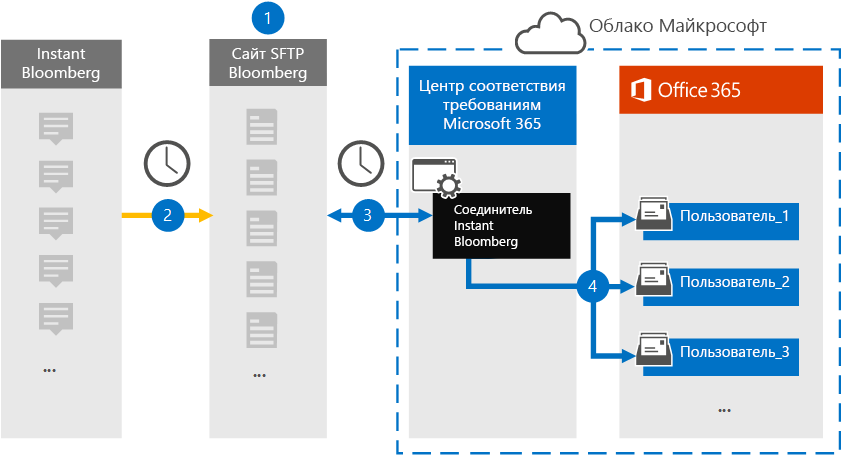

# Настройка соединителя для архивации данных Instant Bloomberg

Используйте собственный соединитель в центре соответствия требованиям Microsoft 365, чтобы импортировать и заархивировать данные чата для финансовых служб из средства совместной работы [Bloomberg](https://www.bloomberg.com/professional/product/collaboration/) . После настройки и настройки соединителя он подключается к безопасному FTP-сайту Bloomberg (SFTP) каждый день, преобразует содержимое сообщений чата в формат сообщений электронной почты, а затем импортирует их в почтовые ящики в Microsoft 365.

После хранения данных Bloomberg в почтовых ящиках пользователей можно применять функции обеспечения соответствия требованиям Microsoft 365, такие как хранение для судебного разбирательства, поиск контента, Архивация на месте, аудит, обеспечение соответствия связи и политики хранения Microsoft 365 для мгновенного Bloomberg данных. Например, вы можете выполнить поиск в сообщениях Bloomberg чата с помощью поиска контента или сопоставить почтовый ящик, который содержит данные Bloomberg, с хранитель в расширенном футляре eDiscovery. Использование соединителя Bloomberg для импорта и архивирования данных в Microsoft 365 поможет обеспечить соответствие организации политикам государственных учреждений и нормативным требованиям.

## Общие сведения о архивации данных Bloomberg для обмена мгновенными сообщениями

В следующем обзоре описывается процесс использования соединителя для архивации данных Bloomberg чата в Microsoft 365. 

1. Ваша организация работает с Bloomberg, чтобы настроить сайт Bloomberg SFTP. Вы также можете работать с Bloomberg, чтобы настроить мгновенные Bloomberg на копирование сообщений чата на сайт SFTP Bloomberg.

2. Каждые 24 часа сообщения чата из мгновенных Bloomberg копируются на сайт Bloomberg SFTP.

3. Соединитель мгновенных Bloomberg, который вы создаете в центре соответствия требованиям Microsoft 365, ежедневно подключается к сайту SFTP Bloomberg и передает сообщения из предыдущих 24 часов в защищенную область хранилища Azure в облаке Майкрософт. Соединитель также Преобразовывает содержимое чата массаже в формат сообщения электронной почты.

4. Соединитель импортирует элементы сообщений чата в почтовый ящик определенного пользователя. В почтовом ящике конкретного пользователя будет создана новая папка с именем Инстантблумберг, в которую будут импортированы элементы. Соединитель выполняет это, используя значение свойства *корпоратимаиладдресс* . Каждое сообщение разговора содержит это свойство, которое заполняется адресом электронной почты каждого участника сообщения разговора. В дополнение к автоматическому сопоставлению пользователей с помощью значения свойства *корпоратимаиладдресс* можно также определить настраиваемое сопоставление путем отправки CSV-файла сопоставления. Этот файл сопоставления должен содержать UUID Bloomberg и соответствующий адрес почтовых ящиков Microsoft 365 для каждого пользователя. Если включить автоматическое сопоставление пользователей и предоставить настраиваемое сопоставление, для каждого элемента разговора соединитель будет сначала просматривать файл настраиваемого сопоставления. Если не удается найти действительного пользователя Microsoft 365, соответствующего идентификатору UUID Bloomberg пользователя, соединитель будет использовать свойство *корпоратимаиладдресс* элемента Chat. Если соединитель не находит действительного пользователя Microsoft 365 в файле настраиваемого сопоставления или в свойстве *корпоратимаиладдресс* элемента Chat, элемент не импортируется.

## Перед началом работы

Некоторые действия по внедрению, необходимые для архивации данных Bloomberg для обмена мгновенными сообщениями, являются внешними по отношению к Microsoft 365 и должны быть завершены до того, как вы сможете создать соединитель в центре соответствия требованиям.

- Ваша организация должна разрешить службе импорта Office 365 доступ к данным почтовых ящиков в Организации. Чтобы согласиться с этим запросом, перейдите на [эту страницу](https://login.microsoftonline.com/common/oauth2/authorize?client_id=570d0bec-d001-4c4e-985e-3ab17fdc3073&response_type=code&redirect_uri=https://portal.azure.com/&nonce=1234&prompt=admin_consent), войдите с помощью учетных данных глобального администратора, а затем примите запрос. Необходимо выполнить это действие, прежде чем вы сможете успешно создать соединитель Bloomberg в действии 3.

- Подпишитесь на [Bloomberg Anywhere](https://www.bloomberg.com/professional/product/remote-access/?bbgsum-page=DG-WS-PROF-PROD-BBA). Это необходимо, чтобы можно было войти в Bloomberg везде, чтобы получить доступ к сайту SFTP Bloomberg, который необходимо установить и настроить.

- Настройка сайта Bloomberg SFTP (Secure File Transfer Protocol). После работы с Bloomberg для настройки сайта SFTP данные из мгновенного Bloomberg передаются на сайт SFTP каждый день. Соединитель, созданный на шаге 2, подключается к этому сайту SFTP и передает данные чата в почтовые ящики Microsoft 365. SFTP также шифрует данные мгновенных сообщений Bloomberg, которые отправляются в почтовые ящики в процессе переноса.

  Сведения о Bloomberg SFTP (также называемые *BB-SFTP*):

  - Ознакомьтесь с документом "стандарты подключения SFTP" на сайте [поддержки Bloomberg](https://www.bloomberg.com/professional/support/documentation/).

  - Обратитесь в службу [поддержки клиентов Bloomberg](https://service.bloomberg.com/portal/sessions/new?utm_source=bloomberg-menu&utm_medium=csc).

  После работы с Bloomberg для настройки сайта SFTP Bloomberg предоставит некоторую информацию после того, как вы ответите на сообщение электронной почты о реализации Bloomberg. Сохраните копию следующих сведений. Его можно использовать для настройки соединителя на шаге 3.

  - Утверждение кода, который является ИДЕНТИФИКАТОРом для вашей организации и используется для входа на сайт Bloomberg SFTP.

  - Пароль для сайта Bloomberg SFTP

  - URL-адрес для сайта Bloomberg SFTP (например, sftp.bloomberg.com)

  - Номер порта для сайта Bloomberg SFTP

- Пользователь, создающий соединитель мгновенных Bloomberg на шаге 3 (и загружающий общедоступные ключи и IP-адрес на шаге 1), должен быть назначен роли импорта и экспорта почтовых ящиков в Exchange Online. Это необходимо для добавления соединителей на странице " **соединители данных** " в центре соответствия требованиям Microsoft 365. По умолчанию эта роль не назначена ни одной группе ролей в Exchange Online. Вы можете добавить роль экспорта для импорта почтовых ящиков в группу ролей Управление организацией в Exchange Online. Вы также можете создать группу ролей, назначить роль импорта для импорта почтовых ящиков, а затем добавить соответствующих пользователей в качестве участников. Для получения дополнительных сведений обратитесь к разделу [Создание](https://docs.microsoft.com/Exchange/permissions-exo/role-groups#create-role-groups) групп ролей или [изменение групп ролей](https://docs.microsoft.com/Exchange/permissions-exo/role-groups#modify-role-groups) статьи "Управление группами ролей в Exchange Online".

## Шаг 1: получение открытых ключей SSH и PGP

Первый шаг — получение копии открытых ключей для безопасной оболочки (SSH) и PGP (PGP). С помощью этих ключей в действии 2 можно настроить сайт Bloomberg SFTP, чтобы подключить соединитель (созданный на шаге 3) к сайту SFTP и перенести данные чата Bloomberg в почтовые ящики Microsoft 365. Кроме того, вы получаете IP-адрес, который вы используете при настройке сайта Bloomberg SFTP.

1. Перейдите к <https://compliance.microsoft.com> пункту Bloomberg **Data Connectors**  >  **Instant**.

2. На странице Bloomberg Product Description ( **мгновенные сообщения** ) нажмите **Добавить соединитель**

3. На странице **условия обслуживания** нажмите кнопку **принять**.

4. На странице " **Добавление учетных данных для Bloomberg SFTP** " нажмите кнопку **скачать ключ SSH**, **Скачайте ключ PGP**и загрузите ссылки на **IP-адреса** , чтобы сохранить копию каждого файла на локальном компьютере. Эти файлы содержат следующие элементы, которые используются для настройки сайта Bloomberg SFTP в действии 2:

   - Открытый ключ SSH: этот ключ используется для настройки службы Secure Shell (SSH) для включения безопасного удаленного входа, когда соединитель подключается к сайту SFTP Bloomberg.

   - Открытый ключ PGP: этот ключ используется для настройки шифрования данных, которые передаются с сайта Bloomberg SFTP в Microsoft 365.

   - IP-адрес: сайт Bloomberg SFTP настроен для принятия запроса на подключение только от этого IP-адреса, который используется соединителем Bloomberg, созданным на шаге 3. 

5. Нажмите кнопку **Отмена** , чтобы закрыть мастер. Вернитесь к мастеру на шаге 3, чтобы создать соединитель.

## Шаг 2: Настройка сайта SFTP для Bloomberg

Следующий шаг — использование открытых ключей SSH и PGP, а также IP-адреса, полученного на шаге 1, для настройки проверки подлинности SSH и шифрования PGP для сайта Bloomberg SFTP. Это позволяет соединителю Bloomberg, созданному на шаге 3, подключаться к сайту SFTP Bloomberg и передавать мгновенные данные Bloomberg в Microsoft 365. Для настройки сайта Bloomberg SFTP необходимо работать со службой поддержки клиентов Bloomberg. Обратитесь в службу [поддержки пользователей Bloomberg](https://service.bloomberg.com/portal/sessions/new?utm_source=bloomberg-menu&utm_medium=csc) за помощью. 

> [!IMPORTANT]
> Bloomberg рекомендует присоединить эти три файла, загруженные на шаге 1, к сообщению электронной почты и отправить их группе поддержки клиентов при работе с ними, чтобы настроить сайт SFTP на Bloomberg.

## Шаг 3: Создание соединителя для мгновенного Bloombergа

Последний шаг — создание соединителя мгновенных Bloomberg в центре соответствия требованиям Microsoft 365. Соединитель использует предоставленные сведения для подключения к сайту SFTP Bloomberg и передачи сообщений чата в соответствующие поля почтового ящика пользователя в Microsoft 365.

1. Перейдите к <https://compliance.microsoft.com> пункту Bloomberg **Data Connectors**  >  **Instant**.

2. На странице Bloomberg Product Description ( **мгновенные сообщения** ) нажмите **Добавить соединитель**

3. На странице **условия обслуживания** нажмите кнопку **принять**.

4. На странице " **Добавление учетных данных для сайта Bloomberg SFTP** " в разделе Шаг 3 Введите необходимые сведения в следующие поля, а затем нажмите кнопку **Далее**.

    - **Код подтверждения:** ИДЕНТИФИКАТОР организации, используемый в качестве имени пользователя для сайта Bloomberg SFTP.

    - **Пароль:** Пароль для сайта Bloomberg SFTP.

    - **URL-адрес SFTP:** URL-адрес сайта Bloomberg SFTP (например, sftp.bloomberg.com).

    - **Порт SFTP:** Номер порта для сайта Bloomberg SFTP. Соединитель использует этот порт для подключения к сайту SFTP.

5. На странице **Сопоставление пользователей** включите автоматическое сопоставление пользователей и при необходимости укажите настраиваемое сопоставление пользователей.

   > [!NOTE]
   > Соединитель импортирует элементы сообщений чата в почтовый ящик определенного пользователя. В почтовом ящике конкретного пользователя будет создана новая папка с именем **инстантблумберг** , в которую будут импортированы элементы. Соединитель использует значение свойства *корпоратимаиладдресс* . Каждое сообщение разговора содержит это свойство, а свойство заполняется адресом электронной почты каждого участника сообщения разговора. В дополнение к автоматическому сопоставлению пользователей с помощью значения свойства *корпоратимаиладдресс* можно также определить настраиваемое сопоставление путем отправки CSV-файла сопоставления. Файл сопоставления должен содержать UUID Bloomberg и соответствующий адрес почтовых ящиков Microsoft 365 для каждого пользователя. Если включить автоматическое сопоставление пользователей и предоставить настраиваемое сопоставление, для каждого элемента разговора соединитель будет сначала искать файл настраиваемых сопоставлений. Если не удается найти действительного пользователя Microsoft 365, соответствующего идентификатору UUID Bloomberg пользователя, соединитель будет использовать свойство *корпоратимаиладдресс* элемента Chat. Если соединитель не находит действительных пользователей Microsoft 365 в файле настраиваемого сопоставления или в свойстве *корпоратимаиладдресс* элемента Chat, элемент не импортируется.

6. Нажмите кнопку **Далее**, проверьте параметры и нажмите кнопку **подготовить** , чтобы создать соединитель.

7. Перейдите на страницу " **соединители данных** ", чтобы просмотреть ход процесса импорта для нового соединителя.
