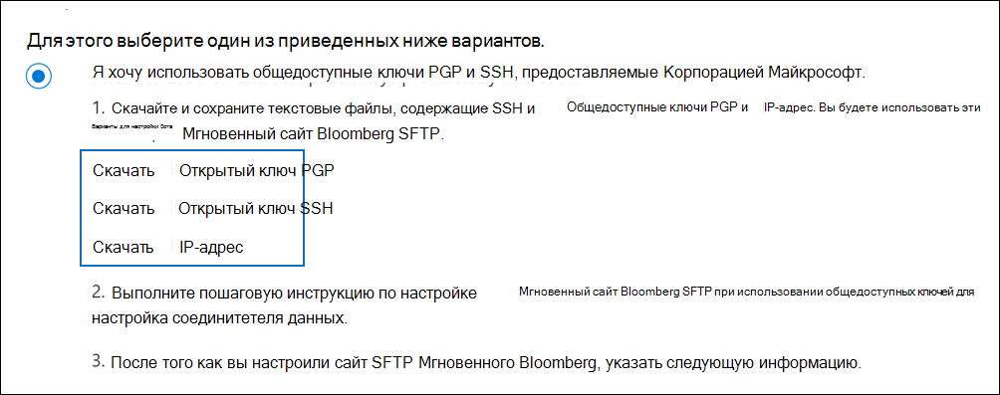

# Настройка соединителя для архивации данных Instant BloombergSet up a connector to archive Instant Bloomberg data

Используйте родной соединитель в центре Microsoft 365 для импорта и архивации данных чата финансовых служб из средства совместной работы [Instant Bloomberg.](https://www.bloomberg.com/professional/product/collaboration/)Use a native connector in the Microsoft 365 compliance center to import and archive financial services chat data from the [Instant Bloomberg](https://www.bloomberg.com/professional/product/collaboration/) collaboration tool. После настройки соединители он подключается к безопасному ftP-сайту Bloomberg в вашей организации один раз в день, преобразует содержимое сообщений чата в формат сообщений электронной почты, а затем импортирует эти элементы в почтовые ящики Microsoft 365.After you set up and configure a connector, it connects to your organization's Bloomberg secure FTP site (SFTP) once every day, converts the content of chat messages to an email message format, and then imports those items to mailboxes in Microsoft 365.

После мгновенного хранения данных Bloomberg в почтовых ящиках пользователей к данным Instant Bloomberg можно применить Microsoft 365 функции обеспечения соответствия требованиям, такие как хранение судебного разбирательства, поиск контента, In-Place архива, аудит, соответствие требованиям связи и Microsoft 365 для хранения данных Instant Bloomberg.After Instant Bloomberg data is stored in user mailboxes, you can apply Microsoft 365 compliance features such as Litigation Hold, Content Search, In-Place Archiving, Auditing, Communication compliance, and Microsoft 365 retention policies to Instant Bloomberg data. Например, можно искать мгновенные сообщения чата Bloomberg с помощью поиска контента или связывать почтовый ящик, содержащий мгновенные данные Bloomberg, с хранителями в Advanced eDiscovery случае.For example, you can search Instant Bloomberg chat messages using Content Search or associate the mailbox that contains the Instant Bloomberg data with a custodian in an Advanced eDiscovery case. Использование соединиттеля Мгновенного Bloomberg для импорта и архива данных в Microsoft 365 может помочь вашей организации соблюдать государственные и нормативные политики.Using an Instant Bloomberg connector to import and archive data in Microsoft 365 can help your organization stay compliant with government and regulatory policies.

## Обзор архива мгновенных данных BloombergOverview of archiving Instant Bloomberg data

В следующем обзоре объясняется процесс использования соединитетеля для архивации мгновенных данных чата Bloomberg в Microsoft 365.The following overview explains the process of using a connector to archive Instant Bloomberg chat data in Microsoft 365. 

1. Ваша организация работает с Агентством Bloomberg для того, чтобы создать сайт Bloomberg SFTP.Your organization works with Bloomberg to set up a Bloomberg SFTP site. Вы также будете работать с Bloomberg, чтобы настроить Instant Bloomberg для копирования сообщений чата на ваш сайт Bloomberg SFTP.You'll also work with Bloomberg to configure Instant Bloomberg to copy chat messages to your Bloomberg SFTP site.

2. Каждые 24 часа сообщения чата из Мгновенного Bloomberg копируется на сайт Bloomberg SFTP.Once every 24 hours, chat messages from Instant Bloomberg are copied to the Bloomberg SFTP site.

3. Соединитель Мгновенный Bloomberg, который вы создаете в центре соответствия требованиям Microsoft 365, подключается к сайту Bloomberg SFTP каждый день и передает сообщения чата из предыдущих 24 часов в безопасную служба хранилища Azure область в Microsoft Cloud.The Instant Bloomberg connector that you create in the Microsoft 365 compliance center connects to the Bloomberg SFTP site every day and transfers the chat messages from the previous 24 hours to a secure Azure Storage area in the Microsoft Cloud. Соединителет также преобразует содержимое сеанса чата в формат сообщения электронной почты.The connector also converts the content of a chat massage to an email message format.

4. Соединитатель импортирует элементы сообщений чата в почтовый ящик определенного пользователя.The connector imports the chat message items to the mailbox of a specific user. В почтовом ящике конкретного пользователя создается новая папка с именем InstantBloomberg, и элементы будут импортироваться в него.A new folder named InstantBloomberg is created in the specific user's mailbox and the items will be imported to it. Соединитетель делает это с помощью значения *свойства CorporateEmailAddress.*The connector does this by using the value of the *CorporateEmailAddress* property. Каждое сообщение чата содержит это свойство, которое заполняется адресом электронной почты каждого участника сообщения чата.Every chat message contains this property, which is populated with the email address of every participant of the chat message. Помимо автоматического сопоставления пользователей с использованием значения свойства *CorporateEmailAddress* можно также определить настраиваемое сопоставление, загрузив файл сопоставления CSV.In addition to automatic user mapping using the value of the *CorporateEmailAddress* property, you can also define a custom mapping by uploading a CSV mapping file. Этот файл сопоставления должен содержать UUID Bloomberg и соответствующий Microsoft 365 почтовый ящик для каждого пользователя.This mapping file should contain a Bloomberg UUID and the corresponding Microsoft 365 mailbox address for each user. Если вы включаете автоматическое сопоставление пользователей и предоставляете настраиваемый сопоставление, для каждого элемента чата соединитатель сначала будет искать настраиваемый файл сопоставления.If you enable automatic user mapping and provide a custom mapping, for every chat item the connector will first look at custom-mapping file. Если он не найдет допустимого пользователя Microsoft 365, соответствующего UUID Bloomberg, соединителю будет использовать свойство *CorporateEmailAddress* элемента чата.If it doesn't find a valid Microsoft 365 user that corresponds to a user's Bloomberg UUID, the connector will use the *CorporateEmailAddress* property of the chat item. Если соединители не находят допустимого пользователя Microsoft 365 в настраиваемом файле сопоставления или свойстве *CorporateEmailAddress* элемента чата, элемент не будет импортирован.If the connector doesn't find a valid Microsoft 365 user in either the custom-mapping file or the *CorporateEmailAddress* property of the chat item, the item won't be imported.

## Перед настройками соединитетеляBefore you set up a connector

Некоторые этапы реализации, необходимые для архивации мгновенных данных Bloomberg, являются внешними для Microsoft 365 и должны быть завершены, прежде чем вы сможете создать соединитель в центре соответствия требованиям.Some of the implementation steps required to archive Instant Bloomberg data are external to Microsoft 365 and must be completed before you can create the connector in the compliance center.

- Чтобы настроить соединитель Bloomberg мгновенно, необходимо использовать ключи и ключевые passphrases для Pretty Good Privacy (PGP) и Secure Shell (SSH).To set up an Instant Bloomberg connector, you have to use keys and key passphrases for Pretty Good Privacy (PGP) and Secure Shell (SSH). Эти ключи используются для настройки сайта Bloomberg SFTP и используются соединителом для подключения к сайту Bloomberg SFTP для импорта данных в Microsoft 365.These keys are used to configure the Bloomberg SFTP site and used by the connector to connect to the Bloomberg SFTP site to import data to Microsoft 365. Ключ PGP используется для настройки шифрования данных, переданных с сайта Bloomberg SFTP на Microsoft 365.The PGP key is used to configure the encryption of data that's transferred from the Bloomberg SFTP site to Microsoft 365. Ключ SSH используется для настройки безопасной оболочки, чтобы включить безопасный удаленный вход при подключении соединители к сайту Bloomberg SFTP.The SSH key is used to configure secure shell to enable a secure remote login when the connector connects to the Bloomberg SFTP site.

  При настройке соединителера можно использовать общедоступные ключи и проходные перефразы, предоставляемые Корпорацией Майкрософт, или же вы можете использовать собственные закрытые ключи и passphrases.When setting up a connector, you have the option to use public keys and key passphrases provided by Microsoft or you can use your own private keys and passphrases. Рекомендуем использовать общедоступные ключи, предоставляемые Корпорацией Майкрософт.We recommend that you use the public keys provided by Microsoft. Однако если ваша организация уже настроил сайт Bloomberg SFTP с помощью закрытых ключей, можно создать соединитель с помощью этих же закрытых ключей.However, if your organization has already configured a Bloomberg SFTP site using private keys, then you can create a connector using these same private keys.

- Подписка на [Bloomberg Anywhere](https://www.bloomberg.com/professional/product/remote-access/?bbgsum-page=DG-WS-PROF-PROD-BBA).Subscribe to [Bloomberg Anywhere](https://www.bloomberg.com/professional/product/remote-access/?bbgsum-page=DG-WS-PROF-PROD-BBA). Это необходимо, чтобы вы могли войти в Bloomberg Anywhere, чтобы получить доступ к сайту Bloomberg SFTP, который необходимо настроить и настроить.This is required so that you can log in to Bloomberg Anywhere to access the Bloomberg SFTP site that you have to set up and configure.

- Настройка сайта Bloomberg SFTP (Безопасный протокол передачи файлов).Set up a Bloomberg SFTP (Secure file transfer protocol) site. После работы с Агентством Bloomberg по настройкам сайта SFTP данные мгновенного Bloomberg ежедневно загружаются на сайт SFTP.After working with Bloomberg to set up the SFTP site, data from Instant Bloomberg is uploaded to the SFTP site every day. Соединитатель, который вы создаете в шаге 2, подключается к этому сайту SFTP и передает данные чата в Microsoft 365 почтовые ящики.The connector you create in Step 2 connects to this SFTP site and transfers the chat data to Microsoft 365 mailboxes. SFTP также шифрует мгновенные данные чата Bloomberg, которые отправляются в почтовые ящики во время процесса передачи.SFTP also encrypts the Instant Bloomberg chat data that is sent to mailboxes during the transfer process.

  Сведения о Bloomberg SFTP (также называемый *BB-SFTP):*For information about Bloomberg SFTP (also called *BB-SFTP*):

  - См. документ "Стандарты подключения SFTP" в [службе поддержки Bloomberg.](https://www.bloomberg.com/professional/support/documentation/)See the "SFTP Connectivity Standards" document at [Bloomberg Support](https://www.bloomberg.com/professional/support/documentation/).

  - Свяжитесь [с службой поддержки клиентов Bloomberg.](https://service.bloomberg.com/portal/sessions/new?utm_source=bloomberg-menu&utm_medium=csc)Contact [Bloomberg customer support](https://service.bloomberg.com/portal/sessions/new?utm_source=bloomberg-menu&utm_medium=csc).

  После работы с Bloomberg над настройками сайта SFTP Bloomberg предоставит вам некоторые сведения после ответа на сообщение электронной почты реализации Bloomberg.After you work with Bloomberg to set up an SFTP site, Bloomberg will provide some information to you after you respond to the Bloomberg implementation email message. Сохраните копию следующих сведений.Save a copy of the following information. С его помощью можно настроить соединители в шаге 3.You use it to set up a connector in Step 3.

  - Код фирмы, который является ID для вашей организации и используется для входа на сайт Bloomberg SFTP.Firm code, which is an ID for your organization and is used to log in to the Bloomberg SFTP site.

  - Пароль для сайта Bloomberg SFTPPassword for your Bloomberg SFTP site

  - URL-адрес сайта Bloomberg SFTP (например, sftp.bloomberg.com)URL for Bloomberg SFTP site (for example, sftp.bloomberg.com)

  - Номер порта для сайта Bloomberg SFTPPort number for Bloomberg SFTP site

- Соединитель Мгновенный Bloomberg может импортировать в общей сложности 200 000 элементов за один день.The Instant Bloomberg connector can import a total of 200,000 items in a single day. Если на сайте SFTP находится более 200 000 элементов, ни один из этих элементов не будет импортироваться в Microsoft 365.If there are more than 200,000 items on the SFTP site, none of those items will be imported to Microsoft 365.

- Пользователю, который создает соединитель Мгновенного Блумберга в шаге 3 (а также скачивает общедоступные ключи и IP-адрес в шаге 1), должна быть назначена роль экспорта импорта почтовых ящиков в Exchange Online.The user who creates an Instant Bloomberg connector in Step 3 (and who downloads the public keys and IP address in Step 1) must be assigned the Mailbox Import Export role in Exchange Online. Это необходимо для добавления соединители на странице **соединители данных** в центре Microsoft 365 соответствия требованиям.This is required to add connectors in the **Data connectors** page in the Microsoft 365 compliance center. По умолчанию эта роль не назначена ни одной группе ролей в Exchange Online.By default, this role isn't assigned to any role group in Exchange Online. Вы можете добавить роль экспорта импорта почтовых ящиков в группу ролей управления организацией в Exchange Online.You can add the Mailbox Import Export role to the Organization Management role group in Exchange Online. Или вы можете создать группу ролей, назначить роль экспортировать импорт почтовых ящиков, а затем добавить соответствующих пользователей в качестве участников.Or you can create a role group, assign the Mailbox Import Export role, and then add the appropriate users as members. Дополнительные сведения см. в разделах [Создание](/Exchange/permissions-exo/role-groups#create-role-groups) групп ролей или [изменение](/Exchange/permissions-exo/role-groups#modify-role-groups) групп ролей в статье "Управление группами ролей в Exchange Online".For more information, see the [Create role groups](/Exchange/permissions-exo/role-groups#create-role-groups) or [Modify role groups](/Exchange/permissions-exo/role-groups#modify-role-groups) sections in the article "Manage role groups in Exchange Online".

## Настройка соединитетеля с помощью общедоступных ключейSet up a connector using public keys

В этом разделе покажут, как настроить соединитель Мгновенный Bloomberg с помощью общедоступных ключей для службы конфиденциальности (PGP) и Secure Shell (SSH).The steps in this section show you how to set up an Instant Bloomberg connector using the public keys for Pretty Good Privacy (PGP) and Secure Shell (SSH).

### Шаг 1. Получение PGP и SSH и общедоступных ключейStep 1: Obtain PGP and SSH and public keys

На первом этапе необходимо получить копию общедоступных ключей для Службы конфиденциальности (PGP) и Secure Shell (SSH).The first step is to obtain a copy of the public keys for Pretty Good Privacy (PGP) and Secure Shell (SSH). Эти ключи используются в шаге 2 для настройки сайта Bloomberg SFTP, чтобы разрешить соединитель (который вы создаете в шаге 3) подключаться к сайту SFTP и передавать мгновенные данные чата Bloomberg в Microsoft 365 почтовые ящики.You use these keys in Step 2 to configure the Bloomberg SFTP site to allow the connector (that you create in Step 3) to connect to the SFTP site and transfer the Instant Bloomberg chat data to Microsoft 365 mailboxes. На этом шаге вы также получите IP-адрес, который используется при настройке сайта Bloomberg SFTP.You also obtain an IP address in this step, which you use when configuring the Bloomberg SFTP site.

1. Перейдите <https://compliance.microsoft.com> и щелкните **соединители данных** в левом nav.Go to <https://compliance.microsoft.com> and click **Data connectors** in the left nav.

2. На странице **Соединители данных** в **статье Instant Bloomberg** нажмите **кнопку Просмотр**.On the **Data connectors** page under **Instant Bloomberg**, click **View**.

3. На странице **Мгновенное описание продукта Bloomberg** нажмите **кнопку Добавить соединителю**On the **Instant Bloomberg** product description page, click **Add connector**

4. На странице **Условия службы нажмите** кнопку **Принять**.On the **Terms of service** page, click **Accept**.

5. На странице **Добавление учетных данных для** исходных страниц контента нажмите кнопку Я хочу использовать общедоступные ключи PGP и **SSH, предоставляемые Корпорацией Майкрософт.**On the **Add credentials for content source** page, click **I want to use PGP and SSH public keys provided by Microsoft**.

   

6. На шаге 1 щелкните клавишу **Download SSH,** скачайте  **клавишу PGP** и скачайте ссылки IP-адресов, чтобы сохранить копию каждого файла на локальном компьютере.Under step 1, click the **Download SSH key**, **Download PGP key**, and **Download IP address** links to save a copy of each file to your local computer.

   

   Эти файлы содержат следующие элементы, используемые для настройки сайта Bloomberg SFTP в шаге 2:These files contain the following items that are used to configure the Bloomberg SFTP site in Step 2:

   - Открытый ключ PGP. Этот ключ используется для настройки шифрования данных, переданных с сайта Bloomberg SFTP на Microsoft 365.PGP public key: This key is used to configure the encryption of data that's transferred from the Bloomberg SFTP site to Microsoft 365.

   - Открытый ключ SSH. Этот ключ используется для настройки безопасной оболочки для обеспечения безопасного удаленного входа при подключении соединитетеля к сайту Bloomberg SFTP.SSH public key: This key is used to configure secure shell to enable a secure remote login when the connector connects to the Bloomberg SFTP site.

   - IP-адрес. Сайт Bloomberg SFTP настроен для приемки запросов на подключение с этого IP-адреса.IP address: The Bloomberg SFTP site is configured to accept connection requests from this IP address. Этот же IP-адрес используется соединителом Мгновенного Bloomberg для подключения к сайту SFTP и передачи мгновенных данных Bloomberg в Microsoft 365.The same IP address is used by the Instant Bloomberg connector to connect to the SFTP site and transfer Instant Bloomberg data to Microsoft 365.

7. Щелкните **Отмена,** чтобы закрыть мастера.Click **Cancel** to close the wizard. Вы возвращались к этому мастеру в шаге 3 для создания соединитетеля.You come back to this wizard in Step 3 to create the connector.

### Шаг 2. Настройка сайта Bloomberg SFTPStep 2: Configure the Bloomberg SFTP site

Следующим шагом является использование общедоступных ключей PGP и SSH и IP-адреса, полученных в шаге 1, для настройки шифрования PGP и проверки подлинности SSH для сайта Bloomberg SFTP.The next step is to use the PGP and SSH public keys and the IP address that you obtained in Step 1 to configure PGP encryption and SSH authentication for the Bloomberg SFTP site. Это позволяет соединителету Bloomberg, который вы создаете в шаге 3, подключиться к сайту Bloomberg SFTP и передать мгновенные данные Bloomberg в Microsoft 365.This lets the Instant Bloomberg connector that you create in Step 3 connect to the Bloomberg SFTP site and transfer Instant Bloomberg data to Microsoft 365. Чтобы настроить сайт Bloomberg SFTP, необходимо работать с службой поддержки клиентов Bloomberg.You need to work with Bloomberg customer support to set up your Bloomberg SFTP site. Обратитесь [в службу поддержки клиентов Bloomberg](https://service.bloomberg.com/portal/sessions/new?utm_source=bloomberg-menu&utm_medium=csc) для оказания помощи.Contact [Bloomberg customer support](https://service.bloomberg.com/portal/sessions/new?utm_source=bloomberg-menu&utm_medium=csc) for assistance. 

> [!IMPORTANT]
> Bloomberg рекомендует прикрепить три файла, скачаемые в шаге 1, к сообщению электронной почты и отправить его в группу поддержки клиентов при работе с ними для настройка сайта SFTP Bloomberg.Bloomberg recommends that you attach the three files that you downloaded in Step 1 to an email message and send it to their customer support team when working with them to set up your Bloomberg SFTP site.

### Шаг 3. Создание соединитетеля BloombergStep 3: Create an Instant Bloomberg connector

Последний шаг — создание соединитетеля Мгновенный Bloomberg в центре Microsoft 365 соответствия требованиям.The last step is to create an Instant Bloomberg connector in the Microsoft 365 compliance center. Соединитель использует сведения, которые вы предоставляете, для подключения к сайту Bloomberg SFTP и передачи сообщений чата соответствующим почтовым ящикам пользователей в Microsoft 365.The connector uses the information you provide to connect to the Bloomberg SFTP site and transfer chat messages to the corresponding user mailbox boxes in Microsoft 365.

1. Перейдите <https://compliance.microsoft.com> к и нажмите **соединители данных**  >  **Мгновенный Bloomberg**.Go to <https://compliance.microsoft.com> and then click **Data connectors** > **Instant Bloomberg**.

2. На странице **Мгновенное описание продукта Bloomberg** нажмите **кнопку Добавить соединителю**On the **Instant Bloomberg** product description page, click **Add connector**

3. На странице **Условия службы нажмите** кнопку **Принять**.On the **Terms of service** page, click **Accept**.

4. На странице Добавление учетных данных для сайта **Bloomberg SFTP** в шаге 3 введите требуемую информацию в следующих полях и нажмите **кнопку Далее**.On the **Add credentials for Bloomberg SFTP site** page, under Step 3, enter the required information in the following boxes and then click **Next**.

    - **Код фирмы:** ID для организации, который используется в качестве имени пользователя для сайта Bloomberg SFTP.**Firm code:** The ID for your organization that is used as the username for the Bloomberg SFTP site.

    - **Пароль:** Пароль для сайта Bloomberg SFTP.**Password:** Password for Bloomberg SFTP site.

    - **URL-адрес SFTP:** URL-адрес сайта Bloomberg SFTP (например, `sftp.bloomberg.com` ).**SFTP URL:** The URL for Bloomberg SFTP site (for example, `sftp.bloomberg.com`). Для этого значения можно также использовать IP-адрес.You can also use an IP address for this value.

    - **Порт SFTP:** Номер порта для сайта Bloomberg SFTP.**SFTP port:** The port number for Bloomberg SFTP site. Соединительщик использует этот порт для подключения к сайту SFTP.The connector uses this port to connect to the SFTP site.

5. На странице Выбор типов данных **для импорта** выберите необходимые типы данных, которые будут импортироваться отдельно от **сообщений.**On the **Select data types to import** page, select the required data types to be imported apart from **Messages**

6. На странице **Map Instant Bloomberg пользователи** могут Microsoft 365, включить автоматическое сопоставление пользователей и обеспечить настраиваемую сопоставление пользователей по мере необходимостиOn the **Map Instant Bloomberg users to Microsoft 365 users** page, enable automatic user mapping and provide custom user mapping as required

   > [!NOTE]
   > Соединитатель импортирует элементы сообщений чата в почтовый ящик определенного пользователя.The connector imports the chat message items to the mailbox of a specific user. В почтовом ящике конкретного пользователя создается новая папка с именем **InstantBloomberg,** и элементы будут импортироваться в него.A new folder named **InstantBloomberg** is created in the specific user's mailbox and the items will be imported to it. Соединитетель использует значение свойства *CorporateEmailAddress.*The connector does by using the value of the *CorporateEmailAddress* property. Каждое сообщение чата содержит это свойство, и свойство заполняется адресом электронной почты каждого участника сообщения чата.Every chat message contains this property, and the property is populated with the email address of every participant of the chat message. Помимо автоматического сопоставления пользователей с использованием значения свойства *CorporateEmailAddress* можно также определить настраиваемый сопоставление, загрузив файл сопоставления CSV.In addition to automatic user mapping using the value of the *CorporateEmailAddress* property, you can also define custom mapping by uploading a CSV mapping file. Файл сопоставления должен содержать UUID Bloomberg и соответствующий Microsoft 365 почтовый ящик для каждого пользователя.The mapping file should contain the Bloomberg UUID and corresponding Microsoft 365 mailbox address for each user. Если вы включаете автоматическое сопоставление пользователей и предоставляете настраиваемый сопоставление, для каждого элемента чата соединитатель сначала будет смотреть настраиваемый файл сопоставления.If you enable automatic user mapping and provide a custom mapping, for every chat item the connector will first look at custom mapping file. Если он не найдет допустимого пользователя Microsoft 365, соответствующего UUID Bloomberg, соединителю будет использовать свойство *CorporateEmailAddress* элемента чата.If it doesn't find a valid Microsoft 365 user that corresponds to a user's Bloomberg UUID, the connector will use the *CorporateEmailAddress* property of the chat item. Если соединители не находят допустимого пользователя Microsoft 365 в настраиваемом файле сопоставления или свойстве *CorporateEmailAddress* элемента чата, элемент не будет импортирован.If the connector doesn't find a valid Microsoft 365 user in either the custom mapping file or the *CorporateEmailAddress* property of the chat item, the item won't be imported.

7. Нажмите **кнопку Далее,** просмотрите параметры и нажмите **кнопку Готово** для создания соединитетеля.Click **Next**, review your settings, and then click **Finish** to create the connector.

8. Перейдите на **страницу Соединители** данных, чтобы увидеть ход процесса импорта для нового соединитетеля.Go to the **Data connectors** page to see the progress of the import process for the new connector. Щелкните соединителет, чтобы отобразить страницу вылетов, которая содержит сведения о соединителе.Click the connector to display the flyout page, which contains information about the connector.

## Настройка соединитетеля с помощью закрытых ключейSet up a connector using private keys

В этом разделе покажут, как настроить соединитель Мгновенный Bloomberg с помощью частных ключей PGP и SSH.The steps in this section show you how to set up an Instant Bloomberg connector using PGP and SSH private keys. Этот параметр установки соединиттеля предназначен для организаций, которые уже настроили сайт Bloomberg SFTP с помощью закрытых ключей.This connector setup option is intended for organizations that have already configured a Bloomberg SFTP site using private keys.

### Шаг 1. Получение IP-адреса для настройки сайта Bloomberg SFTPStep 1: Obtain an IP address to configure the Bloomberg SFTP site

> [!NOTE]
> Если ваша организация ранее настраивала сайт Bloomberg SFTP для архива данных Сообщений Bloomberg с помощью частных ключей PGP и SSH, не нужно настраивать другой.If your organization has previously configured a Bloomberg SFTP site to archive Bloomberg Message data using PGP and SSH private keys, you don't have to configure another one. При создании соединитетеля в шаге 2 можно указать один и тот же сайт SFTP.You can specify the same SFTP site when you create the connector in Step 2.

Если ваша организация использовала частные ключи PGP и SSH для настроить сайт Bloomberg SFTP, необходимо получить IP-адрес и предоставить его службе поддержки клиентов Bloomberg.If your organization has used PGP and SSH private keys to set up a Bloomberg SFTP site, then you have to obtain an IP address and provide it to Bloomberg customer support. Сайт Bloomberg SFTP должен быть настроен для того, чтобы принимать запросы на подключение с этого IP-адреса.The Bloomberg SFTP site must be configured to accept  connection requests from this IP address. Этот же IP-адрес используется соединителом Мгновенного Bloomberg для подключения к сайту SFTP и передачи мгновенных данных Bloomberg в Microsoft 365.The same IP address is used by the Instant Bloomberg connector to connect to the SFTP site and transfer Instant Bloomberg data to Microsoft 365.

Чтобы получить IP-адрес:To obtain the IP address:

1. Перейдите <https://compliance.microsoft.com> и щелкните **соединители данных** в левом nav.Go to <https://compliance.microsoft.com> and click **Data connectors** in the left nav.

2. На странице **Соединители данных** в **статье Instant Bloomberg** нажмите **кнопку Просмотр**.On the **Data connectors** page under **Instant Bloomberg**, click **View**.

3. На странице **Мгновенное описание продукта Bloomberg** нажмите **кнопку Добавить соединителю**On the **Instant Bloomberg** product description page, click **Add connector**

4. На странице **Условия службы нажмите** кнопку **Принять**.On the **Terms of service** page, click **Accept**.

5. На странице **Добавление учетных данных для исходных** страниц контента нажмите кнопку Я **хочу использовать закрытые клавиши PGP и SSH.**On the **Add credentials for content source** page, click **I want to use PGP and SSH private keys**.

6. На шаге 1 щелкните **Скачайте IP-адрес,** чтобы сохранить копию IP-файла на локальном компьютере.Under step 1, click **Download IP address** to save a copy of the IP address file to your local computer.

   

7. Щелкните **Отмена,** чтобы закрыть мастера.Click **Cancel** to close the wizard. Вы возвращались к этому мастеру в шаге 2 для создания соединитетеля.You come back to this wizard in Step 2 to create the connector.

Необходимо работать с службой поддержки клиентов Bloomberg, чтобы настроить сайт Bloomberg SFTP, чтобы принимать запросы на подключение с этого IP-адреса.You need to work with Bloomberg customer support to configure your Bloomberg SFTP site to accept connection requests from this IP address. Обратитесь [в службу поддержки клиентов Bloomberg](https://service.bloomberg.com/portal/sessions/new?utm_source=bloomberg-menu&utm_medium=csc) для оказания помощи.Contact [Bloomberg customer support](https://service.bloomberg.com/portal/sessions/new?utm_source=bloomberg-menu&utm_medium=csc) for assistance.

### Шаг 2. Создание соединитетеля BloombergStep 2: Create an Instant Bloomberg connector

После настройки сайта Bloomberg SFTP следующий шаг — создание соединитетеля Instant Bloomberg в центре Microsoft 365 соответствия требованиям.After your Bloomberg SFTP site is configured, the next step is to create an Instant Bloomberg connector in the Microsoft 365 compliance center. Соединитель использует сведения, которые вы предоставляете, для подключения к сайту Bloomberg SFTP и передачи сообщений электронной почты в соответствующие почтовые ящики пользователей в Microsoft 365.The connector uses the information you provide to connect to the Bloomberg SFTP site and transfer email messages to the corresponding user mailbox boxes in Microsoft 365. Чтобы выполнить этот шаг, убедитесь, что у вас есть копии тех же частных ключей и пропусков ключей, которые вы использовали для настройка сайта Bloomberg SFTP.To complete this step, be sure to have copies of the same private keys and key passphrases that you used to set up your Bloomberg SFTP site.

1. Перейдите <https://compliance.microsoft.com> и щелкните **соединители данных** в левом nav.Go to <https://compliance.microsoft.com> and click **Data connectors** in the left nav.

2. На странице **Соединители данных** в **статье Instant Bloomberg** нажмите **кнопку Просмотр**.On the **Data connectors** page under **Instant Bloomberg**, click **View**.

3. На странице **Мгновенное описание продукта Bloomberg** нажмите **кнопку Добавить соединителю**On the **Instant Bloomberg** product description page, click **Add connector**

4. На странице **Условия службы нажмите** кнопку **Принять**.On the **Terms of service** page, click **Accept**.

5. На странице **Добавление учетных данных для исходных** страниц контента нажмите кнопку Я **хочу использовать закрытые клавиши PGP и SSH.**On the **Add credentials for content source** page, click **I want to use PGP and SSH private keys**.

   

6. В шаге 3 введите необходимые сведения в следующих полях и нажмите кнопку **Проверка подключения**.Under Step 3, enter the required information in the following boxes and then click **Validate connection**.

      - **Имя:** Имя соединитетеля.**Name:** The name for the connector. Он должен быть уникальным в вашей организации.It must be unique in your organization.

      - **Код фирмы:** ID для организации, который используется в качестве имени пользователя для сайта Bloomberg SFTP.**Firm code:** The ID for your organization that is used as the username for the Bloomberg SFTP site.

      - **Пароль:** Пароль для сайта Bloomberg SFTP вашей организации.**Password:** The password for your organization's Bloomberg SFTP site.

      - **URL-адрес SFTP:** URL-адрес сайта Bloomberg SFTP (например, `sftp.bloomberg.com` ).**SFTP URL:** The URL for the Bloomberg SFTP site (for example, `sftp.bloomberg.com`). Для этого значения можно также использовать IP-адрес.You can also use an IP address for this value.

      - **Порт SFTP:** Номер порта для сайта Bloomberg SFTP.**SFTP port:** The port number for the Bloomberg SFTP site. Соединительщик использует этот порт для подключения к сайту SFTP.The connector uses this port to connect to the SFTP site.

      - **Закрытый ключ PGP:** Закрытый ключ PGP для сайта Bloomberg SFTP.**PGP private key:** The PGP private key for the Bloomberg SFTP site. Обязательно включив все значения частного ключа, включая начало и окончание строк блока ключей.Be sure to include the entire private key value, including the beginning and ending lines of the key block.

      - **Passphrase ключа PGP:** Passphrase для закрытого ключа PGP.**PGP key passphrase:** The passphrase for the PGP private key.

      - **Закрытый ключ SSH:** Закрытый ключ SSH для сайта Bloomberg SFTP.**SSH private key:** The SSH private key for the Bloomberg SFTP site. Обязательно включив все значения частного ключа, включая начало и окончание строк блока ключей.Be sure to include the entire private key value, including the beginning and ending lines of the key block.

      - **Passphrase ключа SSH:** Passphrase для закрытого ключа SSH.**SSH key passphrase:** The passphrase for the SSH private key.

7. После успешной проверки подключения нажмите кнопку **Далее**.After the connection is successfully validated, click **Next**.

8. На странице **Map Instant Bloomberg пользователи** могут Microsoft 365 пользователей, включить автоматическое сопоставление пользователей и обеспечить настраиваемую сопоставление пользователей по мере необходимости.On the **Map Instant Bloomberg users to Microsoft 365 users** page, enable automatic user mapping and provide custom user mapping as required.

   > [!NOTE]
   > Соединитатель импортирует элементы сообщений чата в почтовый ящик определенного пользователя.The connector imports the chat message items to the mailbox of a specific user. В почтовом ящике конкретного пользователя создается новая папка с именем **InstantBloomberg,** и элементы будут импортироваться в него.A new folder named **InstantBloomberg** is created in the specific user's mailbox and the items will be imported to it. Соединитетель использует значение свойства *CorporateEmailAddress.*The connector does by using the value of the *CorporateEmailAddress* property. Каждое сообщение чата содержит это свойство, и свойство заполняется адресом электронной почты каждого участника сообщения чата.Every chat message contains this property, and the property is populated with the email address of every participant of the chat message. Помимо автоматического сопоставления пользователей с использованием значения свойства *CorporateEmailAddress* можно также определить настраиваемый сопоставление, загрузив файл сопоставления CSV.In addition to automatic user mapping using the value of the *CorporateEmailAddress* property, you can also define custom mapping by uploading a CSV mapping file. Файл сопоставления должен содержать UUID Bloomberg и соответствующий Microsoft 365 почтовый ящик для каждого пользователя.The mapping file should contain the Bloomberg UUID and corresponding Microsoft 365 mailbox address for each user. Если вы включаете автоматическое сопоставление пользователей и предоставляете настраиваемый сопоставление, для каждого элемента чата соединитатель сначала будет смотреть настраиваемый файл сопоставления.If you enable automatic user mapping and provide a custom mapping, for every chat item the connector will first look at custom mapping file. Если он не найдет допустимого пользователя Microsoft 365, соответствующего UUID Bloomberg, соединителю будет использовать свойство *CorporateEmailAddress* элемента чата.If it doesn't find a valid Microsoft 365 user that corresponds to a user's Bloomberg UUID, the connector will use the *CorporateEmailAddress* property of the chat item. Если соединители не находят допустимого пользователя Microsoft 365 в настраиваемом файле сопоставления или свойстве *CorporateEmailAddress* элемента чата, элемент не будет импортирован.If the connector doesn't find a valid Microsoft 365 user in either the custom mapping file or the *CorporateEmailAddress* property of the chat item, the item won't be imported.

9. Нажмите **кнопку Далее,** просмотрите параметры и нажмите **кнопку Готово** для создания соединитетеля.Click **Next**, review your settings, and then click **Finish** to create the connector.

10. Перейдите на **страницу Соединители** данных, чтобы увидеть ход процесса импорта для нового соединитетеля.Go to the **Data connectors** page to see the progress of the import process for the new connector. Щелкните соединителет, чтобы отобразить страницу вылетов, которая содержит сведения о соединителе.Click the connector to display the flyout page, which contains information about the connector.
