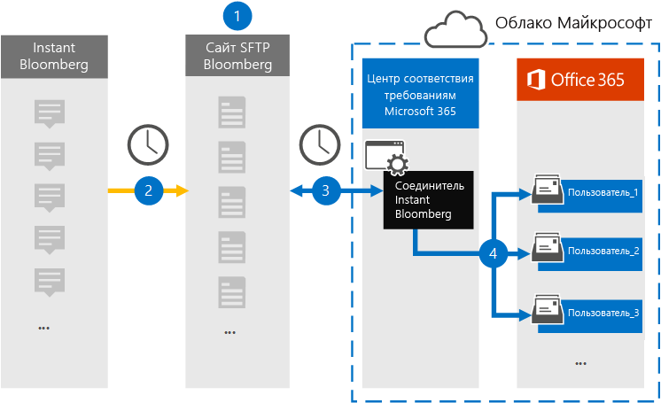

# Настройка соединителя для архивации данных Instant Bloomberg

Используйте нативный соединитель в Центре соответствия требованиям Microsoft 365 для импорта и архивации данных чата финансовых услуг из средства совместной работы [Instant Bloomberg.](https://www.bloomberg.com/professional/product/collaboration/) После настройки и настройки соединители подключаются к безопасному ftP-сайту (SFTP) компании Bloomberg каждый день, преобразовывать содержимое сообщений чата в формат сообщений электронной почты, а затем импортировать эти элементы в почтовые ящики в Microsoft 365.

После сохранения данных Instant Bloomberg в почтовых ящиках пользователей к данным Instant Bloomberg можно применить такие функции соответствия требованиям Microsoft 365, как хранение для судебного разбирательства, поиск контента, архив In-Place, аудит, соответствие коммуникациям и политики хранения Microsoft 365. Например, вы можете искать сообщения чата Instant Bloomberg с помощью поиска контента или связывать почтовый ящик, содержащий данные Instant Bloomberg, с хранителями в деле Advanced eDiscovery. Использование соединители Instant Bloomberg для импорта и архива данных в Microsoft 365 может помочь вашей организации соблюдать правительственные и нормативные политики.

## Обзор архивных данных Instant Bloomberg

В следующем обзоре объясняется процесс использования соединители для архивации данных чата Instant Bloomberg в Microsoft 365. 

1. Ваша организация вместе с Bloomberg настроит сайт Bloomberg SFTP. Вы также будете работать с Bloomberg, чтобы настроить Instant Bloomberg для копирования сообщений чата на сайт Bloomberg SFTP.

2. Каждые 24 часа сообщения чата из Instant Bloomberg копируется на сайт Bloomberg SFTP.

3. Соединитель Instant Bloomberg, который вы создаете в Центре соответствия требованиям Microsoft 365, каждый день подключается к сайту Bloomberg SFTP и переносит сообщения чата из предыдущих 24 часов в защищенное хранилище Azure в Microsoft Cloud. Соединителет также преобразует содержимое чата в формат сообщения электронной почты.

4. Соединиталь импортирует элементы сообщения чата в почтовый ящик определенного пользователя. В почтовом ящике определенного пользователя создается новая папка с именем InstantBloomberg, в нее будут импортироваться элементы. Для этого соединители используют значение свойства *CorporateEmailAddress.* Каждое сообщение чата содержит это свойство, которое заполняется адресом электронной почты каждого участника сообщения чата. Помимо автоматического сопоставления пользователей, используя значение свойства *CorporateEmailAddress,* можно также определить пользовательское сопоставление, загрузив CSV-файл сопоставления. Этот файл сопоставления должен содержать UUID Bloomberg и соответствующий адрес почтового ящика Microsoft 365 для каждого пользователя. Если включить автоматическое сопоставление пользователей и предоставить пользовательское сопоставление, для каждого элемента чата соединители сначала будут искать файл настраиваемого сопоставления. Если он не найдет допустимого пользователя Microsoft 365, соответствующего пользовательскому пользовательскому интерфейсу Bloomberg UUID, соединителю будет задействовать свойство *CorporateEmailAddress* элемента чата. Если соединители не нашли допустимого пользователя Microsoft 365 в файле пользовательского сопоставления или свойстве *CorporateEmailAddress* элемента чата, элемент не будет импортирован.

## Прежде чем начать

Некоторые этапы реализации, необходимые для архивации данных Instant Bloomberg, являются внешними для Microsoft 365 и должны быть выполнены, прежде чем можно будет создать соединитель в Центре соответствия требованиям.

- Подпишитесь [на bloomberg Anywhere.](https://www.bloomberg.com/professional/product/remote-access/?bbgsum-page=DG-WS-PROF-PROD-BBA) Это необходимо, чтобы вы могли войти в bloomberg Anywhere для доступа к сайту Bloomberg SFTP, который необходимо настроить.

- Настройка сайта Bloomberg SFTP (протокол безопасной передачи файлов). После работы с Bloomberg, чтобы настроить сайт SFTP, данные из Instant Bloomberg загружаются на сайт SFTP каждый день. Соединиталь, который вы создали на шаге 2, подключается к этому сайту SFTP и передает данные чата в почтовые ящики Microsoft 365. SFTP также шифрует данные чата Instant Bloomberg, которые отправляются в почтовые ящики в процессе передачи.

  For information about Bloomberg SFTP (also called *BB-SFTP*):

  - См. документ "Стандарты подключения SFTP" в [службе поддержки Bloomberg.](https://www.bloomberg.com/professional/support/documentation/)

  - Обратитесь [в службу поддержки пользователей Bloomberg.](https://service.bloomberg.com/portal/sessions/new?utm_source=bloomberg-menu&utm_medium=csc)

  После того как вы будете работать с Bloomberg, чтобы настроить сайт SFTP, Bloomberg предоставит вам некоторые сведения после ответа на сообщение электронной почты реализации Bloomberg. Сохраните копию следующих сведений. Он используется для того, чтобы настроить соединители в шаге 3.

  - Firm code, which is an ID for your organization and is used to log in to the Bloomberg SFTP site.

  - Пароль для сайта Bloomberg SFTP

  - URL-адрес сайта Bloomberg SFTP (например, sftp.bloomberg.com)

  - Номер порта для сайта Bloomberg SFTP

- За один день соединитель Instant Bloomberg может импортировать 200 000 элементов. Если на сайте SFTP более 200 000 элементов, ни один из них не будет импортироваться в Microsoft 365.

- Пользователю, который создает соединитель Instant Bloomberg на шаге 3 (и который скачивает открытые ключи и IP-адрес на шаге 1), должна быть назначена роль импорта и экспорта почтовых ящиков в Exchange Online. Это необходимо для добавления соединителю на странице **"Соединители** данных" в Центре соответствия требованиям Microsoft 365. По умолчанию эта роль не назначена ни одной группе ролей в Exchange Online. Вы можете добавить роль "Импорт и экспорт почтового ящика" в группу ролей "Управление организацией" в Exchange Online. Можно также создать группу ролей, назначить роль "Импорт и экспорт почтового ящика" и добавить соответствующих пользователей в качестве участников. Дополнительные сведения см. в  разделах ["Создание](https://docs.microsoft.com/Exchange/permissions-exo/role-groups#create-role-groups) групп ролей" или "Изменение групп ролей" статьи "Управление группами ролей в Exchange Online".

## Шаг 1. Получение открытых ключей SSH и PGP

Сначала необходимо получить копию открытых ключей для secure Shell (SSH) и PGP. Эти ключи используются в шаге 2, чтобы настроить сайт Bloomberg SFTP, чтобы разрешить соединители (которые вы создали на шаге 3) подключаться к сайту SFTP и передавать данные чата Instant Bloomberg в почтовые ящики Microsoft 365. Кроме того, на этом этапе вы получите IP-адрес, который используется при настройке сайта Bloomberg SFTP.

1. Go to <https://compliance.microsoft.com> and then click Data **connectors**  >  **Instant Bloomberg**.

2. На странице **описания продукта Instant Bloomberg** нажмите кнопку **"Добавить соединителю"**

3. На странице **"Условия обслуживания" нажмите** кнопку **"Принять".**

4. На шаге 1 "Добавление учетных данных для сайта **Bloomberg SFTP"** щелкните ключ загрузки **SSH,** скачайте **ключ PGP** и скачайте **IP-адреса,** чтобы сохранить копию каждого файла на локальном компьютере. Эти файлы содержат следующие элементы, которые используются для настройки сайта Bloomberg SFTP в шаге 2:

   - Открытый ключ SSH: этот ключ используется для настройки secure Shell (SSH) для обеспечения безопасного удаленного входа при подключении соединители к сайту Bloomberg SFTP.

   - Открытый ключ PGP: этот ключ используется для настройки шифрования данных, которые передаются с сайта Bloomberg SFTP в Microsoft 365.

   - IP-адрес: сайт Bloomberg SFTP настроен так, чтобы принимать запрос на подключение только с этого IP-адреса, который используется соединителом Instant Bloomberg, который вы создали на шаге 3. 

5. Нажмите **кнопку** "Отмена", чтобы закрыть мастер. Вы вернлись к этому мастеру в шаге 3, чтобы создать соединители.

## Шаг 2. Настройка сайта Bloomberg SFTP

Следующим шагом является использование открытых ключей SSH и PGP и IP-адреса, полученных в шаге 1, для настройки проверки подлинности SSH и шифрования PGP для сайта Bloomberg SFTP. Это позволяет соединитель Instant Bloomberg, который вы создали на шаге 3, подключиться к сайту Bloomberg SFTP и передать данные Instant Bloomberg в Microsoft 365. Чтобы настроить сайт Bloomberg SFTP, необходимо работать с клиентской поддержкой Bloomberg. Обратитесь за помощью в службу поддержки клиентов [Bloomberg.](https://service.bloomberg.com/portal/sessions/new?utm_source=bloomberg-menu&utm_medium=csc) 

> [!IMPORTANT]
> Bloomberg рекомендует прикрепить три файла, загруженные на шаге 1, к сообщению электронной почты и отправить его в группу поддержки клиентов при работе с ними по настройкам сайта Bloomberg SFTP.

## Шаг 3. Создание соединители Instant Bloomberg

На последнем этапе необходимо создать соединитель Instant Bloomberg в Центре соответствия требованиям Microsoft 365. Соединитель использует сведения, которые вы предоставляете, для подключения к сайту Bloomberg SFTP и передачи сообщений чата в соответствующие поля почтовых ящиков пользователей в Microsoft 365.

1. Go to <https://compliance.microsoft.com> and then click Data **connectors**  >  **Instant Bloomberg**.

2. На странице **описания продукта Instant Bloomberg** нажмите кнопку **"Добавить соединителю"**

3. На странице **"Условия обслуживания" нажмите** кнопку **"Принять".**

4. На странице "Добавление учетных данных для сайта **Bloomberg SFTP"** в шаге 3 введите необходимые сведения в следующих полях и нажмите кнопку **"Далее".**

    - **Firm code:** ИД организации, используемый в качестве имени пользователя для сайта Bloomberg SFTP.

    - **Пароль:** Пароль для сайта Bloomberg SFTP.

    - **URL-адрес SFTP:** URL-адрес сайта Bloomberg SFTP (например, sftp.bloomberg.com).

    - **Порт SFTP:** Номер порта для сайта Bloomberg SFTP. Этот порт используется соединителом для подключения к сайту SFTP.

5. На странице **"Выбор типов** данных для импорта" выберите типы данных, которые необходимо импортировать отдельно от **сообщений**

6. На странице **сопоставления пользователей** включите автоматическое сопоставление пользователей и при необходимости включим настраиваемые сопоставления пользователей.

   > [!NOTE]
   > Соединиталь импортирует элементы сообщения чата в почтовый ящик определенного пользователя. В почтовом ящике определенного пользователя создается новая папка с именем **InstantBloomberg,** в нее будут импортироваться элементы. Соединители используют значение свойства *CorporateEmailAddress.* Каждое сообщение чата содержит это свойство, а свойство заполняется адресом электронной почты каждого участника сообщения чата. Помимо автоматического сопоставления пользователей, используя значение свойства *CorporateEmailAddress,* можно также определить пользовательское сопоставление, загрузив CSV-файл сопоставления. Файл сопоставления должен содержать UUID Bloomberg и соответствующий адрес почтового ящика Microsoft 365 для каждого пользователя. Если включить автоматическое сопоставление пользователей и предоставить пользовательское сопоставление, для каждого элемента чата соединители сначала будут искать настраиваемый файл сопоставления. Если он не найдет допустимого пользователя Microsoft 365, соответствующего пользовательскому пользовательскому интерфейсу Bloomberg UUID, соединителю будет задействовать свойство *CorporateEmailAddress* элемента чата. Если соединители не нашли допустимого пользователя Microsoft 365 в пользовательском файле сопоставления или *свойстве CorporateEmailAddress* элемента чата, элемент не будет импортирован.

7. Нажмите **кнопку**"Далее",  просмотрите параметры и подготовьтесь к созданию соединителю.

8. Перейдите на **страницу** "Соединители данных", чтобы увидеть ход процесса импорта нового соединитела.
