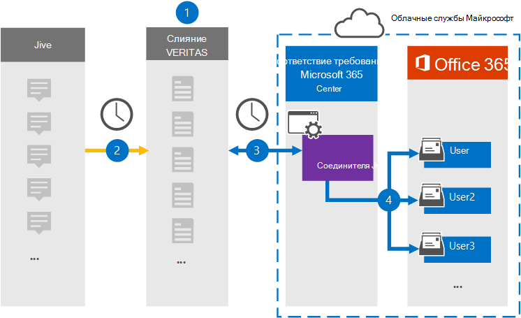

# Настройка соединителя для архива данных JiveSet up a connector to archive Jive data

Используйте соединитель Veritas в центре соответствия требованиям Microsoft 365 для импорта и архивации данных с платформы совместной работы с почтовыми ящиками пользователей в организации Microsoft 365.Use a Veritas connector in the Microsoft 365 compliance center to import and archive data from the collaboration platform to user mailboxes in your Microsoft 365 organization. Veritas предоставляет соединительные элементы [Jive,](https://globanet.com/jive/) настроенные для захвата элементов из стороннего источника данных (на регулярной основе), а затем импорта этих элементов в Microsoft 365.Veritas provides a [Jive](https://globanet.com/jive/) connector that is configured to capture items from the third-party data source (on a regular basis) and then import those items to Microsoft 365. Соединительные содержимого, такие как сообщения электронной почты, чаты и вложения из учетной записи Jive пользователя в формат сообщений электронной почты, а затем импортирует эти элементы в почтовый ящик пользователя в Microsoft 365.The connector converts content such as email messages, chats, and attachments from a user's Jive account to an email message format and then imports those items to the user's mailbox in Microsoft 365.

После хранения данных Jive в почтовых ящиках пользователей можно применить функции соответствия требованиям Microsoft 365, такие как хранение судебного разбирательства, открытие электронных данных, политики хранения и метки хранения, а также соответствие требованиям к связи.After Jive data is stored in user mailboxes, you can apply Microsoft 365 compliance features such as Litigation Hold, eDiscovery, retention policies and retention labels, and communication compliance. Использование соединителя Jive для импорта и архива данных в Microsoft 365 может помочь вашей организации соблюдать государственные и нормативные политики.Using a Jive connector to import and archive data in Microsoft 365 can help your organization stay compliant with government and regulatory policies.

## Обзор архива данных JiveOverview of archiving Jive data

В следующем обзоре объясняется процесс использования соединителя для архивации данных Jive в Microsoft 365.The following overview explains the process of using a connector to archive the Jive data in Microsoft 365.

1. Организация работает с Jive для настройки и настройки сайта Jive.Your organization works with Jive to set up and configure a Jive site.

2. Каждые 24 часа элементы из Jive копируется на сайте Veritas Merge1.Once every 24 hours, items from Jive are copied to the Veritas Merge1 site. Соединительные элементы также преобразует содержимое элементов Jive в формат сообщений электронной почты.The connector also converts the content of Jive items to an email message format.

3. Соединитель Jive, который вы создаете в центре соответствия требованиям Microsoft 365, ежедневно подключается к сайту Veritas Merge1 и передает содержимое в безопасное хранилище Azure в облаке Microsoft.The Jive connector that you create in the Microsoft 365 compliance center connects to the Veritas Merge1 site every day and transfers the content to a secure Azure Storage location in the Microsoft cloud.

4. Соединитатель импортирует преобразованные элементы в почтовые ящики определенных пользователей, используя значение свойства *Email* автоматического сопоставления пользователей, как описано в [шаге 3](#step-3-map-users-and-complete-the-connector-setup).The connector imports the converted items to the mailboxes of specific users by using the value of the *Email* property of the automatic user mapping as described in [Step 3](#step-3-map-users-and-complete-the-connector-setup). В почтовых ящиках пользователей создается новый поддвое в папке Входящие с именем **Jive,** и элементы импортируется в эту папку.A new subfolder in the Inbox folder named **Jive** is created in the user mailboxes, and the items are imported to that folder. Соединитатель делает это, используя значение свойства *Email.*The connector does this by using the value of the *Email* property. Каждый элемент Jive содержит это свойство, которое заполняется адресом электронной почты каждого участника элемента.Every Jive item contains this property, which is populated with the email address of every participant of the item.

## Прежде чем начатьBefore you begin

- Создайте учетную запись Veritas Merge1 для соединители Microsoft.Create a Veritas Merge1 account for Microsoft connectors. Чтобы создать эту учетную запись, обратитесь в службу поддержки [клиентов Veritas.](https://www.veritas.com/content/support/)To create this account, contact [Veritas Customer Support](https://www.veritas.com/content/support/). При создании соединитетеля в шаге 1 вы вопишитесь в эту учетную запись.You will sign into this account when you create the connector in Step 1.

- Пользователь, создавший соединитель Jive в шаге 1 (и завершавший его в шаге 3), должен быть назначен роли экспорта импорта почтовых ящиков в Exchange Online.The user who creates the Jive connector in Step 1 (and completes it in Step 3) must be assigned to the Mailbox Import Export role in Exchange Online. Эта роль необходима для добавления соединители на странице **соединители** данных в центре соответствия требованиям Microsoft 365.This role is required to add connectors on the **Data connectors** page in the Microsoft 365 compliance center. По умолчанию эта роль не назначена группе ролей в Exchange Online.By default, this role is not assigned to a role group in Exchange Online. Вы можете добавить роль экспорта импорта почтовых ящиков в группу ролей управления организацией в Exchange Online.You can add the Mailbox Import Export role to the Organization Management role group in Exchange Online. Или вы можете создать группу ролей, назначить роль экспортировать импорт почтовых ящиков, а затем добавить соответствующих пользователей в качестве участников.Or you can create a role group, assign the Mailbox Import Export role, and then add the appropriate users as members. Дополнительные сведения см. в разделах Создание групп [ролей](/Exchange/permissions-exo/role-groups#create-role-groups) или [изменение](/Exchange/permissions-exo/role-groups#modify-role-groups) групп ролей в статье "Управление группами ролей в Exchange Online".For more information, see the [Create role groups](/Exchange/permissions-exo/role-groups#create-role-groups) or [Modify role groups](/Exchange/permissions-exo/role-groups#modify-role-groups) sections in the article "Manage role groups in Exchange Online".

## Шаг 1. Настройка соединителя JiveStep 1: Set up the Jive connector

Первым шагом является доступ к странице **Соединительные** данные в центре соответствия требованиям Microsoft 365 и создание соединителя для данных Jive.The first step is to access to the **Data Connectors** page in the Microsoft 365 compliance center and create a connector for Jive data.

1. Перейдите [https://compliance.microsoft.com](https://compliance.microsoft.com/) к и нажмите **кнопку Соединительные данные**  >  **Jive**.Go to [https://compliance.microsoft.com](https://compliance.microsoft.com/) and then click **Data connectors** > **Jive**.

2. На странице **описания продукта Jive** нажмите кнопку **Добавить соединителю**.On the **Jive** product description page, click **Add connector**.

3. На странице **Условия службы нажмите** кнопку **Принять**.On the **Terms of service** page, click **Accept**.

4. Введите уникальное имя, идентифицируемое соединитетелем, а затем нажмите **кнопку Далее**.Enter a unique name that identifies the connector, and then click **Next**.

5. Впишитесь в свою учетную запись Merge1, чтобы настроить соединители.Sign in to your Merge1 account to configure the connector.

## Шаг 2. Настройка соединителя JiveStep 2: Configure the Jive connector

Второй шаг — настройка соединителя Jive на сайте Merge1.The second step is to configure the Jive connector on the Merge1 site. Сведения о настройке соединиттеля Jive см. в руководстве по пользователю [Merge1 Third-Party Connectors.](https://docs.ms.merge1.globanetportal.com/Merge1%20Third-Party%20Connectors%20Jive%20User%20Guide.pdf)For information about how to configure the Jive connector, see [Merge1 Third-Party Connectors User Guide](https://docs.ms.merge1.globanetportal.com/Merge1%20Third-Party%20Connectors%20Jive%20User%20Guide.pdf).

После **нажатия кнопки Сохранить &**  finish отображается страница сопоставления пользователей в мастере соединители в центре соответствия требованиям Microsoft 365.After you click **Save & Finish**, the **User mapping** page in the connector wizard in the Microsoft 365 compliance center is displayed.

## Шаг 3. Карта пользователей и завершение установки соединитетеляStep 3: Map users and complete the connector setup

Чтобы составить карту пользователей и завершить установку соединитетеля в центре соответствия требованиям Microsoft 365, выполните следующие действия:To map users and complete the connector setup in the Microsoft 365 compliance center, follow the steps below:

1. На странице **Map Jive для пользователей Microsoft 365** включаем автоматическое сопоставление пользователей.On the **Map Jive users to Microsoft 365 users** page, enable automatic user mapping. Элементы Jive включают свойство *Email,* которое содержит адреса электронной почты для пользователей в вашей организации.The Jive items include a property called *Email*, which contains email addresses for users in your organization. Если соединитатель может связать этот адрес с пользователем Microsoft 365, элементы импортируется в почтовый ящик этого пользователя.If the connector can associate this address with a Microsoft 365 user, the items are imported to that user's mailbox.

2. Нажмите **кнопку Далее,** просмотрите  параметры и перейдите на страницу соединители данных, чтобы просмотреть ход процесса импорта нового соединитетеля.Click **Next**, review your settings, and go to the **Data connectors** page to see the progress of the import process for the new connector.

## Шаг 4. Мониторинг соединителя JiveStep 4: Monitor the Jive connector

После создания соединителя Jive можно просмотреть состояние соединителя в центре соответствия требованиям Microsoft 365.After you create the Jive connector, you can view the connector status in the Microsoft 365 compliance center.

1. Перейдите [https://compliance.microsoft.com](https://compliance.microsoft.com) и щелкните **соединители данных** в левом nav.Go to [https://compliance.microsoft.com](https://compliance.microsoft.com) and click **Data connectors** in the left nav.

2. Щелкните **вкладку** Соединители, а затем выберите **соединителя Jive,** чтобы отобразить страницу вылетов.Click the **Connectors** tab and then select the **Jive** connector to display the flyout page. На этой странице содержатся свойства и сведения о соединители.This page contains the properties and information about the connector.

3. В **состоянии Соединитель с исходным кодом** щелкните ссылку **Журнал** загрузки, чтобы открыть (или сохранить) журнал состояния соединитетеля.Under **Connector status with source**, click the **Download log** link to open (or save) the status log for the connector. В этом журнале содержатся сведения о данных, импортируемых в облако Майкрософт.This log contains information about the data that has been imported to the Microsoft cloud.

## Известные проблемыKnown issues

- В настоящее время мы не поддерживаем импорт вложений или элементов размером более 10 МБ.At this time, we don't support importing attachments or items that are larger than 10 MB. Поддержка более крупных элементов будет доступна позднее.Support for larger items will be available at a later date.