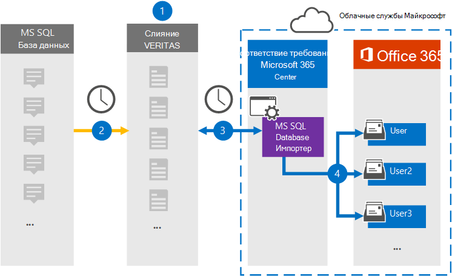

# Настройка соединителя для архивации данных из базы данных MS SQL

Используйте соединитель Глобанет в центре соответствия требованиям Microsoft 365 для импорта и архивирования данных из базы данных MS SQL в почтовые ящики пользователей в организации Microsoft 365. Глобанет предоставляет соединитель импортера базы данных MS SQL, настроенный для записи элементов из базы данных с помощью XML-файла конфигурации и импорта этих элементов в Microsoft 365. Соединитель Преобразовывает содержимое базы данных MS SQL в формат сообщений электронной почты, а затем импортирует эти элементы в почтовые ящики пользователей в Microsoft 365.

После содержимого базы данных MS SQL, хранящейся в почтовых ящиках пользователей, можно применять функции обеспечения соответствия требованиям Microsoft 365, такие как хранение для судебного разбирательства, обнаружение электронных данных, политики хранения и метки хранения. Использование соединителя базы данных MS SQL для импорта и архивирования данных в Microsoft 365 может помочь организации соответствовать государственным и нормативным политикам.

## Общие сведения об архивации данных MS SQL

В следующем обзоре описывается процесс использования соединителя для архивации данных MS SQL в Microsoft 365.

1. Ваша организация работает с поставщиком базы данных MS SQL для установки и настройки сайта базы данных MS SQL.

2. Каждые 24 часа элементы базы данных MS SQL копируются на сайт Глобанет Merge1. Соединитель также преобразовывает этот контент в формат сообщения электронной почты.

3. Соединитель средства импорта базы данных MS SQL, который вы создаете в центре соответствия требованиям Microsoft 365, подключается к сайту Глобанет Merge1 каждый день и передает сообщения в безопасное место хранения Azure в облаке Майкрософт.

4. Соединитель импортирует преобразованные элементы базы данных MS SQL в почтовые ящики определенных пользователей, используя значение свойства *Email* для автоматического сопоставления пользователей, как описано в [шаге 3](#step-3-map-users-and-complete-the-connector-setup). Вложенная папка в папке "Входящие" с именем **MS SQL импортер базы данных** создается в почтовых ящиках пользователей, а элементы импортируются в эту папку. Соединитель определяет, к какому почтовому ящику следует импортировать элементы, используя значение свойства *Email* . Каждый элемент из базы данных MS SQL содержит это свойство, которое заполняется адресом электронной почты каждого участника элемента.

## Прежде чем начать

- Создайте учетную запись Глобанет Merge1 для соединителей Майкрософт. Чтобы создать учетную запись, обратитесь в службу [поддержки клиентов глобанет](https://globanet.com/contact-us/). Вы должны войти в эту учетную запись, когда вы создадите соединитель на шаге 1.

- Пользователь, который создает соединитель импортера базы данных MS SQL в действии 1 (и выполняет его на шаге 3), должен быть назначен роли импорта и экспорта почтовых ящиков в Exchange Online. Эта роль необходима для добавления соединителей на странице "соединители данных" в центре соответствия требованиям Microsoft 365. По умолчанию эта роль не назначена ни одной группе ролей в Exchange Online. Вы можете добавить роль экспорта для импорта почтовых ящиков в группу ролей Управление организацией в Exchange Online. Вы также можете создать группу ролей, назначить роль импорта для импорта почтовых ящиков, а затем добавить соответствующих пользователей в качестве участников. Для получения дополнительных сведений обратитесь к разделу [Создание](https://docs.microsoft.com/Exchange/permissions-exo/role-groups#create-role-groups) групп ролей или [изменение групп ролей](https://docs.microsoft.com/Exchange/permissions-exo/role-groups#modify-role-groups) статьи "Управление группами ролей в Exchange Online".

## Шаг 1: Настройка соединителя средства импорта базы данных MS SQL

Первый шаг — доступ к странице " **соединители данных** " в центре соответствия требованиям Microsoft365 и создание соединителя для базы данных MS SQL.

1. Перейдите к [https://compliance.microsoft.com](https://compliance.microsoft.com) пункту **соединители данных**  >  **MS SQL** Connectors.

2. На странице "Описание продукта программы **импорта базы данных MS SQL** " нажмите кнопку **Добавить новый соединитель**.

3. На странице **условия обслуживания** нажмите кнопку **принять**.

4. Введите уникальное имя, идентифицирующее соединитель, а затем нажмите кнопку **Далее**.

5. Войдите в свою учетную запись Merge1, чтобы настроить соединитель.

## Шаг 2: Настройте соединитель импортера базы данных MS SQL на сайте Глобанет Merge1

Второй шаг — настройка соединителя средства импорта базы данных MS SQL на сайте Merge1. Сведения о настройке средства импорта базы данных MS SQL содержатся в [руководстве пользователя Merge1 Connectors](https://docs.ms.merge1.globanetportal.com/Merge1%20Third-Party%20Connectors%20MS%20SQL%20Database%20Importer%20User%20Guide%20.pdf).

После нажатия кнопки **сохранить & готово** отображается страница **Сопоставление пользователей** в мастере соединителей в центре соответствия требованиям Microsoft 365.

## Шаг 3: сопоставление пользователей и завершение установки соединителя

Чтобы сопоставить пользователей и завершить настройку соединителя, выполните следующие действия:

1. На странице " **Сопоставление базы данных Microsoft SQL для импорта на страницу пользователей Microsoft 365** " Включите автоматическое сопоставление пользователей. Элементы базы данных MS SQL включают в себя свойство *Email*, которое содержит адреса электронной почты для пользователей в Организации. Если соединитель может сопоставить этот адрес с пользователем Microsoft 365, элементы будут импортированы в почтовый ящик этого пользователя.

2. На странице **согласия администратора** нажмите кнопку **предоставить согласие** . Вы будете перенаправлены на сайт Майкрософт. Нажмите кнопку **принять** , чтобы предоставить согласие.

   Ваша организация должна разрешить службе импорта Office 365 доступ к данным почтовых ящиков в Организации. Чтобы предоставить согласие администратора, необходимо войти в систему, используя учетные данные глобального администратора Microsoft 365, а затем принять запрос согласия. Если вы не вошли в систему как глобальный администратор, вы можете перейти на [эту страницу](https://login.microsoftonline.com/common/oauth2/authorize?client_id=570d0bec-d001-4c4e-985e-3ab17fdc3073&response_type=code&redirect_uri=https://portal.azure.com/&nonce=1234&prompt=admin_consent) и войти в систему, используя учетные данные глобального администратора, чтобы принять запрос.

3. Нажмите кнопку **Далее**, проверьте параметры и перейдите на страницу " **соединители данных** ", чтобы просмотреть ход процесса импорта для нового соединителя.

## Шаг 4: мониторинг соединителя средства импорта базы данных MS SQL

После создания соединителя средства импорта базы данных MS SQL вы можете просмотреть состояние соединителя в центре соответствия требованиям Microsoft 365.

1. Перейдите к разделу <https://compliance.microsoft.com/> **соединители данных** в левой панели навигации и нажмите кнопку соединители данных.

2. Перейдите на вкладку **соединители** и выберите соединитель **импортера** **базы данных MS SQL** для отображения всплывающей страницы, содержащей свойства и сведения о соединителе.

3. В разделе **состояние соединителя с источником** выберите ссылку **журнал загрузки** , чтобы открыть (или сохранить) журнал состояний для соединителя. Этот журнал содержит данные, которые были импортированы в Microsoft Cloud.

## Известные проблемы

- В настоящее время импорт вложений или элементов, размер которых превышает 10 МБ, не поддерживается. Поддержка элементов с большим сроком действия будет доступна позже.
