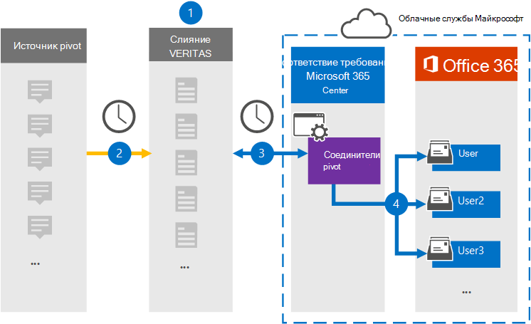

# Настройка соединитетеля для архива данных PivotSet up a connector to archive Pivot data

Используйте соединителик Globanet в центре соответствия требованиям Microsoft 365 для импорта и архива данных с платформы Pivot в почтовые ящики пользователей в организации Microsoft 365.Use a Globanet connector in the Microsoft 365 compliance center to import and archive data from the Pivot platform to user mailboxes in your Microsoft 365 organization. Globanet предоставляет вам соединителик [Pivot,](https://globanet.com/pivot/) который настроен для захвата элементов из стороннего источника данных (на регулярной основе), а затем импортировать эти элементы в Microsoft 365.Globanet provides you with a [Pivot](https://globanet.com/pivot/) connector that is configured to capture items from the third-party data source (on a regular basis) and then import those items to Microsoft 365. Pivot — это платформа обмена мгновенными сообщениями, которая позволяет сотрудничать с участниками финансового рынка.Pivot is an instant messaging platform that allows collaboration with financial market participants. Соединитатель преобразует элементы, такие как сообщения чата, из учетных записей pivot пользователей в формат сообщений электронной почты, а затем импортирует эти элементы в почтовые ящики пользователей в Microsoft 365.The connector converts items such as chat messages, from a users' Pivot accounts to an email message format and then imports those items to the user mailboxes in Microsoft 365.

После хранения данных Pivot в почтовых ящиках пользователей можно применить функции соответствия требованиям Microsoft 365, такие как хранение судебного разбирательства, открытие электронных данных, политики хранения и метки хранения, а также соответствие требованиям к связи.After Pivot data is stored in user mailboxes, you can apply Microsoft 365 compliance features such as Litigation Hold, eDiscovery, retention policies and retention labels, and communication compliance. Использование соединиттеля Pivot для импорта и архива данных в Microsoft 365 может помочь вашей организации соблюдать государственные и нормативные политики.Using a Pivot connector to import and archive data in Microsoft 365 can help your organization stay compliant with government and regulatory policies.

## Обзор архива данных сводаOverview of archiving Pivot data

В следующем обзоре рассказывается о процессе использования соединитетеля для архивации данных Pivot в Microsoft 365.The following overview explains the process of using a connector to archive the Pivot data in Microsoft 365.

1. Организация работает с Pivot, чтобы настроить и настроить исходный сайт Pivot.Your organization works with Pivot to set up and configure a Pivot source site.

2. Раз в 24 часа элементы Pivot копируется на сайт Globanet Merge1.Once every 24 hours, Pivot items are copied to the Globanet Merge1 site. Соединитело также преобразует элементы Pivot в формат сообщений электронной почты.The connector also converts the Pivot items to an email message format.

3. Соединителик Pivot, который вы создаете в центре соответствия требованиям Microsoft 365, подключается к сайту Globanet Merge1 каждый день и передает элементы Pivot в безопасное хранилище Azure в облаке Microsoft.The Pivot connector that you create in the Microsoft 365 compliance center, connects to the Globanet Merge1 site every day and transfers the Pivot items to a secure Azure Storage location in the Microsoft cloud.

4. Соединитатель импортирует элементы Pivot в почтовые ящики определенных пользователей, используя значение свойства *Email* автоматического сопоставления пользователей, как описано в [шаге 3](#step-3-map-users-and-complete-the-connector-setup).The connector imports the Pivot items to the mailboxes of specific users by using the value of the *Email* property of the automatic user mapping as described in [Step 3](#step-3-map-users-and-complete-the-connector-setup). Подмостки в папке "Входящие" с именем **Pivot** создаются в почтовых ящиках пользователей, и элементы импортируется в эту папку.A subfolder in the Inbox folder named **Pivot** is created in the user mailboxes, and the items are imported to that folder. Соединитатель делает это, используя значение свойства *Email.*The connector does this by using the value of the *Email* property. Каждый элемент Pivot содержит это свойство, которое заполняется адресом электронной почты каждого участника элемента.Every Pivot item contains this property, which is populated with the email address of every participant of the item.

## ПодготовкаBefore you begin

- Создайте учетную запись Globanet Merge1 для соединители Microsoft.Create a Globanet Merge1 account for Microsoft connectors. Чтобы создать эту учетную запись, обратитесь в службу поддержки клиентов [Globanet.](https://globanet.com/ms-connectors-contact/)To create this account, contact [Globanet Customer Support](https://globanet.com/ms-connectors-contact/). При создании соединитетеля в шаге 1 вы вопишитесь в эту учетную запись.You will sign into this account when you create the connector in Step 1.

- Пользователь, создавший соединитель Pivot в шаге 1 (и завершавший его в шаге 3), должен быть назначен роли экспорта импорта почтовых ящиков в Exchange Online.The user who creates the Pivot connector in Step 1 (and completes it in Step 3) must be assigned to the Mailbox Import Export role in Exchange Online. Эта роль необходима для добавления соединители на странице соединители данных в центре соответствия требованиям Microsoft 365.This role is required to add connectors on the Data connectors page in the Microsoft 365 compliance center. По умолчанию эта роль не назначена группе ролей в Exchange Online.By default, this role is not assigned to a role group in Exchange Online. Вы можете добавить роль экспорта импорта почтовых ящиков в группу ролей управления организацией в Exchange Online.You can add the Mailbox Import Export role to the Organization Management role group in Exchange Online. Или вы можете создать группу ролей, назначить роль экспортировать импорт почтовых ящиков, а затем добавить соответствующих пользователей в качестве участников.Or you can create a role group, assign the Mailbox Import Export role, and then add the appropriate users as members. Дополнительные сведения см. в разделах Создание групп [ролей](/Exchange/permissions-exo/role-groups#create-role-groups) или [изменение](/Exchange/permissions-exo/role-groups#modify-role-groups) групп ролей в статье "Управление группами ролей в Exchange Online".For more information, see the [Create role groups](/Exchange/permissions-exo/role-groups#create-role-groups) or [Modify role groups](/Exchange/permissions-exo/role-groups#modify-role-groups) sections in the article "Manage role groups in Exchange Online".

## Шаг 1. Настройка соединиттеля PivotStep 1: Set up the Pivot connector

Первым шагом является доступ к странице **Соединители** данных в центре соответствия требованиям Майкрософт и создание соединитетеля для данных Pivot.The first step is to access to the **Data Connectors** page in the Microsoft compliance center and create a connector for Pivot data.

1. Перейдите [https://compliance.microsoft.com](https://compliance.microsoft.com/) к и нажмите **кнопку Соединители данные**  >  **Pivot**.Go to [https://compliance.microsoft.com](https://compliance.microsoft.com/) and then click **Data connectors** > **Pivot**.

2. На странице **описание продукта Pivot** нажмите кнопку **Добавить соединителю**.On the **Pivot** product description page, click **Add connector**.

3. На странице **Условия службы нажмите** кнопку **Принять**.On the **Terms of service** page, click **Accept**.

4. Введите уникальное имя, которое идентифицирует соединителен, а затем нажмите **кнопку Далее**.Enter a unique name that identifies the connector and then click **Next**.

5. Впишитесь в свою учетную запись Merge1, чтобы настроить соединители.Sign in to your Merge1 account to configure the connector.

## Шаг 2. Настройка соединитетеля pivot на сайте Globanet Merge1Step 2: Configure the Pivot connector on the Globanet Merge1 site

На втором этапе необходимо настроить соединители Pivot на сайте Merge1.The second step is to configure the Pivot connector on the Merge1 site. Сведения о настройке соединиттеля Pivot на сайте Globanet Merge1 см. в руководстве по пользователю [Merge1.](https://docs.ms.merge1.globanetportal.com/Merge1%20Third-Party%20Connectors%20Pivot%20User%20Guide%20.pdf)For information about how to configure the Pivot connector on the Globanet Merge1 site, see [Merge1 Third-Party Connectors User Guide](https://docs.ms.merge1.globanetportal.com/Merge1%20Third-Party%20Connectors%20Pivot%20User%20Guide%20.pdf).

После **нажатия кнопки Сохранить &**  finish отображается страница сопоставления пользователей в мастере соединители в центре соответствия требованиям Microsoft 365.After you click **Save & Finish**, the **User mapping** page in the connector wizard in the Microsoft 365 compliance center is displayed.

## Шаг 3. Карта пользователей и завершение установки соединитетеляStep 3: Map users and complete the connector setup

Чтобы составить карту пользователей и завершить установку соединитетеля в центре соответствия требованиям Microsoft 356, выполните следующие действия:To map users and complete the connector setup in the Microsoft 356 compliance center, follow these steps:

1. На странице **Pivot Map для пользователей Microsoft 365** включаем автоматическое сопоставление пользователей.On the **Map Pivot users to Microsoft 365 users** page, enable automatic user mapping. Элементы Pivot включают свойство *Email,* которое содержит адреса электронной почты для пользователей в вашей организации.The Pivot items include a property called *Email*, which contains email addresses for users in your organization. Если соединитатель может связать этот адрес с пользователем Microsoft 365, элементы импортируется в почтовый ящик этого пользователя.If the connector can associate this address with a Microsoft 365 user, the items are imported to that user's mailbox.

2. Нажмите **кнопку Далее,** просмотрите  параметры и перейдите на страницу соединители данных, чтобы просмотреть ход процесса импорта нового соединитетеля.Click **Next**, review your settings, and go to the **Data connectors** page to see the progress of the import process for the new connector.

## Шаг 4. Мониторинг соединиттеля pivotStep 4: Monitor the Pivot connector

После создания соединиттеля Pivot можно просмотреть состояние соединитетеля в центре соответствия требованиям Microsoft 365.After you create the Pivot connector, you can view the connector status in the Microsoft 365 compliance center.

1. Перейдите [https://compliance.microsoft.com](https://compliance.microsoft.com) и щелкните **соединители данных** в левом nav.Go to [https://compliance.microsoft.com](https://compliance.microsoft.com) and click **Data connectors** in the left nav.

2. Щелкните **вкладку** Соединители, а затем выберите **соединителет Pivot,** чтобы отобразить страницу вылетов.Click the **Connectors** tab and then select the **Pivot** connector to display the flyout page. На этой странице содержатся свойства и сведения о соединители.This page contains the properties and information about the connector.

3. В **состоянии Соединитель с исходным кодом** щелкните ссылку **Журнал** загрузки, чтобы открыть (или сохранить) журнал состояния соединитетеля.Under **Connector status with source**, click the **Download log** link to open (or save) the status log for the connector. В этом журнале содержатся данные, импортируемые в облако Майкрософт.This log contains data that has been imported to the Microsoft cloud.

## Известные проблемыKnown issues

- В настоящее время мы не поддерживаем импорт вложений или элементов размером более 10 МБ.At this time, we don't support importing attachments or items that are larger than 10 MB. Поддержка более крупных элементов будет доступна позднее.Support for larger items will be available at a later date.