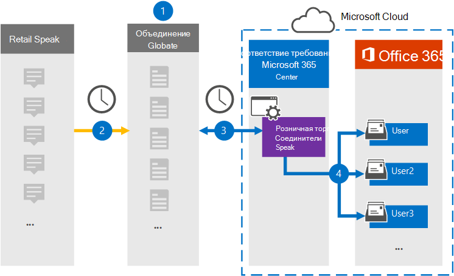

# Настройка соединителя для архива данных Redtail Speak

Используйте соединитель Veritas в центре Microsoft 365 для импорта и архива данных из Redtail Speak для почтовых ящиков пользователей в Microsoft 365 организации. Veritas предоставляет вам соединитель [Redtail Speak,](https://globanet.com/redtail/) настроенный для захвата элементов на SFTP-сервере организации, где они получаются из Redtail. Соединитель преобразует содержимое из Redtail Speak в формат сообщения электронной почты, а затем импортирует эти элементы в почтовый ящик пользователя в Microsoft 365.

После хранения данных Redtail Speak в почтовых ящиках пользователей можно применить Microsoft 365, такие как хранение судебного разбирательства, открытие электронных данных, политики хранения и метки хранения. Использование соединиттеля Redtail Speak для импорта и архива данных в Microsoft 365 может помочь вашей организации соблюдать государственные и нормативные политики.

## Обзор архива данных Redtail Speak

В следующем обзоре объясняется процесс использования соединителя для архивации данных Redtail Speak в Microsoft 365.

1. Ваша организация работает с Redtail Speak для настройки шлюза SMTP, в котором сообщения переадтрансляются из Redtail Speak на SFTP-сервер организации на ежедневной основе.

2. Каждые 24 часа элементы Redtail Speak копируется на сайте Veritas Merge1. Соединитель также преобразует элементы Redtail Speak в формат сообщений электронной почты.

3. Соединитель Redtail Speak, который создается в центре Microsoft 365 соответствия требованиям, подключается к сайту Veritas Merge1 каждый день и передает сообщения в безопасное расположение служба хранилища Azure в облаке Майкрософт.

4. Соединитель импортирует преобразованные элементы Redtail Speak в почтовые ящики определенных пользователей, используя значение свойства *Email* автоматического сопоставления пользователей, как описано в шаге [3](#step-3-map-users-and-complete-the-connector-setup). В почтовых ящиках пользователей создается подмостка в папке "Входящие" с именем **Redtail Speak,** и элементы импортируется в эту папку. Соединитатель определяет, в какой почтовый ящик импортировать элементы, используя значение свойства *Email.* Каждый элемент Redtail Speak содержит это свойство, которое заполняется адресом электронной почты каждого участника элемента.

## Прежде чем начать

- Создайте учетную запись Veritas Merge1 для соединители Microsoft. Чтобы создать учетную запись, обратитесь [в службу поддержки клиентов Veritas.](https://www.veritas.com/content/support/) При создании соединитетеля в шаге 1 необходимо войти в эту учетную запись.

- На шаге 2 необходимо указать SFTP-сервер организации. Этот шаг необходим для того, чтобы Veritas Merge1 связался с ней для сбора данных Redtail Speak с помощью SFTP.

- Пользователь, создавший соединитель импортера разговоров Redtail в шаге 1 (и завершавший его в шаге 3), должен быть назначен роли экспорта импорта почтовых ящиков в Exchange Online. Эта роль требуется для добавления соединители на странице соединители данных в центре Microsoft 365 соответствия требованиям. Эта роль не назначена какой-либо группе ролей в Exchange Online по умолчанию. Вы можете добавить роль экспорта импорта почтовых ящиков в группу ролей управления организацией в Exchange Online. Или вы можете создать группу ролей, назначить роль экспортировать импорт почтовых ящиков, а затем добавить соответствующих пользователей в качестве участников. Дополнительные сведения см. в разделах [Создание](/Exchange/permissions-exo/role-groups#create-role-groups) групп ролей или [изменение](/Exchange/permissions-exo/role-groups#modify-role-groups) групп ролей в статье "Управление группами ролей в Exchange Online".

## Шаг 1. Настройка соединителя redtail Speak

Первым шагом является доступ  к странице Соединители данных в центре Microsoft 365 соответствия требованиям и создание соединителя для данных Redtail Speak.

1. Перейдите [https://compliance.microsoft.com](https://compliance.microsoft.com/) к и выберите **соединители данных** &gt; **Redtail Speak**.

2. На странице **описания продукта Redtail Speak** выберите Добавить новый **соединитель.**

3. На странице **Условия службы выберите** **Accept**.

4. Введите уникальное имя, идентифицируемое соединитетелем, а затем выберите **Далее**.

5. Впишитесь в свою учетную запись Merge1, чтобы настроить соединители.

## Шаг 2. Настройка соединителя Redtail Speak на сайте Veritas Merge1

На втором этапе необходимо настроить соединитель Redtail Speak на сайте Merge1. Сведения о настройке соединителя Redtail Speak см. в руководстве по пользователю [Merge1 Third-Party Connectors.](https://docs.ms.merge1.globanetportal.com/Merge1%20Third-Party%20Connectors%20Redtail%20Speak%20User%20Guide%20.pdf)

После выбора **save & Finish**  отображается страница сопоставления пользователя в мастере соединители в центре Microsoft 365 соответствия требованиям.

## Шаг 3. Карта пользователей и завершение установки соединитетеля

Чтобы составить карту пользователей и выполнить установку соединитетеля, выполните следующие действия:

1. На странице **Map Redtail Speak пользователи могут** Microsoft 365 пользователей, включив автоматическое сопоставление пользователей. Элементы Redtail Speak включают свойство *Email,* которое содержит адреса электронной почты для пользователей в вашей организации. Если соединитатель может связать этот адрес с Microsoft 365 пользователем, элементы импортируется в почтовый ящик этого пользователя.

2. Выберите **Далее,** просмотрите параметры и перейдите на страницу **соединители** данных, чтобы увидеть ход процесса импорта нового соединитетеля.

## Шаг 4. Мониторинг соединителя redtail Speak

После создания соединителя Redtail Speak можно просмотреть состояние соединителя в центре Microsoft 365 соответствия требованиям.

1. Перейдите [https://compliance.microsoft.com](https://compliance.microsoft.com/) к и выберите **соединители данных** в левом nav.

2. Выберите **вкладку Соединители,** а затем выберите соединитель **Redtail Speak,** чтобы отобразить страницу вылетов. На этой странице отображаются свойства и сведения о соединители.

3. В **состоянии Соединитель с исходным кодом** выберите ссылку **Журнал** загрузки, чтобы открыть (или сохранить) журнал состояния для соединитетеля. В этом журнале содержатся данные, импортируемые в облако Майкрософт.

## Известные проблемы

- В настоящее время мы не поддерживаем импорт вложений или элементов размером более 10 МБ. Поддержка более крупных элементов будет доступна позднее.