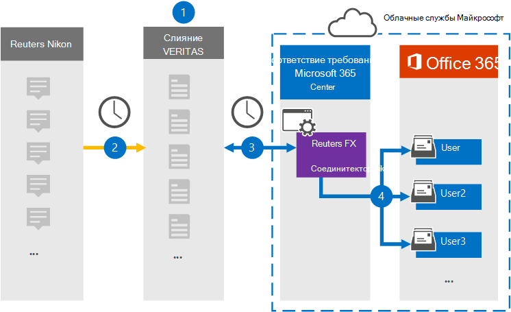

# Настройка соединителей для архива данных Reuters EikonSet up a connector to archive Reuters Eikon data

Используйте соединитель Veritas в центре Microsoft 365 для импорта и архива данных с платформы Reuters Eikon в почтовые ящики пользователей в Microsoft 365 организации.Use a Veritas connector in the Microsoft 365 compliance center to import and archive data from the Reuters Eikon platform to user mailboxes in your Microsoft 365 organization. Veritas предоставляет соединителю [Reuters Eikon,](https://globanet.com/eikon/) который настроен для захвата элементов из стороннего источника данных (на регулярной основе) и импорта этих элементов в Microsoft 365.Veritas provides a [Reuters Eikon](https://globanet.com/eikon/) connector that is configured to capture items from the third-party data source (on a regular basis) and import those items to Microsoft 365. Соединителю преобразует содержимое, например сообщения от человека к человеку, групповые чаты, вложения и отказы от учетной записи reuters Eikon пользователя в формат сообщения электронной почты, а затем импортирует эти элементы в почтовый ящик пользователя в Microsoft 365.The connector converts the content such as person-to-person messages, group chats, attachments, and disclaimers from a user's Reuters Eikon account to an email message format and then imports those items to the user's mailbox in Microsoft 365.

После хранения данных Reuters Eikon в почтовых ящиках пользователей можно применить такие функции соответствия требованиям Microsoft 365, как хранение судебного разбирательства, электронные сведения, политики хранения и метки хранения, а также соответствие требованиям к связи.After Reuters Eikon data is stored in user mailboxes, you can apply Microsoft 365 compliance features such as Litigation Hold, eDiscovery, retention policies and retention labels, and communication compliance. Использование соединителей Reuters Eikon для импорта и архива данных в Microsoft 365 может помочь вашей организации соблюдать государственные и нормативные политики.Using a Reuters Eikon connector to import and archive data in Microsoft 365 can help your organization stay compliant with government and regulatory policies.

## Обзор архива данных Reuters EikonOverview of archiving Reuters Eikon data

В следующем обзоре объясняется процесс использования соединителей для архивации данных Reuters Eikon в Microsoft 365.The following overview explains the process of using a connector to archive Reuters Eikon data in Microsoft 365.

1. Ваша организация сотрудничает с агентством Reuters Eikon для настройки и настройки сайта Reuters Eikon.Your organization works with Reuters Eikon to set up and configure a Reuters Eikon site.

2. Каждые 24 часа элементы Reuters Eikon копируется на сайте Veritas Merge1.Once every 24 hours, Reuters Eikon items are copied to the Veritas Merge1 site. Соединителю также преобразует элементы Reuters Eikon в формат сообщений электронной почты.The connector also converts Reuters Eikon items to an email message format.

3. Соединителю Reuters Eikon, который вы создаете в центре Microsoft 365 соответствия требованиям, ежедневно подключается к сайту Veritas Merge1 и передает содержимое в безопасное служба хранилища Azure в облаке Майкрософт.The Reuters Eikon connector that you create in the Microsoft 365 compliance center connects to the Veritas Merge1 site every day and transfers the content to a secure Azure Storage location in the Microsoft cloud.

4. Соединитатель импортирует элементы в почтовые ящики определенных пользователей, используя значение свойства *Email* автоматического сопоставления пользователей, как описано в [шаге 3](#step-3-map-users-and-complete-the-connector-setup).The connector imports items to the mailboxes of specific users by using the value of the *Email* property of the automatic user mapping as described in [Step 3](#step-3-map-users-and-complete-the-connector-setup). В почтовых ящиках пользователей создается подмостка в папке "Входящие" с именем **Reuters Eikon,** и элементы импортируется в эту папку.A subfolder in the Inbox folder named **Reuters Eikon** is created in the user mailboxes, and the items are imported to that folder. Соединитатель определяет, в какой почтовый ящик импортировать элементы, используя значение свойства *Email.*The connector determines which mailbox to import items to by using the value of the *Email* property. Каждый элемент Reuters Eikon содержит это свойство, которое заполняется адресом электронной почты каждого участника элемента.Every Reuters Eikon item contains this property, which is populated with the email address of every participant of the item.

## Прежде чем начатьBefore you begin

- Создайте учетную запись Veritas Merge1 для соединители Microsoft.Create a Veritas Merge1 account for Microsoft connectors. Чтобы создать учетную запись, обратитесь [в службу поддержки клиентов Veritas.](https://globanet.com/ms-connectors-contact)To create an account, contact [Veritas Customer Support](https://globanet.com/ms-connectors-contact). При создании соединитетеля в шаге 1 вы вопишитесь в эту учетную запись.You will sign into this account when you create the connector in Step 1.

- Пользователь, создавший соединителю Reuters Eikon в шаге 1 (и завершавший его в шаге 3), должен быть назначен роли экспорта импорта почтовых ящиков в Exchange Online.The user who creates the Reuters Eikon connector in Step 1 (and completes it in Step 3) must be assigned to the Mailbox Import Export role in Exchange Online. Эта роль необходима для добавления соединители на **странице** соединители данных в центре Microsoft 365 соответствия требованиям.This role is required to add connectors on the **Data connectors** page in the Microsoft 365 compliance center. По умолчанию эта роль не назначена группе ролей в Exchange Online.By default, this role is not assigned to a role group in Exchange Online. Вы можете добавить роль экспорта импорта почтовых ящиков в группу ролей управления организацией в Exchange Online.You can add the Mailbox Import Export role to the Organization Management role group in Exchange Online. Или вы можете создать группу ролей, назначить роль экспортировать импорт почтовых ящиков, а затем добавить соответствующих пользователей в качестве участников.Or you can create a role group, assign the Mailbox Import Export role, and then add the appropriate users as members. Дополнительные сведения см. в разделах [Создание](/Exchange/permissions-exo/role-groups#create-role-groups) групп ролей или [изменение](/Exchange/permissions-exo/role-groups#modify-role-groups) групп ролей в статье "Управление группами ролей в Exchange Online".For more information, see the [Create role groups](/Exchange/permissions-exo/role-groups#create-role-groups) or [Modify role groups](/Exchange/permissions-exo/role-groups#modify-role-groups) sections in the article "Manage role groups in Exchange Online".

## Шаг 1. Настройка соединителей Reuters EikonStep 1: Set up the Reuters Eikon connector

Первым шагом является доступ  к странице соединителей данных в центре Microsoft 365 и создание соединителей для данных Reuters Eikon.The first step is to access to the **Data Connectors** page in the Microsoft 365 compliance center and create a connector for Reuters Eikon data.

1. Перейдите [https://compliance.microsoft.com](https://compliance.microsoft.com/) к и нажмите **соединителей данных** Reuters  >  **Eikon**.Go to [https://compliance.microsoft.com](https://compliance.microsoft.com/) and then click **Data connectors** > **Reuters Eikon**.

2. На странице **описания продукта Reuters Eikon** нажмите **кнопку Добавить соединителю**.On the **Reuters Eikon** product description page, click **Add connector**.

3. На странице **Условия службы нажмите** кнопку **Принять**.On the **Terms of service** page, click **Accept**.

4. Введите уникальное имя, идентифицируемое соединитетелем, а затем нажмите **кнопку Далее**.Enter a unique name that identifies the connector, and then click **Next**.

5. Впишитесь в свою учетную запись Merge1, чтобы настроить соединители.Sign in to your Merge1 account to configure the connector.

## Шаг 2. Настройка соединителя Reuters Eikon на сайте Veritas Merge1Step 2: Configure the Reuters Eikon connector on the Veritas Merge1 site

Второй шаг — настройка соединителей Reuters Eikon на сайте Merge1.The second step is to configure the Reuters Eikon connector on the Merge1 site. Сведения о настройке соединиттеля Reuters Eikon на сайте Veritas Merge1 см. в руководстве по пользователю [Merge1 сторонних соединителей.](https://docs.ms.merge1.globanetportal.com/Merge1%20Third-Party%20Connectors%20Reuters%20Eikon%20User%20Guide%20.pdf)For information about how to configure the Reuters Eikon connector on the Veritas Merge1 site, see [Merge1 Third-Party Connectors User Guide](https://docs.ms.merge1.globanetportal.com/Merge1%20Third-Party%20Connectors%20Reuters%20Eikon%20User%20Guide%20.pdf).

После нажатия **кнопки Сохранить &**  finish отображается страница сопоставления пользователей в мастере соединители в центре Microsoft 365 соответствия требованиям.After you click **Save & Finish**, the **User mapping** page in the connector wizard in the Microsoft 365 compliance center is displayed.

## Шаг 3. Карта пользователей и завершение установки соединитетеляStep 3: Map users and complete the connector setup

Чтобы составить карту пользователей и завершить установку соединитетеля в центре Microsoft 365 соответствия требованиям, выполните следующие действия:To map users and complete the connector setup in the Microsoft 365 compliance center, follow these steps:

1. На странице **Сопоставление внешних** пользователей для Microsoft 365 пользователей включаем автоматическое сопоставление пользователей.On the **Map external users to Microsoft 365 users** page, enable automatic user mapping. Элементы Reuters Eikon включают свойство *Email,* которое содержит адреса электронной почты для пользователей в организации.The Reuters Eikon items include a property called *Email*, which contains email addresses for users in your organization. Если соединитатель может связать этот адрес с Microsoft 365 пользователем, элементы импортируется в почтовый ящик этого пользователя.If the connector can associate this address with a Microsoft 365 user, the items are imported to that user’s mailbox.

2. Нажмите **кнопку Далее,** просмотрите параметры и перейдите на страницу соединители данных, чтобы просмотреть ход процесса импорта для нового соединитетеля. Click **Next**, review your settings, and then go to the **Data connectors** page to see the progress of the import process for the new connector.

## Шаг 4. Мониторинг соединителей Reuters EikonStep 4: Monitor the Reuters Eikon connector

После создания соединителей Reuters Eikon можно просмотреть состояние соединителей в центре Microsoft 365 соответствия требованиям.After you create the Reuters Eikon connector, you can view the connector status in the Microsoft 365 compliance center.

1. Перейдите [https://compliance.microsoft.com](https://compliance.microsoft.com) и щелкните **соединители данных** в левом nav.Go to [https://compliance.microsoft.com](https://compliance.microsoft.com) and click **Data connectors** in the left nav.

2. Щелкните **вкладку Соединителей** и выберите соединителю **Reuters Eikon,** чтобы отобразить страницу вылетов.Click the **Connectors** tab and then select the **Reuters Eikon** connector to display the flyout page. На этой странице содержатся свойства и сведения о соединители.This page contains the properties and information about the connector.

3. В **состоянии Соединитель с исходным кодом** щелкните ссылку **Журнал** загрузки, чтобы открыть (или сохранить) журнал состояния соединитетеля.Under **Connector status with source**, click the **Download log** link to open (or save) the status log for the connector. В этом журнале содержатся сведения о данных, импортируемых в облако Майкрософт.This log contains information about the data that has been imported to the Microsoft cloud.

## Известные проблемыKnown issues

- В настоящее время мы не поддерживаем импорт вложений или элементов размером более 10 МБ.At this time, we don't support importing attachments or items that are larger than 10 MB. Поддержка более крупных элементов будет доступна позднее.Support for larger items will be available at a later date.