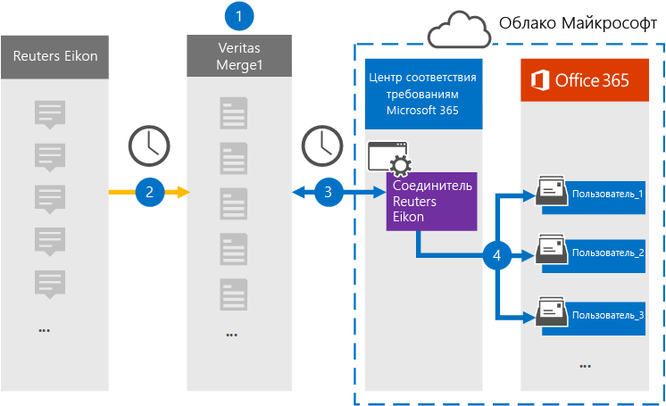

# Настройка соединителей для архива данных Reuters EikonSet up a connector to archive Reuters Eikon data

Используйте соединителю Globanet в Центре соответствия требованиям Microsoft 365, чтобы импортировать и архивировать данные с платформы Reuters Eikon в почтовые ящики пользователей в организации Microsoft 365.Use a Globanet connector in the Microsoft 365 compliance center to import and archive data from the Reuters Eikon platform to user mailboxes in your Microsoft 365 organization. Globanet предоставляет соединителю [Reuters Eikon,](https://globanet.com/eikon/) который настраивается для записи элементов из стороннего источника данных (на регулярной основе) и импорта этих элементов в Microsoft 365.Globanet provides a [Reuters Eikon](https://globanet.com/eikon/) connector that is configured to capture items from the third-party data source (on a regular basis) and import those items to Microsoft 365. Соединителей преобразует содержимое, такое как сообщения от пользователя к человеку, групповые чаты, вложения и заявление об отказе от ответственности из учетной записи пользователя Reuters Eikon в формат электронной почты, а затем импортирует эти элементы в почтовый ящик пользователя в Microsoft 365.The connector converts the content such as person-to-person messages, group chats, attachments, and disclaimers from a user's Reuters Eikon account to an email message format and then imports those items to the user's mailbox in Microsoft 365.

После сохранения данных в почтовых ящиках пользователей в почтовых ящиках пользователей можно применить такие функции соответствия требованиям Microsoft 365, как хранение для судебного разбирательства, eDiscovery, политики хранения и метки хранения, а также соответствие коммуникации.After Reuters Eikon data is stored in user mailboxes, you can apply Microsoft 365 compliance features such as Litigation Hold, eDiscovery, retention policies and retention labels, and communication compliance. Использование соединителей Reuters Eikon для импорта и архива данных в Microsoft 365 может помочь вашей организации соблюдать правительственные и нормативные политики.Using a Reuters Eikon connector to import and archive data in Microsoft 365 can help your organization stay compliant with government and regulatory policies.

## Обзор архивных данных Химена EikonOverview of archiving Reuters Eikon data

В следующем обзоре объясняется процесс использования соединителей для архивации данных Reuters Eikon в Microsoft 365.The following overview explains the process of using a connector to archive Reuters Eikon data in Microsoft 365.

1. Ваша организация вместе с Агентством Eikon настраивает и настраивает сайт Reuters Eikon.Your organization works with Reuters Eikon to set up and configure a Reuters Eikon site.

2. Каждые 24 часа элементы Отелю Eikon копируется на сайт Globanet Merge1.Once every 24 hours, Reuters Eikon items are copied to the Globanet Merge1 site. Соединителю также необходимо преобразовать элементы в формат сообщений электронной почты.The connector also converts Reuters Eikon items to an email message format.

3. Соединителю Reuters Eikon, который вы создаете в Центре соответствия требованиям Microsoft 365, ежедневно подключается к сайту Globanet Merge1 и передает содержимое в безопасное хранилище Azure в Облаке Майкрософт.The Reuters Eikon connector that you create in the Microsoft 365 compliance center connects to the Globanet Merge1 site every day and transfers the content to a secure Azure Storage location in the Microsoft cloud.

4. Соединиталь импортирует элементы в почтовые ящики определенных пользователей, используя значение свойства *"Электронная* почта" автоматического сопоставления пользователей, как описано в [шаге 3.](#step-3-map-users-and-complete-the-connector-setup)The connector imports items to the mailboxes of specific users by using the value of the *Email* property of the automatic user mapping as described in [Step 3](#step-3-map-users-and-complete-the-connector-setup). В почтовых ящиках пользователей создается вложенная папка в папке "Входящие" с именем **"Reuters Eikon",** и элементы импортируется в эту папку.A subfolder in the Inbox folder named **Reuters Eikon** is created in the user mailboxes, and the items are imported to that folder. Соединиталь определяет, в какой почтовый ящик импортировать элементы, используя значение свойства *Email.*The connector determines which mailbox to import items to by using the value of the *Email* property. Каждый элемент Reuters Eikon содержит это свойство, которое заполняется адресом электронной почты каждого участника элемента.Every Reuters Eikon item contains this property, which is populated with the email address of every participant of the item.

## Перед началом работыBefore you begin

- Создайте учетную запись Globanet Merge1 для соединители Майкрософт.Create a Globanet Merge1 account for Microsoft connectors. Чтобы создать учетную запись, обратитесь в службу поддержки клиентов [Globanet.](https://globanet.com/ms-connectors-contact)To create an account, contact [Globanet Customer Support](https://globanet.com/ms-connectors-contact). Вход в эту учетную запись будет происходить при создании соединители на шаге 1.You will sign into this account when you create the connector in Step 1.

- Пользователь, создавший соединитель Reuters Eikon на шаге 1 (и завершивший его на шаге 3), должен быть назначен роли импорта и экспорта почтовых ящиков в Exchange Online.The user who creates the Reuters Eikon connector in Step 1 (and completes it in Step 3) must be assigned to the Mailbox Import Export role in Exchange Online. Эта роль необходима для добавления соединителю на странице **"Соединители** данных" в Центре соответствия требованиям Microsoft 365.This role is required to add connectors on the **Data connectors** page in the Microsoft 365 compliance center. По умолчанию эта роль не назначена группе ролей в Exchange Online.By default, this role is not assigned to a role group in Exchange Online. Вы можете добавить роль "Импорт и экспорт почтового ящика" в группу ролей "Управление организацией" в Exchange Online.You can add the Mailbox Import Export role to the Organization Management role group in Exchange Online. Можно также создать группу ролей, назначить роль "Импорт и экспорт почтового ящика" и добавить соответствующих пользователей в качестве участников.Or you can create a role group, assign the Mailbox Import Export role, and then add the appropriate users as members. Дополнительные сведения см. в  разделах ["Создание](https://docs.microsoft.com/Exchange/permissions-exo/role-groups#create-role-groups) групп ролей" или "Изменение групп ролей" статьи "Управление группами ролей в Exchange Online".For more information, see the [Create role groups](https://docs.microsoft.com/Exchange/permissions-exo/role-groups#create-role-groups) or [Modify role groups](https://docs.microsoft.com/Exchange/permissions-exo/role-groups#modify-role-groups) sections in the article "Manage role groups in Exchange Online".

## Шаг 1. Настройка соединителей Reuters EikonStep 1: Set up the Reuters Eikon connector

Первым шагом является доступ к странице **"Соединители** данных" в Центре соответствия требованиям Microsoft 365 и создание соединителей для данных Reuters Eikon.The first step is to access to the **Data Connectors** page in the Microsoft 365 compliance center and create a connector for Reuters Eikon data.

1. Go to [https://compliance.microsoft.com](https://compliance.microsoft.com/) and then click Data **connectors**  >  **Reuters Eikon**.Go to [https://compliance.microsoft.com](https://compliance.microsoft.com/) and then click **Data connectors** > **Reuters Eikon**.

2. On the **Reuters Eikon** product description page, click **Add connector**.On the **Reuters Eikon** product description page, click **Add connector**.

3. На странице **"Условия обслуживания" нажмите** кнопку **"Принять".**On the **Terms of service** page, click **Accept**.

4. Введите уникальное имя, идентифицируя соединители, и нажмите кнопку **"Далее".**Enter a unique name that identifies the connector, and then click **Next**.

5. Во sign in to your Merge1 account to configure the connector.Sign in to your Merge1 account to configure the connector.

## Шаг 2. Настройка соединителей Reuters Eikon на сайте Globanet Merge1Step 2: Configure the Reuters Eikon connector on the Globanet Merge1 site

Второй шаг — настройка соединителей Reuters Eikon на сайте Merge1.The second step is to configure the Reuters Eikon connector on the Merge1 site. Сведения о настройке соединителей Reuters Eikon на сайте Globanet Merge1 см. в руководстве пользователя [Merge1 Third-Party Connectors.](https://docs.ms.merge1.globanetportal.com/Merge1%20Third-Party%20Connectors%20Reuters%20Eikon%20User%20Guide%20.pdf)For information about how to configure the Reuters Eikon connector on the Globanet Merge1 site, see [Merge1 Third-Party Connectors User Guide](https://docs.ms.merge1.globanetportal.com/Merge1%20Third-Party%20Connectors%20Reuters%20Eikon%20User%20Guide%20.pdf).

После  **нажатия кнопки "Сохранить & Готово"** отображается страница сопоставления пользователей в мастере соединители в Центре соответствия требованиям Microsoft 365.After you click **Save & Finish**, the **User mapping** page in the connector wizard in the Microsoft 365 compliance center is displayed.

## Шаг 3. Соединяем пользователей и завершаем настройку соединителиStep 3: Map users and complete the connector setup

Чтобы связать пользователей и завершить настройку соединители в Центре соответствия требованиям Microsoft 365, выполните следующие действия.To map users and complete the connector setup in the Microsoft 365 compliance center, follow these steps:

1. На странице **"Сопоставление внешних пользователей с пользователями Microsoft 365"** включите автоматическое сопоставление пользователей.On the **Map external users to Microsoft 365 users** page, enable automatic user mapping. Элементы Reuters Eikon содержат свойство *Email,* которое содержит адреса электронной почты для пользователей в вашей организации.The Reuters Eikon items include a property called *Email*, which contains email addresses for users in your organization. Если соединители могут связать этот адрес с пользователем Microsoft 365, элементы будут импортироваться в почтовый ящик этого пользователя.If the connector can associate this address with a Microsoft 365 user, the items are imported to that user’s mailbox.

2. Нажмите **кнопку**"Далее", просмотрите  параметры и перейдите на страницу "Соединители данных", чтобы просмотреть ход процесса импорта нового соединитела.Click **Next**, review your settings, and then go to the **Data connectors** page to see the progress of the import process for the new connector.

## Шаг 4. Отслеживание соединителей Reuters EikonStep 4: Monitor the Reuters Eikon connector

После создания соединителей Reuters Eikon вы можете просмотреть состояние соединителей в Центре соответствия требованиям Microsoft 365.After you create the Reuters Eikon connector, you can view the connector status in the Microsoft 365 compliance center.

1. Go to [https://compliance.microsoft.com](https://compliance.microsoft.com) and click **Data connectors** in the left nav.Go to [https://compliance.microsoft.com](https://compliance.microsoft.com) and click **Data connectors** in the left nav.

2. Перейдите **на вкладку** "Соединителей", а затем выберите соединителю **Reuters Eikon,** чтобы отобразить эту страницу.Click the **Connectors** tab and then select the **Reuters Eikon** connector to display the flyout page. На этой странице содержатся свойства и сведения о соединители.This page contains the properties and information about the connector.

3. В **состоянии соединители с источником** щелкните ссылку журнала загрузки, чтобы открыть (или сохранить) журнал состояния для соединитела. Under **Connector status with source**, click the **Download log** link to open (or save) the status log for the connector. Этот журнал содержит сведения о данных, импортируемых в облако Майкрософт.This log contains information about the data that has been imported to the Microsoft cloud.

## Известные проблемыKnown issues

- В настоящее время мы не поддерживаем импорт вложений или элементов размером более 10 МБ.At this time, we don't support importing attachments or items that are larger than 10 MB. Поддержка более крупных элементов будет доступна позже.Support for larger items will be available at a later date.
