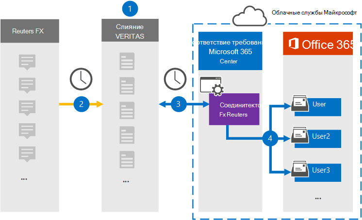

# Настройка соединитетеля для архива данных Reuters FX

Используйте соединитель Veritas в центре Microsoft 365 для импорта и архива данных с платформы Reuters FX в почтовые ящики пользователей в Microsoft 365 организации. Veritas предоставляет вам соединитель [Reuters FX,](https://globanet.com/reuters-fx/) который настроен для захвата элементов из стороннего источника данных (на регулярной основе), а затем импортировать эти элементы в Microsoft 365. Соединитатель преобразует валюты и курсы FX из учетной записи Reuters FX в формат сообщений электронной почты, а затем импортирует эти элементы в почтовый ящик пользователя в Microsoft 365.

После хранения данных Reuters FX в почтовых ящиках пользователей можно применить Microsoft 365, такие как хранение судебного разбирательства, электронные сведения, политики хранения и метки хранения, а также соответствие требованиям к связи. Использование соединиттеля Reuters FX для импорта и архива данных в Microsoft 365 может помочь вашей организации соблюдать государственные и нормативные политики.

## Обзор архива данных Reuters FX

В следующем обзоре объясняется процесс использования соединитетеля для архивации данных Reuters FX в Microsoft 365.

1. Ваша организация работает с агентством Reuters FX для настройки и настройки сайта Reuters FX.

2. Каждые 24 часа элементы Reuters FX копируется на сайте Veritas Merge1. Соединителет также преобразует элементы в формат сообщений электронной почты.

3. Соединитель Reuters FX, который вы создаете в центре Microsoft 365 соответствия требованиям, подключается к сайту Veritas Merge1 каждый день и передает содержимое в безопасное служба хранилища Azure в облаке Microsoft.

4. Соединитатель импортирует элементы в почтовые ящики определенных пользователей, используя значение свойства *Email* автоматического сопоставления пользователей, как описано в [шаге 3](#step-3-map-users-and-complete-the-connector-setup). В почтовых ящиках пользователей создается подмостка в папке "Входящие" с именем **Reuters FX,** и элементы импортируется в эту папку. Соединитатель определяет, в какой почтовый ящик импортировать элементы, используя значение свойства *Email.* Каждый элемент Reuters FX содержит это свойство, которое заполняется адресом электронной почты каждого участника элемента.

## Прежде чем начать

- Создайте учетную запись Veritas Merge1 для соединители Microsoft. Чтобы создать учетную запись, обратитесь [в службу поддержки клиентов Veritas.](https://globanet.com/contact-us) При создании соединитетеля в шаге 1 необходимо войти в эту учетную запись.

- Пользователю, который создает соединители Fx Reuters в шаге 1 (и завершает его в шаге 3), необходимо приступить к роли экспорта импорта почтовых ящиков в Exchange Online. Эта роль необходима для добавления соединители на **странице** соединители данных в центре Microsoft 365 соответствия требованиям. По умолчанию эта роль не назначена какой-либо группе ролей в Exchange Online. Вы можете добавить роль экспорта импорта почтовых ящиков в группу ролей управления организацией в Exchange Online. Или вы можете создать группу ролей, назначить роль экспортировать импорт почтовых ящиков, а затем добавить соответствующих пользователей в качестве участников. Дополнительные сведения см. в разделах [Создание](/Exchange/permissions-exo/role-groups#create-role-groups) групп ролей или [изменение](/Exchange/permissions-exo/role-groups#modify-role-groups) групп ролей в статье "Управление группами ролей в Exchange Online".

## Шаг 1. Настройка соединитетеля "Рейтер FX"

Первым шагом является доступ  к странице соединители данных в Microsoft 365 и создание соединитетеля для данных Reuters FX.

1. Перейдите к [https://compliance.microsoft.com](https://compliance.microsoft.com/) и нажмите **соединители данных** Reuters  >  **FX**.

2. На странице **описания продукта Reuters FX** нажмите **кнопку Добавить соединителю**.

3. На странице **Условия службы нажмите** кнопку **Принять**.

4. Введите уникальное имя, идентифицируемое соединитетелем, а затем нажмите **кнопку Далее**.

5. Вопишите в свою учетную запись Merge1, чтобы настроить соединители.

## Шаг 2. Настройка соединителя Fx Reuters на сайте Veritas Merge1

Второй шаг — настройка соединителя Reuters FX на сайте Veritas Merge1. Сведения о настройке соединиттеля Fx Reuters см. в руководстве по пользователю [Merge1 Third-Party Connectors.](https://docs.ms.merge1.globanetportal.com/Merge1%20Third-Party%20Connectors%20Reuters%20FX%20User%20Guide%20.pdf)

После нажатия **кнопки Сохранить &**  finish отображается страница сопоставления пользователей в мастере соединители в центре Microsoft 365 соответствия требованиям.

## Шаг 3. Карта пользователей и завершение установки соединитетеля

Чтобы составить карту пользователей и завершить установку соединитетеля в центре Microsoft 365 соответствия требованиям, выполните следующие действия:

1. На странице Map Reuters FX пользователи **Microsoft 365 пользователей,** включив автоматическое сопоставление пользователей.

   Элементы Reuters FX включают свойство *Email,* которое содержит адреса электронной почты для пользователей в вашей организации. Если соединитатель может связать этот адрес с Microsoft 365 пользователем, элементы импортируется в почтовый ящик этого пользователя.

2. Нажмите **кнопку Далее,** просмотрите  параметры и перейдите на страницу соединители данных, чтобы просмотреть ход процесса импорта нового соединитетеля.

## Шаг 4. Мониторинг соединитетеля Reuters FX

После создания соединитетеля "Рейтер FX" можно просмотреть состояние соединитетеля в центре Microsoft 365 соответствия требованиям.

1. Перейдите <https://compliance.microsoft.com/> и щелкните **соединители данных** в левом nav.

2. Щелкните **вкладку** Соединители, а затем выберите соединителет **Reuters FX,** чтобы отобразить страницу вылетов, которая содержит свойства и сведения о соединителе.

3. В **состоянии Соединитель с исходным кодом** щелкните ссылку **Журнал** загрузки, чтобы открыть (или сохранить) журнал состояния соединитетеля. В этом журнале содержатся данные, импортируемые в облако Майкрософт.

## Известные проблемы

- В настоящее время мы не поддерживаем импорт вложений или элементов размером более 10 МБ. Поддержка более крупных элементов будет доступна позднее.