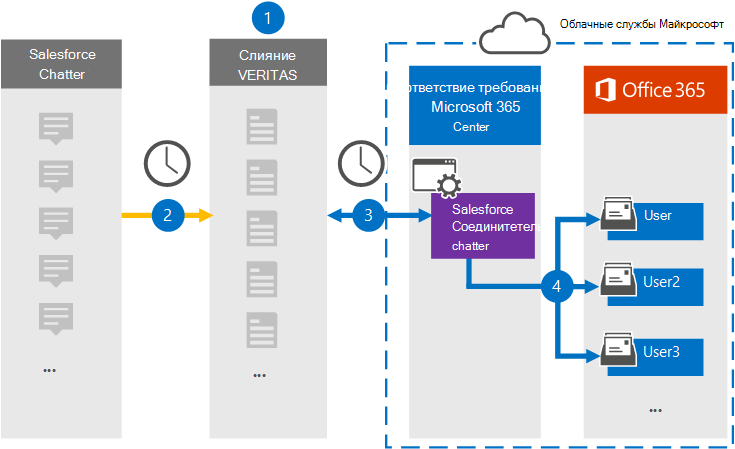

# Настройка соединитетеля для архивации данных chatter Salesforce

Используйте соединителик Globanet в центре соответствия требованиям Microsoft 365 для импорта и архивации данных с платформы Chatter Salesforce для почтовых ящиков пользователей в организации Microsoft 365. Globanet предоставляет [соединителик Chatter Salesforce,](http://globanet.com/chatter/) который захватывает элементы из стороннего источника данных и импортирует эти элементы в Microsoft 365. Соединитетель преобразует содержимое, например чаты, вложения и сообщения из чата Salesforce в формат сообщения электронной почты, а затем импортирует эти элементы в почтовый ящик пользователя в Microsoft 365.

После хранения данных о чате Salesforce в почтовых ящиках пользователей можно применить функции соответствия требованиям Microsoft 365, такие как хранение судебного разбирательства, электронные сведения, политики хранения и метки хранения. Использование соединиттеля чата Salesforce для импорта и архивации данных в Microsoft 365 может помочь вашей организации соблюдать государственные и нормативные политики.

## Обзор архивации данных о чате Salesforce

В следующем обзоре рассказывается о процессе использования соединитетеля для архивации данных chatter Salesforce в Microsoft 365.

1. Ваша организация работает с chatter Salesforce, чтобы настроить и настроить сайт Chatter Salesforce.

2. Раз в 24 часа элементы чата Salesforce копируется на сайт Globanet Merge1. Соединитетель также элементы Chatter Salesforce в формате сообщений электронной почты.

3. Соединителик Chatter Salesforce, который вы создаете в центре соответствия требованиям Microsoft 365, подключается к сайту Globanet Merge1 каждый день и передает содержимое Chatter в безопасное хранилище Azure в облаке Microsoft.

4. Соединитатель импортирует преобразованные элементы в почтовые ящики определенных пользователей, используя значение свойства *Email* автоматического сопоставления пользователей, как описано в [шаге 3](#step-3-map-users-and-complete-the-connector-setup). В почтовых ящиках пользователей создается подмостки в папке "Входящие" с именем **"Чат** с продажами", и элементы импортируют в эту папку. Соединитатель определяет, в какой почтовый ящик импортировать элементы, используя значение свойства *Email.* Каждый элемент Chatter содержит это свойство, которое заполняется адресом электронной почты каждого участника элемента.

## Подготовка

- Создание учетной записи Merge1 для соединители Microsoft. Чтобы создать учетную запись, обратитесь в службу поддержки клиентов [Globanet.](https://globanet.com/contact-us/) При создании соединитетеля в шаге 1 необходимо войти в эту учетную запись.

- Создайте приложение Salesforce и приобретйте маркер в [https://salesforce.com](https://salesforce.com) . Вам потребуется войти в учетную запись Salesforce в качестве администратора и получить личный маркер пользователя для импорта данных. Кроме того, триггеры должны быть опубликованы на сайте Chatter для захвата обновлений, удалений и изменений. Эти триггеры создадут сообщение на канале, а Merge1 будет захватывать информацию из канала. Инструкции по созданию приложения и приобретению маркера см. в руководстве по пользователю [Merge1 Third-Party Connectors.](https://docs.ms.merge1.globanetportal.com/Merge1%20Third-Party%20Connectors%20SalesForce%20Chatter%20User%20Guide%20.pdf)

- Пользователь, создавший соединитель чата Salesforce в шаге 1 (и завершавший его в шаге 3), должен быть назначен роли экспорта импорта почтовых ящиков в Exchange Online. Эта роль необходима для добавления соединители на странице **соединители** данных в центре соответствия требованиям Microsoft 365. По умолчанию эта роль не назначена какой-либо группе ролей в Exchange Online. Вы можете добавить роль экспорта импорта почтовых ящиков в группу ролей управления организацией в Exchange Online. Или вы можете создать группу ролей, назначить роль экспортировать импорт почтовых ящиков, а затем добавить соответствующих пользователей в качестве участников. Дополнительные сведения см. в разделах Создание групп [ролей](/Exchange/permissions-exo/role-groups#create-role-groups) или [изменение](/Exchange/permissions-exo/role-groups#modify-role-groups) групп ролей в статье "Управление группами ролей в Exchange Online".

## Шаг 1. Настройка соединиттеля чата Salesforce

Первым шагом является доступ к странице **Соединители** данных в центре соответствия требованиям Microsoft 365 и создание соединитетеля для данных Chatter.

1. Перейдите [https://compliance.microsoft.com](https://compliance.microsoft.com/) к и нажмите **кнопку Соединители данных**  >  **Salesforce Chatter**.

2. На странице **описания продукта Chatter Salesforce** нажмите **кнопку Добавить соединителю**.

3. На странице **Условия службы нажмите** кнопку **Принять**.

4. Введите уникальное имя, идентифицируемое соединитетелем, а затем нажмите **кнопку Далее**.

5. Впишитесь в свою учетную запись Merge1, чтобы настроить соединители.

## Шаг 2. Настройка чата Salesforce на сайте Globanet Merge1

Второй шаг — настройка соединители чата Salesforce на сайте Globanet Merge1. Сведения о настройке соединиттеля чата Salesforce см. в руководстве по пользователю Merge1 Сторонние [соединители.](https://docs.ms.merge1.globanetportal.com/Merge1%20Third-Party%20Connectors%20SalesForce%20Chatter%20User%20Guide%20.pdf)

После **нажатия кнопки Сохранить** &  finish отображается страница сопоставления пользователя в мастере соединители в центре соответствия требованиям Microsoft 365.

## Шаг 3. Карта пользователей и завершение установки соединитетеля

Чтобы составить карту пользователей и завершить установку соединитетеля в центре соответствия требованиям Microsoft 365, выполните следующие действия:

1. На странице **Map Salesforce Chatter для пользователей Microsoft 365** включаем автоматическое сопоставление пользователей. Элементы Chatter Salesforce включают свойство *Email,* которое содержит адреса электронной почты для пользователей в вашей организации. Если соединитатель может связать этот адрес с пользователем Microsoft 365, элементы импортируется в почтовый ящик этого пользователя.

2. Нажмите **кнопку Далее,** просмотрите параметры, а затем перейдите на страницу соединители данных, чтобы просмотреть ход процесса импорта для нового соединитетеля. 

## Шаг 4. Мониторинг соединиттеля чата Salesforce

После создания соединиттеля chatter Salesforce можно просмотреть состояние соединитетеля в центре соответствия требованиям Microsoft 365.

1. Перейдите [https://compliance.microsoft.com](https://compliance.microsoft.com/) и щелкните **соединители данных** в левом nav.

2. щелкните  вкладку Соединители, а затем щелкните соединителет **Chatter Salesforce,** чтобы отобразить страницу вылетов, которая содержит свойства и сведения о соединителе.

3. В **состоянии Соединитель с исходным кодом** щелкните ссылку **Журнал** загрузки, чтобы открыть (или сохранить) журнал состояния соединитетеля. В этом журнале содержатся данные, импортируемые в облако Майкрософт.

## Известные проблемы

- В настоящее время мы не поддерживаем импорт вложений или элементов размером более 10 МБ. Поддержка более крупных элементов будет доступна позднее.