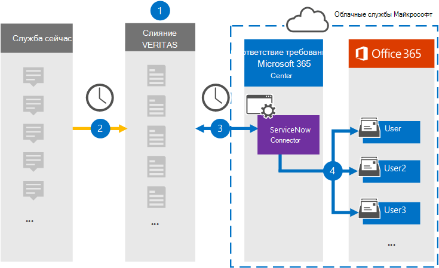

# Настройка соединитетеля для архива данных ServiceNow

Используйте соединитель Veritas в центре соответствия требованиям Microsoft 365 для импорта и архива данных с платформы ServiceNow в почтовые ящики пользователей в организации Microsoft 365. Veritas предоставляет [соединитель ServiceNow,](https://globanet.com/servicenow/) который захватывает элементы из стороннего источника данных и импортирует эти элементы в Microsoft 365. Соединитатель преобразует содержимое, например живые сообщения, вложения и сообщения из ServiceNow в формат сообщений электронной почты, а затем импортирует эти элементы в почтовые ящики пользователей в Microsoft 365.

После хранения данных ServiceNow в почтовых ящиках пользователей можно применить функции соответствия требованиям Microsoft 365, такие как хранение судебного разбирательства, открытие электронных данных, политики хранения и метки хранения. Использование соединиттеля ServiceNow для импорта и архива данных в Microsoft 365 может помочь вашей организации соблюдать государственные и нормативные политики.

## Обзор архива данных ServiceNow

В следующем обзоре рассказывается о процессе использования соединитетеля для архивации данных ServiceNow в Microsoft 365.

1. Организация работает с ServiceNow для настройки и настройки сайта ServiceNow.

2. Каждые 24 часа элементы ServiceNow копируется на сайте Veritas Merge1. Соединителет также преобразует элементы ServiceNow в формат сообщений электронной почты.

3. Соединитель ServiceNow, который вы создаете в центре соответствия требованиям Microsoft 365, ежедневно подключается к сайту Veritas Merge1 и передает содержимое ServiceNow в безопасное хранилище Azure в облаке Microsoft.

4. Соединитатель импортирует преобразованные элементы в почтовые ящики определенных пользователей, используя значение свойства *Email* автоматического сопоставления пользователей, как описано в [шаге 3](#step-3-map-users-and-complete-the-connector-setup). Подмостки в папке "Входящие" с именем **ServiceNow** создаются в почтовых ящиках пользователей, и элементы импортируется в эту папку. Соединитатель определяет, в какой почтовый ящик импортировать элементы, используя значение свойства *Email.* Каждый элемент ServiceNow содержит это свойство, которое заполняется адресом электронной почты каждого участника элемента.

## Прежде чем начать

- Создание учетной записи Merge1 для соединители Microsoft. Чтобы создать учетную запись, обратитесь [в службу поддержки клиентов Veritas.](https://www.veritas.com/content/support/) При создании соединитетеля в шаге 1 необходимо войти в эту учетную запись.

- Создайте приложение ServiceNow для получения данных из учетной записи ServiceNow. Инструкции по пошаговой инструкции по созданию приложения см. в руководстве по пользователю [Merge1 Third-Party Connectors.](https://docs.ms.merge1.globanetportal.com/Merge1%20Third-Party%20Connectors%20ServiceNow%20User%20Guide%20.pdf)

- Пользователь, создавший соединитель ServiceNow в шаге 1 (и завершивший его в шаге 3), должен быть назначен роли экспорта импорта почтовых ящиков в Exchange Online. Эта роль необходима для добавления соединители на странице **соединители** данных в центре соответствия требованиям Microsoft 365. По умолчанию эта роль не назначена ни одной группе ролей в Exchange Online. Вы можете добавить роль экспорта импорта почтовых ящиков в группу ролей управления организацией в Exchange Online. Или вы можете создать группу ролей, назначить роль экспортировать импорт почтовых ящиков, а затем добавить соответствующих пользователей в качестве участников. Дополнительные сведения см. в разделах Создание групп [ролей](/Exchange/permissions-exo/role-groups#create-role-groups) или [изменение](/Exchange/permissions-exo/role-groups#modify-role-groups) групп ролей в статье "Управление группами ролей в Exchange Online".

## Шаг 1. Настройка соединиттеля ServiceNow

Первым шагом является доступ к странице **Соединители** данных в центре соответствия требованиям Microsoft 365 и создание соединитетеля для данных ServiceNow.

1. Перейдите [https://compliance.microsoft.com](https://compliance.microsoft.com/) к и нажмите **кнопку Соединители данных**  >  **ServiceNow**.

2. На странице **описание продукта ServiceNow** нажмите кнопку **Добавить соединителю**.

3. На странице **Условия службы нажмите** кнопку **Принять**.

4. Введите уникальное имя, идентифицируемое соединитетелем, а затем нажмите **кнопку Далее**.

5. Впишитесь в свою учетную запись Merge1, чтобы настроить соединители.

## Шаг 2. Настройка ServiceNow на сайте Veritas Merge1

Второй шаг — настройка соединителя ServiceNow на сайте Veritas Merge1. Сведения о настройке соединиттеля ServiceNow см. в руководстве по пользователю [Merge1 Third-Party Connectors.](https://docs.ms.merge1.globanetportal.com/Merge1%20Third-Party%20Connectors%20ServiceNow%20User%20Guide%20.pdf)

После **нажатия кнопки Сохранить** &  finish отображается страница сопоставления пользователя в мастере соединители в центре соответствия требованиям Microsoft 365.

## Шаг 3. Карта пользователей и завершение установки соединитетеля

Чтобы составить карту пользователей и завершить установку соединитетеля в центре соответствия требованиям Microsoft 365, выполните следующие действия:

1. На странице **Map ServiceNow для пользователей Microsoft 365** включаем автоматическое сопоставление пользователей. Элементы ServiceNow включают свойство *Email,* которое содержит адреса электронной почты для пользователей в организации. Если соединитатель может связать этот адрес с пользователем Microsoft 365, элементы импортируется в почтовый ящик этого пользователя.

2. Нажмите **кнопку Далее,** просмотрите параметры и перейдите на страницу соединители данных, чтобы просмотреть ход процесса импорта для нового соединитетеля. 

## Шаг 4. Мониторинг соединиттеля ServiceNow

После создания соединитетеля ServiceNow можно просмотреть состояние соединитетеля в центре соответствия требованиям Microsoft 365.

1. Перейдите [https://compliance.microsoft.com](https://compliance.microsoft.com/) и щелкните **соединители данных** в левом nav.

2. Щелкните **вкладку** Соединители, а затем выберите соединителет **ServiceNow,** чтобы отобразить страницу вылетов, которая содержит свойства и сведения о соединителе.

3. В **состоянии Соединитель с исходным кодом** щелкните ссылку **Журнал** загрузки, чтобы открыть (или сохранить) журнал состояния соединитетеля. В этом журнале содержатся данные, импортируемые в облако Майкрософт.

## Известные проблемы

- В настоящее время мы не поддерживаем импорт вложений или элементов размером более 10 МБ. Поддержка более крупных элементов будет доступна позднее.