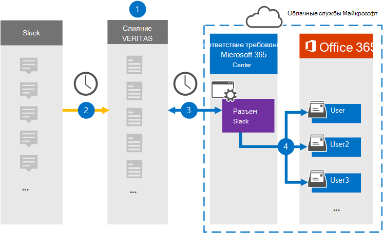

# Настройка соединитела для архива данных об обнаружении электронных данных Slack

Используйте соединиталь Globanet в Центре соответствия требованиям Microsoft 365 для импорта и архивации сторонних данных из социальных сетей, мгновенных сообщений и платформ для совместной работы с документами в почтовые ящики в организации Microsoft 365. Globanet предоставляет соединители [Slack,](https://globanet.com/slack/) настроенные для записи элементов из стороннего источника данных (на регулярной основе), а затем импортировать их в Microsoft 365. Slack извлекает сообщения и файлы из API Slack и преобразует их в формат сообщений электронной почты, а затем импортирует элемент в почтовые ящики пользователей.

После сохранения данных об обнаружении электронных данных Slack в почтовых ящиках пользователей вы можете применить такие функции соответствия Требованиям Microsoft 365, как хранение для судебного разбирательства, eDiscovery, политики хранения и метки хранения, а также соответствие коммуникации. Использование соединители Slack для импорта и архива данных в Microsoft 365 может помочь вашей организации соблюдать правительственные и нормативные политики.

## Обзор архивных данных об обнаружении электронных данных Slack

В следующем обзоре объясняется процесс использования соединители для архивации данных Slack в Microsoft 365.

1. Ваша организация работает с Slack для настройки сайта Slack.

2. Каждые 24 часа сообщения чата из slack eDiscovery копируется на сайт Globanet Merge1. Соединителет также преобразует содержимое сообщения чата в формат сообщения электронной почты.

3. Соединитец Slack eDiscovery, который вы создаете в Центре соответствия требованиям Microsoft 365, каждый день подключается к сайту Globanet Merge1 и передает сообщения чата в безопасное хранилище Azure в облаке Майкрософт.

4. Соединиталь импортирует преобразованные элементы сообщения чата в почтовые ящики определенных пользователей, используя значение свойства *"Электронная* почта" и автоматическое сопоставление пользователей, как описано в шаге 3. Новая вложенная папка в папке "Входящие" с именем **Slack eDiscovery** создается в почтовых ящиках пользователей, и элементы сообщения чата импортируется в эту папку. Соединиталь определяет, в какой почтовый ящик импортировать элементы, используя значение свойства *Email.* Каждое сообщение чата содержит это свойство, которое заполняется адресом электронной почты каждого участника сообщения чата.

## Прежде чем начать

- Создайте учетную запись Globanet Merge1 для соединители Майкрософт. Чтобы создать учетную запись, обратитесь в службу поддержки клиентов [Globanet.](https://globanet.com/ms-connectors-contact) Вход в эту учетную запись будет происходить при создании соединители на шаге 1.

- Получите имя пользователя и пароль для корпоративной учетной записи Slack вашей организации. При настройке Slack вам потребуется войти в эту учетную запись в шаге 2.

- Пользователь, создавший соединитель Slack eDiscovery на шаге 1 (и завершивший его на шаге 3), должен быть назначен роли импорта и экспорта почтовых ящиков в Exchange Online. Эта роль необходима для добавления соединителю на странице **"Соединители** данных" в Центре соответствия требованиям Microsoft 365. По умолчанию эта роль не назначена группе ролей в Exchange Online. Вы можете добавить роль "Импорт и экспорт почтового ящика" в группу ролей "Управление организацией" в Exchange Online. Можно также создать группу ролей, назначить роль "Импорт и экспорт почтового ящика" и добавить соответствующих пользователей в качестве участников. Дополнительные сведения см. в  разделах ["Создание](https://docs.microsoft.com/Exchange/permissions-exo/role-groups#create-role-groups) групп ролей" или "Изменение групп ролей" статьи "Управление группами ролей в Exchange Online".

## Шаг 1. Настройка соединители slack eDiscovery

Первым шагом является доступ к странице **"Соединители** данных" в Центре соответствия требованиям Microsoft 365 и создание соединители для данных Slack.

1. Go to [https://compliance.microsoft.com](https://compliance.microsoft.com/) and then click Data **connectors**  >  **Slack eDiscovery**.

2. На странице **описания продукта slack eDiscovery** нажмите кнопку **"Добавить соединителю".**

3. На странице **"Условия обслуживания" нажмите** кнопку **"Принять".**

4. Введите уникальное имя, идентифицируя соединители, и нажмите кнопку **"Далее".**

5. Во sign in to your Merge1 account to configure the connector.

## Шаг 2. Настройка eDiscovery в Slack

На втором этапе необходимо настроить соединители slack eDiscovery на сайте Merge1. Дополнительные сведения о настройке соединители Slack eDiscovery на сайте Globanet Merge1 см. в руководстве пользователя [Merge1 Third-Party Connectors.](https://docs.ms.merge1.globanetportal.com/Merge1%20Third-Party%20Connectors%20Slack%20eDiscovery%20User%20Guide.pdf)

После нажатия кнопки  **"Сохранить & Готово"** отображается страница сопоставления пользователей в мастере соединители в Центре соответствия требованиям Microsoft 365.

## Шаг 3. Соединяем пользователей и завершаем настройку соединители

1. На странице **"Сопоставление внешних пользователей с пользователями Microsoft 365"** включите автоматическое сопоставление пользователей.

   Элементы eDiscovery Slack включают свойство *Email,* которое содержит адреса электронной почты для пользователей в организации. Если соединители могут связать этот адрес с пользователем Microsoft 365, элементы будут импортироваться в почтовый ящик этого пользователя.

2. Нажмите **кнопку "Далее",** просмотрите параметры и перейдите на страницу "Соединители данных", чтобы просмотреть ход процесса импорта нового соединитела. 

## Шаг 4. Отслеживание соединители slack eDiscovery

После создания соединители slack eDiscovery можно просмотреть состояние соединитела в Центре соответствия требованиям Microsoft 365.

1. Go to [https://compliance.microsoft.com](https://compliance.microsoft.com) and click **Data connectors** in the left nav.

2. Перейдите **на вкладку** "Соединители", а затем выберите соединители **Slack eDiscovery,** чтобы отобразить эту страницу. На этой странице содержатся свойства и сведения о соединители.

3. В **состоянии соединители с источником** щелкните ссылку журнала загрузки, чтобы открыть (или сохранить) журнал состояния для соединитела.  Этот журнал содержит сведения о данных, импортируемых в облако Майкрософт.

## Известные проблемы

- В настоящее время мы не поддерживаем импорт вложений или элементов размером более 10 МБ. Поддержка более крупных элементов будет доступна позже.
