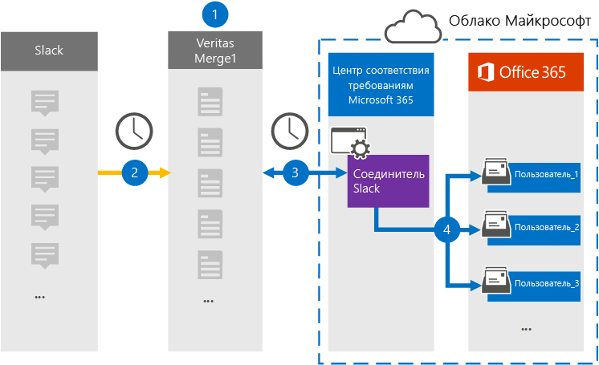

# Настройка соединитетеля для архива данных об обнаружении электронных данных Slack

Используйте соединитель Veritas в центре соответствия требованиям Microsoft 365 для импорта и архивации сторонних данных из социальных сетей, платформ обмена мгновенными сообщениями и документов для почтовых ящиков в организации Microsoft 365. Veritas предоставляет соединитель [Slack,](https://globanet.com/slack/) настроенный для захвата элементов из стороннего источника данных (на регулярной основе), а затем импорта этих элементов в Microsoft 365. Slack извлекает сообщения и файлы из API Slack и преобразует их в формат сообщений электронной почты, а затем импортирует элемент в почтовые ящики пользователей.

После хранения данных об обнаружении slack в почтовых ящиках пользователей можно применить функции соответствия требованиям Microsoft 365, такие как хранение судебного разбирательства, открытие электронных данных, политики хранения и метки хранения, а также соответствие требованиям к связи. Использование соединиттеля Slack для импорта и архива данных в Microsoft 365 может помочь вашей организации соблюдать государственные и нормативные политики.

## Обзор архивных данных slack eDiscovery

В следующем обзоре рассказывается о процессе использования соединитетеля для архивации данных Slack в Microsoft 365.

1. Ваша организация работает с Slack для настройки и настройки сайта Slack.

2. Каждые 24 часа сообщения чата из slack eDiscovery копируется на сайте Veritas Merge1. Соединителет также преобразует содержимое сообщения чата в формат сообщения электронной почты.

3. Соединитель slack eDiscovery, который создается в центре соответствия требованиям Microsoft 365, ежедневно подключается к сайту Veritas Merge1 и передает сообщения чата в безопасное хранилище Azure в облаке Microsoft.

4. Соединитатель импортирует преобразованные элементы сообщения чата в почтовые ящики определенных пользователей, используя значение свойства *Email* и автоматическое сопоставление пользователей, как описано в шаге 3. В почтовых ящиках пользователя создается новый поддвое в папке "Входящие" с именем **Slack eDiscovery,** и элементы сообщений чата импортируется в эту папку. Соединитатель определяет, в какой почтовый ящик импортировать элементы, используя значение свойства *Email.* Каждое сообщение чата содержит это свойство, которое заполняется адресом электронной почты каждого участника сообщения чата.

## Прежде чем начать

- Создайте учетную запись Veritas Merge1 для соединители Microsoft. Чтобы создать учетную запись, обратитесь [в службу поддержки клиентов Veritas.](https://globanet.com/ms-connectors-contact) При создании соединитетеля в шаге 1 вы вопишитесь в эту учетную запись.

- Получение имени пользователя и пароля для корпоративной учетной записи Slack организации. При настройке Slack необходимо войти в эту учетную запись в шаге 2.

- Пользователь, создавший соединитель slack eDiscovery в шаге 1 (и завершавший его в шаге 3), должен быть назначен роли экспорта импорта почтовых ящиков в Exchange Online. Эта роль необходима для добавления соединители на странице **соединители** данных в центре соответствия требованиям Microsoft 365. По умолчанию эта роль не назначена группе ролей в Exchange Online. Вы можете добавить роль экспорта импорта почтовых ящиков в группу ролей управления организацией в Exchange Online. Или вы можете создать группу ролей, назначить роль экспортировать импорт почтовых ящиков, а затем добавить соответствующих пользователей в качестве участников. Дополнительные сведения см. в разделах Создание групп [ролей](/Exchange/permissions-exo/role-groups#create-role-groups) или [изменение](/Exchange/permissions-exo/role-groups#modify-role-groups) групп ролей в статье "Управление группами ролей в Exchange Online".

## Шаг 1. Настройка соединитетеля slack eDiscovery

Первым шагом является доступ к странице **Соединители** данных в центре соответствия требованиям Microsoft 365 и создание соединитетеля для данных Slack.

1. Перейдите к соединитетелям данных и нажмите [https://compliance.microsoft.com](https://compliance.microsoft.com/)   >  **кнопку Slack eDiscovery**.

2. На странице **Описание продукта Slack eDiscovery** нажмите **кнопку Добавить соединителю**.

3. На странице **Условия службы нажмите** кнопку **Принять**.

4. Введите уникальное имя, идентифицируемое соединитетелем, а затем нажмите **кнопку Далее**.

5. Впишитесь в свою учетную запись Merge1, чтобы настроить соединители.

## Шаг 2. Настройка раскрываемой электронной почты Slack

Второй шаг — настройка соединители slack eDiscovery на сайте Merge1. Дополнительные сведения о настройке соединителя slack eDiscovery на сайте Veritas Merge1 см. в руководстве по пользователю [Merge1](https://docs.ms.merge1.globanetportal.com/Merge1%20Third-Party%20Connectors%20Slack%20eDiscovery%20User%20Guide.pdf)Сторонние соединители.

После **нажатия кнопки Сохранить &**  finish отображается страница сопоставления пользователей в мастере соединители в центре соответствия требованиям Microsoft 365.

## Шаг 3. Карта пользователей и завершение установки соединитетеля

1. На странице **"Карта внешних пользователей в Microsoft 365"** включаем автоматическое сопоставление пользователей.

   Элементы slack eDiscovery включают свойство *Email,* которое содержит адреса электронной почты для пользователей в вашей организации. Если соединитатель может связать этот адрес с пользователем Microsoft 365, элементы импортируется в почтовый ящик этого пользователя.

2. Нажмите **кнопку Далее,** просмотрите  параметры и перейдите на страницу соединители данных, чтобы просмотреть ход процесса импорта нового соединитетеля.

## Шаг 4. Мониторинг соединиттеля slack для электронных обнаружений

После создания соединиттеля slack eDiscovery можно просмотреть состояние соединитетеля в центре соответствия требованиям Microsoft 365.

1. Перейдите [https://compliance.microsoft.com](https://compliance.microsoft.com) и щелкните **соединители данных** в левом nav.

2. Щелкните **вкладку** Соединители, а затем выберите **соединителет Slack eDiscovery,** чтобы отобразить страницу вылетов. На этой странице содержатся свойства и сведения о соединители.

3. В **состоянии Соединитель с исходным кодом** щелкните ссылку **Журнал** загрузки, чтобы открыть (или сохранить) журнал состояния соединитетеля. В этом журнале содержатся сведения о данных, импортируемых в облако Майкрософт.

## Известные проблемы

- В настоящее время мы не поддерживаем импорт вложений или элементов размером более 10 МБ. Поддержка более крупных элементов будет доступна позднее.