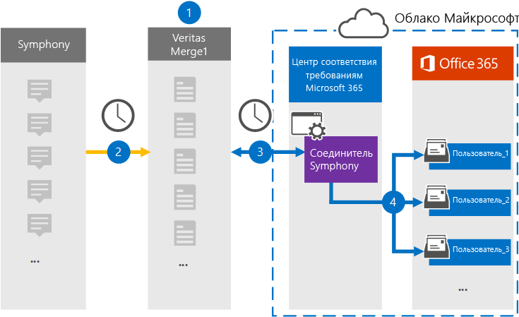

# Настройка соединителя для архивации данных СимфониSet up a connector to archive Symphony data

Используйте соединитель Глобанет в центре соответствия требованиям Microsoft 365 для импорта и архивации данных Симфони в почтовые ящики пользователей в организации Microsoft 365.Use a Globanet connector in the Microsoft 365 compliance center to import and archive Symphony data to user mailboxes in your Microsoft 365 organization. Симфони — это платформа для обмена сообщениями и совместной работы, используемая в отрасли финансовых служб.Symphony is a messaging and collaboration platform used in the financial services industry. Глобанет предоставляет [соединитель данных Симфони](https://globanet.com/symphony) в центре соответствия требованиям Microsoft 365, который можно настроить для сбора элементов из стороннего источника данных (на регулярной основе), а затем импортировать эти элементы в почтовые ящики пользователей.Globanet provides a [Symphony data connector](https://globanet.com/symphony) in the Microsoft 365 compliance center that you can configured to capture items from the third-party data source (on a regular basis) and then import those items to user mailboxes. Соединитель преобразует содержимое элемента из учетной записи Симфони в формат сообщений электронной почты, а затем импортирует его в почтовый ящик в Microsoft 365.The connector converts the content of an item from the Symphony account to an email message format and then imports the item to a mailbox in Microsoft 365.

После того как Симфони связь будет храниться в почтовых ящиках пользователей, можно применить функции соответствия требованиям Microsoft 365, такие как хранение для судебного разбирательства, обнаружение электронных данных, политики хранения и метки хранения, а также соответствие требованиямAfter Symphony communications are stored in user mailboxes, you can apply Microsoft 365 compliance features such as Litigation Hold, eDiscovery, retention policies and retention labels, and communication compliance. Использование соединителя Симфони для импорта и архивирования данных в Microsoft 365 может помочь организации соответствовать государственным и нормативным политикам.Using a Symphony connector to import and archive data in Microsoft 365 can help your organization stay compliant with government and regulatory policies.

## Обзор архивации данных СимфониOverview of archiving Symphony data

В следующем обзоре описывается процесс использования соединителя данных для архивации Симфони связи в Microsoft 365.The following overview explains the process of using a data connector to archive Symphony communications in Microsoft 365.

1. Ваша организация работает с Симфони, чтобы установить и настроить сайт Симфони.Your organization works with Symphony to set up and configure a Symphony site.

2. Через каждые 24 часа сообщения чата из Симфони копируются на сайт Глобанет Merge1.Once every 24 hours, chat messages from Symphony are copied to the Globanet Merge1 site. Соединитель также Преобразовывает содержимое сообщения чата в формат сообщения электронной почты.The connector also converts the content of a chat message to an email message format.

3. Соединитель Симфони, который вы создаете в центре соответствия требованиям Microsoft 365, подключается к сайту Глобанет Merge1 каждый день и передает сообщения в безопасное место хранения данных Azure в облаке Майкрософт.The Symphony connector that you create in the Microsoft 365 compliance center, connects to the Globanet Merge1 site every day and transfers the messages to a secure Azure Storage location in the Microsoft cloud.

4. Соединитель импортирует преобразованные элементы сообщений в почтовые ящики определенных пользователей, используя значение свойства *Email* для автоматического сопоставления пользователей, как описано в шаге 3.The connector imports the converted message items to the mailboxes of specific users using the value of the *Email* property of the automatic user mapping as described in Step 3. Новая вложенная папка в папке "Входящие" с именем **Симфони** создается в почтовых ящиках пользователей, а элементы сообщения импортируются в эту папку.A new subfolder in the Inbox folder named **Symphony** is created in the user mailboxes, and the message items are imported to that folder. Соединитель выполняет это, используя значение свойства *Email* .The connector does this by using the value of the *Email* property. Каждое сообщение разговора содержит это свойство, которое заполняется адресом электронной почты каждого участника сообщения разговора.Every chat message contains this property, which is populated with the email address of every participant of the chat message.

## Прежде чем начатьBefore you begin

- Создайте учетную запись Глобанет Merge1 для соединителей Майкрософт.Create a Globanet Merge1 account for Microsoft connectors. Для этого обратитесь в [службу поддержки клиентов глобанет](https://globanet.com/ms-connectors-contact).To do this, contact [Globanet Customer Support](https://globanet.com/ms-connectors-contact). Вы должны войти в эту учетную запись, когда вы создадите соединитель на шаге 1.You need to sign into this account when you create the connector in Step 1.

- Пользователь, создающий соединитель Симфони в действии 1 (и завершающий его на шаге 3), должен быть назначен роли импорта и экспорта почтовых ящиков в Exchange Online.The user who creates the Symphony connector in Step 1 (and completes it in Step 3) must be assigned to the Mailbox Import Export role in Exchange Online. Эта роль необходима для добавления соединителей на странице " **соединители данных** " в центре соответствия требованиям Microsoft 365.This role is required to add connectors on the **Data connectors** page in the Microsoft 365 compliance center. По умолчанию эта роль не назначена ни одной группе ролей в Exchange Online.By default, this role is not assigned to any role group in Exchange Online. Вы можете добавить роль экспорта для импорта почтовых ящиков в группу ролей Управление организацией в Exchange Online.You can add the Mailbox Import Export role to the Organization Management role group in Exchange Online. Вы также можете создать группу ролей, назначить роль импорта для импорта почтовых ящиков, а затем добавить соответствующих пользователей в качестве участников.Or you can create a role group, assign the Mailbox Import Export role, and then add the appropriate users as members. Для получения дополнительных сведений обратитесь к разделу [Создание](https://docs.microsoft.com/Exchange/permissions-exo/role-groups#create-role-groups) групп ролей или [изменение групп ролей](https://docs.microsoft.com/Exchange/permissions-exo/role-groups#modify-role-groups) статьи "Управление группами ролей в Exchange Online".For more information, see the [Create role groups](https://docs.microsoft.com/Exchange/permissions-exo/role-groups#create-role-groups) or [Modify role groups](https://docs.microsoft.com/Exchange/permissions-exo/role-groups#modify-role-groups) sections in the article "Manage role groups in Exchange Online".

## Шаг 1: Настройка соединителя СимфониStep 1: Set up the Symphony connector

Первый шаг — доступ к странице " **соединители данных** " в центре соответствия требованиям Microsoft 365 и создание соединителя для данных Симфони.The first step is to access to the **Data Connectors** page in the Microsoft 365 compliance center and create a connector for Symphony data.

1. Перейдите к [https://compliance.microsoft.com](https://compliance.microsoft.com/) пункту **соединители данных**  >  **Симфони**.Go to [https://compliance.microsoft.com](https://compliance.microsoft.com/) and then click **Data connectors** > **Symphony**.

2. На странице "Описание продукта **Симфони** " нажмите кнопку **Добавить соединитель**.On the **Symphony** product description page, click **Add connector**.

3. На странице **условия обслуживания** нажмите кнопку **принять**.On the **Terms of service** page, click **Accept**.

4. Введите уникальное имя, идентифицирующее соединитель, а затем нажмите кнопку **Далее**.Enter a unique name that identifies the connector, and then click **Next**.

5. Войдите в свою учетную запись Merge1, чтобы настроить соединитель.Sign in to your Merge1 account to configure the connector.

## Настройка соединителя Симфони на сайте Глобанет Merge1Configure the Symphony connector on the Globanet Merge1 site

Второй шаг — настройка соединителя Симфони на сайте Merge1.The second step is to configure the Symphony connector on the Merge1 site. Сведения о настройке соединителя Симфони на сайте Глобанет Merge1 можно найти в [руководстве пользователя Merge1 Connectors](https://docs.ms.merge1.globanetportal.com/Merge1%20Third-Party%20Connectors%20Symphony%20User%20Guide%20.pdf).For information about configuring  the Symphony connector on the Globanet Merge1 site, see [Merge1 Third-Party Connectors User Guide](https://docs.ms.merge1.globanetportal.com/Merge1%20Third-Party%20Connectors%20Symphony%20User%20Guide%20.pdf).

После нажатия кнопки **сохранить & готово**вы вернетесь в центр соответствия требованиям Microsoft 365 на страницу **сопоставления пользователей** в мастере соединителей.After you click **Save & Finish**, you are returned to the Microsoft 365 compliance center, to the **User mapping** page of the connector wizard.

## Шаг 3: сопоставление пользователей и завершение установки соединителяStep 3: Map users and complete the connector setup

Чтобы сопоставить пользователей и завершить настройку соединителя в центре соответствия требованиям Microsoft 365, выполните указанные ниже действия.To map users and complete the connector setup in the Microsoft 365 compliance center, follow these steps:

1. На странице " **сопоставление внешних пользователей с Microsoft 365 пользователей** " Включите автоматическое сопоставление пользователей.On the **Map external users to Microsoft 365 users** page, enable automatic user mapping. Элементы Симфони включают в себя свойство *Email*, которое содержит адреса электронной почты для пользователей в Организации.The Symphony items include a property called *Email*, which contains email addresses for users in your organization. Если соединитель может сопоставить этот адрес с пользователем Microsoft 365, элементы будут импортированы в почтовый ящик этого пользователя.If the connector can associate this address with a Microsoft 365 user, the items are imported to that user’s mailbox.

2. На странице **"согласие администратора** " щелкните **предоставить согласие**.On the **Admin Consent** page, click **Provide Consent**. Вы будете перенаправлены на сайт Майкрософт.You will be redirected to the Microsoft site. Нажмите кнопку **принять** , чтобы предоставить согласие.Click **Accept** to provide the consent.

   Ваша организация должна разрешить службе импорта Office 365 доступ к данным почтовых ящиков в Организации.Your organization must consent to allow the Office 365 Import service to access mailbox data in your organization. Чтобы предоставить согласие администратора, необходимо войти в систему, используя учетные данные глобального администратора Microsoft 365, а затем принять запрос согласия.To provide admin consent, you must be signed in with the credentials of a Microsoft 365 global admin, and then accept the consent request. Если вы не вошли в систему как глобальный администратор, вы можете перейти на [эту страницу](https://login.microsoftonline.com/common/oauth2/authorize?client_id=570d0bec-d001-4c4e-985e-3ab17fdc3073&response_type=code&redirect_uri=https://portal.azure.com/&nonce=1234&prompt=admin_consent) и войти в систему, используя учетные данные глобального администратора, чтобы принять запрос.If you aren't signed in as a global admin, you can go to [this page](https://login.microsoftonline.com/common/oauth2/authorize?client_id=570d0bec-d001-4c4e-985e-3ab17fdc3073&response_type=code&redirect_uri=https://portal.azure.com/&nonce=1234&prompt=admin_consent) and sign in using global admin credentials to accept the request.

3. Нажмите кнопку **Далее**, проверьте параметры, а затем перейдите на страницу " **соединители данных** ", чтобы просмотреть ход процесса импорта для нового соединителя.Click **Next**, review your settings, and then go to the **Data connectors** page to see the progress of the import process for the new connector.

## Шаг 4: мониторинг соединителя СимфониStep 4: Monitor the Symphony connector

После создания соединителя Симфони можно просмотреть состояние соединителя в центре соответствия требованиям Microsoft 365.After you create the Symphony connector, you can view the connector status in the Microsoft 365 compliance center.

1. Перейдите к разделу [https://compliance.microsoft.com](https://compliance.microsoft.com) **соединители данных** в левой панели навигации и нажмите кнопку соединители данных.Go to [https://compliance.microsoft.com](https://compliance.microsoft.com) and click **Data connectors** in the left nav.

2. Перейдите на вкладку **соединители** и выберите соединитель **Симфони** , чтобы отобразить раскрывающуюся страницу, содержащую свойства и сведения о соединителе.Click the **Connectors** tab and then select the **Symphony** connector to display the flyout page, which contains the properties and information about the connector.

3. В разделе **состояние соединителя с источником**выберите ссылку **журнал загрузки** , чтобы открыть (или сохранить) журнал состояний для соединителя.Under **Connector status with source**, click the **Download log** link to open (or save) the status log for the connector. Этот журнал содержит сведения о данных, импортированных в Microsoft Cloud.This log contains information about the data that has been imported to the Microsoft cloud.

## Известные проблемыKnown issues

- В настоящее время импорт вложений или элементов, размер которых превышает 10 МБ, не поддерживается.At this time, we don't support importing attachments or items that are larger than 10 MB. Поддержка элементов с большим сроком действия будет доступна позже.Support for larger items will be available at a later date.
