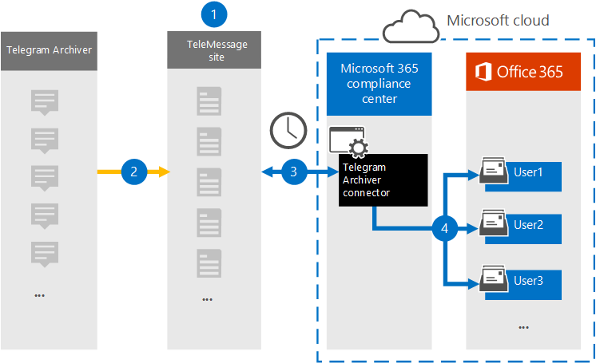

# Настройка соединитетеля для архива данных связи TelegramSet up a connector to archive Telegram communications data

Используйте соединители TeleMessage в Центр соответствия требованиям Microsoft 365 для импорта и архива чатов, вложений, файлов и удаленных сообщений и вызовов.Use the TeleMessage connector in the Microsoft 365 compliance center to import and archive Telegram chats, attachments, files, and deleted messages and calls. После настройки соединители он подключается к учетной записи TeleMessage вашей организации и импортирует мобильную связь сотрудников с помощью архива Telegram в почтовые ящики в Microsoft 365.After you set up and configure a connector, it connects to your organization's TeleMessage account, and imports the mobile communication of employees using the Telegram Archiver to mailboxes in Microsoft 365.

После хранения данных соединиттеля архива Telegram в почтовых ящиках пользователей к данным связи Telegram можно применить Microsoft 365 таких функций соответствия требованиям, как хранение судебного разбирательства, поиск контента и Microsoft 365 хранения.After Telegram Archiver connector data is stored in user mailboxes, you can apply Microsoft 365 compliance features such as Litigation Hold, Content search, and Microsoft 365 retention policies to Telegram communication data. Например, вы можете искать сообщения Telegram с помощью поиска контента или связывать почтовый ящик, содержащий данные соединителя архива Telegram, с хранителями в Advanced eDiscovery случае.For example, you can search Telegram communication using Content Search or associate the mailbox that contains the Telegram Archiver connector data with a custodian in an Advanced eDiscovery case. Использование соединиттеля архива Telegram для импорта и архива данных в Microsoft 365 может помочь вашей организации соблюдать правила корпоративного управления и нормативные политики.Using a Telegram Archiver connector to import and archive data in Microsoft 365 can help your organization stay compliant with corporate governance regulations and regulatory policies.

## Обзор архива данных связи TelegramOverview of archiving Telegram communications data

В следующем обзоре рассказывается о процессе использования соединитетеля для архивации данных связи Telegram в Microsoft 365.The following overview explains the process of using a connector to archive  Telegram communications data in Microsoft 365.

1. Ваша организация работает с TeleMessage, чтобы настроить соединители архиватора Telegram.Your organization works with TeleMessage to set up a Telegram Archiver connector. Дополнительные сведения см. в [странице Активация архива teleMessage Telegram для Microsoft 365](https://www.telemessage.com/microsoft-365-activation-for-telegram-archiver/).For more information, see [Activating the TeleMessage Telegram Archiver for Microsoft 365](https://www.telemessage.com/microsoft-365-activation-for-telegram-archiver/).

2. В режиме реального времени данные Telegram вашей организации копируется на сайт TeleMessage.In real time, your organization's Telegram data is copied to the TeleMessage site.

3. Соединитатель архива Telegram, который вы создаете в Центр соответствия требованиям Microsoft 365 подключается к сайту TeleMessage каждый день и передает сообщения электронной почты из предыдущих 24 часов в безопасную служба хранилища Azure область в Microsoft Cloud.The Telegram Archiver connector that you create in the Microsoft 365 compliance center connects to the TeleMessage site every day and transfers the email messages from the previous 24 hours to a secure Azure Storage area in the Microsoft Cloud.

4. Соединитатель импортирует элементы мобильной связи в почтовый ящик определенного пользователя.The connector imports the mobile communication items to the mailbox of a specific user. В почтовом ящике конкретного пользователя будет создана новая папка с именем Архивер Telegram, в который будут импортироваться элементы.A new folder named Telegram Archiver will be created in the specific user's mailbox and the items will be imported to it. Соединитатель делает это сопоставление, используя значение свойства адреса *электронной почты* пользователя.The connector does this mapping by using the value of the *User's Email address* property. Каждое сообщение электронной почты содержит это свойство, которое заполняется адресом электронной почты каждого участника сообщения электронной почты.Every email message contains this property, which is populated with the email address of every participant of the email message.

> Помимо автоматического сопоставления пользователей с  использованием значения свойства адресов электронной почты пользователя, вы также можете определить настраиваемую сопоставление, загрузив файл сопоставления CSV.In addition to automatic user mapping using the value of the *User's Email address* property, you can also define a custom mapping by uploading a CSV mapping file. Этот файл сопоставления должен содержать мобильный номер пользователя и соответствующий Microsoft 365 почтового ящика для каждого пользователя.This mapping file should contain User's mobile Number and the corresponding Microsoft 365 mailbox address for each user. Если вы включаете автоматическое сопоставление пользователей и предоставляете настраиваемый сопоставление, для каждого элемента электронной почты соединитатель сначала будет искать настраиваемый файл сопоставления.If you enable automatic user mapping and provide a custom mapping, for every email item the connector will first look at custom mapping file. Если он не найдет допустимого пользователя Microsoft 365, соответствующего мобильному номеру пользователя, соединиттель будет использовать свойство адресов электронной почты пользователя элемента электронной почты.If it doesn't find a valid Microsoft 365 user that corresponds to a user's mobile number, the connector will use the User ‘s email address property of the email item. Если соединиттель не находит допустимого пользователя Microsoft 365 в настраиваемом  файле сопоставления или свойстве адреса электронной почты элемента электронной почты, элемент не будет импортирован.If the connector doesn't find a valid Microsoft 365 user in either the custom mapping file or the *user's email address* property of the email item, the item won't be imported.

## Перед настройками соединитетеляBefore you set up a connector

- Заказать [службу архивации Telegram в TeleMessage](https://www.telemessage.com/mobile-archiver/order-mobile-archiver-for-o365/) и получить допустимую учетную запись администрирования для вашей организации.Order the [Telegram archiving service from TeleMessage](https://www.telemessage.com/mobile-archiver/order-mobile-archiver-for-o365/) and get a valid administration account for your organization. Вам потребуется войти в эту учетную запись при создании соединитетеля в центре соответствия требованиям.You'll need to sign into this account when you create the connector in the compliance center.

- Регистрация всех пользователей, которые требуют архива Telegram в учетной записи TeleMessage.Register all users that require Telegram archiving in the TeleMessage account. При регистрации пользователей обязательно используйте тот же адрес электронной почты, который используется для Microsoft 365 учетной записи.When registering users, be sure to use the same email address that's used for their Microsoft 365 account.

- Установите приложение Архивер Telegram на мобильные телефоны сотрудников и активируйте его.Install the Telegram Archiver app on the mobile phones of your employees and activate it. Приложение Архивер Telegram позволяет им общаться и общаться с другими пользователями Telegram.The Telegram Archiver app allows them to communicate and chat with other Telegram users.

- Пользователю, создававшего соединители архива Telegram в шаге 3, должна быть назначена роль экспорта импорта почтовых ящиков в Exchange Online.The user who creates a Telegram Archiver connector in Step 3 must be assigned the Mailbox Import Export role in Exchange Online. Это необходимо для добавления соединители на странице **соединители** данных в Центр соответствия требованиям Microsoft 365.This is required to add connectors in the **Data connectors** page in the Microsoft 365 compliance center. По умолчанию эта роль не назначена ни одной группе ролей в Exchange Online.By default, this role isn't assigned to any role group in Exchange Online. Вы можете добавить роль экспорта импорта почтовых ящиков в группу ролей управления организацией в Exchange Online.You can add the Mailbox Import Export role to the Organization Management role group in Exchange Online. Или вы можете создать группу ролей, назначить роль экспортировать импорт почтовых ящиков, а затем добавить соответствующих пользователей в качестве участников.Or you can create a role group, assign the Mailbox Import Export role, and then add the appropriate users as members. Дополнительные сведения см. в разделах [Создание](/Exchange/permissions-exo/role-groups#create-role-groups) групп ролей или [изменение](/Exchange/permissions-exo/role-groups#modify-role-groups) групп ролей в статье "Управление группами ролей в Exchange Online".For more information, see the [Create role groups](/Exchange/permissions-exo/role-groups#create-role-groups) or [Modify role groups](/Exchange/permissions-exo/role-groups#modify-role-groups) sections in the article "Manage role groups in Exchange Online".

## Создание соединитетеля архива TelegramCreate a Telegram Archiver connector

После завершения необходимых условий, описанных в предыдущем разделе, можно создать соединители архиватора Telegram в Центр соответствия требованиям Microsoft 365.After you've completed the prerequisites described in the previous section, you can create the Telegram Archiver connector in the Microsoft 365 compliance center. Соединитатель использует сведения, которые вы предоставляете, для подключения к сайту TeleMessage и передачи данных телеграммы в соответствующие ящики почтовых ящиков пользователей в Microsoft 365.The connector uses the information you provide to connect to the TeleMessage site and transfers Telegram communications data to the corresponding user mailbox boxes in Microsoft 365.

1. Перейдите <https://compliance.microsoft.com> к и нажмите **соединителей** данных > T **elegram Archiver**.Go to <https://compliance.microsoft.com> and then click **Data connectors** > T **elegram Archiver**.

2. На странице **описания продукта архиватора Telegram** нажмите **кнопку Добавить соединителю**.On the **Telegram Archiver** product description page, click **Add connector**.

3. На странице **Условия службы нажмите** кнопку **Принять**.On the **Terms of service** page, click **Accept**.

4. На странице **Входа в TeleMessage** в шаге 3 введите необходимые сведения в следующих полях и нажмите **кнопку Далее**.On the **Login to TeleMessage** page, under Step 3, enter the required information in the following boxes and then click **Next**.

    - **Имя пользователя:** Имя пользователя TeleMessage.**Username:** Your TeleMessage username.

    - **Пароль:** Пароль TeleMessage.**Password:** Your TeleMessage password.

5. После создания соединитетеля можно закрыть всплывающее окно и перейти на следующую страницу.After the connector is created, you can close the pop-up window and go to the next page.

6. На странице **Сопоставление пользователей** включаем автоматическое сопоставление пользователей.On the **User mapping** page, enable automatic user mapping. Чтобы включить настраиваемую сопоставление, загрузите CSV-файл, содержащий сведения о сопоставлении пользователей, а затем нажмите **кнопку Далее**.To enable custom mapping, upload a CSV file that contains the user mapping information, and then click **Next**.

7. Просмотрите параметры и нажмите **кнопку Готово** для создания соединитетеля.Review your settings, and then click **Finish** to create the connector.

8. Перейдите на вкладку Соединители на странице **Соединители** данных, чтобы увидеть ход процесса импорта для нового соединитетеля.Go to the Connectors tab in **Data connectors** page to see the progress of the import process for the new connector.

## Известные проблемыKnown issues

- В настоящее время мы не поддерживаем импорт вложений или элементов размером более 10 МБ.At this time, we don't support importing attachments or items that are larger than 10 MB. Поддержка более крупных элементов будет доступна позднее.Support for larger items will be available at a later date.
