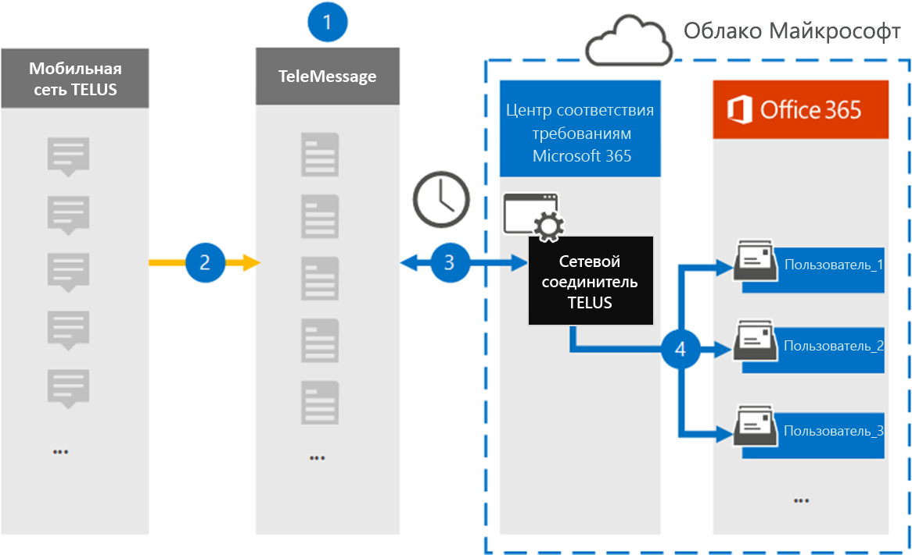

# Настройка соединителю для архива данных TELUS Network

Используйте соединителю TeleMessage в центре Microsoft 365 соответствия требованиям для импорта и архива данных службы коротких SMS (SMS) из сети TELUS организации. После настройки соединители он подключается к сети TELUS организации один раз в день и импортирует SMS в почтовые ящики в Microsoft 365.

После SMS сообщений, хранимых в почтовых ящиках пользователей, к данным TELUS можно применить Microsoft 365, такие как хранение судебного разбирательства, поиск контента и политики хранения Microsoft 365. Например, вы можете искать сообщения telus SMS с помощью поиска контента или связывать почтовый ящик, содержащий данные TELUS, с хранителями в Advanced eDiscovery случае. Использование соединиттеля TELUS Network для импорта и архива данных в Microsoft 365 может помочь вашей организации соблюдать государственные и нормативные политики.

## Обзор архива данных TELUS Network

В следующем обзоре объясняется процесс использования соединителю для архивации данных TELUS Network в Microsoft 365.

1. Ваша организация работает с TeleMessage и TELUS, чтобы настроить соединителю TELUS Network. Дополнительные сведения см. в [фотоархиве TELUS Network Archiver.](https://www.telemessage.com/office365-activation-for-telus-network-archiver/)

2. В режиме SMS сообщения из сети TELUS вашей организации копируется на сайт TeleMessage.

3. Соединителю TELUS Network, который вы создаете в центре соответствия требованиям Microsoft 365, ежедневно подключается к сайту TeleMessage и передает SMS сообщения из предыдущих 24 часов в безопасное расположение служба хранилища Azure в облаке Майкрософт. Соединитатель также преобразует содержимое SMS сообщений в формат сообщений электронной почты.

4. Соединитатель импортирует элементы мобильной связи в почтовый ящик определенного пользователя. В почтовом ящике конкретного пользователя создается новая папка с именем TELUS SMS network **Archiver,** и элементы импортируется в нее. Соединитатель делает сопоставление с помощью значения свойства адреса *электронной* почты пользователя. Каждое SMS содержит это свойство, заполненное адресом электронной почты каждого участника SMS сообщения.

   Помимо автоматического сопоставления пользователей с  использованием значения свойства адресов электронной почты пользователя, вы также можете реализовать настраиваемую сопоставление, загрузив файл сопоставления CSV. Этот файл сопоставления содержит номер мобильного телефона и соответствующий Microsoft 365 адрес электронной почты для пользователей в организации. Если вы включаете автоматическое сопоставление пользователей и настраиваемый сопоставление, для каждого элемента TELUS соединителю сначала необходимо использовать настраиваемый файл сопоставления. Если он не найдет допустимого пользователя Microsoft 365, соответствующего номеру мобильного телефона пользователя, соединиттель будет использовать значения в свойстве адреса электронной почты элемента, который он пытается импортировать. Если соединителю не Microsoft 365 допустимого пользователя в настраиваемом файле сопоставления или в свойстве адреса электронной почты элемента TELUS, элемент не будет импортирован.

## Перед настройками соединитетеля

Некоторые этапы реализации, необходимые для архивации данных TELUS Network, являются внешними для Microsoft 365 и должны быть завершены, прежде чем вы сможете создать соединителю в центре соответствия требованиям.

- Заказать [службу сетевого архива TELUS в TeleMessage](https://www.telemessage.com/mobile-archiver/order-mobile-archiver-for-o365) и получить допустимую учетную запись администрирования для вашей организации. Вам потребуется войти в эту учетную запись при создании соединитетеля в центре соответствия требованиям.

- Получите учетную запись TELUS Network и контактные данные счетов, чтобы можно было заполнить бортовые формы TeleMessage и заказать службу архива сообщений из TELUS.

- Регистрация всех пользователей, для SMS архива в учетной записи TeleMessage. При регистрации пользователей обязательно используйте тот же адрес электронной почты, который используется для Microsoft 365 учетной записи.

- Ваши сотрудники должны иметь корпоративные и корпоративные мобильные телефоны в мобильной сетиTELUS. Архивавка сообщений в Microsoft 365 недоступна для устройств, которые принадлежат сотруднику или bring your Own Devices (BYOD).

- Пользователю, создава которому создается соединителю telus Network, должна быть назначена роль экспорта импорта почтовых ящиков в Exchange Online. Это необходимо для добавления соединители на странице **соединители данных** в центре Microsoft 365 соответствия требованиям. По умолчанию эта роль не назначена ни одной группе ролей в Exchange Online. Вы можете добавить роль экспорта импорта почтовых ящиков в группу ролей управления организацией в Exchange Online. Или вы можете создать группу ролей, назначить роль экспортировать импорт почтовых ящиков, а затем добавить соответствующих пользователей в качестве участников. Дополнительные сведения см. в разделах [Создание](/Exchange/permissions-exo/role-groups#create-role-groups) групп ролей или [изменение](/Exchange/permissions-exo/role-groups#modify-role-groups) групп ролей в статье "Управление группами ролей в Exchange Online".

- Этот соединитатель данных доступен в GCC средах в облаке Microsoft 365 правительства США. Сторонние приложения и службы могут включать хранение, передачу и обработку данных клиентов вашей организации в сторонних системах, которые находятся за пределами инфраструктуры Microsoft 365 и поэтому не покрываются обязательствами по Microsoft 365 соответствия требованиям и защите данных. Корпорация Майкрософт не представляет, что использование этого продукта для подключения к сторонним приложениям означает, что эти сторонние приложения соответствуют требованиям FEDRAMP.

## Создание соединитетеля сети TELUS

После завершения необходимых условий, описанных в предыдущем разделе, можно создать соединителю TELUS Network в центре Microsoft 365 соответствия требованиям. Соединитатель использует сведения, которые вы предоставляете, для подключения к сайту TeleMessage и передачи SMS сообщений соответствующим почтовым ящикам пользователей в Microsoft 365.

1. Перейдите [https://compliance.microsoft.com](https://compliance.microsoft.com/) к и нажмите **соединители**  >  **данных TELUS Network**.

2. На странице **описания продукта TELUS Network** нажмите кнопку Добавить **соединителю**

3. На странице **Условия службы нажмите** кнопку **Принять**.

4. На странице **Входа в TeleMessage** в шаге 3 введите необходимые сведения в следующих полях и нажмите **кнопку Далее**.

   - **Имя пользователя:** Имя пользователя TeleMessage.

   - **Пароль:** Пароль TeleMessage.

5. После создания соединитетеля можно закрыть всплывающее окно и перейти на следующую страницу.

6. На странице **Сопоставление пользователей** включайте автоматическое сопоставление пользователей и нажмите **кнопку Далее**. В случае необходимости настраиваемой сопоставления загрузите CSV-файл и нажмите **кнопку Далее**.

7. Просмотрите параметры и нажмите **кнопку Готово** для создания соединитетеля.

8. Перейдите на вкладку Соединители на странице **Соединители** данных, чтобы увидеть ход процесса импорта для нового соединитетеля.

## Известные проблемы

- В настоящее время мы не поддерживаем импорт вложений или элементов размером более 10 МБ. Поддержка более крупных элементов будет доступна позднее.
