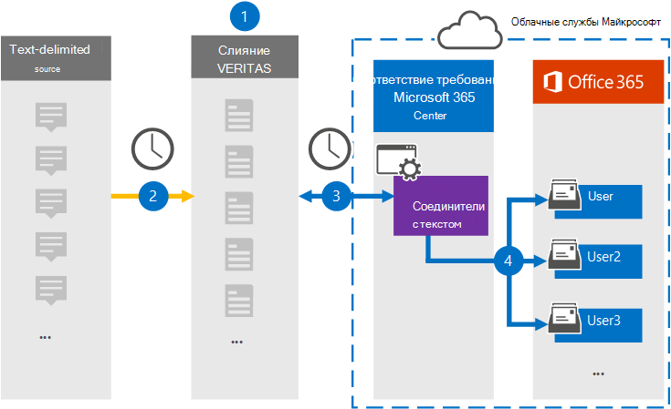

# Настройка соединители для архива данных с текстовыми делегамиSet up a connector to archive text-delimited data

Используйте соединители Globanet в Центре соответствия требованиям Microsoft 365, чтобы импортировать и архивировать текстовые данные в почтовые ящики пользователей в организации Microsoft 365.Use a Globanet connector in the Microsoft 365 compliance center to import and archive text-delimited data to user mailboxes in your Microsoft 365 organization. Globanet предоставляет  текстовый соединители, настроенные для захвата элементов из стороннего источника данных (на регулярной основе) и импорта этих элементов в Microsoft 365.Globanet provides a [text-delimited connector](https://globanet.com/text-delimited) that's configured to capture items from a third-party data source (on a regular basis) and import those items to Microsoft 365. Соединители преобразуют содержимое из источника данных с текстом в формат сообщений электронной почты, а затем импортируют эти элементы в почтовый ящик пользователя в Microsoft 365.The connector converts content from the text-delimited data source to an email message format and then imports those items to the user's mailbox in Microsoft 365.

После сохранения текстовых данных в почтовых ящиках пользователей можно применить такие функции соответствия требованиям Microsoft 365, как хранение для судебного разбирательства, eDiscovery, политики хранения и метки хранения.After text-delimited data is stored in user mailboxes, you can apply Microsoft 365 compliance features such as Litigation Hold, eDiscovery, and retention policies and retention labels. Использование соединители данных с текстовыми делегами для импорта и архива данных в Microsoft 365 может помочь вашей организации соблюдать правительственные и нормативные политики.Using a text-delimited data connector to import and archive data in Microsoft 365 can help your organization stay compliant with government and regulatory policies.

## Обзор архивных данных с текстовыми делениямиOverview of archiving the text-delimited data

В следующем обзоре объясняется процесс использования соединители для архивации сведений источника с текстовым делегом в Microsoft 365.The following overview explains the process of using a connector to archive text-delimited source information in Microsoft 365.

1. Ваша организация работает с источником с текстовым делегированием для настройки сайта с текстовым делегированием.Your organization works with the text-delimited source to set up and configure a text-delimited site.

2. Каждые 24 часа сообщения чата из источника с текстовым делегом копируется на сайт Globanet Merge1.Once every 24 hours, chat messages from the text-delimited source are copied to the Globanet Merge1 site. Соединителет также преобразует содержимое в формат сообщений электронной почты.The connector also converts the content to an email message format.

3. Соединители с текстовыми делениями, которые вы создаете в Центре соответствия требованиям Microsoft 365, каждый день подключаются к сайту Globanet Merge1 и переносятся в безопасное хранилище Azure в Облаке Майкрософт.The text-delimited connector that you create in the Microsoft 365 compliance center connects to the Globanet Merge1 site every day and transfers the messages to a secure Azure Storage location in the Microsoft cloud.

4. Соединиталь импортирует преобразованные элементы сообщений в почтовые ящики определенных пользователей, используя значение свойства *"Электронная* почта" автоматического сопоставления пользователей, как описано в шаге 3.The connector imports the converted message items to the mailboxes of specific users using the value of the *Email* property of the automatic user mapping as described in Step 3. В почтовых ящиках пользователей создается новая вложенная папка в папке "Входящие" с именем **Text-Delimited,** и элементы сообщения импортированы в эту папку.A new subfolder in the Inbox folder named **Text- Delimited** is created in the user mailboxes, and the message items are imported to that folder. Соединиталь определяет, в какой почтовый ящик импортировать элементы, используя значение свойства *Email.*The connector determines which mailbox to import items to by using the value of the *Email* property. Каждое сообщение содержит это свойство, которое заполняется адресом электронной почты каждого участника.Every message contains this property, which is populated with the email address of every participant.

## Прежде чем начатьBefore you begin

- Создайте учетную запись Globanet Merge1 для соединители Майкрософт.Create a Globanet Merge1 account for Microsoft connectors. Чтобы создать эту учетную запись, обратитесь в службу поддержки клиентов [Globanet.](https://globanet.com/ms-connectors-contact)To create this account, contact [Globanet Customer Support](https://globanet.com/ms-connectors-contact). Вход в эту учетную запись будет происходить при создании соединители на шаге 1.You will sign into this account when you create the connector in Step 1.

- Пользователь, создавший соединитель с текстовым делегом на шаге 1 (и завершивший его на шаге 3), должен быть назначен роли импорта и экспорта почтовых ящиков в Exchange Online.The user who creates the text-delimited connector in Step 1 (and completes it in Step 3) must be assigned to the Mailbox Import Export role in Exchange Online. Эта роль необходима для добавления соединителю на странице **"Соединители** данных" в Центре соответствия требованиям Microsoft 365.This role is required to add connectors on the **Data connectors** page in the Microsoft 365 compliance center. По умолчанию эта роль не назначена группе ролей в Exchange Online.By default, this role is not assigned to a role group in Exchange Online. Вы можете добавить роль "Импорт и экспорт почтового ящика" в группу ролей "Управление организацией" в Exchange Online.You can add the Mailbox Import Export role to the Organization Management role group in Exchange Online. Можно также создать группу ролей, назначить роль "Импорт и экспорт почтового ящика" и добавить соответствующих пользователей в качестве участников.Or you can create a role group, assign the Mailbox Import Export role, and then add the appropriate users as members. Дополнительные сведения см. в  разделах ["Создание](https://docs.microsoft.com/Exchange/permissions-exo/role-groups#create-role-groups) групп ролей" или "Изменение групп ролей" статьи "Управление группами ролей в Exchange Online".For more information, see the [Create role groups](https://docs.microsoft.com/Exchange/permissions-exo/role-groups#create-role-groups) or [Modify role groups](https://docs.microsoft.com/Exchange/permissions-exo/role-groups#modify-role-groups) sections in the article "Manage role groups in Exchange Online".

## Шаг 1. Настройка соединители с текстовым делемStep 1: Set up the text-delimited connector

Сначала необходимо получить доступ к странице **"Соединители** данных" в Центре соответствия требованиям Microsoft 365 и создать соединители для данных с текстовыми данными.The first step is to access to the **Data Connectors** page in the Microsoft 365 compliance center and create a connector for text-delimited data.

1. Go to [https://compliance.microsoft.com](https://compliance.microsoft.com/) and then click Data **connectors**  >  **Text-Delimited**.Go to [https://compliance.microsoft.com](https://compliance.microsoft.com/) and then click **Data connectors** > **Text-Delimited**.

2. На странице **описания продукта с** текстом щелкните **"Добавить соединители".**On the **text-delimited** product description page, click **Add connector**.

3. На странице **"Условия обслуживания" нажмите** кнопку **"Принять".**On the **Terms of service** page, click **Accept**.

4. Введите уникальное имя, идентифицируя соединители, и нажмите кнопку **"Далее".**Enter a unique name that identifies the connector, and then click **Next**.

5. Во sign in to your Merge1 account to configure the connector.Sign in to your Merge1 account to configure the connector.

## Шаг 2. Настройка соединители с текстом на сайте Globanet Merge1Step 2: Configure the Text-delimited connector on the Globanet Merge1 site

Второй этап — настройка соединители с текстовым делегом на сайте Merge1.The second step is to configure the text-delimited connector on the Merge1 site. Сведения о настройке соединители с текстовым делением на сайте Globanet Merge1 см. в руководстве пользователя [Merge1 Third-Party Connectors.](https://docs.ms.merge1.globanetportal.com/Merge1%20Third-Party%20Connectors%20text-delimited%20User%20Guide%20.pdf)For information about configuring  the text-delimited connector on the Globanet Merge1 site, see [Merge1 Third-Party Connectors User Guide](https://docs.ms.merge1.globanetportal.com/Merge1%20Third-Party%20Connectors%20text-delimited%20User%20Guide%20.pdf).

После нажатия кнопки  **"Сохранить & Готово"** отображается страница сопоставления пользователей в мастере соединители в Центре соответствия требованиям Microsoft 365.After you click **Save & Finish**, the **User mapping** page in the connector wizard in the Microsoft 365 compliance center is displayed.

## Шаг 3. Соединяем пользователей и завершаем настройку соединителиStep 3: Map users and complete the connector setup

Чтобы связать пользователей и завершить настройку соединители в Центре соответствия требованиям Microsoft 365, выполните следующие действия.To map users and complete the connector setup in the Microsoft 365 compliance center, follow these steps:

1. На странице **"Сопоставление внешних пользователей с пользователями Microsoft 365"** включите автоматическое сопоставление пользователей.On the **Map external users to Microsoft 365 users** page, enable automatic user mapping. Элементы источника с делегированный текстом включают свойство *Email,* которое содержит адреса электронной почты для пользователей в вашей организации.The Text- Delimited source items include a property called *Email*, which contains email addresses for users in your organization. Если соединители могут связать этот адрес с пользователем Microsoft 365, элементы будут импортироваться в почтовый ящик этого пользователя.If the connector can associate this address with a Microsoft 365 user, the items are imported to that user’s mailbox.

2. Нажмите **кнопку**"Далее", просмотрите  параметры и перейдите на страницу "Соединители данных", чтобы просмотреть ход процесса импорта нового соединитела.Click **Next**, review your settings, and then go to the **Data connectors** page to see the progress of the import process for the new connector.

## Шаг 4. Отслеживание соединители с текстовым делегомStep 4: Monitor the text-delimited connector

После создания соединители с делегированный текст можно просмотреть состояние соединители в Центре соответствия требованиям Microsoft 365.After you create the Text- Delimited connector, you can view the connector status in the Microsoft 365 compliance center.

1. Go to [https://compliance.microsoft.com](https://compliance.microsoft.com) and click **Data connectors** in the left nav.Go to [https://compliance.microsoft.com](https://compliance.microsoft.com) and click **Data connectors** in the left nav.

2. Перейдите **на вкладку** "Соединители", а затем выберите соединители с делегировками "Текст", чтобы отобразить эту страницу. Click the **Connectors** tab and then select the **Text- Delimited** connector to display the flyout page. На этой странице содержатся свойства и сведения о соединители.This page contains the properties and information about the connector.

3. В **состоянии соединители с источником** щелкните ссылку журнала загрузки, чтобы открыть (или сохранить) журнал состояния для соединитела. Under **Connector status with source**, click the **Download log** link to open (or save) the status log for the connector. Этот журнал содержит сведения о данных, импортируемых в облако Майкрософт.This log contains information about the data that has been imported to the Microsoft cloud.

## Известные проблемыKnown issues

- В настоящее время мы не поддерживаем импорт вложений или элементов размером более 10 МБ.At this time, we don't support importing attachments or items that are larger than 10 MB. Поддержка более крупных элементов будет доступна позже.Support for larger items will be available at a later date.
