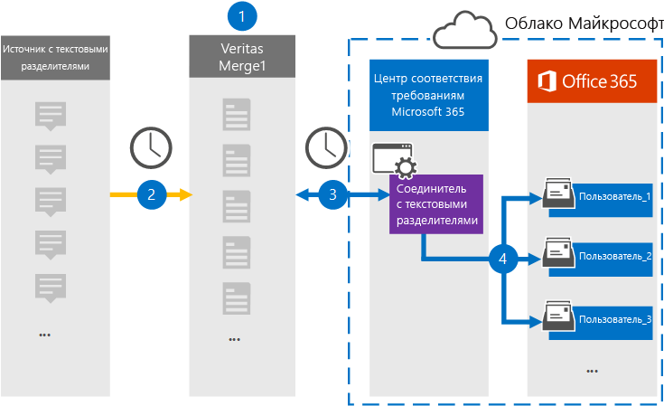

# Настройка соединители для архива данных с текстовыми делегами

Используйте соединители Globanet в Центре соответствия требованиям Microsoft 365, чтобы импортировать и архивировать текстовые данные в почтовые ящики пользователей в организации Microsoft 365. Globanet предоставляет  текстовый соединители, настроенные для захвата элементов из стороннего источника данных (на регулярной основе) и импорта этих элементов в Microsoft 365. Соединители преобразуют содержимое из источника данных с текстом в формат сообщений электронной почты, а затем импортируют эти элементы в почтовый ящик пользователя в Microsoft 365.

После сохранения текстовых данных в почтовых ящиках пользователей можно применить такие функции соответствия требованиям Microsoft 365, как хранение для судебного разбирательства, eDiscovery, политики хранения и метки хранения. Использование соединители данных с текстовыми делегами для импорта и архива данных в Microsoft 365 может помочь вашей организации соблюдать правительственные и нормативные политики.

## Обзор архивных данных с текстовыми делениями

В следующем обзоре объясняется процесс использования соединители для архивации сведений источника с текстовым делегом в Microsoft 365.

1. Ваша организация работает с источником с текстовым делегированием для настройки сайта с текстовым делегированием.

2. Каждые 24 часа сообщения чата из источника с текстовым делегом копируется на сайт Globanet Merge1. Соединителет также преобразует содержимое в формат сообщений электронной почты.

3. Соединители с текстовыми делениями, которые вы создаете в Центре соответствия требованиям Microsoft 365, каждый день подключаются к сайту Globanet Merge1 и переносятся в безопасное хранилище Azure в Облаке Майкрософт.

4. Соединиталь импортирует преобразованные элементы сообщений в почтовые ящики определенных пользователей, используя значение свойства *"Электронная* почта" автоматического сопоставления пользователей, как описано в шаге 3. В почтовых ящиках пользователей создается новая вложенная папка в папке "Входящие" с именем **Text-Delimited,** и элементы сообщения импортированы в эту папку. Соединиталь определяет, в какой почтовый ящик импортировать элементы, используя значение свойства *Email.* Каждое сообщение содержит это свойство, которое заполняется адресом электронной почты каждого участника.

## Прежде чем начать

- Создайте учетную запись Globanet Merge1 для соединители Майкрософт. Чтобы создать эту учетную запись, обратитесь в службу поддержки клиентов [Globanet.](https://globanet.com/ms-connectors-contact) Вход в эту учетную запись будет происходить при создании соединители на шаге 1.

- Пользователь, создавший соединитель с текстовым делегом на шаге 1 (и завершивший его на шаге 3), должен быть назначен роли импорта и экспорта почтовых ящиков в Exchange Online. Эта роль необходима для добавления соединителю на странице **"Соединители** данных" в Центре соответствия требованиям Microsoft 365. По умолчанию эта роль не назначена группе ролей в Exchange Online. Вы можете добавить роль "Импорт и экспорт почтового ящика" в группу ролей "Управление организацией" в Exchange Online. Можно также создать группу ролей, назначить роль "Импорт и экспорт почтового ящика" и добавить соответствующих пользователей в качестве участников. Дополнительные сведения см. в  разделах ["Создание](https://docs.microsoft.com/Exchange/permissions-exo/role-groups#create-role-groups) групп ролей" или "Изменение групп ролей" статьи "Управление группами ролей в Exchange Online".

## Шаг 1. Настройка соединители с текстовым делем

Сначала необходимо получить доступ к странице **"Соединители** данных" в Центре соответствия требованиям Microsoft 365 и создать соединители для данных с текстовыми данными.

1. Go to [https://compliance.microsoft.com](https://compliance.microsoft.com/) and then click Data **connectors**  >  **Text-Delimited**.

2. На странице **описания продукта с** текстом щелкните **"Добавить соединители".**

3. На странице **"Условия обслуживания" нажмите** кнопку **"Принять".**

4. Введите уникальное имя, идентифицируя соединители, и нажмите кнопку **"Далее".**

5. Во sign in to your Merge1 account to configure the connector.

## Шаг 2. Настройка соединители с текстом на сайте Globanet Merge1

Второй этап — настройка соединители с текстовым делегом на сайте Merge1. Сведения о настройке соединители с текстовым делением на сайте Globanet Merge1 см. в руководстве пользователя [Merge1 Third-Party Connectors.](https://docs.ms.merge1.globanetportal.com/Merge1%20Third-Party%20Connectors%20text-delimited%20User%20Guide%20.pdf)

После нажатия кнопки  **"Сохранить & Готово"** отображается страница сопоставления пользователей в мастере соединители в Центре соответствия требованиям Microsoft 365.

## Шаг 3. Соединяем пользователей и завершаем настройку соединители

Чтобы связать пользователей и завершить настройку соединители в Центре соответствия требованиям Microsoft 365, выполните следующие действия.

1. На странице **"Сопоставление внешних пользователей с пользователями Microsoft 365"** включите автоматическое сопоставление пользователей. Элементы источника с делегированный текстом включают свойство *Email,* которое содержит адреса электронной почты для пользователей в вашей организации. Если соединители могут связать этот адрес с пользователем Microsoft 365, элементы будут импортироваться в почтовый ящик этого пользователя.

2. Нажмите **кнопку**"Далее", просмотрите  параметры и перейдите на страницу "Соединители данных", чтобы просмотреть ход процесса импорта нового соединитела.

## Шаг 4. Отслеживание соединители с текстовым делегом

После создания соединители с делегированный текст можно просмотреть состояние соединители в Центре соответствия требованиям Microsoft 365.

1. Go to [https://compliance.microsoft.com](https://compliance.microsoft.com) and click **Data connectors** in the left nav.

2. Перейдите **на вкладку** "Соединители", а затем выберите соединители с делегировками "Текст", чтобы отобразить эту страницу.  На этой странице содержатся свойства и сведения о соединители.

3. В **состоянии соединители с источником** щелкните ссылку журнала загрузки, чтобы открыть (или сохранить) журнал состояния для соединитела.  Этот журнал содержит сведения о данных, импортируемых в облако Майкрософт.

## Известные проблемы

- В настоящее время мы не поддерживаем импорт вложений или элементов размером более 10 МБ. Поддержка более крупных элементов будет доступна позже.
