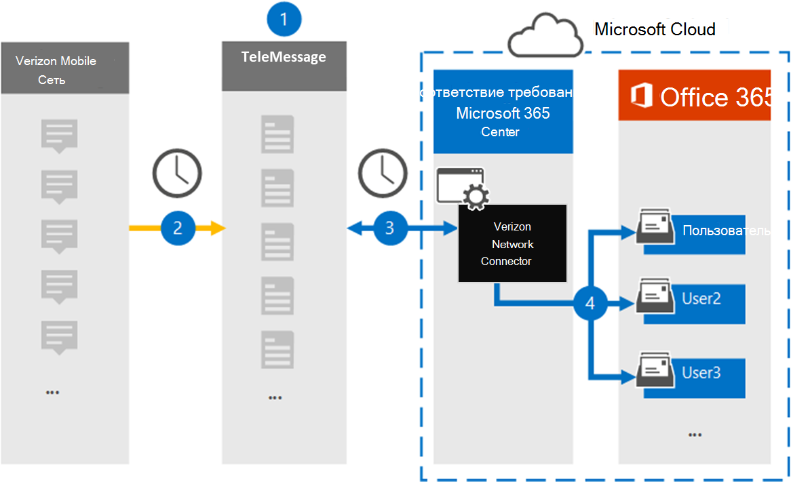

# Настройка соединитетеля для архива данных Verizon NetworkSet up a connector to archive Verizon Network data

Используйте соединители TeleMessage в центре Microsoft 365 для импорта и архива данных службы коротких сообщений (SMS) и службы мультимедийных сообщений (MMS) из Сети Verizon.Use the TeleMessage connector in the Microsoft 365 compliance center to import and archive Short Messaging Service (SMS) and Multimedia Messaging Service (MMS) data from Verizon Network. После настройки соединители он подключается к сети Verizon в вашей организации один раз в день и импортирует данные SMS и MMS в почтовые ящики в Microsoft 365.After you set up and configure a connector, it connects to your organization's Verizon Network once every day and imports SMS and MMS data to mailboxes in Microsoft 365.

После хранения данных соединители Verizon Network в почтовых ящиках пользователей можно применить к данным Verizon Microsoft 365, такие как хранение судебного разбирательства, поиск контента и Microsoft 365 политики хранения.After Verizon Network connector data is stored in user mailboxes, you can apply Microsoft 365 compliance features such as Litigation Hold, Content Search, and Microsoft 365 retention policies to Verizon data. Например, можно искать сообщения SMS и MMS с помощью поиска контента или связывать почтовый ящик, содержащий данные Verizon Network, с хранителями в Advanced eDiscovery случае.For example, you can search Verizon SMS and MMS messages using Content Search or associate the mailbox that contains Verizon Network data with a custodian in an Advanced eDiscovery case. Использование соединиттеля Сети Verizon для импорта и архива данных в Microsoft 365 может помочь вашей организации соблюдать государственные и нормативные политики.Using a Verizon Network connector to import and archive data in Microsoft 365 can help your organization stay compliant with government and regulatory policies.

## Обзор архива данных Verizon NetworkOverview of archiving Verizon Network data

В следующем обзоре объясняется процесс использования соединитетеля для архивации данных Verizon Network в Microsoft 365.The following overview explains the process of using a connector to archive Verizon Network data in Microsoft 365.

1. Ваша организация работает с TeleMessage и Verizon, чтобы настроить соединители Verizon Network.Your organization works with TeleMessage and Verizon to set up a Verizon Network connector. Дополнительные сведения см. в [фотоархиве Verizon Network Archiver.](https://www.telemessage.com/office365-activation-for-verizon-network-archiver/)For more information, see [Verizon Network Archiver](https://www.telemessage.com/office365-activation-for-verizon-network-archiver/).

2. Каждые 24 часа SMS и MMS-сообщения из сети Verizon в вашей организации копируется на сайт TeleMessage.Once every 24 hours, SMS and MMS messages from your organization’s Verizon Network are copied to the TeleMessage site.

3. Соединители Verizon Network, которые вы создаете в центре соответствия Microsoft 365, ежедневно подключаются к сайту TeleMessage и переносят сообщения SMS и MMS из предыдущих 24 часов в безопасное расположение служба хранилища Azure в облаке Майкрософт.The Verizon Network connector that you create in the Microsoft 365 compliance center connects to the TeleMessage site every day and transfers the SMS and MMS messages from the previous 24 hours to a secure Azure Storage location in the Microsoft cloud. Соединителет также преобразует содержимое сообщений SMS MMS в формат сообщений электронной почты.The connector also converts the content of SMS and MMS messages to an email message format.

4. Соединитатель импортирует элементы мобильной связи в почтовый ящик определенного пользователя.The connector imports the mobile communication items to the mailbox of a specific user. Новая папка с именем **Verizon SMS/MMS Network Archiver** создается в почтовом ящике конкретного пользователя, и элементы импортируется в него.A new folder named **Verizon SMS/MMS Network Archiver** is created in the specific user's mailbox and the items are imported to it. Соединитатель делает это сопоставление, используя значение свойства адреса *электронной почты* пользователя.The connector does this mapping by using the value of the *User’s Email address* property. Каждое SMS сообщение MMS содержит это свойство, которое заполняется адресом электронной почты каждого участника сообщения.Every SMS and MMS message contains this property, which is populated with the email address of every participant of the message.

   Помимо автоматического сопоставления пользователей с  использованием значения свойства адресов электронной почты пользователя, вы также можете реализовать настраиваемую сопоставление, загрузив файл сопоставления CSV.In addition to automatic user mapping using the value of the *User’s Email address* property, you can also implement custom mapping by uploading a CSV mapping file. Этот файл сопоставления содержит номер мобильного телефона и соответствующий Microsoft 365 адрес электронной почты для пользователей в организации.This mapping file contains the mobile phone number and corresponding Microsoft 365 email address for users in your organization. Если вы включаете автоматическое сопоставление пользователей и настраиваемое сопоставление, для каждого элемента Verizon соединитатель сначала рассматривает настраиваемый файл сопоставления.If you enable both automatic user mapping and custom mapping, for every Verizon item the connector first looks at custom mapping file. Если он не найдет допустимого пользователя Microsoft 365, соответствующего номеру мобильного телефона пользователя, соединиттель будет использовать значения в свойстве адреса электронной почты элемента, который он пытается импортировать.If it doesn't find a valid Microsoft 365 user that corresponds to a user's mobile phone number, the connector will use the values in the email address property of the item it's trying to import. Если соединиттель не находит допустимого пользователя Microsoft 365 в настраиваемом файле сопоставления или в свойстве адреса электронной почты элемента Verizon, элемент не будет импортирован.If the connector doesn't find a valid Microsoft 365 user in either the custom mapping file or in the email address property of the Verizon item, the item won't be imported.

## Прежде чем начатьBefore you begin

Некоторые этапы реализации, необходимые для архивации данных Verizon Network, являются внешними для Microsoft 365 и должны быть завершены, прежде чем вы сможете создать соединители в центре соответствия требованиям.Some of the implementation steps required to archive Verizon Network data are external to Microsoft 365 and must be completed before you can create a connector in the compliance center.

- Заказать [службу сетевого архива Verizon в TeleMessage](https://www.telemessage.com/mobile-archiver/order-mobile-archiver-for-o365) и получить допустимую учетную запись администрирования для вашей организации.Order the [Verizon Network Archiver service from TeleMessage](https://www.telemessage.com/mobile-archiver/order-mobile-archiver-for-o365) and get a valid administration account for your organization. Вам потребуется войти в эту учетную запись при создании соединитетеля в центре соответствия требованиям.You'll need to sign into this account when you create the connector in the compliance center.

- Получите учетную запись Сети Verizon и контактные данные о выставлении счетов, чтобы вы могли заполнить бортовые формы TeleMessage и заказать службу архива сообщений от Verizon.Obtain your Verizon Network account and billing contact details so you can fill-out the TeleMessage onboarding forms and order the message archiving service from Verizon.

- Регистрация всех пользователей, для SMS и MMS архива в учетной записи TeleMessage.Register all users that require Verizon SMS and MMS archiving in the TeleMessage account. При регистрации пользователей обязательно используйте тот же адрес электронной почты, который используется для Microsoft 365 учетной записи.When registering users, be sure to use the same email address that's used for their Microsoft 365 account.

- Ваши сотрудники должны иметь корпоративные и корпоративные мобильные телефоны в мобильной сети Verizon.Your employees must have corporate-owned and corporate-liable mobile phones on the Verizon mobile network. Архивавка сообщений в Microsoft 365 недоступна для устройств, которые принадлежат сотруднику или bring your Own Devices (BYOD).Archiving messages in Microsoft 365 isn't available for employee-owned or Bring Your Own Devices (BYOD) devices.

- Пользователю, создавателю соединитетеля Сети Verizon, необходимо приумнодить роль экспорта импорта почтовых ящиков в Exchange Online.The user who creates a Verizon Network connector must be assigned the Mailbox Import Export role in Exchange Online. Это необходимо для добавления соединители на странице **соединители данных** в центре Microsoft 365 соответствия требованиям.This is required to add connectors in the **Data connectors** page in the Microsoft 365 compliance center. По умолчанию эта роль не назначена ни одной группе ролей в Exchange Online.By default, this role isn't assigned to any role group in Exchange Online. Вы можете добавить роль экспорта импорта почтовых ящиков в группу ролей управления организацией в Exchange Online.You can add the Mailbox Import Export role to the Organization Management role group in Exchange Online. Или вы можете создать группу ролей, назначить роль экспортировать импорт почтовых ящиков, а затем добавить соответствующих пользователей в качестве участников.Or you can create a role group, assign the Mailbox Import Export role, and then add the appropriate users as members. Дополнительные сведения см. в разделах [Создание](/Exchange/permissions-exo/role-groups#create-role-groups) групп ролей или [изменение](/Exchange/permissions-exo/role-groups#modify-role-groups) групп ролей в статье "Управление группами ролей в Exchange Online".For more information, see the [Create role groups](/Exchange/permissions-exo/role-groups#create-role-groups) or [Modify role groups](/Exchange/permissions-exo/role-groups#modify-role-groups) sections in the article "Manage role groups in Exchange Online".

## Создание соединитетеля Сети VerizonCreate a Verizon Network connector

После завершения необходимых условий, описанных в предыдущем разделе, можно создать соединители Verizon Network в центре Microsoft 365 соответствия требованиям.After you've completed the prerequisites described in the previous section, you can create Verizon Network connector in the Microsoft 365 compliance center. Соединитатель использует сведения, которые вы предоставляете, для подключения к сайту TeleMessage и передачи сообщений SMS и MMS в соответствующие почтовые ящики пользователей в Microsoft 365.The connector uses the information you provide to connect to the TeleMessage site and transfer SMS and MMS messages to the corresponding user mailbox boxes in Microsoft 365.

1. Перейдите [https://compliance.microsoft.com](https://compliance.microsoft.com) к и нажмите **кнопку Соединители данных** Verizon  >  **Network**.Go to [https://compliance.microsoft.com](https://compliance.microsoft.com) and then click **Data connectors** > **Verizon Network**.

2. На странице **описания продукта Verizon Network** нажмите кнопку Добавить **соединителю**On the **Verizon Network** product description page, click **Add connector**

3. На странице **Условия службы нажмите** кнопку **Принять**.On the **Terms of service** page, click **Accept**.

4. На странице **Входа в TeleMessage** в шаге 3 введите необходимые сведения в следующих полях и нажмите **кнопку Далее**.On the **Login to TeleMessage** page, under Step 3, enter the required information in the following boxes and then click **Next**.
  
   - **Имя пользователя:** Имя пользователя TeleMessage.**Username:** Your TeleMessage username.

   - **Пароль:** Пароль TeleMessage.**Password:** Your TeleMessage password.

5. После создания соединитетеля можно закрыть всплывающее окно и перейти на следующую страницу.After the connector is created, you can close the pop-up window and go to the next page.

6. На странице **Сопоставление пользователей** включайте автоматическое сопоставление пользователей и нажмите **кнопку Далее**.On the **User mapping** page, enable automatic user mapping and click **Next**. В случае необходимости настраиваемой сопоставления загрузите CSV-файл и нажмите **кнопку Далее**.In case you need custom mapping upload a CSV file, and click **Next**.

7. Просмотрите параметры и нажмите **кнопку Готово** для создания соединитетеля.Review your settings, and then click **Finish** to create the connector.

8. Перейдите на вкладку Соединители на странице **Соединители** данных, чтобы увидеть ход процесса импорта для нового соединитетеля.Go to the Connectors tab in **Data connectors** page to see the progress of the import process for the new connector.

## Известные проблемыKnown issues

- В настоящее время мы не поддерживаем импорт вложений или элементов размером более 10 МБ.At this time, we don't support importing attachments or items that are larger than 10 MB. Поддержка более крупных элементов будет доступна позднее.Support for larger items will be available at a later date.