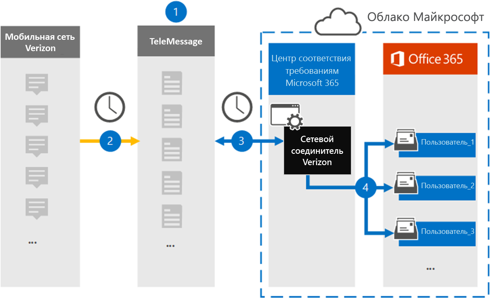

# Настройка соединителя для архивации данных сети Веризон (Предварительная версия)Set up a connector to archive Verizon Network data (preview)

Используйте соединитель для обмена сообщениями в центре соответствия требованиям Microsoft 365, чтобы импортировать и архивировать данные службы обмена мгновенными сообщениями (SMS) и службы обмена мультимедийными сообщениями (MMS) из сети Веризон.Use the TeleMessage connector in the Microsoft 365 compliance center to import and archive Short Messaging Service (SMS) and Multimedia Messaging Service (MMS) data from Verizon Network. После настройки и настройки соединителя он подключается к сети Веризон в организации каждый день и импортирует SMS и MMS данные в почтовые ящики в Microsoft 365.After you set up and configure a connector, it connects to your organization's Verizon Network once every day and imports SMS and MMS data to mailboxes in Microsoft 365.

После хранения данных сетевого соединителя Веризон в почтовых ящиках пользователей можно применить такие функции обеспечения соответствия требованиям Microsoft 365, как хранение для судебного разбирательства, поиск контента и политики хранения Microsoft 365, в данные Веризон.After Verizon Network connector data is stored in user mailboxes, you can apply Microsoft 365 compliance features such as Litigation Hold, Content Search, and Microsoft 365 retention policies to Verizon data. Например, вы можете выполнить поиск в Веризон SMS и MMS, используя поиск контента, или сопоставить почтовый ящик, содержащий данные сети Веризон, с хранитель в расширенном случае обнаружения электронных данных.For example, you can search Verizon SMS and MMS messages using Content Search or associate the mailbox that contains Verizon Network data with a custodian in an Advanced eDiscovery case. Использование сетевого соединителя Веризон для импорта и архивирования данных в Microsoft 365 поможет обеспечить соответствие организации политикам государственных учреждений и нормативным требованиям.Using a Verizon Network connector to import and archive data in Microsoft 365 can help your organization stay compliant with government and regulatory policies.

## Обзор архивации данных сети ВеризонOverview of archiving Verizon Network data

В следующем обзоре описывается процесс использования соединителя для архивации данных сети Веризон в Microsoft 365.The following overview explains the process of using a connector to archive Verizon Network data in Microsoft 365.

1. Ваша организация работает с сообщениями и Веризон для настройки сетевого соединителя Веризон.Your organization works with TeleMessage and Verizon to set up a Verizon Network connector. Дополнительные сведения можно найти в статье [Веризон Network WinRAR](https://www.telemessage.com/office365-activation-for-verizon-network-archiver/).For more information, see [Verizon Network Archiver](https://www.telemessage.com/office365-activation-for-verizon-network-archiver/).

2. Каждые 24 часа SMS-сообщения и MMS-сообщения из сети Веризон вашей организации копируются на сайт для обмена сообщениями.Once every 24 hours, SMS and MMS messages from your organization’s Verizon Network are copied to the TeleMessage site.

3. Сетевой соединитель Веризон, который вы создаете в центре соответствия требованиям Microsoft 365, подключается к сайту сообщений каждый день и передает SMS-и MMS-сообщения из предыдущих 24 часов в безопасное место хранения Azure в облаке Майкрософт.The Verizon Network connector that you create in the Microsoft 365 compliance center connects to the TeleMessage site every day and transfers the SMS and MMS messages from the previous 24 hours to a secure Azure Storage location in the Microsoft Cloud. Соединитель также Преобразовывает содержимое SMS и MMS сообщения в формат сообщения электронной почты.The connector also converts the content of SMS and MMS messages to an email message format.

4. Соединитель импортирует элементы мобильного взаимодействия в почтовый ящик определенного пользователя.The connector imports the mobile communication items to the mailbox of a specific user. В почтовом ящике конкретного пользователя создается новая папка с именем **ВЕРИЗОН SMS/MMS WinRAR** , в которую будут импортированы элементы.A new folder named **Verizon SMS/MMS Network Archiver** is created in the specific user's mailbox and the items are imported to it. Соединитель выполняет это сопоставление, используя значение свойства *электронного адреса пользователя* .The connector does this mapping by using the value of the *User’s Email address* property. Каждое сообщение SMS и MMS содержит это свойство, которое заполняется адресом электронной почты каждого участника сообщения.Every SMS and MMS message contains this property, which is populated with the email address of every participant of the message.

   В дополнение к автоматическому сопоставлению пользователей с использованием значения свойства *электронного адреса пользователя* , можно также реализовать настраиваемое сопоставление путем отправки CSV-файла сопоставления.In addition to automatic user mapping using the value of the *User’s Email address* property, you can also implement custom mapping by uploading a CSV mapping file. Этот файл сопоставления содержит номер мобильного телефона и соответствующий адрес электронной почты Microsoft 365 для пользователей в вашей организации.This mapping file contains the mobile phone number and corresponding Microsoft 365 email address for users in your organization. Если вы включаете автоматическое сопоставление пользователей и настраиваемое сопоставление, для каждого элемента Веризон соединительный код сначала выполняет поиск по пользовательскому файлу сопоставления.If you enable both automatic user mapping and custom mapping, for every Verizon item the connector first looks at custom mapping file. Если не удается найти действительного пользователя Microsoft 365, который соответствует номеру мобильного телефона пользователя, соединитель будет использовать значения в свойстве адрес электронной почты элемента, который он пытается импортировать.If it doesn't find a valid Microsoft 365 user that corresponds to a user's mobile phone number, the connector will use the values in the email address property of the item it's trying to import. Если соединитель не находит действительных пользователей Microsoft 365 в файле настраиваемого сопоставления или в свойстве адреса электронной почты элемента Веризон, элемент не импортируется.If the connector doesn't find a valid Microsoft 365 user in either the custom mapping file or in the email address property of the Verizon item, the item won't be imported.

## Перед началом работыBefore you begin

Многие этапы реализации, необходимые для архивации сетевых данных Веризон, являются внешними по отношению к Microsoft 365 и должны быть завершены, прежде чем можно будет создать соединитель в центре соответствия требованиям.Many of the implementation steps required to archive Verizon Network data are external to Microsoft 365 and must be completed before you can create a connector in the compliance center.

- Закажите [службу Веризон Network WinRAR из сообщения](https://www.telemessage.com/mobile-archiver/order-mobile-archiver-for-o365) и получите допустимую учетную запись администрирования для Организации.Order the [Verizon Network Archiver service from TeleMessage](https://www.telemessage.com/mobile-archiver/order-mobile-archiver-for-o365) and get a valid administration account for your organization. Вам потребуется войти в эту учетную запись, когда вы создадите соединитель в центре соответствия требованиям.You'll need to sign into this account when you create the connector in the compliance center.

- Получите свою сетевую учетную запись Веризон и сведения о контактах для выставления счетов, чтобы можно было заполнить формы входящей миграции и упорядочить службу архивации сообщений из Веризон.Obtain your Verizon Network account and billing contact details so you can fill-out the TeleMessage onboarding forms and order the message archiving service from Verizon.

- Зарегистрируйте всех пользователей, которым требуется Веризон SMS и MMS в учетной записи для обмена сообщениями.Register all users that require Verizon SMS and MMS archiving in the TeleMessage account. При регистрации пользователей необходимо использовать тот же адрес электронной почты, который используется для своей учетной записи Microsoft 365.When registering users, be sure to use the same email address that's used for their Microsoft 365 account.

- Ваши сотрудники должны иметь корпоративные и корпоративные мобильные телефоны в сети Веризон Mobile.Your employees must have corporate-owned and corporate-liable mobile phones on the Verizon mobile network. Архивация сообщений в Microsoft 365 недоступна для устройств, принадлежащих сотрудникам, или для собственных устройств (BYOD).Archiving messages in Microsoft 365 isn't available for employee-owned or Bring Your Own Devices (BYOD) devices.

- Ваша организация должна разрешить службе импорта Office 365 доступ к данным почтовых ящиков в Организации.Your organization must consent to allow the Office 365 Import service to access mailbox data in your organization. Вам потребуется предоставить это согласие при создании соединителя.You will need to provide this consent when you create the connector. Чтобы согласиться с этим запросом, перейдите на [эту страницу](https://login.microsoftonline.com/common/oauth2/authorize?client_id=570d0bec-d001-4c4e-985e-3ab17fdc3073&response_type=code&redirect_uri=https://portal.azure.com/&nonce=1234&prompt=admin_consent), войдите с помощью учетных данных глобального администратора Office 365 и примите запрос.To consent to this request, go to [this page](https://login.microsoftonline.com/common/oauth2/authorize?client_id=570d0bec-d001-4c4e-985e-3ab17fdc3073&response_type=code&redirect_uri=https://portal.azure.com/&nonce=1234&prompt=admin_consent), sign in with the credentials of an Office 365 global admin, and then accept the request. Необходимо выполнить это действие, прежде чем можно будет успешно создать сетевой соединитель Веризон.You have to complete this step before you can successfully create Verizon Network connector.

- Пользователю, создающему сетевой соединитель Веризон, должна быть назначена роль импорта почтовых ящиков в Exchange Online.The user who creates a Verizon Network connector must be assigned the Mailbox Import Export role in Exchange Online. Это необходимо для добавления соединителей на странице " **соединители данных** " в центре соответствия требованиям Microsoft 365.This is required to add connectors in the **Data connectors** page in the Microsoft 365 compliance center. По умолчанию эта роль не назначена ни одной группе ролей в Exchange Online.By default, this role isn't assigned to any role group in Exchange Online. Вы можете добавить роль экспорта для импорта почтовых ящиков в группу ролей Управление организацией в Exchange Online.You can add the Mailbox Import Export role to the Organization Management role group in Exchange Online. Вы также можете создать группу ролей, назначить роль импорта для импорта почтовых ящиков, а затем добавить соответствующих пользователей в качестве участников.Or you can create a role group, assign the Mailbox Import Export role, and then add the appropriate users as members. Для получения дополнительных сведений обратитесь к разделу [Создание](https://docs.microsoft.com/Exchange/permissions-exo/role-groups#create-role-groups) групп ролей или [изменение групп ролей](https://docs.microsoft.com/Exchange/permissions-exo/role-groups#modify-role-groups) статьи "Управление группами ролей в Exchange Online".For more information, see the [Create role groups](https://docs.microsoft.com/Exchange/permissions-exo/role-groups#create-role-groups) or [Modify role groups](https://docs.microsoft.com/Exchange/permissions-exo/role-groups#modify-role-groups) sections in the article "Manage role groups in Exchange Online".

## Создание сетевого соединителя ВеризонCreate a Verizon Network connector

После выполнения предварительных требований, описанных в предыдущем разделе, можно создать сетевой соединитель Веризон в центре соответствия требованиям Microsoft 365.After you've completed the prerequisites described in the previous section, you can create Verizon Network connector in the Microsoft 365 compliance center. Соединитель использует предоставленные сведения для подключения к сайту "Служба сообщений" и передачи SMS-и MMS-сообщений в соответствующие поля почтового ящика пользователя в Microsoft 365.The connector uses the information you provide to connect to the TeleMessage site and transfer SMS and MMS messages to the corresponding user mailbox boxes in Microsoft 365.

1. Перейдите к [https://compliance.microsoft.com](https://compliance.microsoft.com) пункту **соединители**  >  **Веризон Network**(соединители данных).Go to [https://compliance.microsoft.com](https://compliance.microsoft.com) and then click **Data connectors** > **Verizon Network**.

2. На странице "Описание **сетевого продукта Веризон** " нажмите кнопку **Добавить соединитель**On the **Verizon Network** product description page, click **Add connector**

3. На странице **условия обслуживания** нажмите кнопку **принять**.On the **Terms of service** page, click **Accept**.

4. На странице " **Вход в систему** " в разделе Шаг 3 Введите необходимые сведения в следующие поля, а затем нажмите кнопку **Далее**.On the **Login to TeleMessage** page, under Step 3, enter the required information in the following boxes and then click **Next**.
  
   - **Имя пользователя:** Имя пользователя в вашем почтовом сообщении.**Username:** Your TeleMessage username.

   - **Пароль:** Пароль к своему почтовому сообщению.**Password:** Your TeleMessage password.

5. После создания соединителя можно закрыть всплывающее окно и перейти к следующей странице.After the connector is created, you can close the pop-up window and go to the next page.

6. На странице **Сопоставление пользователей** включите автоматическое сопоставление пользователей и нажмите кнопку **Далее**.On the **User mapping** page, enable automatic user mapping and click **Next**. Если вам потребуется настраиваемое сопоставление, отправьте CSV-файл, а затем нажмите кнопку **Далее**.In case you need custom mapping upload a CSV file, and click **Next**.

7. Предоставьте согласие администратора и нажмите кнопку **Далее**.Provide admin consent and then click **Next**.

   Чтобы предоставить согласие администратора, необходимо войти в систему, используя учетные данные глобального администратора Office 365, а затем принять запрос согласия.To provide admin consent, you must be signed in with the credentials of an Office 365 global admin, and then accept the consent request. Если вы не вошли в систему как глобальный администратор, вы можете перейти на [эту страницу](https://login.microsoftonline.com/common/oauth2/authorize?client_id=570d0bec-d001-4c4e-985e-3ab17fdc3073&response_type=code&redirect_uri=https://portal.azure.com/&nonce=1234&prompt=admin_consent) и войти, используя учетные данные глобального администратора, чтобы принять запрос.If you aren't signed in as a global admin, you can go to [this page](https://login.microsoftonline.com/common/oauth2/authorize?client_id=570d0bec-d001-4c4e-985e-3ab17fdc3073&response_type=code&redirect_uri=https://portal.azure.com/&nonce=1234&prompt=admin_consent) and sign-in using global admin credentials to accept the request.

8. Проверьте параметры и нажмите кнопку **Готово** , чтобы создать соединитель.Review your settings, and then click **Finish** to create the connector.

9. Перейдите на вкладку Connectors (соединители) на странице **Data Connectors** (соединители), чтобы увидеть ход процесса импорта для нового соединителя.Go to the Connectors tab in **Data connectors** page to see the progress of the import process for the new connector.

## Известные проблемыKnown issues

- Соединитель не импортирует элементы размером более 10 МБ.The connector doesn’t import any item larger than 10 MB.
