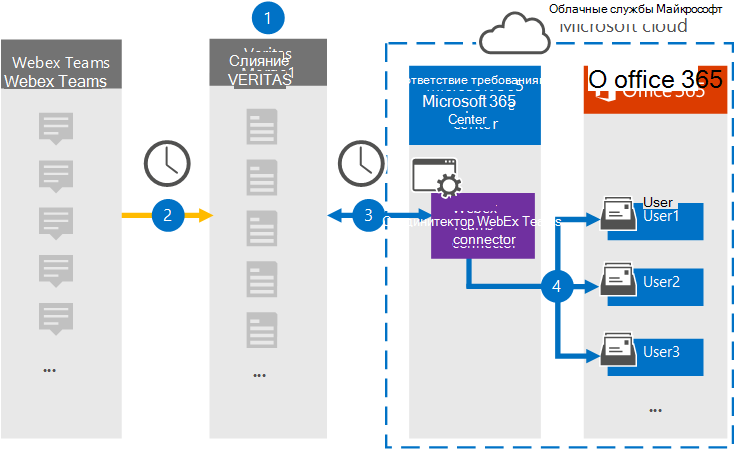

# Настройка соединитела для архива данных Webex Teams

Используйте соединиталь Globanet в Центре соответствия требованиям Microsoft 365, чтобы импортировать и архивировать данные из Webex Teams в почтовые ящики пользователей в организации Microsoft 365. Globanet предоставляет [соединители Webex Teams,](https://globanet.com/webex-teams/) настроенные для записи элементов связи Webex Teams и их импорта в Microsoft 365. Соединиталь преобразует содержимое из Webex Teams, например чаты 1:1, групповые беседы, беседы каналов и вложения из учетной записи Webex Teams вашей организации, в формат сообщений электронной почты, а затем импортирует эти элементы в почтовый ящик пользователя в Microsoft 365.

После сохранения данных Webex Teams в почтовых ящиках пользователей вы можете применить такие функции соответствия Требованиям Microsoft 365, как хранение для судебного разбирательства, eDiscovery, политики хранения и метки хранения, а также соответствие коммуникации. Использование соединители Webex Teams для импорта и архива данных в Microsoft 365 может помочь вашей организации соблюдать правительственные и нормативные политики.

## Обзор архивных данных Webex Teams

В следующем обзоре объясняется процесс использования соединители для архивации данных Webex Teams в Microsoft 365.

1. Ваша организация работает с Webex Teams для настройки и настройки сайта Webex Teams.

2. Каждые 24 часа элементы Webex Teams копируется на сайт Globanet Merge1. Соединитер также преобразует элементы Webex Teams в формат сообщений электронной почты.

3. Соединитек Webex Teams, который вы создаете в Центре соответствия требованиям Microsoft 365, каждый день подключается к Globanet Merge1 и переносит элементы Webex Teams в безопасное хранилище Azure в Облаке Майкрософт.

4. Соединиталь импортирует элементы в почтовые ящики определенных пользователей, используя значение свойства *"Электронная* почта" автоматического сопоставления пользователей, как описано в [шаге 3.](#step-3-map-users-and-complete-the-connector-setup) В почтовых ящиках пользователей создается вложенная папка в папке "Входящие" с именем **Webex Teams,** и элементы импортируется в эту папку. Для этого соединители используют значение свойства *Email.* Каждый элемент Webex Teams содержит это свойство, которое заполняется адресом электронной почты каждого участника элемента.

## Перед началом работы

- Создайте учетную запись Globanet Merge1 для соединители Майкрософт. Чтобы создать эту учетную запись, обратитесь в службу поддержки клиентов [Globanet.](https://globanet.com/ms-connectors-contact) Вход в эту учетную запись будет происходить при создании соединители на шаге 1.

- Создайте приложение для [https://developer.webex.com/](https://developer.webex.com) получения данных из учетной записи Webex Teams. Пошаговая инструкция по созданию приложения см. в руководстве пользователя [Merge1 Third-Party Connectors](https://docs.ms.merge1.globanetportal.com/Merge1%20Third-Party%20Connectors%20Webex%20Teams%20User%20Guide%20.pdf)

   При создании этого приложения платформа Webex создает набор уникальных учетных данных. Эти учетные данные используются в действии 2 при настройке соединители Webex Teams на сайте Global Merge1.

- Пользователь, создавший соединитель Webex Teams на шаге 1 (и завершивший его на шаге 3), должен быть назначен роли импорта и экспорта почтовых ящиков в Exchange Online. Эта роль необходима для добавления соединителю на странице **"Соединители** данных" в Центре соответствия требованиям Microsoft 365. По умолчанию эта роль не назначена группе ролей в Exchange Online. Вы можете добавить роль "Импорт и экспорт почтового ящика" в группу ролей "Управление организацией" в Exchange Online. Можно также создать группу ролей, назначить роль "Импорт и экспорт почтового ящика" и добавить соответствующих пользователей в качестве участников. Дополнительные сведения см. в  разделах ["Создание](https://docs.microsoft.com/Exchange/permissions-exo/role-groups#create-role-groups) групп ролей" или "Изменение групп ролей" статьи "Управление группами ролей в Exchange Online".

## Шаг 1. Настройка соединители Webex Teams

Сначала необходимо получить доступ к соединитетелям **данных** и настроить [соединители Webex Teams.](https://globanet.com/webex-teams/)

1. Go to [https://compliance.microsoft.com](https://compliance.microsoft.com/) and then click Data **connectors**  >  **Webex Teams**.

2. На странице **описания продукта Webex Teams** нажмите кнопку **"Добавить соединителю".**

3. На странице **"Условия обслуживания" нажмите** кнопку **"Принять".**

4. Введите уникальное имя, идентифицируя соединители, и нажмите кнопку **"Далее".**

5. Во sign in to your Merge1 account to configure the connector.

## Шаг 2. Настройка соединители Webex Teams на сайте Globanet Merge1

Второй шаг — настройка соединители Webex Teams на сайте Merge1. Сведения о настройке соединители Webex Teams см. в руководстве пользователя [Merge1 Third-Party Connectors.](https://docs.ms.merge1.globanetportal.com/Merge1%20Third-Party%20Connectors%20Webex%20Teams%20User%20Guide%20.pdf)

После нажатия кнопки  **"Сохранить & Готово"** отображается страница сопоставления пользователей в мастере соединители в Центре соответствия требованиям Microsoft 365.

## Шаг 3. Соединяем пользователей и завершаем настройку соединители

Чтобы связать пользователей и завершить настройку соединители в Центре соответствия требованиям Microsoft 365, выполните следующие действия:

1. На странице **"Сопоставление пользователей Webex Teams с пользователями Microsoft 365"** включите автоматическое сопоставление пользователей. Элементы Webex Teams включают свойство *"Электронная почта",* которое содержит адреса электронной почты для пользователей в организации. Если соединители могут связать этот адрес с пользователем Microsoft 365, элементы будут импортироваться в почтовый ящик этого пользователя.

2. Нажмите **кнопку**"Далее", просмотрите  параметры и перейдите на страницу "Соединители данных", чтобы просмотреть ход процесса импорта нового соединитела.

## Шаг 4. Отслеживание соединители Webex Teams

После создания соединители Webex Teams можно просмотреть состояние соединитела в Центре соответствия требованиям Microsoft 365.

1. Go to [https://compliance.microsoft.com](https://compliance.microsoft.com) and click **Data connectors** in the left nav.

2. Перейдите **на вкладку** "Соединители", а затем выберите соединители **Webex Teams,** чтобы отобразить страницу отображения. На этой странице содержатся свойства и сведения о соединители.

3. В **состоянии соединители с источником** щелкните ссылку журнала загрузки, чтобы открыть (или сохранить) журнал состояния для соединитела.  Этот журнал содержит сведения о данных, импортируемых в облако Майкрософт.

## Известные проблемы

- В настоящее время мы не поддерживаем импорт вложений или элементов размером более 10 МБ. Поддержка более крупных элементов будет доступна позже.
