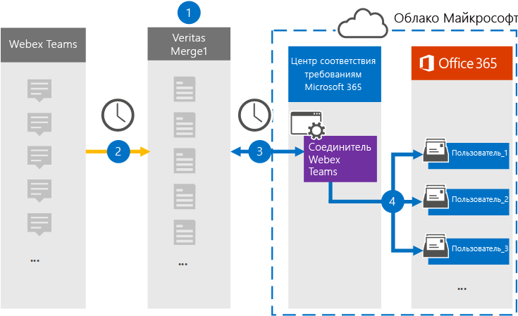

# Настройка соединитетеля для архива данных Webex Teams

Используйте соединитель Veritas в центре соответствия требованиям Microsoft 365 для импорта и архива данных из Webex Teams в почтовые ящики пользователей в организации Microsoft 365. Veritas предоставляет соединитель [Webex Teams,](https://globanet.com/webex-teams/) настроенный для захвата элементов связи Webex Teams и импорта их в Microsoft 365. Соединитатель преобразует контент из Webex Teams, например чаты 1:1, групповые беседы, беседы каналов и вложения из учетной записи Webex Teams организации, в формат сообщений электронной почты, а затем импортирует эти элементы в почтовый ящик пользователя в Microsoft 365.

После хранения данных Webex Teams в почтовых ящиках пользователей можно применить функции соответствия требованиям Microsoft 365, такие как хранение судебного разбирательства, поиск электронных данных, политики хранения и метки хранения, а также соответствие требованиям к связи. Использование соединиттеля Webex Teams для импорта и архива данных в Microsoft 365 может помочь вашей организации соблюдать государственные и нормативные политики.

## Обзор архива данных Webex Teams

В следующем обзоре рассказывается о процессе использования соединитетеля для архивации данных Webex Teams в Microsoft 365.

1. Ваша организация работает с Webex Teams для настройки и настройки сайта Webex Teams.

2. Каждые 24 часа элементы Webex Teams копируется на сайте Veritas Merge1. Соединителет также преобразует элементы Webex Teams в формат сообщений электронной почты.

3. Соединитель Webex Teams, который создается в центре соответствия требованиям Microsoft 365, подключается к veritas Merge1 каждый день и передает элементы Webex Teams в безопасное хранилище Azure в облаке Microsoft.

4. Соединитатель импортирует элементы в почтовые ящики определенных пользователей, используя значение свойства *Email* автоматического сопоставления пользователей, как описано в [шаге 3](#step-3-map-users-and-complete-the-connector-setup). Подмостки в папке "Входящие" с именем **Webex Teams** создаются в почтовых ящиках пользователей, и элементы импортируется в эту папку. Соединитатель делает это, используя значение свойства *Email.* Каждый элемент Webex Teams содержит это свойство, заполненное адресом электронной почты каждого участника элемента.

## Прежде чем начать

- Создайте учетную запись Veritas Merge1 для соединители Microsoft. Чтобы создать эту учетную запись, обратитесь в службу поддержки [клиентов Veritas.](https://globanet.com/ms-connectors-contact) При создании соединитетеля в шаге 1 вы вопишитесь в эту учетную запись.

- Создайте приложение для получения данных из учетной записи [https://developer.webex.com/](https://developer.webex.com) Webex Teams. Инструкции по пошаговой инструкции по созданию приложения см. в руководстве по пользователю [Merge1 Third-Party Connectors](https://docs.ms.merge1.globanetportal.com/Merge1%20Third-Party%20Connectors%20Webex%20Teams%20User%20Guide%20.pdf)

   При создании этого приложения платформа Webex создает набор уникальных учетных данных. Эти учетные данные используются в шаге 2 при настройке соединиттеля Webex Teams на сайте Global Merge1.

- Пользователь, создавший соединитель Webex Teams в шаге 1 (и завершивший его в шаге 3), должен быть назначен роли экспорта импорта почтовых ящиков в Exchange Online. Эта роль необходима для добавления соединители на странице **соединители** данных в центре соответствия требованиям Microsoft 365. По умолчанию эта роль не назначена группе ролей в Exchange Online. Вы можете добавить роль экспорта импорта почтовых ящиков в группу ролей управления организацией в Exchange Online. Или вы можете создать группу ролей, назначить роль экспортировать импорт почтовых ящиков, а затем добавить соответствующих пользователей в качестве участников. Дополнительные сведения см. в разделах Создание групп [ролей](/Exchange/permissions-exo/role-groups#create-role-groups) или [изменение](/Exchange/permissions-exo/role-groups#modify-role-groups) групп ролей в статье "Управление группами ролей в Exchange Online".

## Шаг 1. Настройка соединиттеля Webex Teams

На первом этапе необходимо  получить доступ к соединитетелям данных и настроить соединители [Webex Teams.](https://globanet.com/webex-teams/)

1. Перейдите [https://compliance.microsoft.com](https://compliance.microsoft.com/) к и нажмите **кнопку Соединители данных**  >  **Вебекс Teams**.

2. На странице **описания продукта Webex Teams** нажмите **кнопку Добавить соединителю**.

3. На странице **Условия службы нажмите** кнопку **Принять**.

4. Введите уникальное имя, идентифицируемое соединитетелем, а затем нажмите **кнопку Далее**.

5. Впишитесь в свою учетную запись Merge1, чтобы настроить соединители.

## Шаг 2. Настройка соединиттеля Webex Teams на сайте Слияния1 Veritas

Второй шаг — настройка соединиттеля Webex Teams на сайте Merge1. Сведения о настройке соединиттеля Webex Teams см. в руководстве по пользователю [Merge1 Сторонние соединители.](https://docs.ms.merge1.globanetportal.com/Merge1%20Third-Party%20Connectors%20Webex%20Teams%20User%20Guide%20.pdf)

После **нажатия кнопки Сохранить &**  finish отображается страница сопоставления пользователей в мастере соединители в центре соответствия требованиям Microsoft 365.

## Шаг 3. Карта пользователей и завершение установки соединитетеля

Чтобы составить карту пользователей и завершить установку соединитетеля в центре соответствия требованиям Microsoft 365, выполните следующие действия:

1. На странице **Map Webex Teams пользователи на странице Microsoft 365** включат автоматическое сопоставление пользователей. Элементы Webex Teams включают свойство *Email,* которое содержит адреса электронной почты для пользователей в организации. Если соединитатель может связать этот адрес с пользователем Microsoft 365, элементы импортируется в почтовый ящик этого пользователя.

2. Нажмите **кнопку Далее,** просмотрите параметры и перейдите на страницу соединители данных, чтобы просмотреть ход процесса импорта для нового соединитетеля. 

## Шаг 4. Мониторинг соединиттеля Вебекс групп

После создания соединиттеля Webex Teams можно просмотреть состояние соединитетеля в центре соответствия требованиям Microsoft 365.

1. Перейдите [https://compliance.microsoft.com](https://compliance.microsoft.com) и щелкните **соединители данных** в левом nav.

2. Щелкните **вкладку** Соединители, а затем выберите соединителет **Webex Teams,** чтобы отобразить страницу вылетов. На этой странице содержатся свойства и сведения о соединители.

3. В **состоянии Соединитель с исходным кодом** щелкните ссылку **Журнал** загрузки, чтобы открыть (или сохранить) журнал состояния соединитетеля. В этом журнале содержатся сведения о данных, импортируемых в облако Майкрософт.

## Известные проблемы

- В настоящее время мы не поддерживаем импорт вложений или элементов размером более 10 МБ. Поддержка более крупных элементов будет доступна позднее.