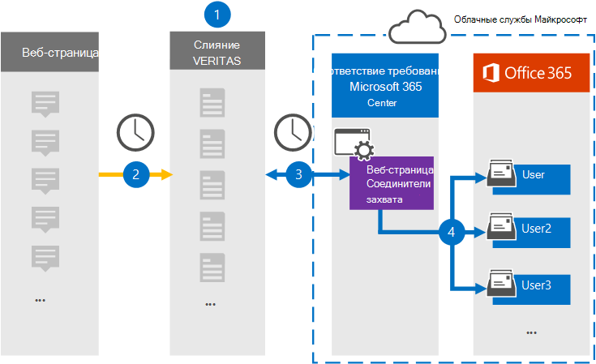

# Настройка соединитела для архива данных веб-страницыSet up a connector to archive webpage data

Используйте соединиталь Globanet в Центре соответствия требованиям Microsoft 365, чтобы импортировать и архивировать данные с веб-страниц в почтовые ящики пользователей в организации Microsoft 365.Use a Globanet connector in the Microsoft 365 compliance center to import and archive data from webpages to user mailboxes in your Microsoft 365 organization. Globanet предоставляет соединители [webpage Capture,](https://globanet.com/webpage-capture) которые захватывают определенные веб-страницы (и все ссылки на этих страницах) на определенном веб-сайте или во всем домене.Globanet provides a [Webpage Capture](https://globanet.com/webpage-capture) connector that captures specific webpages (and any links on those pages) in a specific website or an entire domain. Соединителя преобразует содержимое веб-страницы в формат PDF, PNG или настраиваемый формат файлов, а затем присоединяет преобразованные файлы к сообщению электронной почты, а затем импортирует эти элементы электронной почты в почтовые ящики пользователей в Microsoft 365.The connector converts the webpage content to a PDF, PNG, or custom file format and then attaches the converted files to an email message and then imports those email items to user mailboxes in Microsoft 365.

После сохранения содержимого веб-страницы в почтовых ящиках пользователей можно применить такие функции соответствия требованиям Microsoft 365, как хранение для судебного разбирательства, eDiscovery, а также политики хранения и метки хранения.After webpage content is stored in user mailboxes, you can apply Microsoft 365 compliance features such as Litigation Hold, eDiscovery, and retention policies and retention labels. Использование соединители webpage Capture для импорта и архива данных в Microsoft 365 может помочь вашей организации соблюдать правительственные и нормативные политики.Using a Webpage Capture connector to import and archive data in Microsoft 365 can help your organization stay compliant with government and regulatory policies.

## Обзор данных архивной веб-страницыOverview of archiving webpage data

В следующем обзоре объясняется процесс использования соединители для архивации содержимого веб-страниц в Microsoft 365.The following overview explains the process of using a connector to archive webpage content in Microsoft 365.

1. Организация работает с источником веб-страницы для настройки и настройки сайта webpage Capture.Your organization works with the webpage source to set up and configure a Webpage Capture site.

2. Каждые 24 часа элементы источников веб-страниц копируется на сайт Globanet Merge1.Once every 24 hours, the webpage sources items are copied to the Globanet Merge1 site. Соединителя также преобразует и присоединяет содержимое веб-страницы к сообщению электронной почты.The connector also converts and attaches the content of a webpage to an email message.

3. Соединитец Захвата веб-страниц, который вы создаете в Центре соответствия требованиям Microsoft 365, каждый день подключается к сайту Globanet Merge1 и переносит элементы веб-страницы в безопасное хранилище Azure в Облаке Майкрософт.The Webpage Capture connector that you create in the Microsoft 365 compliance center, connects to the Globanet Merge1 site every day and transfers the webpage items to a secure Azure Storage location in the Microsoft cloud.

4. Соединиталь импортирует преобразованные элементы веб-страницы в почтовые ящики определенных пользователей, используя значение свойства *"Электронная* почта" автоматического сопоставления пользователей, как описано в шаге [3.](#step-3-map-users-and-complete-the-connector-setup)The connector imports the converted webpage items to the mailboxes of specific users by using the value of the *Email* property of the automatic user mapping as described in [Step 3](#step-3-map-users-and-complete-the-connector-setup). В почтовых ящиках пользователей создается вложенная папка в папке "Входящие" с именем **Webpage Capture,** и элементы веб-страницы импортируется в эту папку.A subfolder in the Inbox folder named **Webpage Capture** is created in the user mailboxes, and the webpage items are imported to that folder. Для этого соединители используют значение свойства *Email.*The connector does this by using the value of the *Email* property. Каждый элемент веб-страницы содержит это свойство, которое заполняется адресами электронной почты, предоставленными при настройке соединителя webpage Capture в шаге [2.](#step-2-configure-the-webpage-capture-connector-on-the-globanet-merge1-site)Every webpage item contains this property, which is populated with the email addresses provided when you configure the Webpage Capture connector in [Step 2](#step-2-configure-the-webpage-capture-connector-on-the-globanet-merge1-site).

## Перед началом работыBefore you begin

- Создайте учетную запись Globanet Merge1 для соединители Майкрософт.Create a Globanet Merge1 account for Microsoft connectors. Чтобы создать эту учетную запись, обратитесь в службу поддержки клиентов [Globanet.](https://globanet.com/ms-connectors-contact/)To create this account, contact [Globanet Customer Support](https://globanet.com/ms-connectors-contact/). Вход в эту учетную запись будет происходить при создании соединители на шаге 1.You will sign into this account when you create the connector in Step 1.

- Необходимо работать с поддержкой Globanet, чтобы настроить настраиваемый формат файлов для преобразования элементов веб-страницы.You need to work with Globanet support to set up a custom file format to convert the webpage items to. Дополнительные сведения см. в руководстве пользователя по соединитетелям Merge1For more information, see the Merge1 Third-Party Connectors User Guide in 

- Пользователь, создавший соединитель webpage Capture на шаге 1 (и завершивший его на шаге 3), должен быть назначен роли импорта и экспорта почтовых ящиков в Exchange Online.The user who creates the Webpage Capture connector in Step 1 (and completes it in Step 3) must be assigned to the Mailbox Import Export role in Exchange Online. Эта роль необходима для добавления соединителю на странице **"Соединители** данных" в Центре соответствия требованиям Microsoft 365.This role is required to add connectors on the **Data connectors** page in the Microsoft 365 compliance center. По умолчанию эта роль не назначена группе ролей в Exchange Online.By default, this role is not assigned to a role group in Exchange Online. Вы можете добавить роль "Импорт и экспорт почтового ящика" в группу ролей "Управление организацией" в Exchange Online.You can add the Mailbox Import Export role to the Organization Management role group in Exchange Online. Можно также создать группу ролей, назначить роль "Импорт и экспорт почтового ящика" и добавить соответствующих пользователей в качестве участников.Or you can create a role group, assign the Mailbox Import Export role, and then add the appropriate users as members. Дополнительные сведения см. в  разделах ["Создание](https://docs.microsoft.com/Exchange/permissions-exo/role-groups#create-role-groups) групп ролей" или "Изменение групп ролей" статьи "Управление группами ролей в Exchange Online".For more information, see the [Create role groups](https://docs.microsoft.com/Exchange/permissions-exo/role-groups#create-role-groups) or [Modify role groups](https://docs.microsoft.com/Exchange/permissions-exo/role-groups#modify-role-groups) sections in the article "Manage role groups in Exchange Online".

## Шаг 1. Настройка соединители webpage CaptureStep 1: Set up the Webpage Capture connector

Сначала необходимо получить доступ к соединитетелям **данных** и создать соединители для исходных данных веб-страницы.The first step is to access to the **Data Connectors** and create a connector for Web Page source data.

1. Go to [https://compliance.microsoft.com](https://compliance.microsoft.com/) and then click Data **connectors**  >  **Webpage Capture**.Go to [https://compliance.microsoft.com](https://compliance.microsoft.com/) and then click **Data connectors** > **Webpage Capture**.

2. На странице **описания продукта Webpage Capture** нажмите кнопку **"Добавить соединителю".**On the **Webpage Capture** product description page, click **Add connector**.

3. На странице **"Условия обслуживания" нажмите** кнопку **"Принять".**On the **Terms of service** page, click **Accept**.

4. Введите уникальное имя, идентифицируя соединители, и нажмите кнопку **"Далее".**Enter a unique name that identifies the connector, and then click **Next**.

5. Во sign in to your Merge1 account to configure the connector.Sign in to your Merge1 account to configure the connector.

## Шаг 2. Настройте соединители webpage Capture на сайте Globanet Merge1Step 2: Configure the Webpage Capture connector on the Globanet Merge1 site

На втором этапе необходимо настроить соединители webpage Capture на сайте Globanet Merge1.The second step is to configure the Webpage Capture connector on the Globanet Merge1 site. Сведения о настройке соединители захвата веб-страниц см. в руководстве пользователя [Merge1 Third-Party Connectors.](https://docs.ms.merge1.globanetportal.com/Merge1%20Third-Party%20Connectors%20Web%20Page%20Capture%20User%20Guide%20.pdf)For information about how to configure the Webpage Capture connector, see [Merge1 Third-Party Connectors User Guide](https://docs.ms.merge1.globanetportal.com/Merge1%20Third-Party%20Connectors%20Web%20Page%20Capture%20User%20Guide%20.pdf).

После нажатия кнопки  **"Сохранить & Готово"** отображается страница сопоставления пользователей в мастере соединители в Центре соответствия требованиям Microsoft 365.After you click **Save & Finish**, the **User mapping** page in the connector wizard in the Microsoft 365 compliance center is displayed.

## Шаг 3. Соединяем пользователей и завершаем настройку соединителиStep 3: Map users and complete the connector setup

Чтобы связать пользователей и завершить настройку соединители в Центре соответствия требованиям Microsoft 365, выполните следующие действия:To map users and complete the connector setup in the Microsoft 365 compliance center, follow the steps below:

1. На странице "Сопоставление пользователей веб-страницы захвата с **пользователями Microsoft 365"** включите автоматическое сопоставление пользователей.On the **Map Webpage Capture users to Microsoft 365 users** page, enable automatic user mapping. Элементы webpage Capture содержат свойство *Email,* которое содержит адреса электронной почты для пользователей в организации.The Webpage Capture items include a property called *Email*, which contains email addresses for users in your organization. Если соединители могут связать этот адрес с пользователем Microsoft 365, элементы будут импортироваться в почтовый ящик этого пользователя.If the connector can associate this address with a Microsoft 365 user, the items are imported to that user's mailbox.

2. Нажмите **кнопку**"Далее", просмотрите параметры и перейдите на страницу "Соединители данных", чтобы просмотреть ход процесса импорта нового соединитела. Click **Next**, review your settings, and go to the **Data connectors** page to see the progress of the import process for the new connector.

## Шаг 4. Отслеживание соединители webpage CaptureStep 4: Monitor the Webpage Capture connector

После создания соединители записи веб-страниц можно просмотреть состояние соединитела в Центре соответствия требованиям Microsoft 365.After you create the Webpage Capture connector, you can view the connector status in the Microsoft 365 compliance center.

1. Go to [https://compliance.microsoft.com](https://compliance.microsoft.com) and click **Data connectors** in the left nav.Go to [https://compliance.microsoft.com](https://compliance.microsoft.com) and click **Data connectors** in the left nav.

2. Перейдите **на вкладку** "Соединители", а затем выберите соединиталь **"Захват** веб-страниц", чтобы отобразить страницу отображения.Click the **Connectors** tab and then select the **Webpage Capture** connector to display the flyout page. На этой странице содержатся свойства и сведения о соединители.This page contains the properties and information about the connector.

3. В **состоянии соединители с источником** щелкните ссылку журнала загрузки, чтобы открыть (или сохранить) журнал состояния для соединитела. Under **Connector status with source**, click the **Download log** link to open (or save) the status log for the connector. Этот журнал содержит данные, импортируемые в облако Майкрософт.This log contains data that has been imported to the Microsoft cloud.

## Известные проблемыKnown issues

- В настоящее время мы не поддерживаем импорт вложений или элементов размером более 10 МБ.At this time, we don't support importing attachments or items that are larger than 10 MB. Поддержка более крупных элементов будет доступна позже.Support for larger items will be available at a later date.
