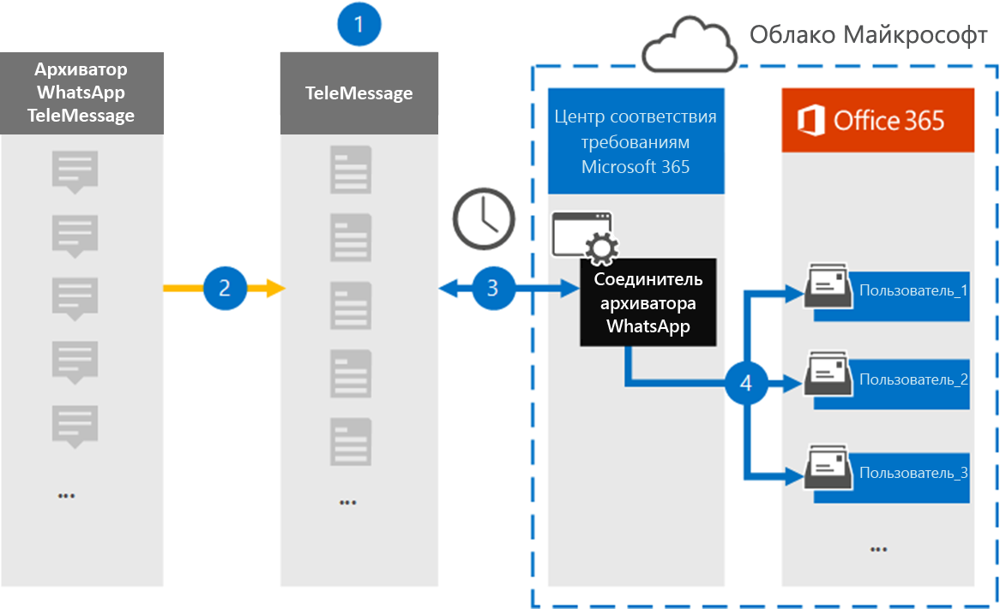

# Настройка соединитела для архива данных WhatsApp

Используйте соединители TeleMessage в Центре соответствия требованиям Microsoft 365 для импорта и архива вызовов, чатов, вложений, файлов и удаленных сообщений WhatsApp. После настройки и настройки соединители подключаются к учетной записи TeleMessage вашей организации каждый день и импортируют мобильную связь сотрудников с помощью архиватора телефона WhatsApp Или TeleMessage Whatssage WhatsApp Cloud Archiver в почтовые ящики в Microsoft 365.

После сохранения данных WhatsApp в почтовых ящиках пользователей к данным WhatsApp можно применить такие функции соответствия требованиям Microsoft 365, как хранение для судебного разбирательства, поиск контента и политики хранения Microsoft 365. Например, можно искать сообщения WhatsApp с помощью поиска контента или связывать почтовый ящик, содержащий сообщения WhatsApp, с хранителями в деле Advanced eDiscovery. Использование соединители WhatsApp для импорта и архива данных в Microsoft 365 может помочь вашей организации соблюдать правительственные и нормативные политики.

## Обзор архивных данных WhatsApp

В следующем обзоре объясняется процесс использования соединители для архивации данных WhatsApp в Microsoft 365.

1. Ваша организация работает с TeleMessage, чтобы настроить соединители архиватора WhatsApp. Дополнительные сведения см. в [архиве WhatsApp.](https://www.telemessage.com/office365-activation-for-whatsapp-archiver)

2. Каждые 24 часа данные WhatsApp организации копируется на сайт TeleMessage.

3. Соединители WhatsApp, которые вы создаете в Центре соответствия требованиям Microsoft 365, каждый день подключаются к сайту TeleMessage и переносят данные WhatsApp из предыдущих 24 часов в безопасное хранилище Azure в Microsoft Cloud. Соединителет также преобразует данные контента WhatsApp в формат сообщений электронной почты.

4. Соединиталь импортирует данные WhatsApp в почтовый ящик определенного пользователя. В почтовом ящике определенного пользователя создается новая папка с именем **WhatsApp Archiver,** в нее импортируется элемент. Соединитегор делает это сопоставление, используя значение свойства адреса *электронной почты* пользователя. Каждое сообщение WhatsApp содержит это свойство, которое заполняется адресом электронной почты каждого участника сообщения.

   Помимо автоматического сопоставления пользователей с  использованием значения свойства адреса электронной почты пользователя, можно также реализовать пользовательское сопоставление, загрузив CSV-файл сопоставления. Этот файл сопоставления содержит номер мобильного телефона и соответствующий адрес электронной почты Microsoft 365 для пользователей в организации. Если включить как автоматическое сопоставление пользователей, так и пользовательское сопоставление, для каждого элемента WhatsApp соедините имя сначала ищет настраиваемый файл сопоставления. Если он не найдет допустимого пользователя Microsoft 365, соответствующего номеру мобильного телефона пользователя, соединитетель будет использовать значения в свойстве адреса электронной почты элемента, который он пытается импортировать. Если соединители не нашли допустимого пользователя Microsoft 365 в пользовательском файле сопоставления или в свойстве адреса электронной почты элемента WhatsApp, элемент не будет импортирован.

## Перед началом работы

Некоторые этапы реализации, необходимые для архивации данных связи WhatsApp, являются внешними для Microsoft 365 и должны быть выполнены перед созданием соединители в Центре соответствия требованиям.

- Заказать [службу архивации WhatsApp из TeleMessage](https://www.telemessage.com/mobile-archiver/order-mobile-archiver-for-o365) и получить допустимую учетную запись администрирования для вашей организации. Вам потребуется войти в эту учетную запись при создании соединитела в Центре соответствия требованиям.

- Зарегистрируйте всех пользователей, для чего требуется архивировать WhatsApp, в учетной записи TeleMessage. При регистрации пользователей обязательно используйте тот же адрес электронной почты, который используется для их учетной записи Microsoft 365.

- Установите приложение TeleMessage [WhatsApp Phone Archiver](https://www.telemessage.com/mobile-archiver/whatsapp-phone-archiver-2/) на мобильных телефонах сотрудников и активируйте его. Кроме того, вы можете установить обычные приложения WhatsApp или WhatsApp Business на мобильные телефоны сотрудников и активировать службу архивирования WhatsApp, сканировав QR-код на веб-сайте TeleMessage. Дополнительные сведения см. в теме ["Облачный архив whatsApp".](https://www.telemessage.com/mobile-archiver/whatsapp-archiver/whatsapp-cloud-archiver/)

- Пользователю, создателю соединителя Verizon Network, должна быть назначена роль импорта и экспорта почтовых ящиков в Exchange Online. Это необходимо для добавления соединителю на странице **"Соединители** данных" в Центре соответствия требованиям Microsoft 365. По умолчанию эта роль не назначена ни одной группе ролей в Exchange Online. Вы можете добавить роль "Импорт и экспорт почтового ящика" в группу ролей "Управление организацией" в Exchange Online. Можно также создать группу ролей, назначить роль "Импорт и экспорт почтового ящика" и добавить соответствующих пользователей в качестве участников. Дополнительные сведения см. в  разделах ["Создание](https://docs.microsoft.com/Exchange/permissions-exo/role-groups#create-role-groups) групп ролей" или "Изменение групп ролей" статьи "Управление группами ролей в Exchange Online".

## Создание соединитела архива WhatsApp

После выполнения необходимых условий, описанных в предыдущем разделе, вы можете создать соединители WhatsApp в Центре соответствия требованиям Microsoft 365. Соединиталь использует сведения, которые вы предоставляете, для подключения к сайту TeleMessage и передачи данных WhatsApp в соответствующие поля почтовых ящиков пользователей в Microsoft 365.

1. Go to [https://compliance.microsoft.com](https://compliance.microsoft.com/) and then click Data **connectors**  >  **WhatsApp Archiver**.

2. На странице **описания продукта архиватора WhatsApp** нажмите кнопку **"Добавить соединителю".**

3. На странице **"Условия обслуживания" нажмите** кнопку **"Принять".**

4. На странице входа в **TeleMessage** в шаге 3 введите необходимые сведения в следующих полях и нажмите кнопку **"Далее".**

   - **Имя пользователя:** Имя пользователя TeleMessage.

   - **Пароль:** Пароль TeleMessage.

5. После создания соединители можно закрыть всплывающее окно и перейти на следующую страницу.

6. На странице **сопоставления пользователей** включайте автоматическое сопоставление пользователей и нажмите кнопку **"Далее".** Если вам потребуется пользовательское сопоставление, загрузите CSV-файл и нажмите кнопку **"Далее".**

7. Просмотрите параметры и нажмите кнопку **"Готово",** чтобы создать соединители.

8. Перейдите на вкладку "Соединители" на странице **"Соединители** данных", чтобы увидеть ход процесса импорта нового соединитела.

## Известные проблемы

- В настоящее время мы не поддерживаем импорт вложений или элементов размером более 10 МБ. Поддержка более крупных элементов будет доступна позже.
