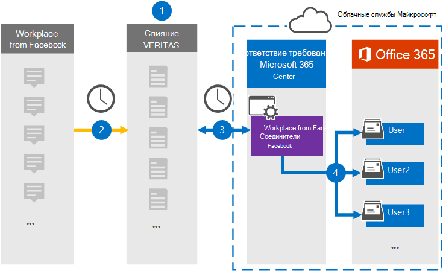

# Настройка соединитетеля для архива рабочих мест из данных FacebookSet up a connector to archive Workplace from Facebook data

Используйте соединитель Veritas в центре Microsoft 365 для импорта и архива данных с рабочего места из Facebook в почтовые ящики пользователей в Microsoft 365 организации.Use a Veritas connector in the Microsoft 365 compliance center to import and archive data from Workplace from Facebook to user mailboxes in your Microsoft 365 organization. Veritas предоставляет рабочее место из [соединителя Facebook,](https://globanet.com/workplace/) настроенное для захвата элементов из стороннего источника данных (на регулярной основе) и импорта этих элементов в Microsoft 365.Veritas provides a [Workplace from Facebook](https://globanet.com/workplace/) connector that is configured to capture items from the third-party data source (on a regular basis) and import those items to Microsoft 365. Соединитатель преобразует содержимое, например чаты, вложения, сообщения и видео с Рабочего места в формат сообщений электронной почты, а затем импортирует эти элементы в почтовые ящики пользователей в Microsoft 365.The connector converts the content such as chats, attachments, posts, and videos from Workplace to an email message format and then imports those items to user mailboxes in Microsoft 365.

После хранения данных на рабочем месте в почтовых ящиках пользователей можно применить Microsoft 365, такие как хранение судебного разбирательства, электронные сведения, политики хранения и метки хранения, а также соответствие требованиям связи.After Workplace data is stored in user mailboxes, you can apply Microsoft 365 compliance features such as Litigation Hold, eDiscovery, retention policies and retention labels, and communication compliance. Использование рабочих мест из соединиттеля Facebook для импорта и архива данных в Microsoft 365 может помочь вашей организации соблюдать государственные и нормативные политики.Using Workplace from Facebook connector to import and archive data in Microsoft 365 can help your organization stay compliant with government and regulatory policies.

## Обзор архива рабочих мест из данных FacebookOverview of archiving Workplace from Facebook data

В следующем обзоре объясняется процесс использования соединитетеля для архивации данных workplace в Microsoft 365.The following overview explains the process of using a connector to archive Workplace data in Microsoft 365.

1. Ваша организация работает с Workplace из Facebook для настройки и настройки сайта Workplace.Your organization works with Workplace from Facebook to set up and configure a Workplace site.

2. Каждые 24 часа элементы из Workplace копируется на сайт Veritas Merge1.Once every 24 hours, items from Workplace are copied to the Veritas Merge1 site. Соединителет также преобразует содержимое этих элементов в формат сообщений электронной почты.The connector also converts the content of these items to an email message format.

3. Рабочее место из соединителя Facebook, которое вы создаете в центре Microsoft 365 соответствия требованиям, подключается к Veritas Merge1 каждый день и передает элементы Workplace в безопасное расположение служба хранилища Azure в облаке Microsoft.The Workplace from Facebook connector that you create in the Microsoft 365 compliance center, connects to the Veritas Merge1 every day, and transfers the Workplace items to a secure Azure Storage location in the Microsoft cloud.

4. Соединитатель импортирует преобразованные элементы в почтовые ящики определенных пользователей, используя значение свойства *Email* автоматического сопоставления пользователей, как описано в шаге 3.The connector imports the converted items to the mailboxes of specific users using the value of the *Email* property of the automatic user mapping as described in Step 3. Создается подмостка в папке "Входящие" с именем Workplace из **Facebook,** и элементы Workplace импортируется в эту папку.A subfolder in the Inbox folder named **Workplace from Facebook** is created, and the Workplace items are imported to that folder. Соединитатель делает это, используя значение свойства *Email.*The connector does this by using the value of the *Email* property. Каждый элемент Workplace содержит это свойство, которое заполняется адресом электронной почты каждого участника чата или сообщения.Every Workplace item contains this property, which is populated with the email address of every chat or post participant.

## Прежде чем начатьBefore you begin

- Создайте учетную запись Veritas Merge1 для соединители Microsoft.Create a Veritas Merge1 account for Microsoft connectors. Чтобы создать эту учетную запись, обратитесь в службу поддержки [клиентов Veritas.](https://globanet.com/ms-connectors-contact)To create this account, contact [Veritas Customer Support](https://globanet.com/ms-connectors-contact). При создании соединитетеля в шаге 1 вы вопишитесь в эту учетную запись.You will sign into this account when you create the connector in Step 1.

- Создайте настраиваемую интеграцию для получения данных из Workplace с помощью API для обеспечения соответствия требованиям и для целей получения https://my.workplace.com/work/admin/apps/ электронных данных.Create a custom integration at https://my.workplace.com/work/admin/apps/ to retrieve data from Workplace via APIs for compliance and eDiscovery purposes.

   При создании интеграции платформа Workplace создает набор уникальных учетных данных, используемых для создания маркеров, используемых для проверки подлинности.When creating the integration, the Workplace platform generates a set of unique credentials used to generate tokens that are used for authentication. Эти маркеры используются в мастере конфигурации конфигурации рабочих мест на Facebook в шаге 2.These tokens are used in the Workplace from Facebook connector configuration wizard in Step 2. Инструкции по пошаговой инструкции по созданию приложений см. в руководстве по пользователю [Merge1 Third-Party Connectors.](https://docs.ms.merge1.globanetportal.com/Merge1%20Third-Party%20Connectors%20Workplace%20from%20Facebook%20User%20Guide%20.pdf)For step-by step instructions about how to create the applications, see [Merge1 Third-Party Connectors User Guide](https://docs.ms.merge1.globanetportal.com/Merge1%20Third-Party%20Connectors%20Workplace%20from%20Facebook%20User%20Guide%20.pdf).

- Пользователь, создававший рабочее место из соединиттеля Facebook в шаге 1 (и завершивший его в шаге 3), должен быть назначен роли импорта почтовых ящиков в Exchange Online.The user who creates the Workplace from Facebook connector in Step 1 (and completes it in Step 3) must be assigned to the Mailbox Import Export role in Exchange Online. Эта роль необходима для добавления соединители на **странице** соединители данных в центре Microsoft 365 соответствия требованиям.This role is required to add connectors on the **Data connectors** page in the Microsoft 365 compliance center. По умолчанию эта роль не назначена группе ролей в Exchange Online.By default, this role is not assigned to a role group in Exchange Online. Вы можете добавить роль экспорта импорта почтовых ящиков в группу ролей управления организацией в Exchange Online.You can add the Mailbox Import Export role to the Organization Management role group in Exchange Online. Или вы можете создать группу ролей, назначить роль экспортировать импорт почтовых ящиков, а затем добавить соответствующих пользователей в качестве участников.Or you can create a role group, assign the Mailbox Import Export role, and then add the appropriate users as members. Дополнительные сведения см. в разделах [Создание](/Exchange/permissions-exo/role-groups#create-role-groups) групп ролей или [изменение](/Exchange/permissions-exo/role-groups#modify-role-groups) групп ролей в статье "Управление группами ролей в Exchange Online".For more information, see the [Create role groups](/Exchange/permissions-exo/role-groups#create-role-groups) or [Modify role groups](/Exchange/permissions-exo/role-groups#modify-role-groups) sections in the article "Manage role groups in Exchange Online".

## Шаг 1. Настройка рабочего места из соединитетеля FacebookStep 1: Set up the Workplace from Facebook connector

Первый шаг — доступ  к странице Соединители данных в центре Microsoft 365 и создание соединитетеля для данных workplace.The first step is to access to the **Data Connectors** page in the Microsoft 365 compliance center and create a connector for Workplace data.

1. Перейдите к [https://compliance.microsoft.com](https://compliance.microsoft.com/) и нажмите **соединители данные** На рабочем месте из  >  **Facebook**.Go to [https://compliance.microsoft.com](https://compliance.microsoft.com/) and then click **Data connectors** > **Workplace from Facebook**.

2. На странице **Описание продукта Facebook** на рабочем месте нажмите **кнопку Добавить соединителю**.On the **Workplace from Facebook** product description page, click **Add connector**.

3. На странице **Условия службы нажмите** кнопку **Принять**.On the **Terms of service** page, click **Accept**.

4. Введите уникальное имя, идентифицируемое соединитетелем, а затем нажмите **кнопку Далее**.Enter a unique name that identifies the connector, and then click **Next**.

5. Впишитесь в свою учетную запись Merge1, чтобы настроить соединители.Sign in to your Merge1 account to configure the connector.

## Шаг 2. Настройка рабочего места с соединителя Facebook на сайте Veritas Merge1Step 2: Configure the Workplace from Facebook connector on the Veritas Merge1 site

Второй шаг — настройка рабочего места из соединители Facebook на сайте Merge1.The second step is to configure the Workplace from Facebook connector on the Merge1 site. Сведения о настройке рабочего места из соединители Facebook см. в руководстве по пользователю [Merge1 Third-Party Connectors.](https://docs.ms.merge1.globanetportal.com/Merge1%20Third-Party%20Connectors%20Workplace%20from%20Facebook%20User%20Guide%20.pdf)For information about how to configure the Workplace from Facebook connector, see [Merge1 Third-Party Connectors User Guide](https://docs.ms.merge1.globanetportal.com/Merge1%20Third-Party%20Connectors%20Workplace%20from%20Facebook%20User%20Guide%20.pdf).

После нажатия **кнопки Сохранить &**  finish отображается страница сопоставления пользователей в мастере соединители в центре Microsoft 365 соответствия требованиям.After you click **Save & Finish**, the **User mapping** page in the connector wizard in the Microsoft 365 compliance center is displayed.

## Шаг 3. Карта пользователей и завершение установки соединитетеляStep 3: Map users and complete the connector setup

Чтобы составить карту пользователей и завершить установку соединитетеля в центре Microsoft 365 соответствия требованиям, выполните следующие действия:To map users and complete the connector setup in the Microsoft 365 compliance center, follow these steps:

1. На странице **Сопоставление внешних** пользователей для Microsoft 365 пользователей включаем автоматическое сопоставление пользователей.On the **Map external users to Microsoft 365 users** page, enable automatic user mapping. Элементы Workplace включают свойство *Email,* которое содержит адреса электронной почты для пользователей в организации.The Workplace items include a property called *Email* that contains email addresses for users in your organization. Если соединитатель может связать этот адрес с Microsoft 365 пользователем, элементы импортируется в почтовый ящик этого пользователя.If the connector can associate this address with a Microsoft 365 user, the items are imported to that user’s mailbox.

2. Нажмите **кнопку Далее,** просмотрите параметры и перейдите на страницу соединители данных, чтобы просмотреть ход процесса импорта для нового соединитетеля. Click **Next**, review your settings, and then go to the **Data connectors** page to see the progress of the import process for the new connector.

## Шаг 4. Мониторинг рабочего места из соединитетеля FacebookStep 4: Monitor the Workplace from Facebook connector

После создания рабочего места из соединители Facebook можно просмотреть состояние соединитетеля в центре Microsoft 365 соответствия требованиям.After you create the Workplace from Facebook connector, you can view the connector status in the Microsoft 365 compliance center.

1. Перейдите [https://compliance.microsoft.com](https://compliance.microsoft.com) и щелкните **соединители данных** в левом nav.Go to [https://compliance.microsoft.com](https://compliance.microsoft.com) and click **Data connectors** in the left nav.

2. Щелкните **вкладку** Соединители, а затем выберите рабочее место из **соединитетеля Facebook,** чтобы отобразить страницу вылетов.Click the **Connectors** tab and then select the **Workplace from Facebook** connector to display the flyout page. На этой странице содержатся свойства и сведения о соединители.This page contains the properties and information about the connector.

3. В **состоянии Соединитель с исходным кодом** щелкните ссылку **Журнал** загрузки, чтобы открыть (или сохранить) журнал состояния соединитетеля.Under **Connector status with source**, click the **Download log** link to open (or save) the status log for the connector. В этом журнале содержатся сведения о данных, импортируемых в облако Майкрософт.This log contains information about the data that has been imported to the Microsoft cloud.

## Известные проблемыKnown issues

- В настоящее время мы не поддерживаем импорт вложений или элементов размером более 10 МБ.At this time, we don't support importing attachments or items that are larger than 10 MB. Поддержка более крупных элементов будет доступна позднее.Support for larger items will be available at a later date.