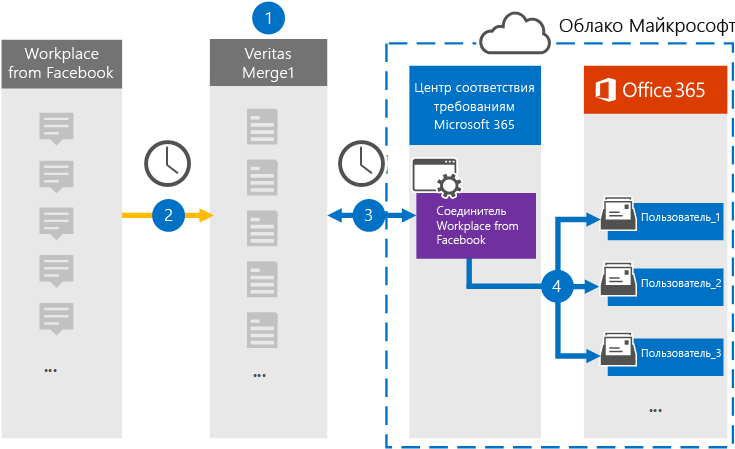

# Настройка соединителя для архивации на рабочем месте из данных Facebook

Используйте соединитель Глобанет в центре соответствия требованиям Microsoft 365, чтобы импортировать и архивировать данные с рабочего места из Facebook в почтовые ящики пользователей в организации Microsoft 365. Глобанет обеспечивает [рабочее место от соединителя Facebook](https://globanet.com/workplace/) , настроенного для сбора элементов из стороннего источника данных (на регулярной основе) и импорта этих элементов в Microsoft 365. Соединитель преобразует такие элементы, как беседы, вложения, записи и видеозаписи с рабочего места, в формат сообщений электронной почты, а затем импортирует их в почтовые ящики пользователей в Microsoft 365.

После хранения данных на рабочем месте в почтовых ящиках пользователей можно применять функции обеспечения соответствия требованиям Microsoft 365, такие как хранение для судебного разбирательства, обнаружение электронных данных, политики хранения и метки хранения, а также соответствие требованиям. Использование функции "Рабочая область" из соединителя Facebook для импорта и архивирования данных в Microsoft 365 может помочь организации соответствовать государственным и нормативным политикам.

## Общие сведения о архивации данных на рабочем месте из данных Facebook

В следующем обзоре описывается процесс использования соединителя для архивации данных о рабочих местах в Microsoft 365.

1. Ваша организация работает с разработкой из Facebook для установки и настройки сайта рабочей области.

2. Каждые 24 часа элементы из рабочего места копируются на сайт Глобанет Merge1. Соединитель также Преобразовывает содержимое этих элементов в формат сообщения электронной почты.

3. Место на рабочем месте из соединителя Facebook, созданного в центре соответствия требованиям Microsoft 365, подключается к Глобанет Merge1 каждый день и передает элементы рабочего места в безопасное место хранения Azure в облаке Майкрософт.

4. Соединитель импортирует преобразованные элементы в почтовые ящики определенных пользователей, используя значение свойства *Email* для автоматического сопоставления пользователей, как описано в шаге 3. Создается вложенная папка в папке "Входящие" с именем "Рабочая область" **из Facebook** , а элементы рабочего места импортируются в эту папку. Соединитель выполняет это, используя значение свойства *Email* . Каждый элемент рабочей области содержит это свойство, которое заполняется электронным адресом каждого чата или каждого участника.

## Прежде чем начать

- Создайте учетную запись Глобанет Merge1 для соединителей Майкрософт. Чтобы создать эту учетную запись, обратитесь в службу [поддержки пользователей глобанет](https://globanet.com/ms-connectors-contact). Вы будете входить в эту учетную запись, когда вы создадите соединитель на шаге 1.

- Создание настраиваемой интеграции https://my.workplace.com/work/admin/apps/ для получения данных с рабочего места с помощью API для обеспечения соответствия требованиям и обнаружения электронных данных.

   При создании интеграции платформа на рабочем месте создает набор уникальных учетных данных, используемых для создания маркеров, используемых для проверки подлинности. Эти маркеры используются на рабочем месте с помощью мастера настройки соединителя Facebook в шаге 2. Пошаговые инструкции по созданию приложений можно найти в [руководстве пользователя Merge1 Connector Connectors](https://docs.ms.merge1.globanetportal.com/Merge1%20Third-Party%20Connectors%20Workplace%20from%20Facebook%20User%20Guide%20.pdf).

- Пользователь, который создает рабочее место из соединителя Facebook на этапе 1 (и выполняет его на шаге 3), должен быть назначен роли импорта почтовых ящиков в Exchange Online. Эта роль необходима для добавления соединителей на странице " **соединители данных** " в центре соответствия требованиям Microsoft 365. По умолчанию эта роль не назначена группе ролей в Exchange Online. Вы можете добавить роль экспорта для импорта почтовых ящиков в группу ролей Управление организацией в Exchange Online. Вы также можете создать группу ролей, назначить роль импорта для импорта почтовых ящиков, а затем добавить соответствующих пользователей в качестве участников. Для получения дополнительных сведений обратитесь к разделу [Создание](https://docs.microsoft.com/Exchange/permissions-exo/role-groups#create-role-groups) групп ролей или [изменение групп ролей](https://docs.microsoft.com/Exchange/permissions-exo/role-groups#modify-role-groups) статьи "Управление группами ролей в Exchange Online".

## Шаг 1: Настройка рабочего места в соединителе Facebook

Первый шаг — доступ к странице " **соединители данных** " в центре соответствия требованиям Microsoft 365 и создание соединителя для данных о рабочем месте.

1. Перейдите в раздел [https://compliance.microsoft.com](https://compliance.microsoft.com/) **соединители данных**  >  **от Facebook** и нажмите кнопку соединители данных.

2. На странице "на **рабочем месте** " в разделе "Описание продукта Facebook" нажмите **Добавить соединитель** .

3. На странице **условия обслуживания** нажмите кнопку **принять** .

4. Введите уникальное имя, идентифицирующее соединитель, а затем нажмите кнопку **Далее** .

5. Войдите в свою учетную запись Merge1, чтобы настроить соединитель.

## Шаг 2: Настройка рабочего места на сайте Facebook Connector на сайте Глобанет Merge1

Второй шаг — Настройка места на рабочем месте из соединителя Facebook на сайте Merge1. Сведения о том, как настроить рабочее место на сайте Facebook Connector, можно найти в [руководстве пользователя Merge1 Connector Connectors](https://docs.ms.merge1.globanetportal.com/Merge1%20Third-Party%20Connectors%20Workplace%20from%20Facebook%20User%20Guide%20.pdf).

После нажатия кнопки **сохранить & готово** отображается страница **Сопоставление пользователей** в мастере соединителей в центре соответствия требованиям Microsoft 365.

## Шаг 3: сопоставление пользователей и завершение установки соединителя

Чтобы сопоставить пользователей и завершить настройку соединителя в центре соответствия требованиям Microsoft 365, выполните указанные ниже действия.

1. На странице " **сопоставление внешних пользователей с Microsoft 365 пользователей** " Включите автоматическое сопоставление пользователей. Элементы рабочего места включают свойство *Email* , которое содержит адреса электронной почты для пользователей в Организации. Если соединитель может сопоставить этот адрес с пользователем Microsoft 365, элементы будут импортированы в почтовый ящик этого пользователя.

2. На странице **"согласие администратора** " щелкните **предоставить согласие** . Вы будете перенаправлены на сайт Майкрософт. Нажмите кнопку **принять** , чтобы предоставить согласие.
  
   Ваша организация должна разрешить службе импорта Office 365 доступ к данным почтовых ящиков в Организации. Чтобы предоставить согласие администратора, необходимо войти в систему, используя учетные данные глобального администратора Microsoft 365, а затем принять запрос согласия. Если вы не вошли в систему как глобальный администратор, вы можете перейти на [эту страницу](https://login.microsoftonline.com/common/oauth2/authorize?client_id=570d0bec-d001-4c4e-985e-3ab17fdc3073&response_type=code&redirect_uri=https://portal.azure.com/&nonce=1234&prompt=admin_consent) и войти в систему, используя учетные данные глобального администратора, чтобы принять запрос.

3. Нажмите кнопку **Далее** , проверьте параметры, а затем перейдите на страницу " **соединители данных** ", чтобы просмотреть ход процесса импорта для нового соединителя.

## Шаг 4: мониторинг места на рабочем месте через соединитель Facebook

После создания места на рабочем месте из соединителя Facebook вы можете просмотреть состояние соединителя в центре соответствия требованиям Microsoft 365.

1. Перейдите к разделу [https://compliance.microsoft.com](https://compliance.microsoft.com) **соединители данных** в левой панели навигации и нажмите кнопку соединители данных.

2. Перейдите на вкладку **соединители** и выберите в поле Рабочая область на **сайте Facebook** Connector, чтобы отобразить всплывающую страницу. На этой странице представлены свойства и сведения о соединителе.

3. В разделе **состояние соединителя с источником** выберите ссылку **журнал загрузки** , чтобы открыть (или сохранить) журнал состояний для соединителя. Этот журнал содержит сведения о данных, импортированных в Microsoft Cloud.

## Известные проблемы

- В настоящее время импорт вложений или элементов, размер которых превышает 10 МБ, не поддерживается. Поддержка элементов с большим сроком действия будет доступна позже.
