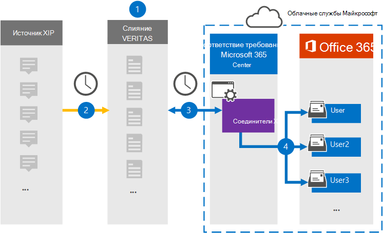

# Настройка соединителя для архивации исходных данных КСИПSet up a connector to archive XIP source data

Используйте соединитель Глобанет в центре соответствия требованиям Microsoft 365 для импорта и архивирования данных из исходной платформы КСИП в почтовые ящики пользователей в организации Microsoft 365.Use a Globanet connector in the Microsoft 365 compliance center to import and archive data from the XIP source platform to user mailboxes in your Microsoft 365 organization. Глобанет предоставляет соединитель [КСИП](https://globanet.com/xip/) , позволяющий использовать файл КСИП для импорта элементов в Microsoft 365.Globanet provides a [XIP](https://globanet.com/xip/) connector that allows using an XIP file to import items to Microsoft 365. Файл КСИП похож на ZIP-файл, но позволяет использовать цифровую подпись.An XIP file is similar to a ZIP file, but allows for a digital signature to be used. Цифровая подпись проверяется с помощью Глобанет Merge 1 перед извлечением исходного файла КСИП.The digital signature is verified by the Globanet Merge 1 before the XIP source file is extracted. Соединитель преобразует содержимое из исходного файла КСИП в формат электронного письма, а затем импортирует эти элементы в почтовый ящик пользователя в Microsoft 365.The connector converts the content from the XIP source file to an email message format and then imports those items to the user's mailbox in Microsoft 365.

После того как исходные данные КСИП хранятся в почтовых ящиках пользователей, можно применять функции обеспечения соответствия требованиям Microsoft 365, такие как хранение для судебного разбирательства, обнаружение электронных данных, политики хранения и метки хранения, а также обеспечение соответствия требованиям.After XIP source data is stored in user mailboxes, you can apply Microsoft 365 compliance features such as Litigation Hold, eDiscovery, retention policies and retention labels, and communication compliance. Использование соединителя КСИП для импорта и архивирования данных в Microsoft 365 может помочь организации соответствовать государственным и нормативным политикам.Using an XIP connector to import and archive data in Microsoft 365 can help your organization stay compliant with government and regulatory policies.

## Общие сведения об архивации исходных данных КСИПOverview of archiving the XIP source data

В следующем обзоре описывается процесс использования соединителя для архивации исходных данных КСИП в Microsoft 365.The following overview explains the process of using a connector to archive the XIP source data in Microsoft 365.

1. Ваша организация работает с источником КСИП для установки и настройки сайта КСИП.Your organization works with the XIP source to set up and configure an XIP site.

2. Каждые 24 часа элементы источника КСИП копируются на сайт Глобанет Merge1.Once every 24 hours, XIP source items are copied to the Globanet Merge1 site. Соединитель также Преобразовывает содержимое в формат сообщения электронной почты.The connector also converts the content to an email message format.

3. Соединитель КСИП, который вы создаете в центре соответствия требованиям Microsoft 365, подключается к сайту Глобанет Merge1 каждый день и передает сообщения в безопасное место хранения данных Azure в облаке Майкрософт.The XIP connector that you create in the Microsoft 365 compliance center, connects to the Globanet Merge1 site every day and transfers the messages to a secure Azure Storage location in the Microsoft cloud.

4. Соединитель импортирует преобразованные элементы сообщений в почтовые ящики определенных пользователей, используя значение свойства *Email* для автоматического сопоставления пользователей, как описано в [шаге 3](#step-3-map-users-and-complete-the-connector-setup).The connector imports the converted message items to the mailboxes of specific users using the value of the *Email* property of the automatic user mapping as described in [Step 3](#step-3-map-users-and-complete-the-connector-setup). Вложенная папка в папке "Входящие" с именем **КСИП** создается в почтовых ящиках пользователей, а элементы импортируются в эту папку.A subfolder in the Inbox folder named **XIP** is created in the user mailboxes, and the items are imported to that folder. Соединитель определяет, к какому почтовому ящику следует импортировать элементы, используя значение свойства *Email* .The connector determines which mailbox to import items to by using the value of the *Email* property. Каждый элемент источника содержит это свойство, которое заполняется электронным адресом каждого участника.Every source item contains this property, which is populated with the email address of every participant.

## Прежде чем начатьBefore you begin

- Создайте учетную запись Глобанет Merge1 для соединителей Майкрософт.Create a Globanet Merge1 account for Microsoft connectors. Чтобы создать учетную запись, обратитесь в службу [поддержки клиентов глобанет](https://globanet.com/contact-us/).To create an account, contact [Globanet Customer Support](https://globanet.com/contact-us/). Вы должны войти в эту учетную запись, когда вы создадите соединитель на шаге 1.You need to sign into this account when you create the connector in Step 1.

- Пользователь, создающий соединитель КСИП в действии 1 (и завершающий его на шаге 3), должен быть назначен роли импорта и экспорта почтовых ящиков в Exchange Online.The user who creates the XIP connector in Step 1 (and completes it in Step 3) must be assigned to the Mailbox Import Export role in Exchange Online. Эта роль необходима для добавления соединителей на странице "соединители данных" в центре соответствия требованиям Microsoft 365.This role is required to add connectors on the Data connectors page in the Microsoft 365 compliance center. По умолчанию эта роль не назначена ни одной группе ролей в Exchange Online.By default, this role is not assigned to any role group in Exchange Online. Вы можете добавить роль экспорта для импорта почтовых ящиков в группу ролей Управление организацией в Exchange Online.You can add the Mailbox Import Export role to the Organization Management role group in Exchange Online. Вы также можете создать группу ролей, назначить роль импорта для импорта почтовых ящиков, а затем добавить соответствующих пользователей в качестве участников.Or you can create a role group, assign the Mailbox Import Export role, and then add the appropriate users as members. Для получения дополнительных сведений обратитесь к разделу [Создание](https://docs.microsoft.com/Exchange/permissions-exo/role-groups#create-role-groups) групп ролей или [изменение групп ролей](https://docs.microsoft.com/Exchange/permissions-exo/role-groups#modify-role-groups) статьи "Управление группами ролей в Exchange Online".For more information, see the [Create role groups](https://docs.microsoft.com/Exchange/permissions-exo/role-groups#create-role-groups) or [Modify role groups](https://docs.microsoft.com/Exchange/permissions-exo/role-groups#modify-role-groups) sections in the article "Manage role groups in Exchange Online".

## Шаг 1: Настройка соединителя КСИПStep 1: Set up the XIP connector

Первый шаг — доступ к странице " **соединители данных** " в центре соответствия требованиям Microsoft365 и создание соединителя для исходных данных КСИП.The first step is to access to the **Data Connectors** page in the Microsoft365 compliance center and create a connector for the XIP source data.

1. Перейдите к [https://compliance.microsoft.com](https://compliance.microsoft.com/) пункту **соединители данных** \> **КСИП**.Go to [https://compliance.microsoft.com](https://compliance.microsoft.com/) and then click **Data connectors** \> **XIP**.

2. На странице **КСИП** Product Description (описание продукта) нажмите кнопку **Добавить новый соединитель**.On the **XIP** product description page, click **Add new connector**.

3. На странице **условия обслуживания** нажмите кнопку **принять**.On the **Terms of service** page, click **Accept**.

4. Введите уникальное имя, идентифицирующее соединитель, а затем нажмите кнопку **Далее**.Enter a unique name that identifies the connector, and then click **Next**.

5. Войдите в свою учетную запись Merge1, чтобы настроить соединитель.Sign in to your Merge1 account to configure the connector.

## Шаг 2: Настройка соединителя КСИП на сайте Глобанет Merge1Step 2: Configure the XIP connector on the Globanet Merge1 site

Второй шаг — настройка соединителя КСИП на сайте Merge1.The second step is to configure the XIP connector on the Merge1 site. Сведения о настройке соединителя КСИП можно найти в [руководстве пользователя Merge1 сторонних соединителей](https://docs.ms.merge1.globanetportal.com/Merge1%20Third-Party%20Connectors%20XIP%20User%20Guide%20.pdf).For information about how to configure the XIP connector, see [Merge1 Third-Party Connectors User Guide](https://docs.ms.merge1.globanetportal.com/Merge1%20Third-Party%20Connectors%20XIP%20User%20Guide%20.pdf).

После нажатия кнопки **сохранить & готово** отображается страница **Сопоставление пользователей** в мастере соединителей в центре соответствия требованиям Microsoft 365.After you click **Save & Finish**, the **User mapping** page in the connector wizard in the Microsoft 365 compliance center is displayed.

## Шаг 3: сопоставление пользователей и завершение установки соединителяStep 3: Map users and complete the connector setup

Чтобы сопоставить пользователей и завершить настройку соединителя, выполните следующие действия:To map users and complete the connector setup, follow these steps:

1. На странице " **сопоставление КСИП пользователей с Microsoft 365 пользователи** " Включите автоматическое сопоставление пользователей.On the **Map XIP users to Microsoft 365 users** page, enable automatic user mapping. Элементы источника КСИП включают свойство *Email*, которое содержит адреса электронной почты для пользователей в Организации.The XIP source items include a property called *Email*, which contains email addresses for users in your organization. Если соединитель может сопоставить этот адрес с пользователем Microsoft 365, элементы будут импортированы в почтовый ящик этого пользователя.If the connector can associate this address with a Microsoft 365 user, the items are imported to that user’s mailbox.

2. На странице **согласия администратора** нажмите кнопку **предоставить согласие** .On the **Admin Consent** page, click the **Provide Consent** button. Вы будете перенаправлены на сайт Майкрософт.You will be redirected to the Microsoft site. Нажмите кнопку **принять** , чтобы предоставить согласие.Click **Accept** to provide the consent.

   Ваша организация должна разрешить службе импорта Office 365 доступ к данным почтовых ящиков в Организации.Your organization must consent to allow the Office 365 Import service to access mailbox data in your organization. Чтобы предоставить согласие администратора, необходимо войти в систему, используя учетные данные глобального администратора Microsoft 365, а затем принять запрос согласия.To provide admin consent, you must be signed in with the credentials of a Microsoft 365 global admin, and then accept the consent request. Если вы не вошли в систему как глобальный администратор, вы можете перейти на [эту страницу](https://login.microsoftonline.com/common/oauth2/authorize?client_id=570d0bec-d001-4c4e-985e-3ab17fdc3073&response_type=code&redirect_uri=https://portal.azure.com/&nonce=1234&prompt=admin_consent) и войти в систему, используя учетные данные глобального администратора, чтобы принять запрос.If you aren't signed in as a global admin, you can go to [this page](https://login.microsoftonline.com/common/oauth2/authorize?client_id=570d0bec-d001-4c4e-985e-3ab17fdc3073&response_type=code&redirect_uri=https://portal.azure.com/&nonce=1234&prompt=admin_consent) and sign in using global admin credentials to accept the request.

3. Нажмите кнопку **Далее**, проверьте параметры и перейдите на страницу " **соединители данных** ", чтобы просмотреть ход процесса импорта для нового соединителя.Click **Next**, review your settings, and go to the **Data connectors** page to see the progress of the import process for the new connector.

## Шаг 4: мониторинг соединителя КСИПStep 4: Monitor the XIP connector

После создания соединителя КСИП можно просмотреть состояние соединителя в центре соответствия требованиям Microsoft 365.After you create the XIP connector, you can view the connector status in the Microsoft 365 compliance center.

1. Перейдите к разделу [https://compliance.microsoft.com](https://compliance.microsoft.com/) **соединители данных** в левой панели навигации и нажмите кнопку соединители данных.Go to [https://compliance.microsoft.com](https://compliance.microsoft.com/) and click **Data connectors** in the left nav.

2. Перейдите на вкладку **соединители** и выберите соединитель **КСИП** , чтобы отобразить раскрывающуюся страницу, содержащую свойства и сведения о соединителе.Click the **Connectors** tab and then select the **XIP** connector to display the flyout page, which contains the properties and information about the connector.

3. В разделе **состояние соединителя с источником** выберите ссылку **журнал загрузки** , чтобы открыть (или сохранить) журнал состояний для соединителя.Under **Connector status with source**, click the **Download log** link to open (or save) the status log for the connector. Этот журнал содержит данные, которые были импортированы в Microsoft Cloud.This log contains data that has been imported to the Microsoft cloud.

## Известные проблемыKnown issues

- В настоящее время импорт вложений или элементов, размер которых превышает 10 МБ, не поддерживается.At this time, we don't support importing attachments or items that are larger than 10 MB. Поддержка элементов с большим сроком действия будет доступна позже.Support for larger items will be available at a later date.
