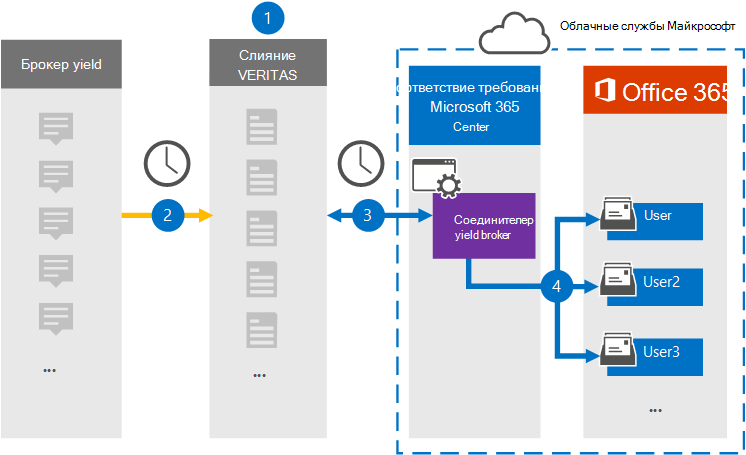

# Настройка соединители для архива данных Yieldbroker (предварительная версия)

Используйте соединиталь Globanet в Центре соответствия требованиям Microsoft 365, чтобы импортировать и архивировать данные из Yieldbroker в почтовые ящики пользователей в организации Microsoft 365. Globanet предоставляет соединители [Yieldbroker,](https://globanet.com/yieldbroker/) настроенные для захвата элементов из стороннего источника данных и импорта этих элементов в Microsoft 365. Соединиталь преобразует содержимое из Yieldbroker в формат сообщений электронной почты, а затем импортирует эти элементы в почтовый ящик пользователя в Microsoft 365.

После сохранения Yieldbroker в почтовых ящиках пользователей можно применить такие функции соответствия Требованиям Microsoft 365, как хранение для судебного разбирательства, eDiscovery, политики хранения и метки хранения. Использование соединители Yieldbroker для импорта и архива данных в Microsoft 365 может помочь вашей организации соблюдать правительственные и нормативные политики.

## Обзор архивных данных Yieldbroker

В следующем обзоре объясняется процесс использования соединители для архивации данных Yieldbroker в Microsoft 365.

1. Ваша организация работает с Брокером доходных работ для настройки и настройки сайта Yieldbroker.

2. Каждые 24 часа элементы Yieldbroker копируется на сайт Globanet Merge1. Соединителет также преобразует содержимое в формат сообщений электронной почты.

3. Соединитлет Yieldbroker, который вы создаете в Центре соответствия требованиям Microsoft 365, каждый день подключается к сайту Globanet Merge1 и передает сообщения в безопасное хранилище Azure в Облаке Майкрософт.

4. Соединиталь импортирует преобразованные элементы Yieldbroker в почтовые ящики определенных пользователей, используя значение свойства *Email* автоматического сопоставления пользователей, как описано в шаге [3.](#step-3-map-users-and-complete-the-connector-setup) В почтовых ящиках пользователей создается вложенная папка папки "Входящие" с именем **Yieldbroker,** и элементы импортируется в эту папку. Соединиталь определяет, в какой почтовый ящик импортировать элементы, используя значение свойства *Email.* Каждый объект Yieldbroker содержит это свойство, которое заполняется адресом электронной почты каждого участника элемента.

## Прежде чем начать

- Создайте учетную запись Globanet Merge1 для соединители Майкрософт. Чтобы создать учетную запись, обратитесь в службу поддержки клиентов [Globanet.](https://globanet.com/contact-us/) Необходимо войти в эту учетную запись при создании соединители на шаге 1.

- Пользователь, создавший соединитель Yieldbroker на шаге 1 (и завершивший его на шаге 3), должен быть назначен роли импорта и экспорта почтовых ящиков в Exchange Online. Эта роль необходима для добавления соединителю на странице "Соединители данных" в Центре соответствия требованиям Microsoft 365. По умолчанию эта роль не назначена ни одной группе ролей в Exchange Online. Вы можете добавить роль "Импорт и экспорт почтового ящика" в группу ролей "Управление организацией" в Exchange Online. Можно также создать группу ролей, назначить роль "Импорт и экспорт почтового ящика" и добавить соответствующих пользователей в качестве участников. Дополнительные сведения см. в  разделах ["Создание](https://docs.microsoft.com/Exchange/permissions-exo/role-groups#create-role-groups) групп ролей" или "Изменение групп ролей" статьи "Управление группами ролей в Exchange Online".

## Шаг 1. Настройка соединители Yieldbroker

Первым шагом является доступ к странице **"Соединители** данных" в Центре соответствия требованиям Microsoft 365 и создание соединители для Yieldbroker.

1. Go to [https://compliance.microsoft.com](https://compliance.microsoft.com/) and then click Data **connectors** &gt; **Yieldbroker**.

2. На странице **описания продукта Yieldbroker** нажмите кнопку **"Добавить новый соединителю".**

3. На странице **"Условия обслуживания" нажмите** кнопку **"Принять".**

4. Введите уникальное имя, идентифицируя соединители, и нажмите кнопку **"Далее".**

5. Во sign in to your Merge1 account to configure the connector.

## Шаг 2. Настройте соединители Yieldbroker на сайте Globanet Merge1

Второй шаг — настройка соединители Yieldbroker на сайте Merge1. Сведения о настройке Yieldbroker см. в руководстве пользователя [Merge1 Third-Party Connectors.](https://docs.ms.merge1.globanetportal.com/Merge1%20Third-Party%20Connectors%20Yieldbroker%20User%20Guide%20.pdf)

После нажатия кнопки  **"Сохранить & Готово"** отображается страница сопоставления пользователей в мастере соединители в Центре соответствия требованиям Microsoft 365.

## Шаг 3. Соединяем пользователей и завершаем настройку соединители

Чтобы связать пользователей и завершить настройку соединители, выполните следующие действия.

1. На странице **сопоставления пользователей Yieldbroker с пользователями Microsoft 365** включите автоматическое сопоставление пользователей. Элементы Yieldbroker включают свойство *Email,* которое содержит адреса электронной почты для пользователей в вашей организации. Если соединители могут связать этот адрес с пользователем Microsoft 365, элементы будут импортироваться в почтовый ящик этого пользователя.

2. Нажмите **кнопку "Далее",** просмотрите параметры и перейдите на страницу "Соединители данных", чтобы просмотреть ход процесса импорта нового соединитела. 

## Шаг 4. Отслеживание соединители Yieldbroker

После создания соединители Yieldbroker вы можете просмотреть его состояние в Центре соответствия требованиям Microsoft 365.

1. Go to [https://compliance.microsoft.com](https://compliance.microsoft.com/) and click **Data connectors** in the left nav.

2. Перейдите **на вкладку** "Соединители", а затем выберите соединиталь **Yieldbroker,** чтобы отобразить страницу с информацией о соединителе и свойствами.

3. В **состоянии соединители с источником** щелкните ссылку журнала загрузки, чтобы открыть (или сохранить) журнал состояния для соединитела.  Этот журнал содержит данные, импортируемые в облако Майкрософт.

## Известные проблемы

- В настоящее время мы не поддерживаем импорт вложений или элементов размером более 10 МБ. Поддержка более крупных элементов будет доступна позже.
