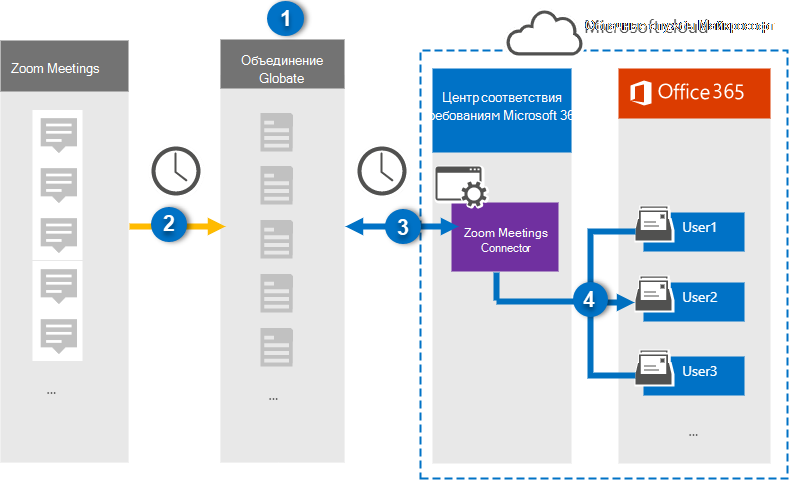

# Настройка соединитетеля для архивирования данных Zoom Meetings

Используйте соединитель Veritas в центре Microsoft 365 для импорта и архивирования данных из Zoom Meetings в почтовые ящики пользователей в Microsoft 365 организации. Veritas предоставляет соединитель [Zoom Meetings,](https://globanet.com/zoom/) настроенный для захвата элементов из стороннего источника данных (на регулярной основе) и импорта этих элементов в Microsoft 365. Соединитатель преобразует содержимое собраний (включая чаты, записанные файлы и метаданные) из учетной записи Zoom Meetings в формат сообщений электронной почты, а затем импортирует эти элементы в почтовые ящики пользователей в Microsoft 365.

После хранения данных Zoom Meetings в почтовых ящиках пользователей можно применить Microsoft 365, такие как хранение судебных разбирательств, электронные сведения, политики хранения и метки хранения, а также соответствие требованиям к связи. Использование соединиттеля Zoom Meetings для импорта и архивирования данных в Microsoft 365 может помочь вашей организации соблюдать государственные и нормативные политики.

## Обзор архивирования данных Zoom Meetings

В следующем обзоре объясняется процесс использования соединитетеля для архивирования данных Zoom Meetings в Microsoft 365.

1. Организация работает с масштабированием собраний для настройки и настройки сайта Zoom Meetings.

2. Раз в 24 часа элементы собраний из Zoom Meetings копируется на сайте Слияния1 Veritas. Соединителет также преобразует содержимое собраний в формат сообщений электронной почты.

3. Соединитель Zoom Meetings, который создается в центре Microsoft 365 соответствия требованиям, подключается к Veritas Merge1 каждый день и передает сообщения собраний в безопасное служба хранилища Azure в облаке Майкрософт.

4. Соединитатель импортирует преобразованные элементы собраний в почтовые ящики определенных пользователей, используя значение свойства *Email* и автоматическое сопоставление пользователей, как описано в шаге 3. В почтовых ящиках пользователей создается новая подмостка в папке "Входящие" с именем **Zoom Meetings,** и элементы собраний импортируется в эту папку. Соединитатель делает это, используя значение свойства *Email.* Каждый элемент собрания содержит это свойство, которое заполняется адресом электронной почты каждого участника собрания.

## Прежде чем начать

- Создайте учетную запись Veritas Merge1 для соединители Microsoft. Чтобы создать эту учетную запись, обратитесь в службу поддержки [клиентов Veritas.](https://globanet.com/ms-connectors-contact) При создании соединитетеля в шаге 1 вы вопишитесь в эту учетную запись.

- Получение имени пользователя и пароля для учетной записи Zoom Business или Zoom Enterprise организации. Вам потребуется войти в эту учетную запись на шаге 2 при настройке соединиттеля Zoom Meetings.

- Создание следующих приложений на рынке [масштабирования:](https://marketplace.zoom.us)

  - Приложение OAuth

  - Приложение JWT

  После создания этих приложений платформа Zoom создает набор уникальных учетных данных, используемых для создания маркеров. Эти маркеры используются для проверки подлинности соединитетеля при подключении к учетной записи Zoom и копировании элементов на сайт Merge1. Эти маркеры будут применяться при настройке соединиттеля Zoom в шаге 2.

  Инструкции по пошаговым шагам по созданию приложений OAuth и JWT см. в руководстве по пользователю [Merge1 Third-Party Connectors.](https://docs.ms.merge1.globanetportal.com/Merge1%20Third-Party%20Connectors%20Zoom%20Meetings%20User%20Guide%20.pdf)

- Пользователь, создававший соединитатель Zoom Meetings в шаге 1 (и завершавший его в шаге 3), должен быть назначен роли экспорта импорта почтовых ящиков в Exchange Online. Эта роль необходима для добавления соединители на **странице** соединители данных в центре Microsoft 365 соответствия требованиям. По умолчанию эта роль не назначена группе ролей в Exchange Online. Вы можете добавить роль экспорта импорта почтовых ящиков в группу ролей управления организацией в Exchange Online. Или вы можете создать группу ролей, назначить роль экспортировать импорт почтовых ящиков, а затем добавить соответствующих пользователей в качестве участников. Дополнительные сведения см. в разделах [Создание](/Exchange/permissions-exo/role-groups#create-role-groups) групп ролей или [изменение](/Exchange/permissions-exo/role-groups#modify-role-groups) групп ролей в статье "Управление группами ролей в Exchange Online".

## Шаг 1. Настройка соединиттеля Zoom Meetings

Первым шагом является доступ  к соединиттелям данных в центре Microsoft 365 соответствия требованиям и создание соединитетеля Zoom Meetings.

1. Перейдите к соединитетелям данных и нажмите кнопку [https://compliance.microsoft.com](https://compliance.microsoft.com/)   >  **Масштабирование собраний.**

2. На странице **Описание продукта Zoom Meetings** нажмите **кнопку Добавить соединителю**.

3. На странице **Условия службы нажмите** кнопку **Принять**.

4. Введите уникальное имя, идентифицируемое соединитетелем, а затем нажмите **кнопку Далее**.

5. Впишитесь в свою учетную запись Merge1, чтобы настроить соединители.

## Шаг 2. Настройка соединиттеля Zoom Meetings

Второй шаг — настройка соединиттеля Zoom Meetings на сайте Merge1. Дополнительные сведения о настройке соединиттеля Zoom Meetings на сайте Veritas Merge1 см. в руководстве по пользователю Merge1 Сторонние [соединители.](https://docs.ms.merge1.globanetportal.com/Merge1%20Third-Party%20Connectors%20Zoom%20Meetings%20User%20Guide%20.pdf)

После нажатия **кнопки Сохранить &**  finish отображается страница сопоставления пользователей в мастере соединители в центре Microsoft 365 соответствия требованиям.

## Шаг 3. Карта пользователей и завершение установки соединитетеля

1. На странице **Сопоставление внешних** пользователей для Microsoft 365 пользователей включаем автоматическое сопоставление пользователей.

   Элементы Zoom Meetings включают свойство *Email,* которое содержит адреса электронной почты для пользователей в организации. Если соединитатель может связать этот адрес с Microsoft 365 пользователем, элементы импортируется в почтовый ящик этого пользователя.

2. Нажмите **кнопку Далее,** просмотрите  параметры и перейдите на страницу соединители данных, чтобы просмотреть ход процесса импорта нового соединитетеля.

## Шаг 4. Мониторинг соединиттеля Масштабирование собраний

После создания соединиттеля Zoom Meetings можно просмотреть состояние соединитетеля в центре Microsoft 365 соответствия требованиям.

1. Перейдите [https://compliance.microsoft.com](https://compliance.microsoft.com) и щелкните **соединители данных** в левом nav.

2. Щелкните **вкладку** Соединители, а затем выберите соединителет **Zoom Meetings,** чтобы отобразить страницу вылетов. На этой странице содержатся свойства и сведения о соединители.

3. В **состоянии Соединитель с исходным кодом** щелкните ссылку **Журнал** загрузки, чтобы открыть (или сохранить) журнал состояния соединитетеля. В этом журнале содержатся сведения о данных, импортируемых в облако Майкрософт.

## Известные проблемы

- В настоящее время мы не поддерживаем импорт вложений или элементов размером более 10 МБ. Поддержка более крупных элементов будет доступна позднее.

- Чтобы соединитатель Zoom Meetings работал, необходимо включить записи при настройке масштабирования собраний.