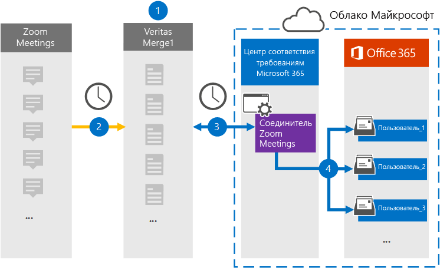

# Настройка соединители для архивирования данных масштабирования собранийSet up a connector to archive Zoom Meetings data

Используйте соединиталь Globanet в Центре соответствия требованиям Microsoft 365 для импорта и архивирования данных из zoom Meetings в почтовые ящики пользователей в организации Microsoft 365.Use a Globanet connector in the Microsoft 365 compliance center to import and archive data from Zoom Meetings to user mailboxes in your Microsoft 365 organization. Globanet предоставляет соединители [Zoom Meetings,](https://globanet.com/zoom/) настроенные для записи элементов из стороннего источника данных (на регулярной основе) и импорта этих элементов в Microsoft 365.Globanet provides a [Zoom Meetings](https://globanet.com/zoom/) connector that is configured to capture items from the third-party data source (on a regular basis) and import those items to Microsoft 365. Соединиталь преобразует содержимое собраний (включая чаты, записанные файлы и метаданные) из учетной записи Zoom Meetings в формат сообщения электронной почты, а затем импортирует эти элементы в почтовые ящики пользователей в Microsoft 365.The connector converts the content of the meetings (including chats, recorded files, and metadata) from the Zoom Meetings account to an email message format and then imports those items to user mailboxes in Microsoft 365.

После сохранения данных о масштабе собраний в почтовых ящиках пользователей вы можете применить такие функции соответствия Требованиям Microsoft 365, как хранение для судебного разбирательства, eDiscovery, политики хранения и метки хранения, а также соответствие коммуникации требованиям.After Zoom Meetings data is stored in user mailboxes, you can apply Microsoft 365 compliance features such as Litigation Hold, eDiscovery, retention policies and retention labels, and communication compliance. Использование соединители Zoom Meetings для импорта и архивирования данных в Microsoft 365 может помочь вашей организации соблюдать правительственные и нормативные политики.Using a Zoom Meetings connector to import and archive data in Microsoft 365 can help your organization stay compliant with government and regulatory policies.

## Обзор архивирования данных масштабирования собранийOverview of archiving Zoom Meetings data

В следующем обзоре объясняется процесс использования соединители для архивации данных масштабирования собраний в Microsoft 365.The following overview explains the process of using a connector to archive Zoom Meetings data in Microsoft 365.

1. Ваша организация работает с масштабированием собраний для настройки и настройки сайта масштабирования собраний.Your organization works with Zoom Meetings to set up and configure a Zoom Meetings site.

2. Каждые 24 часа элементы собрания из zoom Meetings копируется на сайт Globanet Merge1.Once every 24 hours, meeting items from Zoom Meetings are copied to the Globanet Merge1 site. Соединитер также преобразует содержимое собраний в формат сообщений электронной почты.The connector also converts the content of the meetings to an email message format.

3. Соединитец Zoom Meetings, который вы создаете в Центре соответствия требованиям Microsoft 365, подключается к Globanet Merge1 каждый день и переносит сообщения о собраниях в безопасное хранилище Azure в Облаке Майкрософт.The Zoom Meetings connector that you create in the Microsoft 365 compliance center, connects to the Globanet Merge1 every day, and transfers the meeting messages to a secure Azure Storage location in the Microsoft cloud.

4. Соединиталь импортирует преобразованные элементы собрания в почтовые ящики определенных пользователей, используя значение свойства *"Электронная* почта" и автоматическое сопоставление пользователей, как описано в шаге 3.The connector imports the converted meeting items to the mailboxes of specific users using the value of the *Email* property and automatic user mapping, as described in Step 3. Новая вложенная папка в папке "Входящие" с именем **Zoom Meetings** создается в почтовых ящиках пользователей, и элементы собрания импортируется в эту папку.A new subfolder in the Inbox folder named **Zoom Meetings** is created in user mailboxes, and the meeting items are imported to that folder. Для этого соединители используют значение свойства *Email.*The connector does this by using the value of the *Email* property. Каждый элемент собрания содержит это свойство, которое заполняется адресом электронной почты каждого участника собрания.Every meeting item contains this property, which is populated with the email address of every participant of the meeting.

## Перед началом работыBefore you begin

- Создайте учетную запись Globanet Merge1 для соединители Майкрософт.Create a Globanet Merge1 account for Microsoft connectors. Чтобы создать эту учетную запись, обратитесь в службу поддержки клиентов [Globanet.](https://globanet.com/ms-connectors-contact)To create this account, contact [Globanet Customer Support](https://globanet.com/ms-connectors-contact). Вход в эту учетную запись будет происходить при создании соединители на шаге 1.You will sign into this account when you create the connector in Step 1.

- Получите имя пользователя и пароль для учетной записи Zoom Business или Zoom Enterprise организации.Obtain the username and password for your organization's Zoom Business or Zoom Enterprise account. Вам потребуется войти в эту учетную запись на шаге 2 при настройке соединители масштабирования собраний.You'll need to sign into this account in Step 2 when you configure the Zoom Meetings connector.

- Создайте следующие приложения в [Zoom Marketplace:](https://marketplace.zoom.us)Create the following applications in the [Zoom Marketplace](https://marketplace.zoom.us):

  - Приложение OAuthOAuth application

  - Приложение JWTJWT application

  После создания этих приложений платформа Zoom создает набор уникальных учетных данных, используемых для создания маркеров.After you create these applications, the Zoom platform generates a set of unique credentials used to generate the tokens. Эти маркеры используются для проверки подлинности соединители при подключении к учетной записи Zoom и копировании элементов на сайт Merge1.These tokens are used to authenticate the connector when it connects to your Zoom account and copies items to the Merge1 site. Эти маркеры будут применяться при настройке соединители Zoom на шаге 2.You will use these tokens when you configure the Zoom connector in Step 2.

  Пошаговая инструкция по созданию приложений OAuth и JWT см. в руководстве пользователя [Merge1 Third-Party Connectors.](https://docs.ms.merge1.globanetportal.com/Merge1%20Third-Party%20Connectors%20Zoom%20Meetings%20User%20Guide%20.pdf)For step-by step instructions on how to create the OAuth and JWT applications, see [Merge1 Third-Party Connectors User Guide](https://docs.ms.merge1.globanetportal.com/Merge1%20Third-Party%20Connectors%20Zoom%20Meetings%20User%20Guide%20.pdf).

- Пользователь, создавший соединитель масштабирования собраний на шаге 1 (и завершивший его на шаге 3), должен быть назначен роли импорта и экспорта почтовых ящиков в Exchange Online.The user who creates the Zoom Meetings connector in Step 1 (and completes it in Step 3) must be assigned to the Mailbox Import Export role in Exchange Online. Эта роль необходима для добавления соединителю на странице **"Соединители** данных" в Центре соответствия требованиям Microsoft 365.This role is required to add connectors on the **Data connectors** page in the Microsoft 365 compliance center. По умолчанию эта роль не назначена группе ролей в Exchange Online.By default, this role is not assigned to a role group in Exchange Online. Вы можете добавить роль "Импорт и экспорт почтового ящика" в группу ролей "Управление организацией" в Exchange Online.You can add the Mailbox Import Export role to the Organization Management role group in Exchange Online. Можно также создать группу ролей, назначить роль "Импорт и экспорт почтового ящика" и добавить соответствующих пользователей в качестве участников.Or you can create a role group, assign the Mailbox Import Export role, and then add the appropriate users as members. Дополнительные сведения см. в  разделах ["Создание](https://docs.microsoft.com/Exchange/permissions-exo/role-groups#create-role-groups) групп ролей" или "Изменение групп ролей" статьи "Управление группами ролей в Exchange Online".For more information, see the [Create role groups](https://docs.microsoft.com/Exchange/permissions-exo/role-groups#create-role-groups) or [Modify role groups](https://docs.microsoft.com/Exchange/permissions-exo/role-groups#modify-role-groups) sections in the article "Manage role groups in Exchange Online".

## Шаг 1. Настройка соединители Zoom MeetingsStep 1: Set up the Zoom Meetings connector

Первым шагом является доступ к соединитетелям **данных** в Центре соответствия требованиям Microsoft 365 и создание соединитела Zoom Meetings.The first step is to access the **Data Connectors** in the Microsoft 365 compliance center and create a Zoom Meetings connector.

1. Go to [https://compliance.microsoft.com](https://compliance.microsoft.com/) and then click Data **connectors**  >  **Zoom Meetings**.Go to [https://compliance.microsoft.com](https://compliance.microsoft.com/) and then click **Data connectors** > **Zoom Meetings**.

2. На странице **описания продукта "Масштабирование** собраний" нажмите **кнопку "Добавить соединителю".**On the **Zoom Meetings** product description page, click **Add connector**.

3. На странице **"Условия обслуживания" нажмите** кнопку **"Принять".**On the **Terms of service** page, click **Accept**.

4. Введите уникальное имя, идентифицируя соединители, и нажмите кнопку **"Далее".**Enter a unique name that identifies the connector, and then click **Next**.

5. Во sign in to your Merge1 account to configure the connector.Sign in to your Merge1 account to configure the connector.

## Шаг 2. Настройте соединители масштабирования собранийStep 2: Configure the Zoom Meetings connector

Второй шаг — настройка соединители Zoom Meetings на сайте Merge1.The second step is to configure the Zoom Meetings connector on the Merge1 site. Дополнительные сведения о настройке соединители Zoom Meetings на сайте Globanet Merge1 см. в руководстве пользователя [Merge1 Third-Party Connectors.](https://docs.ms.merge1.globanetportal.com/Merge1%20Third-Party%20Connectors%20Zoom%20Meetings%20User%20Guide%20.pdf)For more information about how to configure the Zoom Meetings connector on the Globanet Merge1 site, see [Merge1 Third-Party Connectors User Guide](https://docs.ms.merge1.globanetportal.com/Merge1%20Third-Party%20Connectors%20Zoom%20Meetings%20User%20Guide%20.pdf).

После нажатия кнопки  **"Сохранить & Готово"** отображается страница сопоставления пользователей в мастере соединители в Центре соответствия требованиям Microsoft 365.After you click **Save & Finish**, the **User mapping** page in the connector wizard in the Microsoft 365 compliance center is displayed.

## Шаг 3. Соединяем пользователей и завершаем настройку соединителиStep 3: Map users and complete the connector setup

1. На странице **"Сопоставление внешних пользователей с пользователями Microsoft 365"** включите автоматическое сопоставление пользователей.On the **Map external users to Microsoft 365 users** page, enable automatic user mapping.

   Элементы масштабирования собраний включают свойство *"Электронная почта",* которое содержит адреса электронной почты для пользователей в организации.Zoom Meetings items include a property called *Email* that contains email addresses for users in your organization. Если соединители могут связать этот адрес с пользователем Microsoft 365, элементы будут импортироваться в почтовый ящик этого пользователя.If the connector can associate this address with a Microsoft 365 user, the items are imported to that user's mailbox

2. Нажмите **кнопку**"Далее", просмотрите параметры и перейдите на страницу "Соединители данных", чтобы просмотреть ход процесса импорта нового соединитела. Click **Next**, review your settings, and go to the **Data connectors** page to see the progress of the import process for the new connector.

## Шаг 4. Отслеживание соединители масштабирования собранийStep 4: Monitor the Zoom Meetings connector

После создания соединители Zoom Meetings можно просмотреть состояние соединитела в Центре соответствия требованиям Microsoft 365.After you create the Zoom Meetings connector, you can view the connector status in the Microsoft 365 compliance center.

1. Go to [https://compliance.microsoft.com](https://compliance.microsoft.com) and click **Data connectors** in the left nav.Go to [https://compliance.microsoft.com](https://compliance.microsoft.com) and click **Data connectors** in the left nav.

2. Перейдите **на вкладку** "Соединители", а затем выберите соединители **"Масштабирование** собраний", чтобы отобразить вылетную страницу.Click the **Connectors** tab and then select the **Zoom Meetings** connector to display the flyout page. На этой странице содержатся свойства и сведения о соединители.This page contains the properties and information about the connector.

3. В **состоянии соединители с источником** щелкните ссылку журнала загрузки, чтобы открыть (или сохранить) журнал состояния для соединитела. Under **Connector status with source**, click the **Download log** link to open (or save) the status log for the connector. Этот журнал содержит сведения о данных, импортируемых в облако Майкрософт.This log contains information about the data that has been imported to the Microsoft cloud.

## Известные проблемыKnown issues

- В настоящее время мы не поддерживаем импорт вложений или элементов размером более 10 МБ.At this time, we don't support importing attachments or items that are larger than 10 MB. Поддержка более крупных элементов будет доступна позже.Support for larger items will be available at a later date.

- Чтобы соединители Zoom Meetings работали, необходимо включить записи при настройке масштабирования собраний.For the Zoom Meetings connector to work, you must enable recordings when setting up Zoom Meetings.
