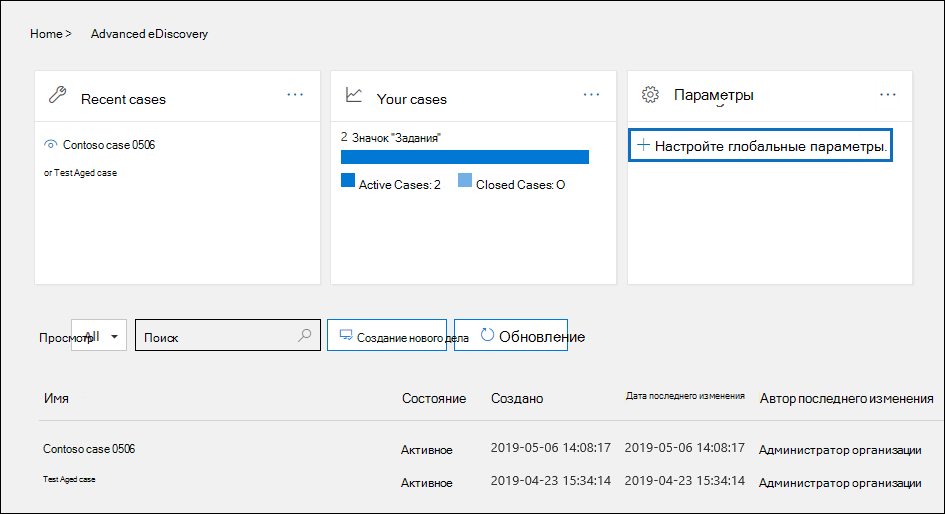
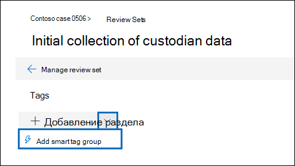
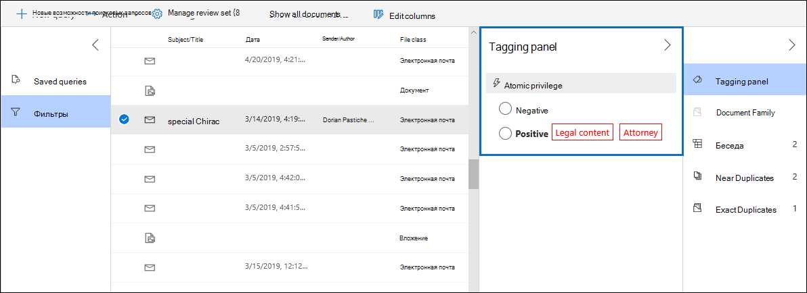
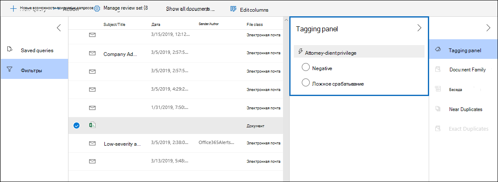

# Настройка обнаружения адвокатских прав в Advanced eDiscoverySet up attorney-client privilege detection in Advanced eDiscovery

Основным и дорогостоящим аспектом на этапе проверки любого процесса eDiscovery является проверка документов на привилегированный контент.A major and costly aspect of the review phase of any eDiscovery process is reviewing documents for privileged content. Advanced eDiscovery обеспечивает обнаружение привилегированного содержимого на основе машинного обучения, чтобы сделать этот процесс более эффективным.Advanced eDiscovery provides machine learning-based detection of privileged content to make this process more efficient. Эта функция называется *обнаружением адвокатских привилегий.*This feature is called *attorney-client privilege detection*.

## Как это работает?How does it work?

Если обнаружение адвокатских прав включено, все документы в наборе для проверки будут  обрабатываться моделью обнаружения адвокатских привилегий при анализе данных в наборе для проверки.When attorney-client privilege detection is enabled, all documents in a review set will be processed by the attorney-client privilege detection model when you [analyze the data](analyzing-data-in-review-set.md) in the review set. Модель ищет два вещи:The model looks for two things:

- Привилегированное содержимое — модель использует машинное обучение для определения вероятности того, что документ содержит содержимое, которое является юридическим.Privileged content – The model uses machine learning to determine the likelihood that the document contains content that is legal in nature.

- Участники — в рамках настройки обнаружения адвокатских прав необходимо отправить список юристов для вашей организации.Participants – As part of setting up attorney-client privilege detection, you have to submit a list of attorneys for your organization. Затем модель сравнивает участников документа со списком адвокатов, чтобы определить, имеется ли в документе хотя бы один адвокат.The model then compares the participants of the document with the attorney list to determine if a document has at least one attorney participant.

Модель создает следующие три свойства для каждого документа:The model produces the following three properties for every document:

- **AttorneyClientPrivilegeScore:** Вероятность того, что документ имеет юридический характер; значения для оценки находятся в от **0** до **1**.**AttorneyClientPrivilegeScore:** The likelihood the document is legal in nature; the values for the score are between **0** and **1**.

- **HasAttorney:** Это свойство имеет свойство **true,** если один из участников документа указан в списке адвокатов; в противном случае значение **false.****HasAttorney:** This property is set to **true** if one of the document participants is listed in the attorney list; otherwise the value is **false**. Кроме того, если ваша организация не отправила список адвокатов, ему также за установлено значение **false.**The value is also set to **false** if your organization didn't upload an attorney list.

- **IsPrivilege:** Это свойство имеет значение **true,** если значение **Свойства AttorneyClientPrivilegeScore** превышает пороговое значение или если документ имеет участника-юриста;  в противном случае значение будет установлено как **false**.**IsPrivilege:** This property is set to **true** if the value for **AttorneyClientPrivilegeScore** is above the threshold *or* if the document has an attorney participant; otherwise the value is set to **false**.

Эти свойства (и соответствующие им значения) добавляются в метаданные файлов в наборе для проверки, как показано на следующем снимке экрана:These properties (and their corresponding values) are added to the file metadata of the documents in a review set, as shown in the following screenshot:

Эти три свойства также можно найти в наборе для проверки.These three properties are also searchable within a review set. Дополнительные сведения [см. в запросе данных в наборе для проверки.](review-set-search.md)For more information, see [Query the data in a review set](review-set-search.md).

## Настройка модели обнаружения адвокатских правSet up the attorney-client privilege detection model

Чтобы включить модель обнаружения адвокатских прав, ваша организация должна включить ее и отправить список адвокатов.To enable the attorney-client privilege detection model, your organization has to turn it on and then upload an attorney list.

### Шаг 1. Включив обнаружение адвокатских правStep 1: Turn on attorney-client privilege detection

Лицо, управляющего eDiscovery в вашей организации (участник подгруппы администратора eDiscovery в группе ролей "Менеджер по обнаружению электронных данных"), должно сделать модель доступной в ваших случаях Advanced eDiscovery.A person who is an eDiscovery Administrator in your organization (a member of the eDiscovery Administrator subgroup in the eDiscovery Manager role group) must make the model available in your Advanced eDiscovery cases.

1. В Центре безопасности & соответствия требованиям перейдите в > **Advanced eDiscovery.**In the Security & Compliance Center, go to **eDiscovery > Advanced eDiscovery**.

2. На **домашней странице Advanced eDiscovery** на плитке  "Параметры" щелкните "Настройка глобальных **параметров аналитики".**On the **Advanced eDiscovery** home page, in the **Settings** tile, click **Configure global analytics settings**.

   

3. На **вкладке "Параметры аналитики"** выберите "Управление привилегиями **юриста".**On the **Analytics settings** tab, select **Manage attorney-client privilege setting**.

4. На странице **"Адвокатская привилегия"** включите функцию с помощью выключата и выберите **"Сохранить".**On the **Attorney-client privilege** flyout page, use the toggle to turn on the feature and then select **Save**.

### Шаг 2. Отправка списка адвокатов (необязательно)Step 2: Upload a list of attorneys (optional)

Чтобы в полной мере воспользоваться моделью обнаружения адвокатских прав и использовать результаты ранее описанного определения "Has **Attorney** or **Potentially Privileged",** рекомендуется отправить список адресов электронной почты юристам и юристам, которые работают в вашей организации.To take full advantage of the attorney-client privilege detection model and use the results of the **Has Attorney** or **Potentially Privileged** detection that was previously described, we recommend that you upload a list of email addresses for the lawyers and legal personnel who work for your organization. 

Чтобы отправить список адвокатов для использования с помощью модели обнаружения адвокатских привилегий:To upload an attorney list for use by the attorney-client privilege detection model:

1. Создайте CSV-файл (без строки header) и добавьте адрес электронной почты для каждого соответствующего человека в отдельной строке.Create a .csv file (without a header row) and add the email address for each appropriate person on a separate line. Сохраните этот файл на локальном компьютере.Save this file to your local computer.

2. На **домашней странице Advanced eDiscovery** на плитке "Параметры" выберите "Настройка экспериментальных функций", а затем выберите параметр "Управление адвокатской привилегией **клиента".**  On the **Advanced eDiscovery** home page, in the **Settings** tile, select **Configure experimental features**, and then select **Manage attorney-client privilege setting**.

   **Отобразилась страница "Адвокат-клиент"** и включено переключение обнаружения адвокатских прав. The **Attorney-client privilege** page is displayed, and the **Attorney-client privilege detection** toggle is turned on.

   

3. Выберите  "Обзор", а затем найдите CSV-файл, созданный на шаге 1.Select **Browse** and then find and select the .csv file that you created in step 1.

4. Выберите **"Сохранить",** чтобы отправить список адвокатов.Select **Save** to upload the attorney list.

## Использование модели обнаружения адвокатских правUse the attorney-client privilege detection model

Выполните действия в этом разделе, чтобы использовать обнаружение адвокатских прав для документов в наборе для проверки.Follow the steps in this section to use attorney-client privilege detection for documents in a review set.

### Шаг 1. Создание интеллектуальной группы тегов с моделью обнаружения адвокатских привилегийStep 1: Create a smart tag group with attorney-client privilege detection model

Одним из основных способов просмотра результатов обнаружения адвокатских прав в процессе проверки является использование группы смарт-тегов.One of the primary ways to see the results of attorney-client privilege detection in your review process is by using a smart tag group. Группа смарт-тегов указывает результаты обнаружения адвокатской привилегии и отображает результаты в строке рядом с тегами в группе смарт-тегов.A smart tag group indicates the results of the attorney-client privilege detection and shows the results in-line next to the tags in a smart tag group. Это позволяет быстро определить потенциально привилегированные документы во время проверки документов.This lets you quickly identify potentially privileged documents during document review. Кроме того, вы можете использовать теги в группе смарт-тегов, чтобы пометить документы как привилегированные или непривименные.Additionally, you can also use the tags in the smart tag group to tag documents as privileged or non-privileged. Дополнительные сведения о смарт-тегах см. в подстройке ["Настройка смарт-тегов в Advanced eDiscovery".](smart-tags.md)For more information about smart tags, see [Set up smart tags in Advanced eDiscovery](smart-tags.md).

1. В наборе для проверки, который содержит документы, проанализированы в шаге 1, выберите "Управление набором для **проверки",** а затем выберите **"Управление тегами".**In the review set that contains the documents that you analyzed in Step 1, select **Manage review set** and then select **Manage tags**.
 
2. В **группе "Теги"** выберите оттягивку рядом с "Добавить группу",  а затем выберите **"Добавить группу смарт-тегов".**Under **Tags**, select the pull-down next to **Add group** and then select **Add smart tag group**.

   

3. On the **Choose a model for your smart tag** page, choose **Select** next to **Attorney-client privilege**.On the **Choose a model for your smart tag** page, choose **Select** next to **Attorney-client privilege**.

   Отображается группа тегов **с именем "Адвокат-клиент".**A tag group named **Attorney-client privilege** is displayed. Он содержит два child тега **с именами Positive** и **Negative**, которые соответствуют возможным результатам, полученным моделью.It contains two child tags named **Positive** and **Negative**, which correspond to the possible results produced by the model.

   

3. Переименуйте группу тегов и теги соответствующим образом для проверки.Rename the tag group and tags as appropriate for your review. Например, можно переименовать **положительное** на **Privileged,** а **отрицательное** — **на "Не привилегированное".**For example, you can rename **Positive** to **Privileged** and **Negative** to **Not privileged**.

### Шаг 2. Анализ набора для проверкиStep 2: Analyze a review set

При анализе документов в наборе для проверки также будет запускаться модель обнаружения адвокатских прав и соответствующие свойства (описанные в описании ее [работы?](#how-does-it-work) будут добавлены в каждый документ в наборе для проверки.When you analyze the documents in a review set, the attorney-client privilege detection model will also run and the corresponding properties (described in [How does it work?](#how-does-it-work) will be added to every document in the review set. Дополнительные сведения об анализе данных в наборе для проверки см. в анализе данных в наборе для проверки [в Advanced eDiscovery.](analyzing-data-in-review-set.md)For more information about analyzing data in review set, see [Analyze data in a review set in Advanced eDiscovery](analyzing-data-in-review-set.md).

### Шаг 3. Использование группы смарт-тегов для проверки привилегированного содержимогоStep 3: Use the smart tag group for review of privileged content

После анализа настройки проверки и настройки смарт-тегов необходимо просмотреть документы.After analyzing the review set and setting up smart tags, the next step is to review the documents. Если модель определила, что документ потенциально привилегированный, соответствующий смарт-тег на панели тегов будет указывать следующие результаты, полученные при обнаружении адвокатской привилегии: If the model has determined the document is potentially privileged, the corresponding smart tag in the **Tagging panel** will indicate the following results produced by the attorney-client privilege detection:

- Если документ содержит содержимое, которое может быть  юридическим, метка "Юридическое содержимое" отображается рядом с соответствующим смарт-тегом (в данном случае это положительный тег по **умолчанию).**If the document has content that may be legal in nature, the label **Legal content** is displayed next to the corresponding smart tag (which in this case is the default **Positive** tag).

- Если в документе есть участник, который находится в списке адвокатов вашей организации, метка **"Адвокат"** отображается рядом с соответствующим смарт-тегом (который в данном случае также является положительным тегом по **умолчанию).**If the document has a participant who is found in your organization's attorney list, the label **Attorney** is displayed next to the corresponding smart tag (which in this case is also the default **Positive** tag).

- Если документ содержит содержимое, которое может быть юридическим по своей сути  и  содержит участника в списке адвокатов, отображаются как юридическое содержимое, так и метки "Адвокат". If the document has content that may be legal in nature *and* has a participant found in the attorney list, both the **Legal content**  and **Attorney** labels are displayed. 

Если модель определяет, что документ не содержит содержимого, которое является юридическим или не содержит участника из списка адвокатов, то ни одна метка не отображается на панели тегов.If the model determines that a document doesn't contain content that is legal in nature or doesn't contain a participant from the attorney list, then neither label is displayed in the tagging panel.

Например, на следующих снимках экрана представлены два документа.For example, the following screenshots show two documents. Первый содержит юридическое содержимое, которое содержит участника в списке адвокатов.The first one contains content that is legal in nature and has a participant found in the list of attorneys. Вторая не содержит ни одной из них, поэтому не отображает метки.The second contains neither and therefore doesn't display any labels.

После просмотра документа, чтобы узнать, содержит ли он привилегированное содержимое, можно пометить документ соответствующим тегом.After you review a document to see if it contains privileged content, you can tag the document with the appropriate tag.
