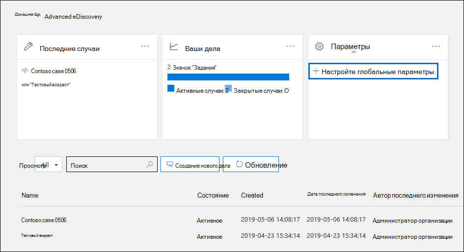

# Настройка обнаружения привилегий между адвокатом и клиентом в Advanced eDiscoverySet up attorney-client privilege detection in Advanced eDiscovery

Основным и дорогостоящим аспектом на этапе проверки любого процесса проверки электронных документов является проверка документов для привилегированного контента.A major and costly aspect of the review phase of any eDiscovery process is reviewing documents for privileged content. Advanced eDiscovery обеспечивает обнаружение привилегированного контента на основе машинного обучения, чтобы сделать этот процесс более эффективным.Advanced eDiscovery provides machine learning-based detection of privileged content to make this process more efficient. Эта функция называется *обнаружением привилегий между адвокатом и клиентом.*This feature is called *attorney-client privilege detection*.

## Как это работает?How does it work?

Когда будет включено обнаружение привилегий между адвокатом и клиентом, все документы в  наборе отзывов будут обрабатываться моделью обнаружения привилегий между адвокатом и клиентом при анализе данных в наборе отзывов.When attorney-client privilege detection is enabled, all documents in a review set will be processed by the attorney-client privilege detection model when you [analyze the data](analyzing-data-in-review-set.md) in the review set. Модель ищет две вещи:The model looks for two things:

- Привилегированное содержимое — модель использует машинное обучение для определения вероятности того, что документ содержит легальный по своему характеру контент.Privileged content – The model uses machine learning to determine the likelihood that the document contains content that is legal in nature.

- Участники . В рамках настройки обнаружения привилегий между адвокатом и клиентом необходимо представить список адвокатов для вашей организации.Participants – As part of setting up attorney-client privilege detection, you have to submit a list of attorneys for your organization. Затем модель сравнивает соавторов документа со списком юристов, чтобы определить, есть ли среди соавторов хотя бы один адвокат.The model then compares the participants of the document with the attorney list to determine if a document has at least one attorney participant.

Модель создает следующие три свойства для каждого документа:The model produces the following three properties for every document:

- **AttorneyClientPrivilegeScore:** Вероятность того, что документ является юридическим по своему характеру; значения для оценки от **0** до **1**.**AttorneyClientPrivilegeScore:** The likelihood the document is legal in nature; the values for the score are between **0** and **1**.

- **HasAttorney:** Это свойство имеет свойство **true,** если один из участников документа указан в списке адвоката; в противном случае значение является **ложным**.**HasAttorney:** This property is set to **true** if one of the document participants is listed in the attorney list; otherwise the value is **false**. Значение также равно **false**, если ваша организация не определила список юристов.The value is also set to **false** if your organization didn't upload an attorney list.

- **IsPrivilege:** Это свойство имеет значение **true,** если значение **для AttorneyClientPrivilegeScore** превышает пороговое значение или если в документе есть участник адвокатского процесса;  в противном случае значение заведомо **ложное.****IsPrivilege:** This property is set to **true** if the value for **AttorneyClientPrivilegeScore** is above the threshold *or* if the document has an attorney participant; otherwise the value is set to **false**.

Эти свойства (и их соответствующие значения) добавляются в метаданные файлов документов в наборе отзывов, как показано на следующем скриншоте:These properties (and their corresponding values) are added to the file metadata of the documents in a review set, as shown in the following screenshot:

Эти три свойства также можно искать в наборе обзоров.These three properties are also searchable within a review set. Дополнительные сведения см. в обзоре Запрос данных в [наборе обзоров.](review-set-search.md)For more information, see [Query the data in a review set](review-set-search.md).

## Настройка модели обнаружения привилегий между адвокатом и клиентомSet up the attorney-client privilege detection model

Чтобы включить модель обнаружения привилегий между адвокатом и клиентом, организации необходимо включить ее и загрузить список адвокатов.To enable the attorney-client privilege detection model, your organization has to turn it on and then upload an attorney list.

### Шаг 1. Включив обнаружение привилегий между адвокатом и клиентомStep 1: Turn on attorney-client privilege detection

Человек, который является администратором по обнаружению электронных данных в вашей организации (член подгруппы администратора по обнаружению электронных данных в группе ролей диспетчера электронных данных), должен сделать модель доступной в Advanced eDiscovery случаях.A person who is an eDiscovery Administrator in your organization (a member of the eDiscovery Administrator subgroup in the eDiscovery Manager role group) must make the model available in your Advanced eDiscovery cases.

1. В Центре & безопасности перейдите в **центр eDiscovery > Advanced eDiscovery.**In the Security & Compliance Center, go to **eDiscovery > Advanced eDiscovery**.

2. На **домашней Advanced eDiscovery** на Параметры  нажмите кнопку Настройка **параметров глобальной аналитики.**On the **Advanced eDiscovery** home page, in the **Settings** tile, click **Configure global analytics settings**.

   

3. На **вкладке Параметры аналитики** выберите **параметр Управление привилегиями адвоката и клиента.**On the **Analytics settings** tab, select **Manage attorney-client privilege setting**.

4. На странице **Адвокатская тайна** включите эту функцию, а затем выберите **Сохранить**.On the **Attorney-client privilege** flyout page, use the toggle to turn on the feature and then select **Save**.

### Шаг 2. Upload список адвокатов (необязательно)Step 2: Upload a list of attorneys (optional)

Чтобы в полной мере использовать модель обнаружения привилегий между адвокатом и клиентом и использовать результаты ранее описанного обнаружения has **attorney** или **Potentially Privileged,** рекомендуем загрузить список адресов электронной почты для юристов и юристов, которые работают в вашей организации.To take full advantage of the attorney-client privilege detection model and use the results of the **Has Attorney** or **Potentially Privileged** detection that was previously described, we recommend that you upload a list of email addresses for the lawyers and legal personnel who work for your organization. 

Чтобы загрузить список адвокатов для использования моделью обнаружения привилегий между адвокатом и клиентом:To upload an attorney list for use by the attorney-client privilege detection model:

1. Создайте CSV-файл (без строки заголовка) и добавьте каждый адрес электронной почты для каждого нужного человека в отдельной строке. Сохраните этот файл на своем компьютере.Create a .csv file (without a header row) and add the email address for each appropriate person on a separate line. Save this file to your local computer.

2. На **домашней Advanced eDiscovery** на Параметры  выберите параметр **Configure experimental features**, а затем выберите параметр **Manage attorney-client privilege setting**.On the **Advanced eDiscovery** home page, in the **Settings** tile, select **Configure experimental features**, and then select **Manage attorney-client privilege setting**.

   Отображается **страница привилегий "Адвокат-клиент"** и включена возможность обнаружения привилегий между адвокатом и клиентом. The **Attorney-client privilege** page is displayed, and the **Attorney-client privilege detection** toggle is turned on.

   

3. Выберите **Обзор,** а затем найдите .csv файл, созданный на шаге 1.Select **Browse** and then find and select the .csv file that you created in step 1.

4. Выберите **Сохранить,** чтобы загрузить список адвокатов.Select **Save** to upload the attorney list.

## Использование модели обнаружения привилегий между адвокатом и клиентомUse the attorney-client privilege detection model

Следуйте шагам в этом разделе, чтобы использовать обнаружение привилегий адвоката и клиента для документов в наборе отзывов.Follow the steps in this section to use attorney-client privilege detection for documents in a review set.

### Шаг 1. Создание группы смарт-тегов с моделью обнаружения привилегий между адвокатом и клиентомStep 1: Create a smart tag group with attorney-client privilege detection model

Один из основных способов увидеть результаты обнаружения адвокатской тайны в ходе проверки — использование группы смарт-тегов.One of the primary ways to see the results of attorney-client privilege detection in your review process is by using a smart tag group. Группа смарт-тегов указывает результаты обнаружения адвокатской тайны и выводит их построчно рядом с тегами в группе смарт-тегов.A smart tag group indicates the results of the attorney-client privilege detection and shows the results in-line next to the tags in a smart tag group. Это позволяет быстро выявлять потенциально привилегированные документы во время проверки документов.This lets you quickly identify potentially privileged documents during document review. Кроме того, теги в группе смарт-тегов можно использовать для пометки документов как конфиденциальных или не конфиденциальных.Additionally, you can also use the tags in the smart tag group to tag documents as privileged or non-privileged. Дополнительные сведения о смарт-тегах см. в дополнительных сведениях о настройках [смарт-тегов в Advanced eDiscovery.](smart-tags.md)For more information about smart tags, see [Set up smart tags in Advanced eDiscovery](smart-tags.md).

1. В наборе обзоров, который содержит документы, проанализированые  в шаге 1, выберите управляйте набором обзоров и выберите **теги Manage**.In the review set that contains the documents that you analyzed in Step 1, select **Manage review set** and then select **Manage tags**.
 
2. В **тегах** выберите тягу рядом с **группой Добавить,** а затем **выберите добавить группу смарт-тегов.**Under **Tags**, select the pull-down next to **Add group** and then select **Add smart tag group**.

   

3. На странице **Выбор модели для умной** страницы тегов выберите **Выберите** рядом с привилегией **"Адвокат-клиент".**On the **Choose a model for your smart tag** page, choose **Select** next to **Attorney-client privilege**.

   Отображается группа тегов **с именем "Адвокат-клиент".**A tag group named **Attorney-client privilege** is displayed. Он содержит два детских тега **с именем Positive** и **Negative**, которые соответствуют возможным результатам, полученным моделью.It contains two child tags named **Positive** and **Negative**, which correspond to the possible results produced by the model.

   

3. Переименуйте группу тегов и теги, соответствующие вашему обзору.Rename the tag group and tags as appropriate for your review. Например, можно переименовать Positive в **Privileged** и **Negative** to **Not privileged**. For example, you can rename **Positive** to **Privileged** and **Negative** to **Not privileged**.

### Шаг 2. Анализ набора отзывовStep 2: Analyze a review set

При анализе документов в наборе отзывов будет также работать модель обнаружения привилегий между адвокатом и клиентом, а соответствующие свойства (описанные в описании How [does it work?](#how-does-it-work) будут добавлены к каждому документу в наборе обзоров.When you analyze the documents in a review set, the attorney-client privilege detection model will also run and the corresponding properties (described in [How does it work?](#how-does-it-work) will be added to every document in the review set. Дополнительные сведения об анализе данных в наборе обзоров см. в обзоре Анализ данных в наборе [Advanced eDiscovery.](analyzing-data-in-review-set.md)For more information about analyzing data in review set, see [Analyze data in a review set in Advanced eDiscovery](analyzing-data-in-review-set.md).

### Шаг 3. Используйте группу смарт-тегов для просмотра привилегированного контентаStep 3: Use the smart tag group for review of privileged content

После анализа набора отзывов и настройки смарт-тегов следующим шагом является проверка документов.After analyzing the review set and setting up smart tags, the next step is to review the documents. Если модель определила, что документ потенциально привилегированный, соответствующий смарт-тег на панели тегов будет указывать следующие результаты, полученные при обнаружении привилегий между адвокатом и клиентом: If the model has determined the document is potentially privileged, the corresponding smart tag in the **Tagging panel** will indicate the following results produced by the attorney-client privilege detection:

- Если в документе есть содержимое, которое может быть законным по своему характеру, метка **Legal content** отображается рядом с соответствующим смарт-тегом (который в данном случае является тегом **Positive по** умолчанию).If the document has content that may be legal in nature, the label **Legal content** is displayed next to the corresponding smart tag (which in this case is the default **Positive** tag).

- Если в документе есть участник, найденный в списке  адвоката организации, метка Attorney отображается рядом с соответствующим  смарт-тегом (который в данном случае также является положительным тегом по умолчанию).If the document has a participant who is found in your organization's attorney list, the label **Attorney** is displayed next to the corresponding smart tag (which in this case is also the default **Positive** tag).

- Если в документе содержится содержимое, которое может быть законным по  своему характеру и имеет участника, найденного в списке адвоката, отображаются как юридический контент, так и метки Attorney.  If the document has content that may be legal in nature *and* has a participant found in the attorney list, both the **Legal content**  and **Attorney** labels are displayed. 

Если модель определяет, что документ не содержит содержимого, которое является законным по своему характеру или не содержит участника из списка адвокатов, то ни одна метка не отображается на панели тегов.If the model determines that a document doesn't contain content that is legal in nature or doesn't contain a participant from the attorney list, then neither label is displayed in the tagging panel.

Например, на следующих скриншотах покажут два документа.For example, the following screenshots show two documents. Первый содержит содержимое, которое является законным по своему характеру и содержит участника в списке адвокатов.The first one contains content that is legal in nature and has a participant found in the list of attorneys. Второй не содержит ни того, ни другго, и поэтому не отображает метки.The second contains neither and therefore doesn't display any labels.

После просмотра документа, чтобы узнать, содержится ли в нем привилегированное содержимое, можно пометить документ соответствующим тегом.After you review a document to see if it contains privileged content, you can tag the document with the appropriate tag.
