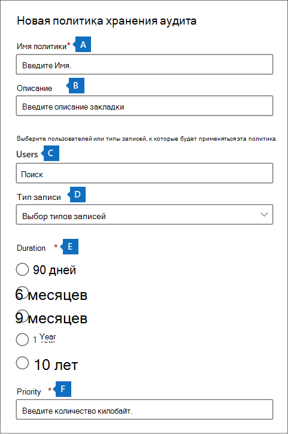
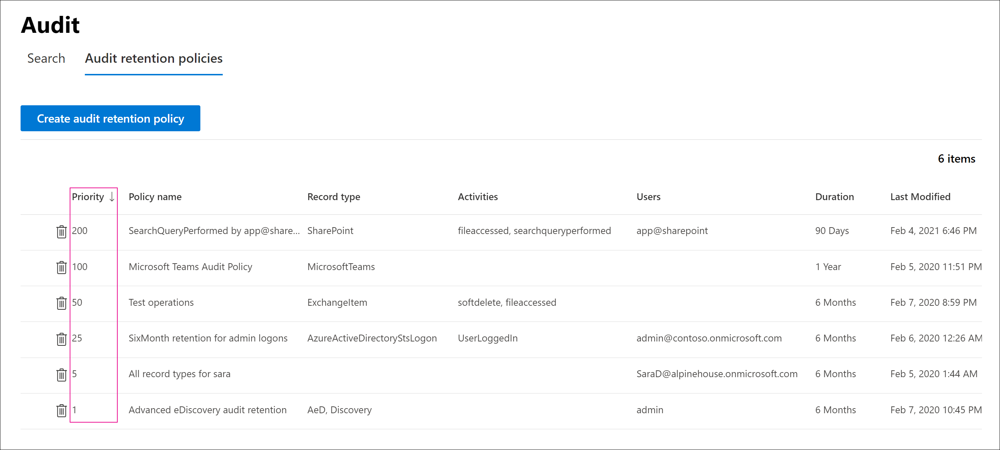

# <a name="manage-audit-log-retention-policies"></a>Управление политиками хранения журнала аудита

Вы можете создавать политики хранения журналов аудита и управлять ими в Центре безопасности и соответствия требованиям. Политики хранения журналов аудита являются частью новых возможностей расширенного аудита в Microsoft 365. Политика хранения журнала аудита позволяет задавать срок хранения журналов аудита в Организации. Вы можете хранить журналы аудита в течение 10 лет. Можно создавать политики, основанные на указанных ниже условиях:

- Все действия в одной или нескольких службах Microsoft 365

- Определенные действия (в службе Microsoft 365), выполняемые всеми или конкретными пользователями

- Уровень приоритета, который определяет, какая политика имеет приоритет у вас есть несколько политик в вашей организации

## <a name="default-audit-log-retention-policy"></a>Политика хранения журнала аудита по умолчанию

Расширенный аудит в Microsoft 365 предоставляет политику хранения журнала аудита по умолчанию для всех организаций. Эта политика сохраняет все записи аудита Exchange Online, SharePoint Online, OneDrive для бизнеса и Azure Active Directory в течение одного года. Эта политика по умолчанию сохраняет записи аудита, содержащие значение **Exchange**, **SharePoint**, **OneDrive** и **AzureActiveDirectory** для свойства **Workload** (это служба, в которой произошло действие). Политика по умолчанию не может быть изменена. Список типов записей, включенных в политику по умолчанию, см. в разделе [Дополнительные сведения](#more-information) в этой статье.

> [!NOTE]
> Стандартная политика хранения журнала аудита применяется только к записям аудита для действий, выполняемых пользователями, которым назначена лицензия Office 365 или Microsoft 365 E5 либо у которых есть дополнительная лицензия на Соответствие требованиям Microsoft 365 E5 или E5 eDiscovery и аудит. Если в вашей организации есть пользователи или гости, не использующие E5, соответствующие записи аудита сохраняются в течение 90 дней.

## <a name="before-you-create-an-audit-log-retention-policy"></a>Что нужно сделать перед созданием политики хранения журнала аудита

- Для создания или изменения политики хранения аудита вам должна быть назначена роль «Конфигурация организации» в Центре безопасности и соответствия требованиям.

- В вашей организации может быть максимум 50 политик хранения журналов аудита.

- Чтобы обеспечить хранение журнала аудита дольше 90 дней (и до 1 года), у пользователя, создающего журнал аудита (путем выполнения действия, для которого включен аудит), должна быть одна из следующих лицензий: лицензия на Office 365 E5 или Microsoft 365 E5, лицензия на Соответствие требованиям Microsoft 365 E5, лицензия на E5 eDiscovery и надстройку Аудит. Чтобы обеспечить хранение журнала аудита в течение 10 лет, пользователю, создающему журнал аудита, в дополнение к лицензии E5 также должна быть назначена 10-летняя дополнительная лицензия на хранение журнала аудита.

- Все пользовательские политики хранения журнала аудита (созданные вашей организацией) имеют приоритет над политикой хранения, заданной по умолчанию. Например, если вы создадите политику хранения журнала аудита для действия почтового ящика Exchange, срок хранения которого не превышает один год, записи аудита для действий почтового ящика Exchange будут сохраняться в течение более короткого периода времени, указанного в пользовательской политике.

## <a name="create-an-audit-log-retention-policy"></a>Создание политики хранения журнала аудита

1. Перейдите в раздел [https://compliance.microsoft.com](https://compliance.microsoft.com) и войдите в систему, используя учетную запись пользователя, которому назначена роль "Конфигурация организации" на странице "Разрешения" в Центре безопасности и соответствия требованиям.

2. В расположенной слева области Центра соответствия требованиям Microsoft 365 щелкните **Показать все** и выберите **Аудит**.

3. Откройте вкладку **Политика хранения записей аудита**.

4. Нажмите **Создать политику хранения записей аудита** и заполните следующие поля на всплывающей странице.

    

   1. **Имя политики.** Имя политики хранения записей аудита. Это имя должно быть уникальным в вашей организации, и его невозможно изменить после создания политики.

   2. **Описание.** Необязательный аргумент, но полезно предоставить сведения о политике, такие как тип записи или рабочая нагрузка, пользователи, указанные в политике, и длительность.

   3. **Пользователи:** Выберите одного или нескольких пользователей, к которым применяется политика. Если оставить это поле пустым, политика будет применена ко всем пользователям. Если вы оставите **Тип записи** пустым, вам потребуется выбрать пользователя.

   4. **Тип записи.** Тип записи аудита, к которой применяется политика. Если оставить это свойство пустым, вам потребуется выбрать пользователя в поле **Пользователи**. Вы можете выбрать один или несколько типов записей:

   - Если выбрать один тип записи, поле **Действия** заполняется динамически. Вы можете использовать раскрывающийся список, чтобы выбрать действия выбранного типа записи, к которым применяется политика. Если вы не выберете конкретные действия, политика будет применяться ко всем действиям выбранного типа записи.

   - Если вы выберите несколько типов записей, вы не сможете выбрать действия. Политика будет применяться ко всем действиям выбранных типов записей.

   5. **Длительность.** Время, в течение которого должны храниться журналы аудита, удовлетворяющие условиям политики.

   6. **Приоритет:** Это значение определяет порядок обработки политик хранения журнала аудита в Организации. Чем больше значение, тем более высокий приоритет. Например, политика с значением приоритета **5** будет иметь приоритет над политикой со значением приоритета **0**. Как было сказано выше, любая настраиваемая политика хранения журнала аудита имеет приоритет над стандартной политикой в Организации.

5. Нажмите кнопку **сохранить**, чтобы создать новую политику хранения журнала аудита.

   Новая политика отображается в списке на вкладке **Политики хранения записей аудита**.

## <a name="manage-audit-log-retention-policies"></a>Управление политиками хранения журнала аудита

Политики хранения журнала аудита перечислены на вкладке **Политики хранения записей аудита** (другое название — *панель мониторинга*). Панель мониторинга можно использовать для просмотра, изменения и удаления политик хранения записей аудита.

### <a name="view-policies-in-the-dashboard"></a>Просмотр политик на панели мониторинга

Политики хранения журнала аудита перечислены на панели мониторинга. Одним из преимуществ просмотра политик на панели мониторинга является то, что вы можете щелкнуть столбец **Приоритет**, чтобы перечислить политики по приоритету их применения. Как указано ранее, чем больше значение, тем выше приоритет.



Кроме того, вы можете выбрать политику, чтобы отобразить ее параметры на всплывающей странице.

> [!NOTE]
> Стандартная политика хранения журнала аудита вашей организации не отображается на панели мониторинга.

### <a name="edit-policies-in-the-dashboard"></a>Изменение политик на панели мониторинга

Для изменения политики выберите ее, чтобы открыть всплывающую страницу. Вы можете изменить один или несколько параметров и сохранить изменения.


> [!IMPORTANT]
> С помощью командлета **New-UnifiedAuditLogRetentionPolicy** можно создать политику хранения журнала аудита для типов записей или действий, недоступных в средстве **Создание политики хранения записей аудита** в панели мониторинга. В этом случае вы не сможете изменять эту политику (например, изменять срок хранения, добавлять или удалять действия) на панели мониторинга **Политики хранения записей аудита**. Можно будет только просмотреть или удалить эту политику в Центре соответствия требованиям. Для изменения этой политики потребуется использовать командлет [Set-UnifiedAuditLogRetentionPolicy](/powershell/module/exchange/set-unifiedauditlogretentionpolicy) в PowerShell безопасности и соответствия требованиям.<br/><br/>**Совет.** Для политик, которые нужно изменять с помощью PowerShell, в верхней части всплывающей страницы выводится сообщение.

### <a name="delete-policies-in-the-dashboard"></a>Удаление политик на панели мониторинга

Чтобы удалить политику, выберите ее, щелкните значок **Удалить** , а затем подтвердите, что вы хотите удалить эту политику. Политика удаляется из панели мониторинга, но ее удаление из вашей организации может занять до 30 минут.

## <a name="create-and-manage-audit-log-retention-policies-in-powershell"></a>Создание политик хранения журнала аудита и управление ими в PowerShell

Вы также можете использовать PowerShell в Центре безопасности и соответствия требованиям для создания политик хранения журнала аудита и управления ими. Одной из причин использования PowerShell является создание политики для типа записи или действия, которые недоступны в пользовательском интерфейсе.

### <a name="create-an-audit-log-retention-policy-in-powershell"></a>Создание политики хранения журнала аудита в PowerShell

Выполните следующие действия, чтобы создать политику хранения журнала аудита в PowerShell.

1. [Подключитесь к Центру безопасности и соответствия требованиям PowerShell](/powershell/exchange/connect-to-scc-powershell).

2. Чтобы создать политику хранения журнала аудита, выполните следующую команду.

   ```powershell
   New-UnifiedAuditLogRetentionPolicy -Name "Microsoft Teams Audit Policy" -Description "One year retention policy for all Microsoft Teams activities" -RecordTypes MicrosoftTeams -RetentionDuration TenYears -Priority 100
   ```

    В этом примере создается политика хранения журнала аудита с именем "политика аудита Microsoft Teams" с такими параметрами:

   - Описание политики.

   - Сохраняет все действия в Microsoft Teams (как определено в параметре *RecordType*).

   - Сохраняет журнал аудита Microsoft Teams на 10 лет.

   - Приоритет — 100.

Вот еще один пример создания политики хранения журнала аудита. Эта политика сохраняет журналы аудита для действия "Пользователь выполнил вход" в течение шести месяцев для пользователя admin@contoso.onmicrosoft.com.

```powershell
New-UnifiedAuditLogRetentionPolicy -Name "SixMonth retention for admin logons" -RecordTypes AzureActiveDirectoryStsLogon -Operations UserLoggedIn -UserIds admin@contoso.onmicrosoft.com -RetentionDuration SixMonths -Priority 25
```

Дополнительные сведения см. в статье [New-UnifiedAuditLogRetentionPolicy.](/powershell/module/exchange/new-unifiedauditlogretentionpolicy)

### <a name="view-policies-in-powershell"></a>Просмотр политик в PowerShell

Чтобы просмотреть политики хранения журнала аудита, используйте командлет [Get-UnifiedAuditLogRetentionPolicy](/powershell/module/exchange/get-unifiedauditlogretentionpolicy) в модуле PowerShell Центра безопасности и соответствия требованиям.

Вот пример команды, чтобы отобразить параметры для всех политик хранения журнала аудита в вашей организации. Эта команда сортирует политики в порядке убывания приоритета.

```powershell
Get-UnifiedAuditLogRetentionPolicy | Sort-Object -Property Priority -Descending | FL Priority,Name,Description,RecordTypes,Operations,UserIds,RetentionDuration
```

> [!NOTE]
> Командлет **Get-UnifiedAuditLogRetentionPolicy** не возвращает стандартную политику хранения журнала аудита для вашей организации.

### <a name="edit-policies-in-powershell"></a>Изменение политик в PowerShell

Чтобы изменить существующую политику хранения журнала аудита, используйте командлет [Set-UnifiedAuditLogRetentionPolicy](/powershell/module/exchange/set-unifiedauditlogretentionpolicy) в модуле PowerShell Центра безопасности и соответствия требованиям.

### <a name="delete-policies-in-powershell"></a>Удаление политик в PowerShell

Чтобы удалить политику хранения журнала аудита, используйте командлет [Remove-UnifiedAuditLogRetentionPolicy](/powershell/module/exchange/remove-unifiedauditlogretentionpolicy) в модуле PowerShell Центра безопасности и соответствия требованиям. Удаление политики из организации может занять до 30 минут.

## <a name="more-information"></a>Дополнительные сведения

Как указано выше, записи аудита для операций в Azure Active Directory, Exchange Online, SharePoint Online и OneDrive для бизнеса по умолчанию хранятся один год. В таблице ниже перечислены все типы записей (для каждой из этих служб), включенные в заданную по умолчанию политику хранения журнала аудита. Это означает, что журналы аудита для любой операции с этим типом записи сохраняются в течение одного года, если пользовательская политика хранения журналов аудита не имеет приоритета для определенного типа записи, операции или пользователя. Значение Enum (которое отображается как значение для свойства RecordType в записи аудита) для каждого типа записи показано в скобках.

|AzureActiveDirectory |Exchange  |SharePoint или OneDrive|
|:---------|:---------|:---------|
|AzureActiveDirectory (8)|ExchangeAdmin (1)|ComplianceDLPSharePoint (11)|
|AzureActiveDirectoryAccountLogon (9)|ExchangeItem (2)|ComplianceDLPSharePointClassification (33)|
|AzureActiveDirectoryStsLogon (15)|Кампания (62)|Project (35)|
||ComplianceDLPExchange (13)|SharePoint (4)|
||ComplianceSupervisionExchange (68)|SharePointCommentOperation (37)|
||CustomerKeyServiceEncryption (69)|SharePointContentTypeOperation (55)|
||ExchangeAggregatedOperation (19)|SharePointFieldOperation (56)|
||ExchangeItemAggregated (50)|SharePointFileOperation (6)|
||ExchangeItemGroup (3)|SharePointListOperation (36)|
||InformationBarrierPolicyApplication (53)|SharePointSharingOperation (14)|
||||
