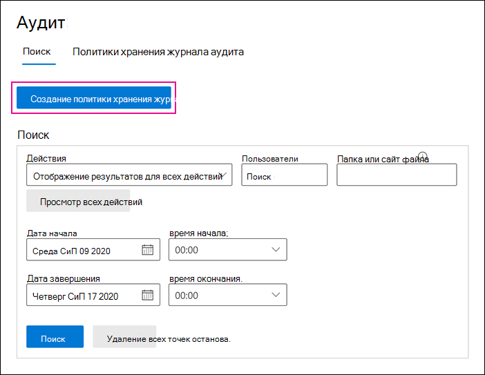
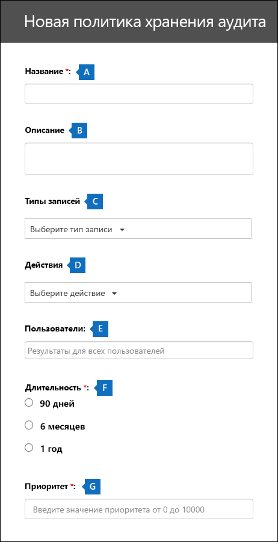

# <a name="manage-audit-log-retention-policies"></a>Управление политиками хранения журнала аудита

Вы можете создавать политики хранения журналов аудита и управлять ими в Центре безопасности и соответствия требованиям. Политики хранения журналов аудита являются частью новых возможностей расширенного аудита в Microsoft 365. Политика хранения журнала аудита позволяет задавать срок хранения журналов аудита в Организации. Вы можете хранить журналы аудита в течение одного года. Можно создавать политики, основанные на указанных ниже условиях:

- Все действия в одной или нескольких службах Microsoft 365

- Определенные действия (в определенной службе), выполняемые всеми пользователями или определенными пользователями

- Уровень приоритета, который определяет, какая политика имеет приоритет у вас есть несколько политик в вашей организации

## <a name="default-audit-log-retention-policy"></a>Политика хранения журнала аудита по умолчанию

Расширенный аудит в Microsoft 365 предоставляет политику хранения журнала аудита по умолчанию для всех организаций. Эта политика сохраняет все записи аудита Exchange, SharePoint и Azure Active Directory в течение одного года. Эта политика по умолчанию сохраняет записи аудита, содержащие значение **AzureActiveDirectory**, **Exchange**или **SharePoint** для **Workload**свойства (это служба, в которой произошло действие). Политика по умолчанию не может быть изменена. Список типов записей, включенных в политику по умолчанию, см. в разделе [Дополнительные сведения](#more-information) в этой статье.

> [!NOTE]
> Политика хранения журнала аудита по умолчанию применяется только к записям аудита для действий, выполняемых пользователями, которым назначена лицензия Office 365 или Microsoft 365 E5 или которые имеют дополнительную лицензию на соответствие Microsoft 365 E5. Если в вашей организации есть пользователи, не являющиеся пользователями E5, соответствующие записи аудита сохраняются в течение 90 дней.

## <a name="before-you-begin"></a>До начала работы

- Для создания или изменения политики хранения аудита вам должна быть назначена роль «Конфигурация организации» в Центре безопасности и соответствия требованиям.

- В вашей организации может быть максимум 50 политик хранения журналов аудита.

- Чтобы сохранить журнал аудита более чем на 90 дней, пользователю, создавшему журнал аудита, должна быть назначена лицензия Office 365 или Microsoft 365 E5 или иметь дополнительную лицензию на соответствие требованиям Microsoft 365 E5.

- Все пользовательские политики хранения журналов аудита (созданные вашей организацией) имеют приоритет политики хранения по умолчанию. Например, если вы создадите политику хранения журнала аудита для действия почтового ящика Exchange, срок хранения которого не превышает один год, записи аудита для действий почтового ящика Exchange будут сохраняться в течение более короткого периода времени, указанного в пользовательской политике.

## <a name="create-an-audit-log-retention-policy-in-the-security--compliance-center"></a>Создайте политику хранения журнала аудита в Центре безопасности и соответствия требованиям

1. Перейдите в раздел [https://protection.office.com](https://protection.office.com) и войдите в систему, используя учетную запись пользователя, которому назначена роль "Конфигурация организации" в центре безопасности и соответствия требованиям &. 

2. В левой панели центра безопасности & центр соответствия требованиям выберите **Поиск** > **Поиск по журналу аудита**.

    Откроется страница **Поиск в журнале аудита**.

    

3. Нажмите кнопку **Новая политика хранения журнала аудита**, а затем заполните следующие поля на всплывающей странице:

    

   а. **Имя:** Имя политики хранения журнала аудита. Это имя должно быть уникальным в вашей организации.
   
   б. **Description (описание).** Необязательный аргумент, но полезно предоставить сведения о ней, такие как тип записи или рабочая нагрузка, пользователи, указанные в политике, и длительность.

   в. **Типы записей.** Типы записей аудита, к которым применяется политика. Если выбрано несколько типов записей, вы не сможете выбрать действия, так как политика будет применена ко всем действиям для выбранных типов записей. Кроме того, если оставить это свойство пустым, необходимо выбрать пользователя в списке **Пользователи**.

   г. **Действия.** Используйте это поле, чтобы выбрать действия из выбранного типа записи. Вы можете выбрать конкретные действия для применения политики. Если вы не выберете конкретные действия, политика будет применяться ко всем действиям выбранного типа записи.

   д. **Пользователи:** Выберите одного или нескольких пользователей, к которым применяется политика. Если оставить это поле пустым, политика будет применена ко всем пользователям. Если вы оставите **Типы записей** пустыми, то вы должны выбрать пользователя.

   е. **Длительность:** Время, в течение которого должны храниться журналы аудита, удовлетворяющие условию политики.

   ж. **Приоритет:** Это значение определяет порядок обработки политик хранения журнала аудита в Организации. Чем больше значение, тем более высокий приоритет. Например, политика с значением приоритета **5** будет иметь приоритет над политикой со значением приоритета **0**. Как было сказано выше, любая настраиваемая политика хранения журнала аудита имеет приоритет над стандартной политикой в Организации.

6. Нажмите кнопку **сохранить**, чтобы создать новую политику хранения журнала аудита. 

В настоящий момент не будет определено, что политика хранения была успешно создана. Смотрите следующий раздел о просмотре свойств политик хранения журнала аудита.

## <a name="create-an-audit-log-retention-policy-in-powershell"></a>Создание политики хранения журнала аудита в PowerShell

Вы также можете использовать PowerShell в Центре безопасности и соответствия требованиям для создания политик хранения журнала аудита. 

1. [Подключитесь к Центру безопасности и соответствия требованиям PowerShell](https://docs.microsoft.com/powershell/exchange/office-365-scc/connect-to-scc-powershell/connect-to-scc-powershell).

2. Чтобы создать политику хранения журнала аудита, выполните следующую команду. 

   ```powershell
   New-UnifiedAuditLogRetentionPolicy -Name "Microsoft Teams Audit Policy" -Description "One year retention policy for all Microsoft Teams activities" -RecordTypes MicrosoftTeams -RetentionDuration TwelveMonths -Priority 100
   ```
    
    В этом примере создается политика хранения журнала аудита с именем "политика аудита Microsoft Teams" с такими параметрами:

   - Описание политики.

   - Сохраняет все действия в Microsoft Teams (как определено в параметре *RecordType*).

   - Журнал аудита Microsoft Teams хранится на один год.

   - Приоритет — 100.

Вот еще один пример создания политики хранения журнала аудита. Эта политика сохраняет журналы аудита для действия "Пользователь выполнил вход" в течение шести месяцев для пользователя admin@contoso.onmicrosoft.com.

```powershell
New-UnifiedAuditLogRetentionPolicy -Name "SixMonth retention for admin logons" -RecordTypes AzureActiveDirectoryStsLogon -Operations UserLoggedIn -UserIds admin@contoso.onmicrosoft.com -RetentionDuration SixMonths -Priority 25
```

Дополнительные сведения см. в статье [New-UnifiedAuditLogRetentionPolicy.](https://docs.microsoft.com/powershell/module/exchange/new-unifiedauditlogretentionpolicy)

## <a name="view-audit-log-retention-policies"></a>Просмотр политик хранения журнала аудита

В настоящее время для просмотра настраиваемых политик хранения в журналах аудита можно использовать cmdlet **Get-UnifiedAuditRetentionPolicy** в PowerShell в центре безопасности и соответствия требованиям &. Вот пример команды для отображения параметров (которые вы настроили на предыдущем шаге) для политик хранения журнала аудита в вашей организации. Эта команда сортирует политики в порядке убывания приоритета.

```powershell
Get-UnifiedAuditLogRetentionPolicy | Sort-Object -Property Priority -Descending | FL Priority,Name,Description,RecordTypes,Operations,UserIds,RetentionDuration
```

> [!NOTE]
> В настоящее время cmdlet **, Get-UnifiedAuditLogRetentionPolicy**, не возвращает политику по умолчанию для журнала аудита в организации.

Дополнительные сведения см. в статье [Get-UnifiedAuditLogRetentionPolicy.](https://docs.microsoft.com/powershell/module/exchange/get-unifiedauditlogretentionpolicy)

## <a name="more-information"></a>Дополнительные сведения

- Чтобы изменить существующую политику хранения журнала аудита, используйте cmdlet **Set-UnifiedAuditLogRetentionPolicy** в центре безопасности и соответствия требованиям (PowerShell) в центре безопасности &. Дополнительные сведения см. в статье [Set-UnifiedAuditLogRetentionPolicy.](https://docs.microsoft.com/powershell/module/exchange/set-unifiedauditlogretentionpolicy)

- Чтобы удалить политику хранения журнала аудита, используйте cmdlet **Remove-UnifiedAuditLogRetentionPolicy** в центре & безопасности и соответствия требованиям (PowerShell). Полное удаление политики может занять до 30 минут. Дополнительные сведения см. в статье [Remove-UnifiedAuditLogRetentionPolicy](https://docs.microsoft.com/powershell/module/exchange/remove-unifiedauditlogretentionpolicy).

- Как отмечалось выше, записи аудита для операций в Azure Active Directory, Exchange и SharePoint хранятся на один год. В таблице ниже перечислены все типы записей (для каждой из этих служб), включенные в политику хранения по умолчанию для журнала аудита. Это означает, что журналы аудита для любой операции с этим типом записи сохраняются в течение одного года, если пользовательская политика хранения журналов аудита не имеет приоритета для определенного типа записи, операции или пользователя. Значение Enum (которое отображается как значение для свойства RecordType в записи аудита) для каждого типа записи показано в скобках.

   |AzureActiveDirectory |Exchange  |SharePoint|
   |:---------|:---------|:---------|
   |AzureActiveDirectory (8)|ExchangeAdmin (1)|ComplianceDLPSharePoint (11)|
   |AzureActiveDirectoryAccountLogon (9)|ExchangeItem (2)|ComplianceDLPSharePointClassification (33)|
   |AzureActiveDirectoryStsLogon (15)|Кампания (62)|Project (35)|
   ||ComplianceDLPExchange (13)|SharePoint (4)|
   ||ComplianceSupervisionExchange (68)|SharePointCommentOperation (37)|
   ||CustomerKeyServiceEncryption (69)|SharePointContentTypeOperation (55)|
   ||ExchangeAggregatedOperation (19)|SharePointFieldOperation (56)|
   ||ExchangeItemAggregated (50)|SharePointFileOperation (6)|
   ||ExchangeItemGroup (3)|SharePointListOperation (36)|
   ||InformationBarrierPolicyApplication (53)|SharePointSharingOperation (14)|
   ||||
